# 🚀 Session 10: Version Control, Deployment & Web Hosting

*From Code Chaos to Professional Deployment*

---

## 📋 Session Overview

**Prerequisites:** Basic HTML, CSS, JavaScript knowledge

### 🎯 Learning Objectives

By the end of this session, you will:

- Understand why version control is essential for developers
- Master fundamental Git commands and workflows
- Set up and use GitHub for code collaboration
- Deploy websites using multiple platforms
- Choose the right hosting solution for different projects

---

## 🔄 Part 1: The Version Control Revolution

### Why Version Control Matters

Imagine you're writing a novel. Without version control, your workflow might look like this:

```
📁 My Novel/
├── novel.doc
├── novel_v2.doc
├── novel_v2_final.doc
├── novel_v2_final_ACTUALLY_FINAL.doc
├── novel_v3_new_chapter.doc
└── novel_backup_dont_delete.doc
```

**Problems:**

- Which version is the latest? 🤷‍♀️
- What changes were made between versions?
- How do multiple authors collaborate?
- What if you accidentally delete everything?

### Enter Git: Your Code Time Machine ⏰

Git is like having a **complete history** of your project with superpowers:


**Git Benefits:**

- 📸 **Snapshots:** Every change is saved as a "commit"
- 🌿 **Branching:** Work on features without breaking main code
- 🤝 **Collaboration:** Multiple developers, zero conflicts
- ⏪ **Time Travel:** Undo any change, anytime
- 🔒 **Backup:** Your code lives in multiple places

---

## 🛠️ Part 2: Git Fundamentals

### Essential Git Concepts

```mermaid
graph TB
    subgraph "Your Computer (Local)"
        A[Working Directory<br/>📁 Your files]
        B[Staging Area<br/>📦 Ready to commit]
        C[Local Repository<br/>📚 Your git history]
    end
    
    subgraph "GitHub (Remote)"
        D[Remote Repository<br/>☁️ Shared code]
    end
    
    A -->|git add| B
    B -->|git commit| C
    C -->|git push| D
    D -->|git pull| C
    
    style A fill:#ffebee
    style B fill:#fff3e0
    style C fill:#e8f5e8
    style D fill:#e3f2fd
```



### The Git Workflow Dance 💃

1. **Edit** your files (Working Directory)
2. **Stage** changes with `git add` (Staging Area)
3. **Commit** with a message `git commit` (Local Repo)
4. **Push** to share `git push` (Remote Repo)

---

## 📚 Part 3: Essential Git Commands

### 🎬 Command Breakdown

#### 1. Starting Your Git Journey

```bash
# Initialize a new Git repository
git init

# Check repository status
git status
```

**Real Example:**

```bash
mkdir my-portfolio
cd my-portfolio
git init
# Output: Initialized empty Git repository in /my-portfolio/.git/
```

#### 2. The Add-Commit-Push Trio

```bash
# Stage specific file
git add index.html

# Stage all files
git add .

# Commit with message
git commit -m "Add homepage structure"

# Push to GitHub
git push origin main
```

**Complete Example Workflow:**

```bash
# Create a simple HTML file
echo "<h1>My First Website</h1>" > index.html

# Check what's changed
git status
# Output: Untracked files: index.html

# Stage the file
git add index.html

# Commit the change
git commit -m "Create initial homepage"

# Push to GitHub (after connecting repository)
git push origin main
```

#### 3. Collaboration Commands

```bash
# Get latest changes from team
git pull

# See commit history
git log --oneline

# Create and switch to new branch
git checkout -b new-feature

# Merge branch back to main
git checkout main
git merge new-feature
```

### 📊 Git Command Cheat Sheet

| Command | Purpose | Example |
|---------|---------|---------|
| `git init` | Start new repository | `git init` |
| `git clone` | Copy remote repository | `git clone https://github.com/user/repo.git` |
| `git add` | Stage changes | `git add .` |
| `git commit` | Save changes | `git commit -m "Fix navigation bug"` |
| `git push` | Upload to remote | `git push origin main` |
| `git pull` | Download from remote | `git pull origin main` |
| `git status` | Check repository state | `git status` |
| `git log` | View commit history | `git log --oneline` |

---

## 🐙 Part 4: GitHub - Your Code's Home

### Setting Up GitHub


### Step-by-Step GitHub Setup

#### 1. Create Your First Repository

1. **Go to GitHub.com** and sign up
2. **Click "New Repository"** (green button)
3. **Repository Details:**
   - Name: `my-portfolio`
   - Description: "My personal portfolio website"
   - Public ✅ (so others can see your work!)
   - Initialize with README ✅

#### 2. Connect Local Project to GitHub

```bash
# Method 1: Clone from GitHub
git clone https://github.com/yourusername/my-portfolio.git

# Method 2: Connect existing project
git remote add origin https://github.com/yourusername/my-portfolio.git
git branch -M main
git push -u origin main
```

#### 3. Professional README Example

```markdown
# 🌟 My Portfolio Website

A responsive personal portfolio showcasing my web development projects.

## 🚀 Features
- Responsive design
- Project showcase
- Contact form
- Blog section

## 🛠️ Technologies Used
- HTML5
- CSS3
- JavaScript
- Git & GitHub

## 📱 Live Demo
[View Portfolio](https://yourusername.github.io/my-portfolio)
```

---

## 🌿 Part 5: Branching & Collaboration

### Understanding Branches

Think of branches like **parallel universes** for your code:


### Branch Commands in Action

```bash
# Create and switch to new branch
git checkout -b feature-contact-form

# Work on your feature...
git add contact.html
git commit -m "Add contact form structure"
git add styles.css
git commit -m "Style contact form"

# Switch back to main
git checkout main

# Merge your feature
git merge feature-contact-form

# Delete feature branch (optional)
git branch -d feature-contact-form
```

### 🤝 Collaboration Workflow


---

## 🌐 Part 6: Web Hosting Options

### The Hosting Landscape


### Hosting Comparison Table

| Platform | Cost | Best For | Pros | Cons |
|----------|------|----------|------|------|
| **GitHub Pages** | Free | Static sites, portfolios | Git integration, custom domains | Static sites only |
| **Netlify** | Free tier | JAMstack, React apps | Automatic builds, forms | Build time limits |
| **Vercel** | Free tier | Next.js, modern frameworks | Excellent performance | Vendor lock-in |
| **Shared Hosting** | $3-10/mo | WordPress, PHP sites | cPanel, email included | Limited resources |
| **DigitalOcean** | $5-50/mo | Full control needed | Complete freedom | Requires server management |

---

## 📡 Part 7: Domain & DNS Basics

### How the Internet Finds Your Website

```mermaid
graph LR
    A[User types<br/>mysite.com] --> B[DNS Lookup<br/>🔍]
    B --> C[DNS Server<br/>📋 IP: 192.168.1.1]
    C --> D[Web Server<br/>🖥️]
    D --> E[Your Website<br/>📄]
    E --> F[User sees site<br/>👀]
    
    style A fill:#e3f2fd
    style F fill:#e8f5e8
```



### Domain Registration Steps

1. **Choose Domain Name**
   - Keep it short and memorable
   - Use `.com` if available
   - Avoid hyphens and numbers

2. **Register Through:**
   - Namecheap (₹650-1000/year)
   - GoDaddy India (₹799-1199/year)
   - Hostinger India (₹599-899/year)
   - BigRock (₹749-1099/year)

3. **DNS Configuration:**

   ```
   Type    Name    Value
   A       @       192.168.1.1
   CNAME   www     yourdomain.com
   ```

---

## 🚀 Part 8: Deployment Walkthrough

### Method 1: GitHub Pages (Easiest)

```bash
# 1. Create repository with special name
# Repository name: yourusername.github.io

# 2. Push your HTML files
git add .
git commit -m "Initial website deploy"
git push origin main

# 3. Enable GitHub Pages
# Go to Settings > Pages > Source: Deploy from branch (main)

# 4. Your site is live at:
# https://yourusername.github.io
```

### Method 2: Netlify (Powerful & Free)

1. **Connect Repository:**
   - Go to Netlify.com
   - "New site from Git"
   - Connect GitHub account
   - Select repository

2. **Build Settings:**

   ```
   Build command: npm run build (if using build tools)
   Publish directory: public (or dist)
   ```

3. **Custom Domain:**
   - Add domain in Site Settings
   - Update DNS records as shown

### Method 3: Traditional FTP Deployment

```bash
# Using FileZilla or similar FTP client
Host: ftp.yourhosting.com
Username: your_username
Password: your_password
Port: 21

# Upload files to public_html folder
# Files are immediately live
```

---

## 🔧 Part 9: Professional Development Workflow

### The Modern Developer Setup


### Best Practices Checklist ✅

#### Git Best Practices

- ✅ Write descriptive commit messages
- ✅ Commit frequently, push daily
- ✅ Use branches for new features
- ✅ Never commit sensitive data (passwords, API keys)
- ✅ Keep commits focused and atomic

#### Deployment Best Practices

- ✅ Test thoroughly before deploying
- ✅ Use staging environments
- ✅ Keep backups of your site
- ✅ Monitor site performance
- ✅ Set up SSL certificates (HTTPS)

---

## 🛠️ Part 10: Hands-On Practice

### 🎯 Practice Exercise: Complete Portfolio Deployment

Let's build and deploy a complete portfolio website from scratch!

#### Step 1: Create Project Structure

```bash
mkdir portfolio-project
cd portfolio-project
git init

# Create files
touch index.html style.css script.js README.md
```

#### Step 2: Build Basic Portfolio

**index.html:**

```html
<!DOCTYPE html>
<html lang="en">
<head>
    <meta charset="UTF-8">
    <meta name="viewport" content="width=device-width, initial-scale=1.0">
    <title>John Doe - Web Developer</title>
    <link rel="stylesheet" href="style.css">
</head>
<body>
    <header>
        <h1>John Doe</h1>
        <p>Full Stack Web Developer</p>
    </header>
    
    <nav>
        <a href="#about">About</a>
        <a href="#projects">Projects</a>
        <a href="#contact">Contact</a>
    </nav>
    
    <section id="about">
        <h2>About Me</h2>
        <p>I create amazing web experiences using modern technologies.</p>
    </section>
    
    <section id="projects">
        <h2>My Projects</h2>
        <div class="project">
            <h3>E-Commerce Site</h3>
            <p>Built with React and Node.js</p>
        </div>
    </section>
    
    <footer id="contact">
        <h2>Contact</h2>
        <p>Email: john@example.com</p>
    </footer>
    
    <script src="script.js"></script>
</body>
</html>
```

#### Step 3: Version Control Workflow

```bash
# Stage and commit initial version
git add .
git commit -m "Initial portfolio structure"

# Create feature branch for styling
git checkout -b feature-styling

# Add CSS (add your styles to style.css)
git add style.css
git commit -m "Add responsive styling"

# Switch back and merge
git checkout main
git merge feature-styling

# Create GitHub repository and push
git remote add origin https://github.com/yourusername/portfolio-project.git
git push -u origin main
```

#### Step 4: Deploy to GitHub Pages

```bash
# Method 1: Settings approach
# Go to GitHub > Settings > Pages > Source: Deploy from branch

# Method 2: gh-pages branch
git checkout -b gh-pages
git push origin gh-pages
```

#### Step 5: Enhance with Netlify

1. **Connect to Netlify:**
   - Visit Netlify.com
   - "New site from Git"
   - Select your repository

2. **Add Contact Form:**

```html
<form name="contact" method="POST" data-netlify="true">
    <input type="text" name="name" placeholder="Name" required>
    <input type="email" name="email" placeholder="Email" required>
    <textarea name="message" placeholder="Message" required></textarea>
    <button type="submit">Send Message</button>
</form>
```

3. **Custom Domain (Optional):**
   - Add domain in Netlify dashboard
   - Update DNS records with your domain provider

---

## 📊 Part 11: Platform Deep Dive

### GitHub Pages vs Competitors

```mermaid
graph TD
    A[Deployment Needs] --> B{Project Type?}
    
    B -->|Static HTML/CSS/JS| C[GitHub Pages<br/>✅ Free ✅ Simple]
    B -->|React/Vue App| D[Netlify<br/>✅ Build Process ✅ Forms]
    B -->|Next.js App| E[Vercel<br/>✅ Optimized ✅ Serverless]
    B -->|WordPress| F[Traditional Hosting<br/>✅ PHP Support ✅ Database]
    B -->|Full Control| G[VPS/Cloud<br/>✅ Everything ❌ Complex]
    
    style C fill:#e8f5e8
    style D fill:#e3f2fd
    style E fill:#f3e5f5
```



### When to Choose What

#### GitHub Pages ✨

**Perfect for:**

- Personal portfolios
- Documentation sites
- Simple business websites
- Learning projects

**Example Use Cases:**

- Portfolio: `https://johndoe.github.io`
- Project docs: `https://company.github.io/project-name`
- Landing pages for open source projects

#### Netlify 🚀

**Perfect for:**

- Modern JavaScript apps
- Sites with forms
- Continuous deployment needs
- JAMstack architecture

**Features:**

- Form handling without backend
- A/B testing
- Branch previews
- Edge functions

#### Vercel ⚡

**Perfect for:**

- Next.js applications
- React/Vue projects
- Sites needing global CDN
- Serverless functions

**Standout Features:**

- Zero-config deployments
- Automatic HTTPS
- Preview deployments
- Analytics

---

## 🔍 Part 12: Troubleshooting Common Issues

### Git Problems & Solutions

#### Problem 1: "Permission denied (publickey)"

```bash
# Solution: Set up SSH keys
ssh-keygen -t rsa -b 4096 -C "your.email@example.com"
# Add to GitHub: Settings > SSH and GPG keys
```

#### Problem 2: Merge Conflicts

```bash
# When you see conflict markers:
<<<<<<< HEAD
Your changes
=======
Someone else's changes
>>>>>>> branch-name

# Fix manually, then:
git add conflicted-file.html
git commit -m "Resolve merge conflict"
```

#### Problem 3: Wrong Commit Message

```bash
# Change last commit message
git commit --amend -m "Corrected commit message"
```

### Deployment Issues & Fixes

#### GitHub Pages Not Updating

- Check if repository is public
- Verify branch name (main vs master)
- Clear browser cache
- Check GitHub Pages settings

#### Netlify Build Failures

```bash
# Check build logs in Netlify dashboard
# Common fixes:
npm install  # Install dependencies
npm run build  # Test build locally
```

#### Domain Not Working

- Wait for DNS propagation (24-48 hours)
- Check DNS settings with: `nslookup yourdomain.com`
- Verify SSL certificate is active

---

## 📈 Part 13: Advanced Tips & Next Steps

### Performance Optimization

```mermaid
graph LR
    A[Optimize Images<br/>WebP format] --> B[Minify CSS/JS<br/>Remove whitespace]
    B --> C[Enable Compression<br/>Gzip/Brotli]
    C --> D[Use CDN<br/>Global distribution]
    D --> E[Fast Loading Site<br/>⚡ Happy Users]
    
    style A fill:#fff3e0
    style E fill:#e8f5e8
```



### Security Best Practices

- ✅ **Always use HTTPS** (most hosts provide free SSL)
- ✅ **Never commit secrets** (.env files, API keys)
- ✅ **Keep dependencies updated** (security patches)
- ✅ **Use Content Security Policy** headers
- ✅ **Regular backups** of your code and data

### Professional Git Workflow

```bash
# Feature branch workflow
git checkout -b feature/user-authentication
# Work on feature...
git add .
git commit -m "Add user login functionality"
git push origin feature/user-authentication
# Create pull request on GitHub
# After review and merge:
git checkout main
git pull origin main
git branch -d feature/user-authentication
```

---

## 🎯 Part 14: Session Wrap-Up & Action Items

### Key Takeaways

1. **Version Control is Essential** - Git saves your sanity and enables collaboration
2. **GitHub is Your Portfolio** - Showcase your code to potential employers
3. **Deployment is Easier Than Ever** - Multiple free options available
4. **Professional Workflow Matters** - Branch, review, merge, deploy

### Your Action Plan 📋

#### This Week

- [ ] Create GitHub account
- [ ] Set up your first repository
- [ ] Deploy a simple HTML page to GitHub Pages
- [ ] Practice basic Git commands daily

#### Next Month

- [ ] Build and deploy your portfolio website
- [ ] Try Netlify or Vercel deployment
- [ ] Register a custom domain
- [ ] Contribute to an open source project

#### Long Term

- [ ] Master Git branching and merging
- [ ] Set up automated deployment pipelines
- [ ] Learn about Docker and containerization
- [ ] Explore cloud platforms (AWS, Google Cloud)

### Resource Library 📚

#### Essential Bookmarks

- [Git Documentation](https://git-scm.com/docs)
- [GitHub Guides](https://guides.github.com/)
- [Netlify Documentation](https://docs.netlify.com/)
- [Mozilla Web Docs](https://developer.mozilla.org/)

#### Practice Platforms

- [Git-it Tutorial](https://github.com/jlord/git-it-electron)
- [Learn Git Branching](https://learngitbranching.js.org/)
- [freeCodeCamp Git Course](https://www.freecodecamp.org/learn)

#### Tools & Extensions

- **VS Code Extensions:**
  - GitLens
  - Git History
  - GitHub Pull Requests

---

## 🌟 Final Challenge: Build Your Developer Brand

Create a professional online presence:

1. **GitHub Profile README** - Make it shine ✨
2. **Portfolio Website** - Showcase your best work
3. **Personal Domain** - yourname.dev looks professional
4. **Consistent Commits** - Build your contribution graph
5. **Open Source Contributions** - Give back to the community

Remember: **Your GitHub is your resume in the developer world!**

---

*"The best time to plant a tree was 20 years ago. The second best time is now." - The same applies to learning Git and deploying your first website! 🌱*

**Happy Coding & Deploying! 🚀**
