# 📦 Parcel.js vs Vite - Build Tool Comparison for React

## 🎯 What is Parcel?

**Parcel** is a web application bundler that requires **zero configuration**. It's the "it just works" build tool - you point it at your HTML file, and it automatically handles everything else!

### 🌟 The Parcel Philosophy


---

## 🚀 Quick Setup Comparison

### Parcel Setup (2 Minutes)

```bash
# Create project
mkdir my-react-app && cd my-react-app
npm init -y

# Install dependencies
npm install react react-dom
npm install --save-dev parcel

# Add to package.json
"scripts": {
  "start": "parcel index.html",
  "build": "parcel build index.html"
}

# Create index.html with <script type="module" src="./index.jsx">
# Run
npm start
```

**✅ NO CONFIG FILES NEEDED!**

### Vite Setup (3 Minutes)

```bash
# Create project with interactive prompts
npm create vite@latest my-app -- --template react

# Install and run
cd my-app
npm install
npm run dev
```

**✅ Minimal config with vite.config.js created**

---

## ✨ Key Features Comparison

### Parcel's Automatic Features

| Feature | What It Does | Configuration Needed |
|---------|--------------|---------------------|
| **JSX Transform** | Automatically converts JSX to JavaScript | None |
| **Babel** | Transpiles modern JS to browser-compatible code | None |
| **CSS Processing** | Bundles and minifies CSS | None |
| **Image Optimization** | Optimizes and bundles images | None |
| **TypeScript** | Compiles TypeScript files | None - just use .tsx |
| **Hot Module Replacement** | Instant updates without refresh | None |
| **Code Splitting** | Automatic bundle splitting | None |
| **Environment Variables** | Loads from .env file | None |

### Vite's Features

| Feature | What It Does | Configuration Needed |
|---------|--------------|---------------------|
| **ESM-based Dev Server** | Serves files as native ES modules | Minimal |
| **Lightning Fast HMR** | Instant hot module replacement | Minimal |
| **Optimized Builds** | Production builds with Rollup | Optional |
| **Plugin System** | Extensive plugin ecosystem | Per plugin |
| **CSS Pre-processors** | SASS, LESS, Stylus support | Optional |
| **TypeScript** | First-class TypeScript support | Minimal |

---

## 📊 Detailed Comparison

### Core Differences

| Aspect | Parcel 📦 | Vite ⚡ |
|--------|-----------|---------|
| **Configuration** | Zero - no files needed | Minimal - optional vite.config.js |
| **Philosophy** | Convention over configuration | Fast by default with flexibility |
| **Learning Curve** | 🟢 Easiest (5 min to understand) | 🟢 Easy (10 min to understand) |
| **Setup Time** | ⏱️ 2 minutes | ⏱️ 3 minutes |
| **Cold Start Speed** | 🚀 2-3 seconds | 🚀🚀 1-2 seconds |
| **HMR Speed** | ⚡ 100-300ms | ⚡⚡ 50-100ms |
| **Production Build** | 📦 Good (Parcel bundler) | 📦📦 Excellent (Rollup) |
| **Bundle Size** | 📏 Larger bundles | 📏 Smaller, optimized bundles |
| **Community Size** | 🌟 Good (15k+ GitHub stars) | 🌟🌟 Larger (65k+ GitHub stars) |
| **Plugin Ecosystem** | ✅ Solid | ✅✅ Extensive |
| **Install Size** | 💾 ~50MB | 💾 ~30MB |
| **Industry Adoption** | 📈 Moderate | 📈📈 High (Vue, Svelte, React) |

### Performance Metrics


| Metric | Parcel | Vite | Winner |
|--------|--------|------|--------|
| **Server Start** | 2-3 sec | 1-2 sec | Vite ⚡ |
| **File Change Update** | 100-300ms | 50-100ms | Vite ⚡ |
| **Production Build** | Medium | Fast | Vite ⚡ |
| **Final Bundle Size** | Larger | Smaller | Vite ⚡ |
| **Setup Complexity** | Lowest | Low | Parcel 📦 |
| **Zero Config** | Yes | Almost | Parcel 📦 |
| **First-Time Experience** | Smoothest | Smooth | Parcel 📦 |

---

## 🎯 When to Choose What

### Choose Parcel 📦 If


**Ideal For:**

- 👶 **Absolute beginners** to React and build tools
- 🎯 **Focus on learning React**, not tooling
- 🏫 **Teaching environments** with multiple students
- 🧪 **Quick prototypes** and experiments
- 📚 **Following tutorials** that assume simplicity
- ⚡ **Zero setup time** requirements

### Choose Vite ⚡ If


**Ideal For:**

- 💻 **Some JavaScript experience** already
- 🚀 **Production applications** that need optimization
- 🏗️ **Professional projects** with specific requirements
- 🔌 **Need plugins** or custom build configurations
- 📦 **Smaller bundle sizes** are important
- 🌐 **Server-Side Rendering** (SSR) needs
- 👥 **Team projects** with modern tooling standards

---

## 🔍 Real-World Scenarios

### Scenario 1: Complete Beginner Learning React

**Situation:** First React project, never used build tools before

**Best Choice:** **Parcel 📦**

**Why?**

- No configuration = less confusion
- Focus 100% on React syntax and concepts
- Can't make wrong setup decisions
- Instant gratification builds confidence

---

### Scenario 2: Junior Developer Building Portfolio

**Situation:** Know basic JavaScript, building professional portfolio

**Best Choice:** **Vite ⚡**

**Why?**

- Industry-standard tooling on resume
- Smaller production bundles = faster site
- Better performance metrics for portfolio
- Learn modern development practices

---

### Scenario 3: Teaching React Workshop

**Situation:** Teaching 20 students React in 2-hour workshop

**Best Choice:** **Parcel 📦**

**Why?**

- Everyone gets same setup instantly
- No troubleshooting config issues
- More time teaching React, less time on setup
- Students won't get stuck before starting

---

### Scenario 4: Building Production SaaS App

**Situation:** Professional team building production application

**Best Choice:** **Vite ⚡**

**Why?**

- Superior production bundle optimization
- Plugin ecosystem for advanced needs
- Better long-term maintainability
- Industry best practices

---

## 🛠️ Command Cheat Sheet

### Parcel Commands

```bash
# Development
parcel index.html                    # Start dev server (port 1234)
parcel index.html --port 3000        # Custom port
parcel index.html --open             # Open browser automatically
parcel index.html --https            # Enable HTTPS locally

# Production
parcel build index.html              # Build for production
parcel build index.html --dist-dir build  # Custom output folder

# Troubleshooting
rm -rf .parcel-cache                 # Clear cache
parcel index.html --no-cache         # Disable cache
```

### Vite Commands

```bash
# Development
npm run dev                          # Start dev server (port 5173)
npm run dev -- --port 3000          # Custom port
npm run dev -- --open               # Open browser automatically
npm run dev -- --host               # Expose to network

# Production
npm run build                        # Build for production
npm run preview                      # Preview production build

# Other
npx vite optimize                   # Pre-bundle dependencies
```

---

## 🐛 Common Issues & Quick Fixes

### Parcel Issues

| Issue | Solution |
|-------|----------|
| Port already in use | `parcel index.html --port 3000` |
| Changes not reflecting | Clear cache: `rm -rf .parcel-cache` |
| Module not found | Install package: `npm install package-name` |
| Slow initial build | Normal on first run, cache speeds up subsequent builds |

### Vite Issues

| Issue | Solution |
|-------|----------|
| Port already in use | Change port in `vite.config.js` or use `--port` flag |
| Import errors | Check file extensions (.jsx for React files) |
| Slow HMR | Check for large dependencies, consider optimization |
| Build errors | Clear `node_modules` and reinstall: `npm install` |

---

## 🎓 The Bottom Line

### Quick Decision Guide

```mermaid
flowchart TD
    Start{Starting React Project?} --> Experience{Have build tool experience?}
    
    Experience -->|No, first time| Priority{What's your priority?}
    Experience -->|Yes, some experience| Production{Production app?}
    
    Priority -->|Learn React fast| Parcel[✅ Use Parcel]
    Priority -->|Best performance| Vite[✅ Use Vite]
    
    Production -->|Yes| Vite
    Production -->|No, learning| Either[Either works well]
    
    style Parcel fill:#ffd700
    style Vite fill:#646cff
    style Either fill:#90EE90
```



### Final Recommendations

| Your Situation | Recommendation | Why |
|----------------|----------------|-----|
| **Never used build tools** | Parcel 📦 | Zero learning curve for tools |
| **Know basic Node.js** | Vite ⚡ | Modern approach, industry standard |
| **Teaching others** | Parcel 📦 | Less troubleshooting, more teaching |
| **Building for production** | Vite ⚡ | Better optimization, smaller bundles |
| **Quick prototype** | Parcel 📦 | Fastest setup time |
| **Team project** | Vite ⚡ | Better tooling support, more flexibility |

---

## 💡 Pro Tips

### For Parcel Users

- ✅ Let Parcel auto-install packages for fastest development
- ✅ Use `.parcelrc` only if you absolutely need custom configuration
- ✅ Clear cache if you encounter weird issues
- ✅ Transition to Vite when you're comfortable with React

### For Vite Users

- ✅ Use `vite.config.js` for project-specific optimizations
- ✅ Leverage the plugin ecosystem for advanced features
- ✅ Use `@vitejs/plugin-react` for optimal React support
- ✅ Enable build analysis to optimize bundle size

---

## 📚 Resources

### Documentation

- **Parcel:** [parceljs.org](https://parceljs.org)
- **Vite:** [vitejs.dev](https://vitejs.dev)

### Community

- **Parcel Discord:** [discord.gg/parcel](https://discord.gg/parcel)
- **Vite Discord:** [chat.vitejs.dev](https://chat.vitejs.dev)

---

**Key Takeaway:** Both tools are excellent! Parcel is the easiest entry point for beginners, while Vite offers the best development experience and production optimizations. Choose based on your experience level and project needs, not which is "better."

**Happy Building! 🚀**
