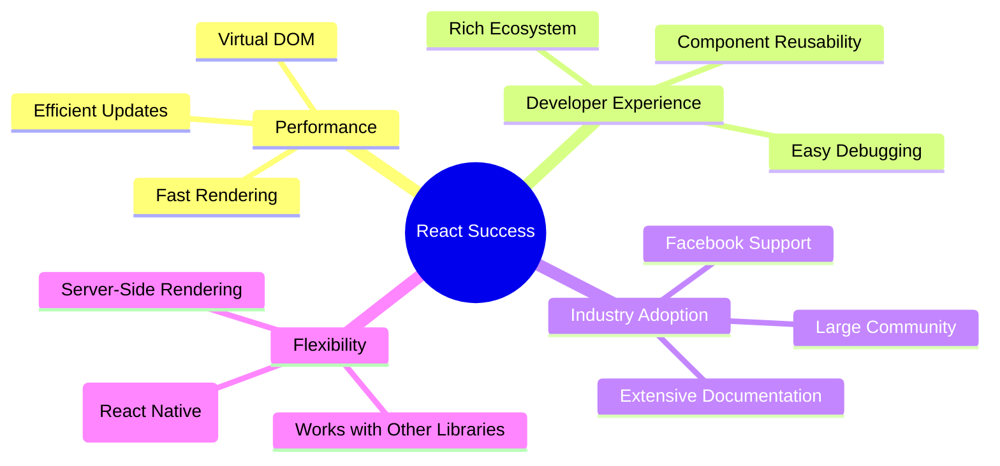
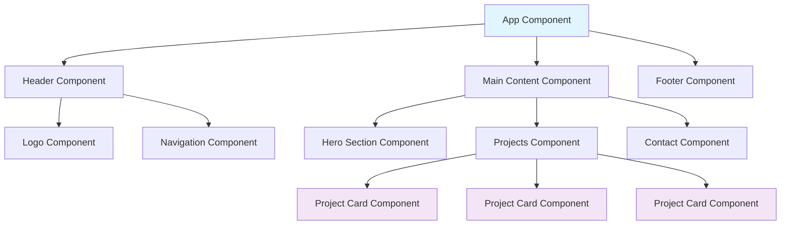
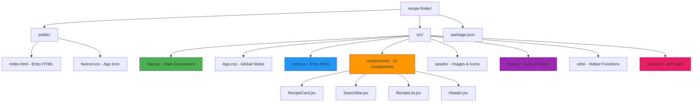
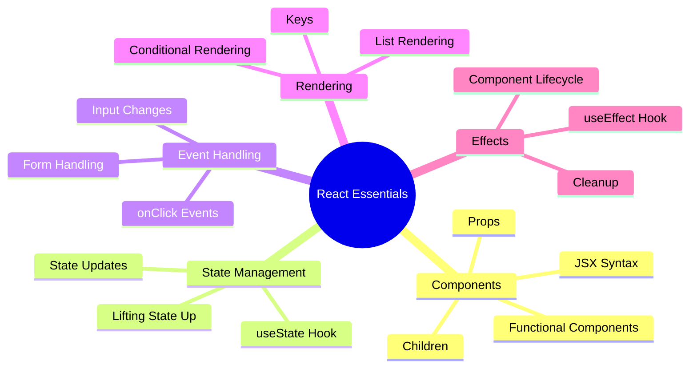
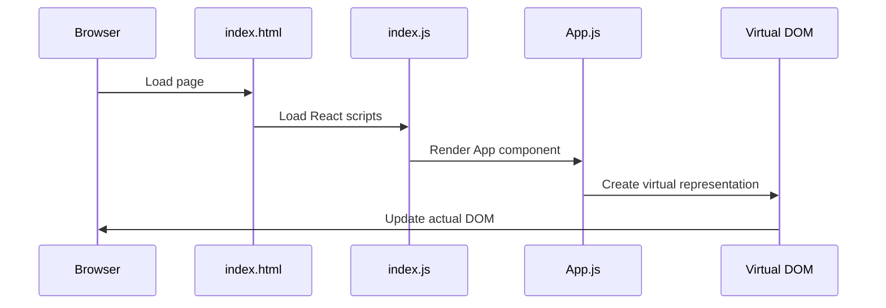
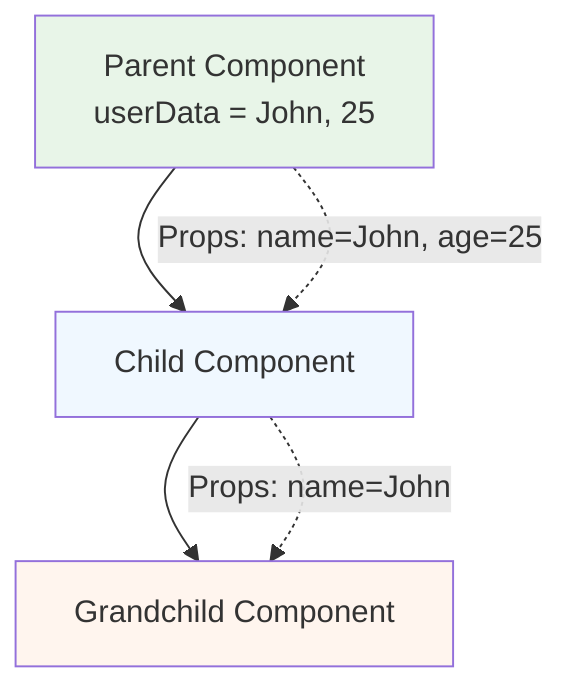

# Session 11: Introduction to React and Component-Based Development

---

## 🎯 Learning Objectives

By the end of this session, you will:

- ✅ Understand React fundamentals and component architecture
- ✅ Set up a modern React development environment (without Create React App)
- ✅ Master JSX syntax and component creation
- ✅ Build a complete Recipe Finder application with modern UI
- ✅ Implement state management, event handling, and API-ready architecture

---

## 📚 Session Agenda

### 🎯 **Core Focus Areas**

1. **🚀 React Introduction & Industry Usage**
   - What is React and why it matters
   - Real-world applications and success stories
   - Understanding the React ecosystem

2. **🏗️ Component-Based Architecture**
   - Breaking UI into reusable components
   - Component hierarchy and composition
   - Benefits over traditional web development

3. **🎨 JSX Syntax Deep Dive**
   - Writing HTML-like code in JavaScript
   - Key differences from HTML
   - Dynamic content and expressions

4. **⚙️ Development Environment Setup**
   - Modern React setup without Create React App
   - Parcel vs Vite vs Next.js comparison
   - Project structure and best practices

5. **🛠️ Hands-On: Recipe Finder App**
   - Building a complete React application
   - State management and event handling
   - Modern UI with responsive design

---

## 🚀 Part 1: What is React?

### Definition

**React** is a JavaScript library for building user interfaces, particularly web applications. Created by Facebook (now Meta) in 2013, it revolutionized how we think about building interactive websites.

### 🏢 Industry Usage - Real World Examples

React powers some of the world's most popular applications:

| Company | Application | Why They Chose React |
|---------|-------------|---------------------|
| **Facebook** | Main Platform | Created React for their own scalability needs |
| **Netflix** | Streaming Interface | Fast rendering for dynamic content |
| **Airbnb** | Booking Platform | Component reusability across different pages |
| **Instagram** | Web Version | Seamless user experience with real-time updates |
| **WhatsApp Web** | Messaging | Real-time messaging with efficient updates |

### 💡 Why React Became Popular



---

## 🏗️ Part 2: Component-Based Architecture

### Traditional Web Development vs React

#### 🔴 Traditional Approach (The Old Way)

```html
<!-- Imagine building a house by writing everything in one huge file -->
<!DOCTYPE html>
<html>
<head>...</head>
<body>
  <header>
    <nav>
      <ul>
        <li><a href="/">Home</a></li>
        <li><a href="/about">About</a></li>
        <!-- Repeated on every page -->
      </ul>
    </nav>
  </header>
  
  <!-- Same navigation copied everywhere -->
  <!-- Same footer copied everywhere -->
  <!-- Hard to maintain, lots of duplication -->
</body>
</html>
```

#### ✅ React Approach (The Modern Way)

Think of building with **LEGO blocks** - each component is a reusable piece!

```jsx
// Navigation component - write once, use everywhere
function Navigation() {
  return (
    <nav>
      <ul>
        <li><a href="/">Home</a></li>
        <li><a href="/about">About</a></li>
      </ul>
    </nav>
  );
}

// Use it anywhere
<Navigation />
```

### 🧩 Component Architecture Visualization



### 🎯 Benefits of Component-Based Architecture

| Benefit | Traditional Web | React Components | Real-World Analogy |
|---------|----------------|------------------|-------------------|
| **Reusability** | Copy-paste code everywhere | Write once, use anywhere | 🧱 LEGO blocks |
| **Maintainability** | Change in 20 files | Change in 1 component | 🔧 Car parts |
| **Testing** | Test entire pages | Test individual components | 🧪 Lab experiments |
| **Collaboration** | Multiple people editing same file | Each person works on different components | 👥 Assembly line |

---

## 🎨 Part 3: JSX Syntax - HTML's Superpowered Cousin

### What is JSX?

JSX (JavaScript XML) lets you write HTML-like code inside JavaScript. It's like having a bilingual conversation - mixing HTML structure with JavaScript logic!

### 🔍 JSX vs HTML Comparison

#### Regular HTML

```html
<div class="welcome-message">
  <h1>Hello, John!</h1>
  <p>You have 5 new messages</p>
</div>
```

#### JSX (React)

```jsx
const userName = "John";
const messageCount = 5;

<div className="welcome-message">
  <h1>Hello, {userName}!</h1>
  <p>You have {messageCount} new messages</p>
</div>
```

### 🚦 JSX Rules & Gotchas

| HTML | JSX | Why? |
|------|-----|------|
| `class="button"` | `className="button"` | `class` is reserved in JavaScript |
| `for="input"` | `htmlFor="input"` | `for` is reserved in JavaScript |
| `onclick="function()"` | `onClick={function}` | CamelCase for events |
| Multiple root elements ✅ | Must have single parent ❌ | JSX returns one element |

### 💻 JSX Examples with Explanations

```jsx
// ✅ Valid JSX - Single parent element
function WelcomeCard() {
  const user = {
    name: "Sarah",
    avatar: "sarah.jpg",
    isOnline: true
  };
  
  return (
    <div className="user-card">
      
      <h2>Welcome, {user.name}!</h2>
      <span className={user.isOnline ? "online" : "offline"}>
        {user.isOnline ? "🟢 Online" : "🔴 Offline"}
      </span>
    </div>
  );
}

// ❌ Invalid JSX - Multiple root elements
function InvalidComponent() {
  return (
    <h1>Title</h1>
    <p>Paragraph</p> // This will cause an error!
  );
}

// ✅ Fixed with Fragment
function ValidComponent() {
  return (
    <>
      <h1>Title</h1>
      <p>Paragraph</p>
    </>
  );
}
```

---

## ⚙️ Part 4: Setting Up React Development Environment

### 🛠️ Prerequisites Checklist

- [ ] **Node.js** (version 18 or higher)
- [ ] **npm** or **yarn** package manager
- [ ] **Code Editor** (VS Code recommended)
- [ ] **Browser** with Developer Tools

### 🚀 Modern React Setup - From Simplest to Advanced

**Important Update:** Create React App has been deprecated! Here are modern approaches from simplest to more advanced:

#### **Option 1: React with CDN (Absolute Beginner) 🎯**

Perfect for understanding React fundamentals without any build tools!

```html
<!DOCTYPE html>
<html>
<head>
    <title>My First React App</title>
    <script crossorigin src="https://unpkg.com/react@18/umd/react.development.js"></script>
    <script crossorigin src="https://unpkg.com/react-dom@18/umd/react-dom.development.js"></script>
    <script src="https://unpkg.com/@babel/standalone/babel.min.js"></script>
</head>
<body>
    <div id="root"></div>
    <script type="text/babel">
        function App() {
            const [count, setCount] = React.useState(0);
            
            return (
                <div>
                    <h1>Hello React!</h1>
                    <button onClick={() => setCount(count + 1)}>
                        Count: {count}
                    </button>
                </div>
            );
        }
        
        ReactDOM.render(<App />, document.getElementById('root'));
    </script>
</body>
</html>
```

#### **Option 2: Manual Setup with Parcel (Simple & Fast) 📦**

Zero configuration bundler - just install and run!

```bash
# Step 1: Create project folder
mkdir my-recipe-app
cd my-recipe-app

# Step 2: Initialize npm
npm init -y

# Step 3: Install React and Parcel
npm install react react-dom
npm install --save-dev parcel

# Step 4: Create index.html and index.js
# Then run: npx parcel index.html
```

#### **Option 3: Vite (Fast Development) ⚡**

Modern and fast, but with slightly more configuration:

```bash
npm create vite@latest my-recipe-app -- --template react
cd my-recipe-app
npm install
npm run dev
```

#### **Option 4: Next.js (Production Ready) 🏗️**

Full-stack framework with built-in features:

```bash
npx create-next-app@latest my-recipe-app
cd my-recipe-app
npm run dev
```

### 📊 Setup Comparison

| Approach | Best For | Setup Time | Learning Curve | Build Tools |
|----------|----------|------------|----------------|-------------|
| **CDN** | Learning React Basics | ⚡ Instant | 🟢 Easiest | ❌ None |
| **Parcel** | Quick Prototypes | 🚀 2 minutes | 🟢 Simple | ✅ Automatic |
| **Vite** | Modern Development | 🏃 3 minutes | 🟡 Medium | ⚙️ Configurable |
| **Next.js** | Production Apps | 🏗️ 5 minutes | 🔴 Advanced | 🏢 Full Framework |

### 🎯 Why Start with CDN then Progress?

**For Learning React Concepts:**

1. **CDN Approach**: Understand React without tooling complexity
2. **Parcel**: Learn modern development with minimal setup
3. **Vite/Next.js**: Advanced features and production readiness

**For This Session:** We'll start with Parcel (simplest modern setup) and show CDN examples for concept clarity.

### 🎯 Quick Start with Our Recipe Finder Project

Navigate to the complete project folder and run:

```bash
cd recipe-finder-app
npm install
npm run dev
```

The app will start at `http://localhost:3000` by default. Open that URL and see React in action!

### 📁 Modern React Project Structure (Recipe Finder App)



#### 📝 Recipe App File Structure Breakdown

| File/Folder | Purpose | Think of it as... |
|-------------|---------|------------------|
| `public/` | Static assets served directly | 🏠 Public lobby |
| `src/index.js` | App entry point | 🚪 The front door |
| `src/App.jsx` | Main app component | 🏢 The main building |
| `src/components/` | Reusable UI components | 🧩 LEGO blocks |
| `src/hooks/` | Custom React hooks | 🎣 Fishing tools |
| `src/services/` | API integration functions | � Communication center |
| `src/utils/` | Helper functions | 🛠️ Toolbox |

### 🔥 Essential React Features You Need to Know

#### **1. React Hooks - The Game Changers**

```jsx
import { useState, useEffect } from 'react';

function UserProfile() {
  // useState - Manage component state
  const [user, setUser] = useState(null);
  const [loading, setLoading] = useState(true);

  // useEffect - Handle side effects
  useEffect(() => {
    fetchUserData()
      .then(userData => {
        setUser(userData);
        setLoading(false);
      });
  }, []); // Empty array means "run once on mount"

  if (loading) return <div>Loading...</div>;
  
  return (
    <div>
      <h1>Welcome, {user.name}!</h1>
      <p>Email: {user.email}</p>
    </div>
  );
}
```

#### **2. Event Handling - Making Things Interactive**

```jsx
function InteractiveButton() {
  const [count, setCount] = useState(0);
  const [message, setMessage] = useState('');

  const handleClick = () => {
    setCount(count + 1);
    setMessage(`Button clicked ${count + 1} times!`);
  };

  const handleInputChange = (event) => {
    setMessage(event.target.value);
  };

  return (
    <div>
      <button onClick={handleClick}>
        Click me! ({count})
      </button>
      <input 
        type="text" 
        value={message}
        onChange={handleInputChange}
        placeholder="Type a message..."
      />
      <p>{message}</p>
    </div>
  );
}
```

#### **3. Conditional Rendering - Smart UI**

```jsx
function WelcomeMessage({ user, isLoggedIn }) {
  return (
    <div>
      {isLoggedIn ? (
        <div>
          <h1>Welcome back, {user.name}!</h1>
          <LogoutButton />
        </div>
      ) : (
        <div>
          <h1>Please log in</h1>
          <LoginForm />
        </div>
      )}
      
      {/* Show notifications only if user has any */}
      {user?.notifications?.length > 0 && (
        <NotificationPanel notifications={user.notifications} />
      )}
    </div>
  );
}
```

#### **4. Lists and Keys - Displaying Dynamic Data**

```jsx
function ProjectList({ projects }) {
  return (
    <div className="project-grid">
      {projects.map(project => (
        <div key={project.id} className="project-card">
          <h3>{project.title}</h3>
          <p>{project.description}</p>
          <div className="tech-stack">
            {project.technologies.map((tech, index) => (
              <span key={`${project.id}-${tech}`} className="tech-badge">
                {tech}
              </span>
            ))}
          </div>
        </div>
      ))}
    </div>
  );
}
```

### 🎯 Essential React Concepts for Beginners



### 🔍 Understanding the Magic - How It All Works



---

## 🎯 Part 5: Component Hierarchy and Props

### 🏗️ Building Component Hierarchy

Think of components like a **family tree** - parent components contain child components!

```jsx
// Parent Component
function Portfolio() {
  const projects = [
    { id: 1, name: "E-commerce Site", tech: "React" },
    { id: 2, name: "Weather App", tech: "JavaScript" },
    { id: 3, name: "Blog Platform", tech: "Node.js" }
  ];

  return (
    <div className="portfolio">
      <Header />
      <ProjectList projects={projects} />
      <Footer />
    </div>
  );
}

// Child Component
function ProjectList({ projects }) {
  return (
    <div className="project-list">
      <h2>My Projects</h2>
      {projects.map(project => (
        <ProjectCard 
          key={project.id}
          name={project.name}
          tech={project.tech}
        />
      ))}
    </div>
  );
}

// Grandchild Component
function ProjectCard({ name, tech }) {
  return (
    <div className="project-card">
      <h3>{name}</h3>
      <span className="tech-badge">{tech}</span>
    </div>
  );
}
```

### 📦 Props - The Data Highway

Props are like **mail delivery** - they carry data from parent to child components!



### 🎭 Real-World Props Example

```jsx
// Think of this like a business card template
function BusinessCard({ name, title, company, email, photo }) {
  return (
    <div className="business-card">
      
      <h2>{name}</h2>
      <h3>{title}</h3>
      <p>{company}</p>
      <a href={`mailto:${email}`}>{email}</a>
    </div>
  );
}

// Using the template with different data
function Team() {
  return (
    <div className="team">
      <BusinessCard 
        name="John Doe"
        title="Frontend Developer"
        company="TechCorp"
        email="john@techcorp.com"
        photo="john.jpg"
      />
      <BusinessCard 
        name="Sarah Smith"
        title="UI Designer"
        company="TechCorp"
        email="sarah@techcorp.com"
        photo="sarah.jpg"
      />
    </div>
  );
}
```

---

## 🛠️ Hands-On Practice: Recipe Finder App

### 🎯 Challenge: Build a Dynamic Recipe Finder App

Let's create a modern, interactive Recipe Finder application using React hooks and modern patterns! This project will demonstrate real-world React concepts like API integration, state management, and component composition.

#### Step 1: Project Setup with Parcel (Simplest Modern Approach)

```bash
# Create project folder
mkdir recipe-finder-app
cd recipe-finder-app

# Initialize npm project
npm init -y

# Install React and development dependencies
npm install react react-dom
npm install --save-dev parcel

# Create package.json scripts
npm pkg set scripts.dev="parcel index.html"
npm pkg set scripts.build="parcel build index.html"
```

#### Step 2: Basic HTML Structure (index.html)

```html
<!DOCTYPE html>
<html lang="en">
<head>
    <meta charset="UTF-8">
    <meta name="viewport" content="width=device-width, initial-scale=1.0">
    <title>Recipe Finder - Learn React</title>
    <link rel="preconnect" href="https://fonts.googleapis.com">
    <link rel="preconnect" href="https://fonts.gstatic.com" crossorigin>
    <link href="https://fonts.googleapis.com/css2?family=Inter:wght@300;400;500;600;700&display=swap" rel="stylesheet">
</head>
<body>
    <div id="root"></div>
    <script type="module" src="./src/index.js"></script>
</body>
</html>
```

#### Step 3: Main App Component Structure

```jsx
// src/App.jsx - Main Recipe Finder Application
import { useState, useEffect } from 'react';
import Header from './components/Header';
import SearchBar from './components/SearchBar';
import RecipeList from './components/RecipeList';
import Footer from './components/Footer';
import { searchRecipes } from './services/recipeAPI';
import './App.css';

function App() {
  // State for recipes and UI
  const [recipes, setRecipes] = useState([]);
  const [loading, setLoading] = useState(false);
  const [error, setError] = useState(null);
  const [searchTerm, setSearchTerm] = useState('');
  const [theme, setTheme] = useState('light');

  // Sample recipes for demonstration (before API integration)
  const [featuredRecipes] = useState([
    {
      id: 1,
      title: "Spaghetti Carbonara",
      image: "https://images.unsplash.com/photo-1621996346565-e3dbc353d2e5?w=400",
      cookTime: "20 mins",
      difficulty: "Easy",
      rating: 4.8,
      ingredients: ["Spaghetti", "Eggs", "Parmesan", "Pancetta", "Black Pepper"],
      description: "Classic Italian pasta dish with creamy egg-based sauce"
    },
    {
      id: 2,
      title: "Chicken Tikka Masala",
      image: "https://images.unsplash.com/photo-1565557623262-b51c2513a641?w=400",
      cookTime: "45 mins",
      difficulty: "Medium",
      rating: 4.9,
      ingredients: ["Chicken", "Tomatoes", "Cream", "Spices", "Onions"],
      description: "Rich and creamy Indian curry with tender chicken pieces"
    },
    {
      id: 3,
      title: "Avocado Toast",
      image: "https://images.unsplash.com/photo-1541519227354-08fa5d50c44d?w=400",
      cookTime: "5 mins",
      difficulty: "Easy",
      rating: 4.5,
      ingredients: ["Avocado", "Bread", "Lemon", "Salt", "Pepper"],
      description: "Healthy and delicious breakfast option"
    }
  ]);

  // Handle recipe search
  const handleSearch = async (searchQuery) => {
    if (!searchQuery.trim()) {
      setRecipes(featuredRecipes);
      return;
    }

    setLoading(true);
    setError(null);
    
    try {
      // Filter featured recipes for now (later we'll use API)
      const filtered = featuredRecipes.filter(recipe => 
        recipe.title.toLowerCase().includes(searchQuery.toLowerCase()) ||
        recipe.ingredients.some(ingredient => 
          ingredient.toLowerCase().includes(searchQuery.toLowerCase())
        )
      );
      
      // Simulate API delay for realistic experience
      setTimeout(() => {
        setRecipes(filtered);
        setLoading(false);
      }, 500);
      
    } catch (err) {
      setError('Failed to search recipes. Please try again.');
      setLoading(false);
    }
  };

  // Load featured recipes on app start
  useEffect(() => {
    setRecipes(featuredRecipes);
  }, []);

  // Theme toggle functionality
  const toggleTheme = () => {
    const newTheme = theme === 'light' ? 'dark' : 'light';
    setTheme(newTheme);
    document.documentElement.setAttribute('data-theme', newTheme);
  };

  return (
    <div className={`app ${theme}`}>
      <Header theme={theme} onToggleTheme={toggleTheme} />
      
      <main className="main-content">
        <section className="hero">
          <div className="hero-content">
            <h1>Discover Amazing Recipes</h1>
            <p>Find and explore delicious recipes from around the world</p>
            <SearchBar 
              onSearch={handleSearch}
              searchTerm={searchTerm}
              onSearchTermChange={setSearchTerm}
            />
          </div>
        </section>

        <section className="recipes-section">
          <div className="container">
            {error && (
              <div className="error-message">
                <p>{error}</p>
                <button onClick={() => setError(null)}>Try Again</button>
              </div>
            )}
            
            <RecipeList 
              recipes={recipes}
              loading={loading}
              searchTerm={searchTerm}
            />
          </div>
        </section>
      </main>

      <Footer />
    </div>
  );
}

export default App;
```

#### Step 4: Entry Point Setup

```jsx
// src/index.js - Application Entry Point
import React from 'react';
import ReactDOM from 'react-dom/client';
import App from './App';

const root = ReactDOM.createRoot(document.getElementById('root'));
root.render(
  <React.StrictMode>
    <App />
  </React.StrictMode>
);
```

#### Step 5: Interactive Recipe Components

```jsx
// src/components/SearchBar.jsx - Interactive search component
import { useState } from 'react';

function SearchBar({ onSearch, searchTerm, onSearchTermChange }) {
  const [localSearchTerm, setLocalSearchTerm] = useState(searchTerm);

  const handleSubmit = (e) => {
    e.preventDefault();
    onSearchTermChange(localSearchTerm);
    onSearch(localSearchTerm);
  };

  const handleClear = () => {
    setLocalSearchTerm('');
    onSearchTermChange('');
    onSearch('');
  };

  return (
    <form className="search-bar" onSubmit={handleSubmit}>
      <div className="search-input-group">
        <input
          type="text"
          placeholder="Search recipes, ingredients..."
          value={localSearchTerm}
          onChange={(e) => setLocalSearchTerm(e.target.value)}
          className="search-input"
        />
        {localSearchTerm && (
          <button 
            type="button" 
            className="clear-btn"
            onClick={handleClear}
          >
            ✕
          </button>
        )}
        <button type="submit" className="search-btn">
          🔍 Search
        </button>
      </div>
    </form>
  );
}

export default SearchBar;
```

```jsx
// src/components/RecipeCard.jsx - Individual recipe display
import { useState } from 'react';

function RecipeCard({ recipe }) {
  const [imageLoaded, setImageLoaded] = useState(false);
  const [isHovered, setIsHovered] = useState(false);

  const getDifficultyColor = (difficulty) => {
    switch(difficulty?.toLowerCase()) {
      case 'easy': return '#10b981';
      case 'medium': return '#f59e0b';
      case 'hard': return '#ef4444';
      default: return '#6b7280';
    }
  };

  const handleImageLoad = () => {
    setImageLoaded(true);
  };

  return (
    <div 
      className={`recipe-card ${isHovered ? 'hovered' : ''}`}
      onMouseEnter={() => setIsHovered(true)}
      onMouseLeave={() => setIsHovered(false)}
    >
      {/* Recipe Image */}
      <div className="recipe-image">
        {!imageLoaded && (
          <div className="image-placeholder">
            <span>🍳</span>
          </div>
        )}
        
        <div className="recipe-rating">
          ⭐ {recipe.rating}
        </div>
      </div>

      {/* Recipe Info */}
      <div className="recipe-content">
        <h3 className="recipe-title">{recipe.title}</h3>
        <p className="recipe-description">{recipe.description}</p>
        
        {/* Recipe Meta */}
        <div className="recipe-meta">
          <span className="cook-time">
            🕒 {recipe.cookTime}
          </span>
          <span 
            className="difficulty"
            style={{ color: getDifficultyColor(recipe.difficulty) }}
          >
            📊 {recipe.difficulty}
          </span>
        </div>

        {/* Ingredients Preview */}
        <div className="ingredients-preview">
          <h4>Key Ingredients:</h4>
          <div className="ingredients-tags">
            {recipe.ingredients.slice(0, 3).map((ingredient, index) => (
              <span key={index} className="ingredient-tag">
                {ingredient}
              </span>
            ))}
            {recipe.ingredients.length > 3 && (
              <span className="more-ingredients">
                +{recipe.ingredients.length - 3} more
              </span>
            )}
          </div>
        </div>

        {/* Action Button */}
        <button className="view-recipe-btn">
          👀 View Full Recipe
        </button>
      </div>
    </div>
  );
}

export default RecipeCard;
```

```jsx
// src/components/RecipeList.jsx - List container with loading states
import RecipeCard from './RecipeCard';

function RecipeList({ recipes, loading, searchTerm }) {
  if (loading) {
    return (
      <div className="loading-container">
        <div className="loading-spinner"></div>
        <p>Searching for delicious recipes...</p>
      </div>
    );
  }

  if (recipes.length === 0 && searchTerm) {
    return (
      <div className="no-results">
        <div className="no-results-icon">🔍</div>
        <h3>No recipes found</h3>
        <p>Try searching for different ingredients or dish names</p>
      </div>
    );
  }

  return (
    <div className="recipe-list">
      <div className="list-header">
        <h2>
          {searchTerm 
            ? `Search Results for "${searchTerm}" (${recipes.length})`
            : `Featured Recipes (${recipes.length})`
          }
        </h2>
      </div>
      
      <div className="recipe-grid">
        {recipes.map(recipe => (
          <RecipeCard 
            key={recipe.id} 
            recipe={recipe}
          />
        ))}
      </div>
    </div>
  );
}

export default RecipeList;
```

#### Step 6: Modern Styling with CSS Variables (Recipe Finder Theme)

```css
/* src/App.css - Modern Recipe Finder Styling */

/* CSS Variables for Theming */
:root {
  /* Light theme colors */
  --bg-primary: #ffffff;
  --bg-secondary: #f8fafc;
  --bg-accent: linear-gradient(135deg, #667eea 0%, #764ba2 100%);
  --text-primary: #1a202c;
  --text-secondary: #4a5568;
  --accent: #ff6b6b;
  --accent-hover: #ee5a52;
  --success: #10b981;
  --warning: #f59e0b;
  --danger: #ef4444;
  --border: #e2e8f0;
  --shadow: rgba(0, 0, 0, 0.1);
  --shadow-hover: rgba(0, 0, 0, 0.15);
}

[data-theme="dark"] {
  /* Dark theme colors */
  --bg-primary: #0f1419;
  --bg-secondary: #1a202c;
  --text-primary: #f7fafc;
  --text-secondary: #cbd5e0;
  --accent: #ff8a80;
  --accent-hover: #ff7043;
  --border: #2d3748;
  --shadow: rgba(0, 0, 0, 0.3);
  --shadow-hover: rgba(0, 0, 0, 0.4);
}

/* Base Styles */
* {
  margin: 0;
  padding: 0;
  box-sizing: border-box;
}

body {
  font-family: 'Inter', -apple-system, BlinkMacSystemFont, sans-serif;
  line-height: 1.6;
  color: var(--text-primary);
  background-color: var(--bg-primary);
  transition: all 0.3s ease;
}

.app {
  min-height: 100vh;
  background-color: var(--bg-primary);
  transition: all 0.3s ease;
}

/* Container */
.container {
  max-width: 1200px;
  margin: 0 auto;
  padding: 0 1rem;
}

/* Hero Section */
.hero {
  background: var(--bg-accent);
  color: white;
  padding: 4rem 0;
  text-align: center;
}

.hero-content h1 {
  font-size: 3rem;
  font-weight: 700;
  margin-bottom: 1rem;
  background: linear-gradient(45deg, #fff, #f0f0f0);
  -webkit-background-clip: text;
  -webkit-text-fill-color: transparent;
  background-clip: text;
}

.hero-content p {
  font-size: 1.25rem;
  margin-bottom: 2rem;
  opacity: 0.9;
}

/* Search Bar */
.search-bar {
  max-width: 600px;
  margin: 0 auto;
}

.search-input-group {
  display: flex;
  background: white;
  border-radius: 50px;
  box-shadow: 0 8px 25px rgba(0, 0, 0, 0.15);
  overflow: hidden;
  position: relative;
}

.search-input {
  flex: 1;
  padding: 1rem 1.5rem;
  border: none;
  font-size: 1rem;
  background: transparent;
  color: var(--text-primary);
}

.search-input::placeholder {
  color: var(--text-secondary);
}

.search-input:focus {
  outline: none;
}

.clear-btn {
  background: none;
  border: none;
  padding: 0.5rem;
  color: var(--text-secondary);
  cursor: pointer;
  border-radius: 50%;
  transition: all 0.2s ease;
}

.clear-btn:hover {
  background: #f3f4f6;
  color: var(--text-primary);
}

.search-btn {
  background: var(--accent);
  color: white;
  border: none;
  padding: 1rem 2rem;
  font-weight: 600;
  cursor: pointer;
  transition: all 0.3s ease;
}

.search-btn:hover {
  background: var(--accent-hover);
  transform: scale(1.02);
}

/* Recipe Grid */
.recipe-grid {
  display: grid;
  grid-template-columns: repeat(auto-fit, minmax(350px, 1fr));
  gap: 2rem;
  padding: 2rem 0;
}

.recipe-card {
  background: var(--bg-secondary);
  border-radius: 16px;
  box-shadow: 0 4px 15px var(--shadow);
  overflow: hidden;
  transition: all 0.4s cubic-bezier(0.4, 0, 0.2, 1);
  cursor: pointer;
  border: 1px solid var(--border);
}

.recipe-card:hover,
.recipe-card.hovered {
  transform: translateY(-12px) scale(1.02);
  box-shadow: 0 25px 50px var(--shadow-hover);
}

/* Recipe Image */
.recipe-image {
  position: relative;
  height: 240px;
  overflow: hidden;
}

.recipe-image img {
  width: 100%;
  height: 100%;
  object-fit: cover;
  transition: transform 0.4s ease;
}

.recipe-card:hover .recipe-image img {
  transform: scale(1.1);
}

.image-placeholder {
  display: flex;
  align-items: center;
  justify-content: center;
  height: 100%;
  background: linear-gradient(135deg, #f3f4f6, #e5e7eb);
  color: var(--text-secondary);
  font-size: 3rem;
}

.recipe-rating {
  position: absolute;
  top: 1rem;
  right: 1rem;
  background: rgba(0, 0, 0, 0.7);
  color: white;
  padding: 0.5rem 0.75rem;
  border-radius: 20px;
  font-weight: 600;
  font-size: 0.9rem;
}

/* Recipe Content */
.recipe-content {
  padding: 1.5rem;
}

.recipe-title {
  font-size: 1.5rem;
  font-weight: 600;
  margin-bottom: 0.5rem;
  color: var(--text-primary);
}

.recipe-description {
  color: var(--text-secondary);
  margin-bottom: 1rem;
  line-height: 1.5;
}

/* Recipe Meta */
.recipe-meta {
  display: flex;
  gap: 1rem;
  margin-bottom: 1rem;
  font-size: 0.9rem;
}

.cook-time,
.difficulty {
  display: flex;
  align-items: center;
  gap: 0.25rem;
  font-weight: 500;
}

/* Ingredients */
.ingredients-preview h4 {
  font-size: 0.9rem;
  font-weight: 600;
  margin-bottom: 0.5rem;
  color: var(--text-primary);
}

.ingredients-tags {
  display: flex;
  flex-wrap: wrap;
  gap: 0.5rem;
  margin-bottom: 1.5rem;
}

.ingredient-tag {
  background: var(--accent);
  color: white;
  padding: 0.25rem 0.75rem;
  border-radius: 15px;
  font-size: 0.8rem;
  font-weight: 500;
}

.more-ingredients {
  background: var(--text-secondary);
  color: white;
  padding: 0.25rem 0.75rem;
  border-radius: 15px;
  font-size: 0.8rem;
  font-weight: 500;
}

/* Action Button */
.view-recipe-btn {
  width: 100%;
  background: linear-gradient(135deg, var(--accent), var(--accent-hover));
  color: white;
  border: none;
  padding: 0.75rem;
  border-radius: 8px;
  font-weight: 600;
  cursor: pointer;
  transition: all 0.3s ease;
}

.view-recipe-btn:hover {
  transform: translateY(-2px);
  box-shadow: 0 8px 25px rgba(255, 107, 107, 0.3);
}

/* Loading States */
.loading-container {
  display: flex;
  flex-direction: column;
  align-items: center;
  padding: 4rem;
  color: var(--text-secondary);
}

.loading-spinner {
  width: 50px;
  height: 50px;
  border: 4px solid var(--border);
  border-top: 4px solid var(--accent);
  border-radius: 50%;
  animation: spin 1s linear infinite;
  margin-bottom: 1rem;
}

@keyframes spin {
  0% { transform: rotate(0deg); }
  100% { transform: rotate(360deg); }
}

/* No Results */
.no-results {
  text-align: center;
  padding: 4rem;
  color: var(--text-secondary);
}

.no-results-icon {
  font-size: 4rem;
  margin-bottom: 1rem;
}

.no-results h3 {
  font-size: 1.5rem;
  margin-bottom: 0.5rem;
  color: var(--text-primary);
}

/* Error Message */
.error-message {
  background: #fef2f2;
  border: 1px solid #fecaca;
  color: #b91c1c;
  padding: 1rem;
  border-radius: 8px;
  margin: 1rem 0;
  text-align: center;
}

.error-message button {
  background: #dc2626;
  color: white;
  border: none;
  padding: 0.5rem 1rem;
  border-radius: 4px;
  margin-top: 0.5rem;
  cursor: pointer;
}

/* Responsive Design */
@media (max-width: 768px) {
  .hero-content h1 {
    font-size: 2rem;
  }
  
  .recipe-grid {
    grid-template-columns: 1fr;
    gap: 1.5rem;
  }
  
  .search-input-group {
    flex-direction: column;
    border-radius: 12px;
  }
  
  .search-btn {
    border-radius: 0;
  }
}

@media (max-width: 480px) {
  .hero {
    padding: 2rem 0;
  }
  
  .hero-content h1 {
    font-size: 1.75rem;
  }
  
  .container {
    padding: 0 0.5rem;
  }
}
```

---

## 🎓 Key Takeaways

### ✅ What You've Learned Today

1. **React Fundamentals**
   - React is a component-based library for building UIs
   - Used by major companies worldwide
   - Makes development faster and more maintainable

2. **Component Architecture**
   - Components are reusable pieces of UI
   - Think LEGO blocks - build once, use anywhere
   - Promotes code organization and collaboration

3. **JSX Syntax**
   - HTML-like syntax in JavaScript
   - Allows dynamic content with `{}`
   - Few key differences from HTML (`className`, `htmlFor`)

4. **Development Setup**
   - Create React App provides everything you need
   - Clear project structure and development server
   - Hot reloading for instant feedback

5. **Props and Data Flow**
   - Props pass data from parent to child components
   - Components become dynamic and reusable
   - Unidirectional data flow keeps things predictable

### 🚀 Next Steps

- **Practice**: Convert more HTML pages to React components
- **Explore**: React Developer Tools browser extension
- **Learn Next**: State management and event handling
- **Build**: Create new components for your portfolio

### 📚 Additional Resources

- [React Official Documentation](https://reactjs.org)
- [Create React App Guide](https://create-react-app.dev)
- [JSX In Depth](https://reactjs.org/docs/jsx-in-depth.html)
- [Thinking in React](https://reactjs.org/docs/thinking-in-react.html)

---

## 🎯 Quick Quiz

Test your understanding:

1. **What is the main benefit of component-based architecture?**
   - A) Faster loading times
   - B) Reusability and maintainability
   - C) Better SEO
   - D) Smaller file sizes

2. **Which is valid JSX?**

   ```jsx
   // Option A
   <div class="container">Hello</div>
   
   // Option B  
   <div className="container">Hello</div>
   ```

3. **How do you pass data to a child component?**
   - A) Using global variables
   - B) Using props
   - C) Using CSS
   - D) Using HTML attributes

*Answers: 1-B, 2-B, 3-B*

---

**Happy React Coding! 🚀**

*Remember: Every expert was once a beginner. Keep practicing, stay curious, and build amazing things!*
