# 🎯 Session 12: React State and Interactive Components

Prerequisites: Basic React knowledge, JSX, functional components

## 📚 Table of Contents

- [Introduction](#introduction)
- [Understanding State in React](#understanding-state-in-react)
- [The useState Hook](#the-usestate-hook)
- [Event Handling in React](#event-handling-in-react)
- [Controlled vs Uncontrolled Components](#controlled-vs-uncontrolled-components)
- [Form Validation & User Feedback](#form-validation--user-feedback)
- [Conditional Rendering](#conditional-rendering)
- [State Management Best Practices](#state-management-best-practices)
- [Hands-On Projects](#hands-on-projects)

---

## 🌟 Introduction

Welcome to the exciting world of **interactive React components**! Today, we'll transform static components into dynamic, responsive interfaces that react to user actions.

### 🎯 Learning Objectives

By the end of this session, you'll be able to:

- ✅ Manage component state using React hooks
- ✅ Handle user interactions effectively
- ✅ Build forms with validation
- ✅ Create dynamic, conditional interfaces
- ✅ Apply state management best practices

### 💡 Real-World Analogy

Think of state as a **light switch** in your room:

- **State** = Current position (ON/OFF)
- **setState** = Flipping the switch
- **Component Re-render** = Light changing brightness

---

## 🧠 Understanding State in React

### What is State?

**State** is a JavaScript object that stores dynamic data in a component. When state changes, React automatically re-renders the component to reflect those changes.

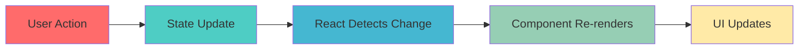

### 🔄 State vs Props

| Feature | State | Props |
|---------|-------|-------|
| **Mutable** | ✅ Yes | ❌ No |
| **Owned by** | Component itself | Parent component |
| **Can change** | Within component | Only by parent |
| **Purpose** | Manage dynamic data | Pass data down |

### 📊 State Lifecycle

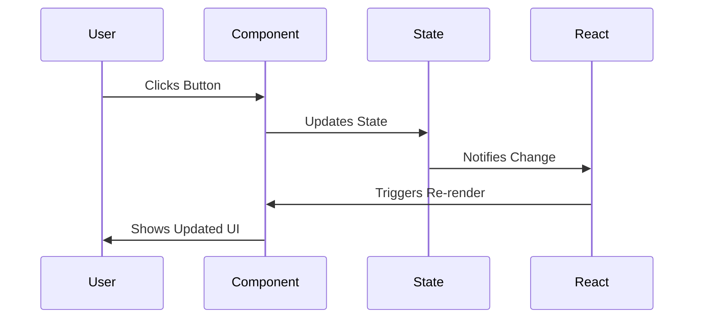

---

## 🪝 The useState Hook

### Basic Syntax

```javascript
const [state, setState] = useState(initialValue);
```

**Breaking it down:**

- `state` → Current state value
- `setState` → Function to update state
- `initialValue` → Starting value

### 🎮 Real-World Example: Counter App

```jsx
import React, { useState } from 'react';

function Counter() {
  // Declare state variable
  const [count, setCount] = useState(0);
  
  return (
    <div className="counter">
      <h2>Current Count: {count}</h2>
      <button onClick={() => setCount(count + 1)}>
        Increment ➕
      </button>
      <button onClick={() => setCount(count - 1)}>
        Decrement ➖
      </button>
      <button onClick={() => setCount(0)}>
        Reset 🔄
      </button>
    </div>
  );
}
```

### 🎨 Visual Flow

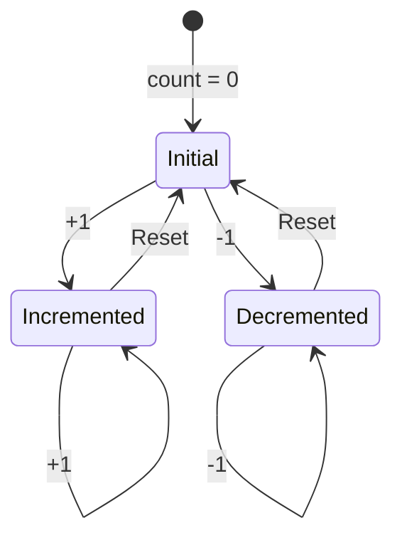

### 📦 Different State Types

#### 1️⃣ String State

```jsx
function Greeting() {
  const [name, setName] = useState('');
  
  return (
    <input 
      value={name}
      onChange={(e) => setName(e.target.value)}
      placeholder="Enter your name"
    />
  );
}
```

#### 2️⃣ Boolean State (Toggles)

```jsx
function LightSwitch() {
  const [isOn, setIsOn] = useState(false);
  
  return (
    <button onClick={() => setIsOn(!isOn)}>
      Light is {isOn ? '💡 ON' : '🌙 OFF'}
    </button>
  );
}
```

#### 3️⃣ Object State

```jsx
function UserProfile() {
  const [user, setUser] = useState({
    name: '',
    email: '',
    age: 0
  });
  
  const updateName = (newName) => {
    setUser({ ...user, name: newName });
  };
  
  return (
    <input 
      value={user.name}
      onChange={(e) => updateName(e.target.value)}
    />
  );
}
```

#### 4️⃣ Array State

```jsx
function TodoList() {
  const [todos, setTodos] = useState([]);
  
  const addTodo = (text) => {
    setTodos([...todos, { id: Date.now(), text }]);
  };
  
  const removeTodo = (id) => {
    setTodos(todos.filter(todo => todo.id !== id));
  };
  
  return (
    <div>
      {todos.map(todo => (
        <div key={todo.id}>
          {todo.text}
          <button onClick={() => removeTodo(todo.id)}>❌</button>
        </div>
      ))}
    </div>
  );
}
```

### ⚡ useState Best Practices

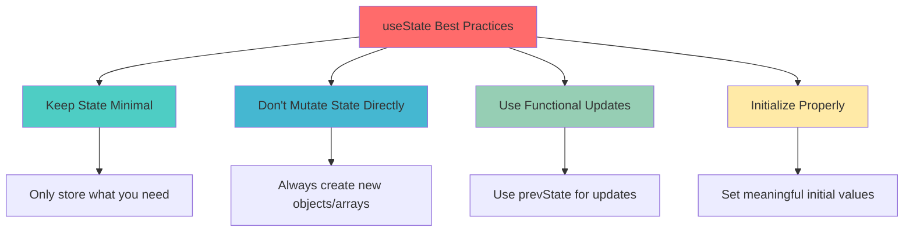

---

## 🎯 Event Handling in React

### Common Event Types

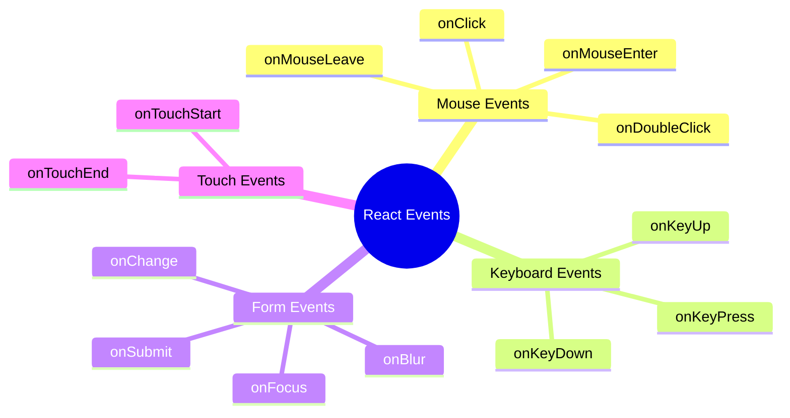

### 🖱️ onClick Events

```jsx
function ClickDemo() {
  const [clicks, setClicks] = useState(0);
  
  const handleClick = () => {
    setClicks(clicks + 1);
    console.log('Button clicked!');
  };
  
  const handleDoubleClick = () => {
    alert('Double clicked! 🎉');
  };
  
  return (
    <div>
      <button onClick={handleClick}>
        Clicked {clicks} times
      </button>
      <button onDoubleClick={handleDoubleClick}>
        Double Click Me
      </button>
    </div>
  );
}
```

### ⌨️ onChange Events

```jsx
function SearchBar() {
  const [searchTerm, setSearchTerm] = useState('');
  
  const handleChange = (event) => {
    const value = event.target.value;
    setSearchTerm(value);
    console.log('Searching for:', value);
  };
  
  return (
    <div>
      <input
        type="text"
        value={searchTerm}
        onChange={handleChange}
        placeholder="Search..."
      />
      <p>You searched for: {searchTerm}</p>
    </div>
  );
}
```

### 📝 onSubmit Events

```jsx
function LoginForm() {
  const [email, setEmail] = useState('');
  const [password, setPassword] = useState('');
  
  const handleSubmit = (event) => {
    event.preventDefault(); // Prevent page reload
    console.log('Login:', { email, password });
    
    // Clear form
    setEmail('');
    setPassword('');
  };
  
  return (
    <form onSubmit={handleSubmit}>
      <input
        type="email"
        value={email}
        onChange={(e) => setEmail(e.target.value)}
        placeholder="Email"
      />
      <input
        type="password"
        value={password}
        onChange={(e) => setPassword(e.target.value)}
        placeholder="Password"
      />
      <button type="submit">Login 🚀</button>
    </form>
  );
}
```

### 🎨 Event Flow

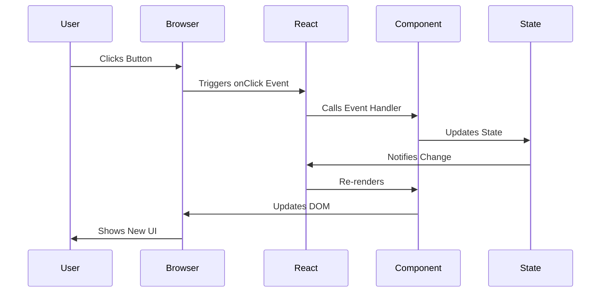

### 💡 Event Handler Patterns

#### Pattern 1: Inline Arrow Function

```jsx
<button onClick={() => setCount(count + 1)}>
  Increment
</button>
```

#### Pattern 2: Named Function

```jsx
const handleIncrement = () => {
  setCount(count + 1);
};

<button onClick={handleIncrement}>
  Increment
</button>
```

#### Pattern 3: Function with Parameters

```jsx
const updateCount = (amount) => {
  setCount(count + amount);
};

<button onClick={() => updateCount(5)}>
  Add 5
</button>
```

---

## 🎛️ Controlled vs Uncontrolled Components

### Understanding the Difference

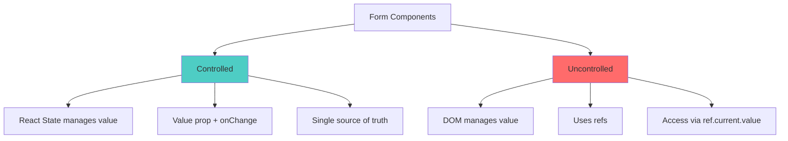

### ✅ Controlled Components (Recommended)

**React controls the input value through state**

```jsx
function ControlledInput() {
  const [value, setValue] = useState('');
  
  return (
    <div>
      <input
        type="text"
        value={value}  // Controlled by state
        onChange={(e) => setValue(e.target.value)}
      />
      <p>Current value: {value}</p>
    </div>
  );
}
```

#### 🎯 Complete Controlled Form Example

```jsx
function ControlledForm() {
  const [formData, setFormData] = useState({
    username: '',
    email: '',
    age: '',
    country: 'USA',
    subscribe: false
  });
  
  const handleChange = (e) => {
    const { name, value, type, checked } = e.target;
    setFormData(prev => ({
      ...prev,
      [name]: type === 'checkbox' ? checked : value
    }));
  };
  
  const handleSubmit = (e) => {
    e.preventDefault();
    console.log('Form submitted:', formData);
  };
  
  return (
    <form onSubmit={handleSubmit}>
      {/* Text Input */}
      <input
        name="username"
        value={formData.username}
        onChange={handleChange}
        placeholder="Username"
      />
      
      {/* Email Input */}
      <input
        name="email"
        type="email"
        value={formData.email}
        onChange={handleChange}
        placeholder="Email"
      />
      
      {/* Number Input */}
      <input
        name="age"
        type="number"
        value={formData.age}
        onChange={handleChange}
        placeholder="Age"
      />
      
      {/* Select Dropdown */}
      <select name="country" value={formData.country} onChange={handleChange}>
        <option value="USA">United States</option>
        <option value="UK">United Kingdom</option>
        <option value="India">India</option>
      </select>
      
      {/* Checkbox */}
      <label>
        <input
          name="subscribe"
          type="checkbox"
          checked={formData.subscribe}
          onChange={handleChange}
        />
        Subscribe to newsletter
      </label>
      
      <button type="submit">Submit</button>
    </form>
  );
}
```

### ❌ Uncontrolled Components

**DOM controls the input value, accessed via refs**

```jsx
import { useRef } from 'react';

function UncontrolledInput() {
  const inputRef = useRef(null);
  
  const handleSubmit = () => {
    console.log(inputRef.current.value);
  };
  
  return (
    <div>
      <input ref={inputRef} type="text" />
      <button onClick={handleSubmit}>Get Value</button>
    </div>
  );
}
```

### 📊 Comparison Table

| Feature | Controlled | Uncontrolled |
|---------|-----------|-------------|
| **State Management** | React State | DOM |
| **Access Value** | `value` prop | `ref.current.value` |
| **Real-time Validation** | ✅ Easy | ❌ Difficult |
| **Dynamic Updates** | ✅ Yes | ❌ Limited |
| **Form Reset** | ✅ Easy | ❌ Manual |
| **Performance** | Slight overhead | Faster |
| **Use Case** | Most forms | Simple forms, file inputs |

---

## ✅ Form Validation & User Feedback

### Validation Strategy

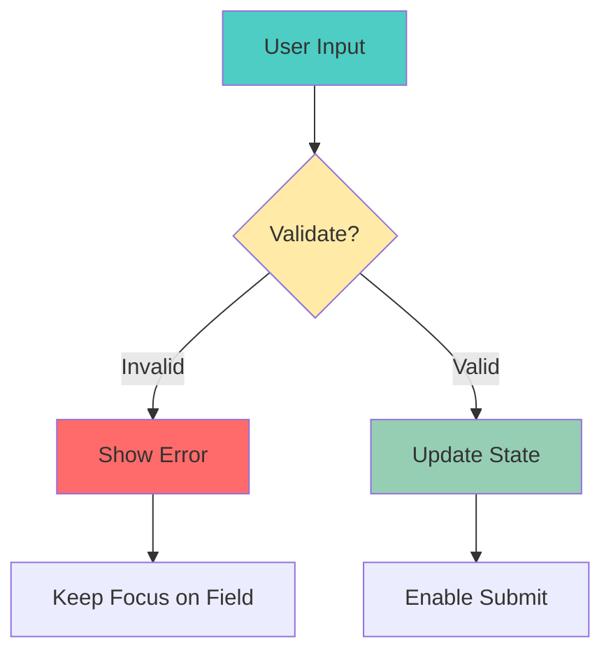

### 🎯 Complete Form with Validation

```jsx
function RegistrationForm() {
  const [formData, setFormData] = useState({
    username: '',
    email: '',
    password: '',
    confirmPassword: ''
  });
  
  const [errors, setErrors] = useState({});
  const [touched, setTouched] = useState({});
  const [isSubmitting, setIsSubmitting] = useState(false);
  
  // Validation rules
  const validate = () => {
    const newErrors = {};
    
    // Username validation
    if (!formData.username) {
      newErrors.username = 'Username is required';
    } else if (formData.username.length < 3) {
      newErrors.username = 'Username must be at least 3 characters';
    }
    
    // Email validation
    const emailRegex = /^[^\s@]+@[^\s@]+\.[^\s@]+$/;
    if (!formData.email) {
      newErrors.email = 'Email is required';
    } else if (!emailRegex.test(formData.email)) {
      newErrors.email = 'Invalid email format';
    }
    
    // Password validation
    if (!formData.password) {
      newErrors.password = 'Password is required';
    } else if (formData.password.length < 8) {
      newErrors.password = 'Password must be at least 8 characters';
    }
    
    // Confirm password validation
    if (formData.password !== formData.confirmPassword) {
      newErrors.confirmPassword = 'Passwords do not match';
    }
    
    return newErrors;
  };
  
  // Handle input change
  const handleChange = (e) => {
    const { name, value } = e.target;
    setFormData(prev => ({ ...prev, [name]: value }));
    
    // Clear error when user starts typing
    if (errors[name]) {
      setErrors(prev => ({ ...prev, [name]: '' }));
    }
  };
  
  // Handle blur (when user leaves field)
  const handleBlur = (e) => {
    const { name } = e.target;
    setTouched(prev => ({ ...prev, [name]: true }));
    
    // Validate single field
    const newErrors = validate();
    if (newErrors[name]) {
      setErrors(prev => ({ ...prev, [name]: newErrors[name] }));
    }
  };
  
  // Handle form submission
  const handleSubmit = async (e) => {
    e.preventDefault();
    
    // Mark all fields as touched
    setTouched({
      username: true,
      email: true,
      password: true,
      confirmPassword: true
    });
    
    // Validate all fields
    const newErrors = validate();
    setErrors(newErrors);
    
    // If no errors, submit form
    if (Object.keys(newErrors).length === 0) {
      setIsSubmitting(true);
      
      try {
        // Simulate API call
        await new Promise(resolve => setTimeout(resolve, 2000));
        console.log('Form submitted:', formData);
        alert('Registration successful! 🎉');
        
        // Reset form
        setFormData({
          username: '',
          email: '',
          password: '',
          confirmPassword: ''
        });
        setTouched({});
      } catch (error) {
        alert('Submission failed. Please try again.');
      } finally {
        setIsSubmitting(false);
      }
    }
  };
  
  return (
    <form onSubmit={handleSubmit} className="registration-form">
      <h2>Create Account 🚀</h2>
      
      {/* Username Field */}
      <div className="form-group">
        <label>Username *</label>
        <input
          type="text"
          name="username"
          value={formData.username}
          onChange={handleChange}
          onBlur={handleBlur}
          className={errors.username && touched.username ? 'error' : ''}
        />
        {errors.username && touched.username && (
          <span className="error-message">❌ {errors.username}</span>
        )}
      </div>
      
      {/* Email Field */}
      <div className="form-group">
        <label>Email *</label>
        <input
          type="email"
          name="email"
          value={formData.email}
          onChange={handleChange}
          onBlur={handleBlur}
          className={errors.email && touched.email ? 'error' : ''}
        />
        {errors.email && touched.email && (
          <span className="error-message">❌ {errors.email}</span>
        )}
      </div>
      
      {/* Password Field */}
      <div className="form-group">
        <label>Password *</label>
        <input
          type="password"
          name="password"
          value={formData.password}
          onChange={handleChange}
          onBlur={handleBlur}
          className={errors.password && touched.password ? 'error' : ''}
        />
        {errors.password && touched.password && (
          <span className="error-message">❌ {errors.password}</span>
        )}
      </div>
      
      {/* Confirm Password Field */}
      <div className="form-group">
        <label>Confirm Password *</label>
        <input
          type="password"
          name="confirmPassword"
          value={formData.confirmPassword}
          onChange={handleChange}
          onBlur={handleBlur}
          className={errors.confirmPassword && touched.confirmPassword ? 'error' : ''}
        />
        {errors.confirmPassword && touched.confirmPassword && (
          <span className="error-message">❌ {errors.confirmPassword}</span>
        )}
      </div>
      
      {/* Submit Button */}
      <button 
        type="submit" 
        disabled={isSubmitting}
        className="submit-button"
      >
        {isSubmitting ? 'Submitting...' : 'Register'}
      </button>
    </form>
  );
}
```

### 🎨 Validation Types

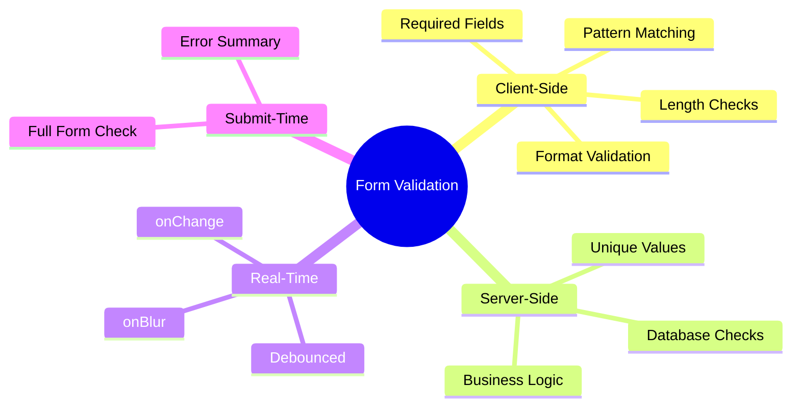

### 📋 Common Validation Patterns

```jsx
// Email Validation
const validateEmail = (email) => {
  const regex = /^[^\s@]+@[^\s@]+\.[^\s@]+$/;
  return regex.test(email);
};

// Phone Number (US Format)
const validatePhone = (phone) => {
  const regex = /^\(?([0-9]{3})\)?[-. ]?([0-9]{3})[-. ]?([0-9]{4})$/;
  return regex.test(phone);
};

// Password Strength
const validatePassword = (password) => {
  const minLength = password.length >= 8;
  const hasUpper = /[A-Z]/.test(password);
  const hasLower = /[a-z]/.test(password);
  const hasNumber = /[0-9]/.test(password);
  const hasSpecial = /[!@#$%^&*]/.test(password);
  
  return {
    isValid: minLength && hasUpper && hasLower && hasNumber,
    strength: [minLength, hasUpper, hasLower, hasNumber, hasSpecial]
      .filter(Boolean).length
  };
};

// URL Validation
const validateURL = (url) => {
  try {
    new URL(url);
    return true;
  } catch {
    return false;
  }
};
```

---

## 🎭 Conditional Rendering

### Rendering Techniques

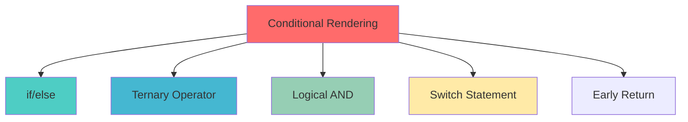

### 1️⃣ Ternary Operator

```jsx
function WelcomeMessage({ isLoggedIn, username }) {
  return (
    <div>
      {isLoggedIn ? (
        <h1>Welcome back, {username}! 👋</h1>
      ) : (
        <h1>Please log in 🔐</h1>
      )}
    </div>
  );
}
```

### 2️⃣ Logical AND (&&)

```jsx
function Notification({ hasNewMessages, messageCount }) {
  return (
    <div>
      {hasNewMessages && (
        <div className="notification">
          You have {messageCount} new messages! 📧
        </div>
      )}
    </div>
  );
}
```

### 3️⃣ Early Return

```jsx
function UserProfile({ user }) {
  // Early return if no user
  if (!user) {
    return <div>Loading user data... ⏳</div>;
  }
  
  // Early return if user not verified
  if (!user.isVerified) {
    return <div>Please verify your email ✉️</div>;
  }
  
  // Main content
  return (
    <div>
      <h2>{user.name}</h2>
      <p>{user.email}</p>
    </div>
  );
}
```

### 4️⃣ Multiple Conditions

```jsx
function StatusBadge({ status }) {
  const getStatusInfo = () => {
    switch(status) {
      case 'active':
        return { text: 'Active', color: 'green', icon: '✅' };
      case 'pending':
        return { text: 'Pending', color: 'yellow', icon: '⏳' };
      case 'inactive':
        return { text: 'Inactive', color: 'red', icon: '❌' };
      default:
        return { text: 'Unknown', color: 'gray', icon: '❓' };
    }
  };
  
  const info = getStatusInfo();
  
  return (
    <span style={{ color: info.color }}>
      {info.icon} {info.text}
    </span>
  );
}
```

### 🎨 Real-World Example: Dashboard

```jsx
function Dashboard() {
  const [user, setUser] = useState(null);
  const [isLoading, setIsLoading] = useState(true);
  const [error, setError] = useState(null);
  
  // Simulate fetching user data
  useEffect(() => {
    setTimeout(() => {
      setUser({ name: 'John Doe', role: 'admin' });
      setIsLoading(false);
    }, 2000);
  }, []);
  
  // Loading state
  if (isLoading) {
    return (
      <div className="loading">
        <div className="spinner"></div>
        <p>Loading dashboard... ⏳</p>
      </div>
    );
  }
  
  // Error state
  if (error) {
    return (
      <div className="error">
        <h2>❌ Error</h2>
        <p>{error}</p>
        <button onClick={() => window.location.reload()}>
          Retry
        </button>
      </div>
    );
  }
  
  // No user state
  if (!user) {
    return (
      <div className="no-user">
        <h2>🔐 Access Denied</h2>
        <p>Please log in to view the dashboard</p>
      </div>
    );
  }
  
  // Success state
  return (
    <div className="dashboard">
      <h1>Welcome, {user.name}! 🎉</h1>
      
      {/* Admin-only content */}
      {user.role === 'admin' && (
        <div className="admin-panel">
          <h2>Admin Controls 👑</h2>
          {/* Admin features */}
        </div>
      )}
      
      {/* Regular content */}
      <div className="content">
        {/* Dashboard content */}
      </div>
    </div>
  );
}
```

---

## 🏆 State Management Best Practices

### The Golden Rules

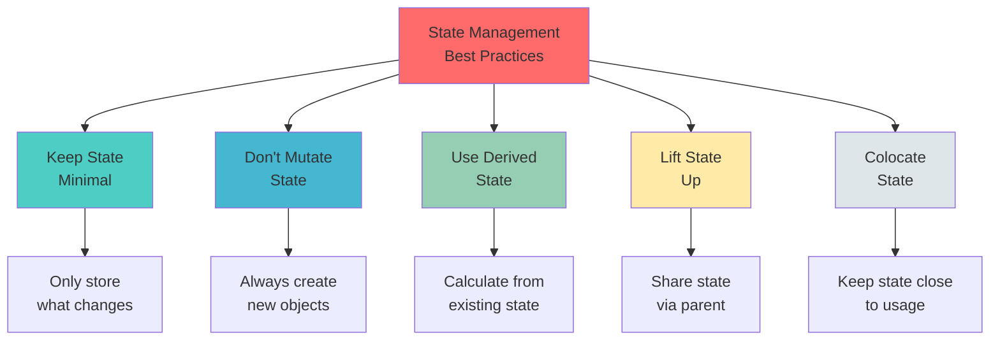

### 1️⃣ Keep State Minimal

```jsx
// ❌ Bad: Storing derived data
function BadExample() {
  const [price, setPrice] = useState(100);
  const [tax, setTax] = useState(15);  // Derived from price
  const [total, setTotal] = useState(115);  // Derived from price + tax
}

// ✅ Good: Calculate derived data
function GoodExample() {
  const [price, setPrice] = useState(100);
  const tax = price * 0.15;  // Calculated
  const total = price + tax;  // Calculated
}
```

### 2️⃣ Don't Mutate State Directly

```jsx
// ❌ Bad: Direct mutation
function BadTodoList() {
  const [todos, setTodos] = useState([]);
  
  const addTodo = (text) => {
    todos.push({ id: Date.now(), text });  // NEVER DO THIS
    setTodos(todos);
  };
}

// ✅ Good: Create new array
function GoodTodoList() {
  const [todos, setTodos] = useState([]);
  
  const addTodo = (text) => {
    setTodos([...todos, { id: Date.now(), text }]);
  };
}
```

### 3️⃣ Use Functional Updates

```jsx
// ❌ Bad: Using current state directly
function BadCounter() {
  const [count, setCount] = useState(0);
  
  const increment = () => {
    setCount(count + 1);
    setCount(count + 1);  // Won't work as expected
  };
}

// ✅ Good: Using functional update
function GoodCounter() {
  const [count, setCount] = useState(0);
  
  const increment = () => {
    setCount(prev => prev + 1);
    setCount(prev => prev + 1);  // Works correctly
  };
}
```

### 4️⃣ Lifting State Up

```jsx
// Parent component manages shared state
function ShoppingApp() {
  const [cartItems, setCartItems] = useState([]);
  
  const addToCart = (item) => {
    setCartItems([...cartItems, item]);
  };
  
  const removeFromCart = (itemId) => {
    setCartItems(cartItems.filter(item => item.id !== itemId));
  };
  
  return (
    <div>
      <ProductList onAddToCart={addToCart} />
      <Cart items={cartItems} onRemove={removeFromCart} />
    </div>
  );
}
```

### 5️⃣ State Colocation

```jsx
// ✅ Good: Keep state close to where it's used
function UserProfile() {
  return (
    <div>
      <PersonalInfo />  {/* Has its own state */}
      <AddressInfo />   {/* Has its own state */}
      <Preferences />   {/* Has its own state */}
    </div>
  );
}

function PersonalInfo() {
  const [name, setName] = useState('');  // Local state
  const [email, setEmail] = useState('');  // Local state
  
  return (/* ... */);
}
```

### 📊 State Organization Pattern

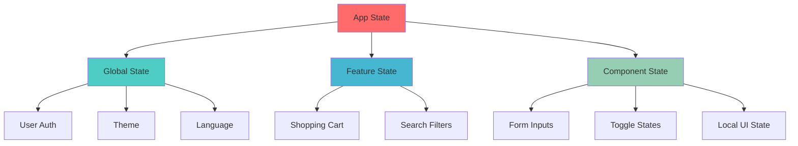

---

## 🚀 Hands-On Projects

### Project 1: Interactive Contact Form

Build a professional contact form with validation and user feedback.

```jsx
import React, { useState } from 'react';
import './ContactForm.css';

function ContactForm() {
  const [formData, setFormData] = useState({
    name: '',
    email: '',
    subject: '',
    message: ''
  });
  
  const [errors, setErrors] = useState({});
  const [touched, setTouched] = useState({});
  const [isSubmitting, setIsSubmitting] = useState(false);
  const [submitStatus, setSubmitStatus] = useState(null);
  
  // Validation function
  const validate = () => {
    const newErrors = {};
    
    if (!formData.name.trim()) {
      newErrors.name = 'Name is required';
    } else if (formData.name.length < 2) {
      newErrors.name = 'Name must be at least 2 characters';
    }
    
    const emailRegex = /^[^\s@]+@[^\s@]+\.[^\s@]+$/;
    if (!formData.email) {
      newErrors.email = 'Email is required';
    } else if (!emailRegex.test(formData.email)) {
      newErrors.email = 'Invalid email address';
    }
    
    if (!formData.subject.trim()) {
      newErrors.subject = 'Subject is required';
    }
    
    if (!formData.message.trim()) {
      newErrors.message = 'Message is required';
    } else if (formData.message.length < 10) {
      newErrors.message = 'Message must be at least 10 characters';
    }
    
    return newErrors;
  };
  
  // Handle input change
  const handleChange = (e) => {
    const { name, value } = e.target;
    setFormData(prev => ({ ...prev, [name]: value }));
    
    if (errors[name]) {
      setErrors(prev => ({ ...prev, [name]: '' }));
    }
  };
  
  // Handle blur
  const handleBlur = (e) => {
    const { name } = e.target;
    setTouched(prev => ({ ...prev, [name]: true }));
    
    const newErrors = validate();
    if (newErrors[name]) {
      setErrors(prev => ({ ...prev, [name]: newErrors[name] }));
    }
  };
  
  // Handle submit
  const handleSubmit = async (e) => {
    e.preventDefault();
    
    // Mark all as touched
    setTouched({
      name: true,
      email: true,
      subject: true,
      message: true
    });
    
    const newErrors = validate();
    setErrors(newErrors);
    
    if (Object.keys(newErrors).length === 0) {
      setIsSubmitting(true);
      setSubmitStatus(null);
      
      try {
        // Simulate API call
        await new Promise(resolve => setTimeout(resolve, 2000));
        
        setSubmitStatus('success');
        setFormData({ name: '', email: '', subject: '', message: '' });
        setTouched({});
        
        setTimeout(() => setSubmitStatus(null), 5000);
      } catch (error) {
        setSubmitStatus('error');
      } finally {
        setIsSubmitting(false);
      }
    }
  };
  
  return (
    <div className="contact-form-container">
      <h2>📧 Contact Us</h2>
      
      {submitStatus === 'success' && (
        <div className="alert success">
          ✅ Message sent successfully! We'll get back to you soon.
        </div>
      )}
      
      {submitStatus === 'error' && (
        <div className="alert error">
          ❌ Failed to send message. Please try again.
        </div>
      )}
      
      <form onSubmit={handleSubmit} className="contact-form">
        <div className="form-group">
          <label htmlFor="name">Name *</label>
          <input
            id="name"
            name="name"
            type="text"
            value={formData.name}
            onChange={handleChange}
            onBlur={handleBlur}
            className={errors.name && touched.name ? 'error' : ''}
            placeholder="John Doe"
          />
          {errors.name && touched.name && (
            <span className="error-message">{errors.name}</span>
          )}
        </div>
        
        <div className="form-group">
          <label htmlFor="email">Email *</label>
          <input
            id="email"
            name="email"
            type="email"
            value={formData.email}
            onChange={handleChange}
            onBlur={handleBlur}
            className={errors.email && touched.email ? 'error' : ''}
            placeholder="john@example.com"
          />
          {errors.email && touched.email && (
            <span className="error-message">{errors.email}</span>
          )}
        </div>
        
        <div className="form-group">
          <label htmlFor="subject">Subject *</label>
          <input
            id="subject"
            name="subject"
            type="text"
            value={formData.subject}
            onChange={handleChange}
            onBlur={handleBlur}
            className={errors.subject && touched.subject ? 'error' : ''}
            placeholder="How can we help?"
          />
          {errors.subject && touched.subject && (
            <span className="error-message">{errors.subject}</span>
          )}
        </div>
        
        <div className="form-group">
          <label htmlFor="message">Message *</label>
          <textarea
            id="message"
            name="message"
            rows="5"
            value={formData.message}
            onChange={handleChange}
            onBlur={handleBlur}
            className={errors.message && touched.message ? 'error' : ''}
            placeholder="Tell us more..."
          />
          {errors.message && touched.message && (
            <span className="error-message">{errors.message}</span>
          )}
          <span className="char-count">
            {formData.message.length} characters
          </span>
        </div>
        
        <button 
          type="submit" 
          className="submit-btn"
          disabled={isSubmitting}
        >
          {isSubmitting ? '📤 Sending...' : '📨 Send Message'}
        </button>
      </form>
    </div>
  );
}

export default ContactForm;
```

#### 🎨 ContactForm.css

```css
.contact-form-container {
  max-width: 600px;
  margin: 40px auto;
  padding: 30px;
  background: #ffffff;
  border-radius: 12px;
  box-shadow: 0 4px 6px rgba(0, 0, 0, 0.1);
}

.contact-form-container h2 {
  text-align: center;
  color: #2c3e50;
  margin-bottom: 30px;
  font-size: 2em;
}

.contact-form {
  display: flex;
  flex-direction: column;
  gap: 20px;
}

.form-group {
  display: flex;
  flex-direction: column;
  gap: 8px;
}

.form-group label {
  font-weight: 600;
  color: #34495e;
  font-size: 14px;
}

.form-group input,
.form-group textarea {
  padding: 12px 16px;
  border: 2px solid #e0e0e0;
  border-radius: 8px;
  font-size: 16px;
  transition: all 0.3s ease;
  font-family: inherit;
}

.form-group input:focus,
.form-group textarea:focus {
  outline: none;
  border-color: #3498db;
  box-shadow: 0 0 0 3px rgba(52, 152, 219, 0.1);
}

.form-group input.error,
.form-group textarea.error {
  border-color: #e74c3c;
}

.error-message {
  color: #e74c3c;
  font-size: 13px;
  margin-top: -4px;
}

.char-count {
  font-size: 12px;
  color: #95a5a6;
  text-align: right;
}

.submit-btn {
  padding: 14px 24px;
  background: linear-gradient(135deg, #667eea 0%, #764ba2 100%);
  color: white;
  border: none;
  border-radius: 8px;
  font-size: 16px;
  font-weight: 600;
  cursor: pointer;
  transition: all 0.3s ease;
  margin-top: 10px;
}

.submit-btn:hover:not(:disabled) {
  transform: translateY(-2px);
  box-shadow: 0 6px 12px rgba(102, 126, 234, 0.4);
}

.submit-btn:disabled {
  opacity: 0.6;
  cursor: not-allowed;
}

.alert {
  padding: 14px 18px;
  border-radius: 8px;
  margin-bottom: 20px;
  font-weight: 500;
}

.alert.success {
  background-color: #d4edda;
  color: #155724;
  border: 1px solid #c3e6cb;
}

.alert.error {
  background-color: #f8d7da;
  color: #721c24;
  border: 1px solid #f5c6cb;
}

@media (max-width: 600px) {
  .contact-form-container {
    padding: 20px;
    margin: 20px;
  }
}
```

---

### Project 2: Project Showcase with Filtering

Build a dynamic project portfolio with filtering capabilities.

```jsx
import React, { useState } from 'react';
import './ProjectShowcase.css';

function ProjectShowcase() {
  // Sample project data
  const [projects] = useState([
    {
      id: 1,
      title: 'E-Commerce Platform',
      category: 'web',
      tags: ['React', 'Node.js', 'MongoDB'],
      description: 'Full-stack e-commerce solution with payment integration',
      image: '🛒',
      status: 'completed',
      featured: true
    },
    {
      id: 2,
      title: 'Mobile Fitness App',
      category: 'mobile',
      tags: ['React Native', 'Firebase'],
      description: 'Track workouts and nutrition with AI recommendations',
      image: '💪',
      status: 'in-progress',
      featured: true
    },
    {
      id: 3,
      title: 'Data Visualization Dashboard',
      category: 'web',
      tags: ['D3.js', 'Python', 'Flask'],
      description: 'Interactive dashboard for business analytics',
      image: '📊',
      status: 'completed',
      featured: false
    },
    {
      id: 4,
      title: 'AI Chatbot',
      category: 'ai',
      tags: ['Python', 'TensorFlow', 'NLP'],
      description: 'Customer service chatbot with natural language processing',
      image: '🤖',
      status: 'completed',
      featured: true
    },
    {
      id: 5,
      title: 'Task Management Tool',
      category: 'web',
      tags: ['Vue.js', 'Express', 'PostgreSQL'],
      description: 'Collaborative task management for teams',
      image: '✅',
      status: 'planning',
      featured: false
    },
    {
      id: 6,
      title: 'Weather Forecast App',
      category: 'mobile',
      tags: ['React Native', 'API Integration'],
      description: 'Real-time weather updates with beautiful UI',
      image: '🌤️',
      status: 'completed',
      featured: false
    }
  ]);
  
  const [activeCategory, setActiveCategory] = useState('all');
  const [searchTerm, setSearchTerm] = useState('');
  const [selectedStatus, setSelectedStatus] = useState('all');
  const [showFeaturedOnly, setShowFeaturedOnly] = useState(false);
  
  // Filter projects based on criteria
  const filteredProjects = projects.filter(project => {
    const matchesCategory = activeCategory === 'all' || project.category === activeCategory;
    const matchesSearch = project.title.toLowerCase().includes(searchTerm.toLowerCase()) ||
                         project.description.toLowerCase().includes(searchTerm.toLowerCase()) ||
                         project.tags.some(tag => tag.toLowerCase().includes(searchTerm.toLowerCase()));
    const matchesStatus = selectedStatus === 'all' || project.status === selectedStatus;
    const matchesFeatured = !showFeaturedOnly || project.featured;
    
    return matchesCategory && matchesSearch && matchesStatus && matchesFeatured;
  });
  
  // Get counts for each category
  const getCategoryCount = (category) => {
    if (category === 'all') return projects.length;
    return projects.filter(p => p.category === category).length;
  };
  
  // Clear all filters
  const clearFilters = () => {
    setActiveCategory('all');
    setSearchTerm('');
    setSelectedStatus('all');
    setShowFeaturedOnly(false);
  };
  
  return (
    <div className="project-showcase">
      <header className="showcase-header">
        <h1>🚀 Project Portfolio</h1>
        <p>Explore my latest work and creations</p>
      </header>
      
      {/* Filter Controls */}
      <div className="filters-container">
        {/* Search Bar */}
        <div className="search-bar">
          <span className="search-icon">🔍</span>
          <input
            type="text"
            placeholder="Search projects, tags, or descriptions..."
            value={searchTerm}
            onChange={(e) => setSearchTerm(e.target.value)}
          />
          {searchTerm && (
            <button 
              className="clear-search"
              onClick={() => setSearchTerm('')}
            >
              ✕
            </button>
          )}
        </div>
        
        {/* Category Filters */}
        <div className="category-filters">
          {['all', 'web', 'mobile', 'ai'].map(category => (
            <button
              key={category}
              className={`category-btn ${activeCategory === category ? 'active' : ''}`}
              onClick={() => setActiveCategory(category)}
            >
              {category === 'all' ? '🌐 All' : 
               category === 'web' ? '💻 Web' :
               category === 'mobile' ? '📱 Mobile' : '🤖 AI'}
              <span className="count">{getCategoryCount(category)}</span>
            </button>
          ))}
        </div>
        
        {/* Additional Filters */}
        <div className="additional-filters">
          <select
            value={selectedStatus}
            onChange={(e) => setSelectedStatus(e.target.value)}
            className="status-select"
          >
            <option value="all">All Status</option>
            <option value="completed">Completed</option>
            <option value="in-progress">In Progress</option>
            <option value="planning">Planning</option>
          </select>
          
          <label className="featured-toggle">
            <input
              type="checkbox"
              checked={showFeaturedOnly}
              onChange={(e) => setShowFeaturedOnly(e.target.checked)}
            />
            <span>⭐ Featured Only</span>
          </label>
          
          <button className="clear-btn" onClick={clearFilters}>
            🔄 Clear Filters
          </button>
        </div>
      </div>
      
      {/* Results Info */}
      <div className="results-info">
        <p>
          Showing <strong>{filteredProjects.length}</strong> of <strong>{projects.length}</strong> projects
        </p>
      </div>
      
      {/* Projects Grid */}
      {filteredProjects.length > 0 ? (
        <div className="projects-grid">
          {filteredProjects.map(project => (
            <div key={project.id} className="project-card">
              {project.featured && (
                <div className="featured-badge">⭐ Featured</div>
              )}
              
              <div className="project-icon">{project.image}</div>
              
              <h3>{project.title}</h3>
              
              <div className="project-tags">
                {project.tags.map(tag => (
                  <span key={tag} className="tag">{tag}</span>
                ))}
              </div>
              
              <p className="project-description">{project.description}</p>
              
              <div className="project-footer">
                <span className={`status status-${project.status}`}>
                  {project.status === 'completed' ? '✅' :
                   project.status === 'in-progress' ? '🔄' : '📋'}
                  {project.status.replace('-', ' ')}
                </span>
                
                <button className="view-btn">View Details →</button>
              </div>
            </div>
          ))}
        </div>
      ) : (
        <div className="no-results">
          <div className="no-results-icon">🔍</div>
          <h3>No projects found</h3>
          <p>Try adjusting your filters or search terms</p>
          <button className="clear-btn" onClick={clearFilters}>
            Clear All Filters
          </button>
        </div>
      )}
    </div>
  );
}

export default ProjectShowcase;
```

#### 🎨 ProjectShowcase.css

```css
.project-showcase {
  max-width: 1200px;
  margin: 0 auto;
  padding: 40px 20px;
}

.showcase-header {
  text-align: center;
  margin-bottom: 40px;
}

.showcase-header h1 {
  font-size: 3em;
  color: #2c3e50;
  margin-bottom: 10px;
}

.showcase-header p {
  font-size: 1.2em;
  color: #7f8c8d;
}

/* Filters */
.filters-container {
  background: white;
  padding: 30px;
  border-radius: 16px;
  box-shadow: 0 4px 6px rgba(0, 0, 0, 0.07);
  margin-bottom: 30px;
}

.search-bar {
  position: relative;
  margin-bottom: 20px;
}

.search-bar input {
  width: 100%;
  padding: 14px 50px 14px 50px;
  border: 2px solid #e0e0e0;
  border-radius: 50px;
  font-size: 16px;
  transition: all 0.3s ease;
}

.search-bar input:focus {
  outline: none;
  border-color: #3498db;
  box-shadow: 0 0 0 3px rgba(52, 152, 219, 0.1);
}

.search-icon {
  position: absolute;
  left: 20px;
  top: 50%;
  transform: translateY(-50%);
  font-size: 20px;
}

.clear-search {
  position: absolute;
  right: 20px;
  top: 50%;
  transform: translateY(-50%);
  background: none;
  border: none;
  font-size: 20px;
  cursor: pointer;
  color: #95a5a6;
  transition: color 0.3s;
}

.clear-search:hover {
  color: #e74c3c;
}

.category-filters {
  display: flex;
  gap: 12px;
  margin-bottom: 20px;
  flex-wrap: wrap;
}

.category-btn {
  padding: 10px 20px;
  border: 2px solid #e0e0e0;
  background: white;
  border-radius: 50px;
  cursor: pointer;
  transition: all 0.3s ease;
  font-weight: 600;
  display: flex;
  align-items: center;
  gap: 8px;
}

.category-btn:hover {
  border-color: #3498db;
  transform: translateY(-2px);
}

.category-btn.active {
  background: linear-gradient(135deg, #667eea 0%, #764ba2 100%);
  color: white;
  border-color: transparent;
}

.category-btn .count {
  background: rgba(0, 0, 0, 0.1);
  padding: 2px 8px;
  border-radius: 12px;
  font-size: 12px;
}

.category-btn.active .count {
  background: rgba(255, 255, 255, 0.3);
}

.additional-filters {
  display: flex;
  gap: 15px;
  align-items: center;
  flex-wrap: wrap;
}

.status-select {
  padding: 10px 16px;
  border: 2px solid #e0e0e0;
  border-radius: 8px;
  font-size: 14px;
  cursor: pointer;
  background: white;
  transition: border-color 0.3s;
}

.status-select:focus {
  outline: none;
  border-color: #3498db;
}

.featured-toggle {
  display: flex;
  align-items: center;
  gap: 8px;
  cursor: pointer;
  user-select: none;
}

.featured-toggle input[type="checkbox"] {
  width: 18px;
  height: 18px;
  cursor: pointer;
}

.clear-btn {
  padding: 10px 20px;
  background: #e74c3c;
  color: white;
  border: none;
  border-radius: 8px;
  cursor: pointer;
  font-weight: 600;
  transition: all 0.3s ease;
}

.clear-btn:hover {
  background: #c0392b;
  transform: translateY(-2px);
}

/* Results Info */
.results-info {
  text-align: center;
  margin-bottom: 30px;
  color: #7f8c8d;
}

.results-info strong {
  color: #2c3e50;
  font-weight: 700;
}

/* Projects Grid */
.projects-grid {
  display: grid;
  grid-template-columns: repeat(auto-fill, minmax(320px, 1fr));
  gap: 30px;
}

.project-card {
  background: white;
  border-radius: 16px;
  padding: 30px;
  box-shadow: 0 4px 6px rgba(0, 0, 0, 0.07);
  transition: all 0.3s ease;
  position: relative;
  overflow: hidden;
}

.project-card:hover {
  transform: translateY(-8px);
  box-shadow: 0 12px 24px rgba(0, 0, 0, 0.15);
}

.featured-badge {
  position: absolute;
  top: 15px;
  right: 15px;
  background: linear-gradient(135deg, #f093fb 0%, #f5576c 100%);
  color: white;
  padding: 6px 12px;
  border-radius: 50px;
  font-size: 12px;
  font-weight: 600;
}

.project-icon {
  font-size: 4em;
  margin-bottom: 15px;
}

.project-card h3 {
  font-size: 1.5em;
  color: #2c3e50;
  margin-bottom: 15px;
}

.project-tags {
  display: flex;
  flex-wrap: wrap;
  gap: 8px;
  margin-bottom: 15px;
}

.tag {
  background: #ecf0f1;
  padding: 5px 12px;
  border-radius: 50px;
  font-size: 12px;
  color: #34495e;
  font-weight: 500;
}

.project-description {
  color: #7f8c8d;
  line-height: 1.6;
  margin-bottom: 20px;
}

.project-footer {
  display: flex;
  justify-content: space-between;
  align-items: center;
  padding-top: 20px;
  border-top: 1px solid #ecf0f1;
}

.status {
  padding: 6px 12px;
  border-radius: 50px;
  font-size: 12px;
  font-weight: 600;
  text-transform: capitalize;
}

.status-completed {
  background: #d4edda;
  color: #155724;
}

.status-in-progress {
  background: #fff3cd;
  color: #856404;
}

.status-planning {
  background: #d1ecf1;
  color: #0c5460;
}

.view-btn {
  background: linear-gradient(135deg, #667eea 0%, #764ba2 100%);
  color: white;
  border: none;
  padding: 8px 16px;
  border-radius: 8px;
  cursor: pointer;
  font-weight: 600;
  transition: all 0.3s ease;
}

.view-btn:hover {
  transform: translateX(4px);
}

/* No Results */
.no-results {
  text-align: center;
  padding: 80px 20px;
}

.no-results-icon {
  font-size: 5em;
  margin-bottom: 20px;
  opacity: 0.5;
}

.no-results h3 {
  font-size: 2em;
  color: #2c3e50;
  margin-bottom: 10px;
}

.no-results p {
  color: #7f8c8d;
  margin-bottom: 30px;
}

/* Responsive */
@media (max-width: 768px) {
  .showcase-header h1 {
    font-size: 2em;
  }
  
  .projects-grid {
    grid-template-columns: 1fr;
  }
  
  .additional-filters {
    flex-direction: column;
    align-items: stretch;
  }
  
  .status-select,
  .clear-btn {
    width: 100%;
  }
}
```

---

## 🎓 Key Takeaways

### ✨ What You've Learned

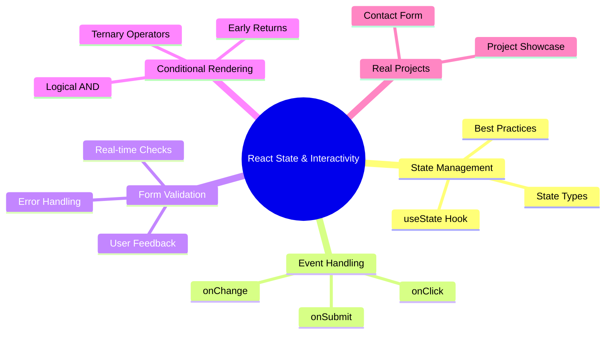

### 🎯 Practice Challenges

1. **Challenge 1: Todo App** ✅
   - Build a todo list with add, delete, and toggle complete
   - Add filtering (all, active, completed)
   - Persist data in localStorage

2. **Challenge 2: Calculator** 🔢
   - Create a functional calculator
   - Handle all basic operations
   - Include clear and backspace

3. **Challenge 3: Weather App** 🌤️
   - Fetch weather data from API
   - Display current weather and forecast
   - Add city search functionality

4. **Challenge 4: Shopping Cart** 🛒
   - Add/remove items from cart
   - Calculate totals
   - Apply discount codes

### 📚 Further Resources

- [React Docs - State](https://react.dev/learn/state-a-components-memory)
- [React Docs - Events](https://react.dev/learn/responding-to-events)
- [Form Validation Best Practices](https://react.dev/learn/managing-state)
- [Conditional Rendering Guide](https://react.dev/learn/conditional-rendering)

---

## 🎉 Conclusion

Congratulations! You've mastered the fundamentals of **React state and interactivity**. You can now:

✅ Manage component state effectively
✅ Handle user interactions professionally
✅ Build validated forms with great UX
✅ Create dynamic, responsive interfaces
✅ Apply state management best practices

### 🚀 Next Steps

1. **Practice** building the hands-on projects
2. **Experiment** with more complex state scenarios
3. **Explore** advanced hooks (useEffect, useContext)
4. **Build** your own creative interactive components

---

## 💪 You're Ready

Keep practicing, stay curious, and happy coding! 🎊

Remember: **Every expert was once a beginner.** Keep building! 🚀

---

*Created with ❤️ for aspiring web developers*
