# 🎣 Session 13: React Hooks and Managing Side Effects

**Prerequisites:** Basic React knowledge from previous sessions

> **Focus:** Advanced Hooks & API Integration

---

## 📚 Table of Contents

1. [Introduction to Side Effects](#introduction-to-side-effects)
2. [The useEffect Hook](#the-useeffect-hook)
3. [HTTP Requests with Fetch](#http-requests-with-fetch)
4. [useContext for State Sharing](#usecontext-for-state-sharing)
5. [Custom Hooks](#custom-hooks)
6. [Hook Rules and Best Practices](#hook-rules-and-best-practices)
7. [Error Handling](#error-handling)
8. [Hands-On Practice](#hands-on-practice)

---

## 🌟 Introduction to Side Effects

### What is a Side Effect?

A **side effect** is any operation that affects something outside the scope of the function being executed. In React, side effects include:

- 🌐 **Fetching data** from APIs
- 📝 **Updating the DOM** directly
- ⏰ **Setting timers** or intervals
- 🔔 **Subscribing to events**
- 💾 **Reading/writing to localStorage**

### Real-World Analogy

Think of your React component as a **coffee shop**:

- The component's render is like displaying your menu (pure function)
- Side effects are like the barista ordering supplies, cleaning tables, or calling customers when their order is ready (operations that affect the outside world)


---

## ⚡ The useEffect Hook

### Understanding useEffect

`useEffect` is React's way of handling side effects in functional components. It runs **after** the component renders.

### Basic Syntax

```javascript
useEffect(() => {
  // Your side effect code here
  
  return () => {
    // Cleanup code (optional)
  };
}, [dependencies]);
```

### The Three Forms of useEffect


### Example 1: Document Title Update

```javascript
import { useState, useEffect } from 'react';

function NotificationCounter() {
  const [count, setCount] = useState(0);

  // Side effect: Update document title
  useEffect(() => {
    document.title = `You have ${count} notifications`;
  }, [count]); // Only re-run when count changes

  return (
    <div>
      <h2>Notifications: {count}</h2>
      <button onClick={() => setCount(count + 1)}>
        Add Notification
      </button>
    </div>
  );
}
```

**Real-World Use Case:** Just like WhatsApp showing "(3) WhatsApp" in your browser tab when you have unread messages!

### Example 2: Component Lifecycle


### Example 3: Timer with Cleanup

```javascript
function StopwatchTimer() {
  const [seconds, setSeconds] = useState(0);
  const [isActive, setIsActive] = useState(false);

  useEffect(() => {
    let interval = null;

    if (isActive) {
      // Start the timer
      interval = setInterval(() => {
        setSeconds(seconds => seconds + 1);
      }, 1000);
    }

    // Cleanup function - runs when component unmounts
    // or before the effect runs again
    return () => {
      if (interval) {
        clearInterval(interval);
        console.log('Timer cleaned up!');
      }
    };
  }, [isActive]); // Re-run effect when isActive changes

  return (
    <div>
      <h2>Time: {seconds}s</h2>
      <button onClick={() => setIsActive(!isActive)}>
        {isActive ? 'Pause' : 'Start'}
      </button>
      <button onClick={() => setSeconds(0)}>Reset</button>
    </div>
  );
}
```

**Real-World Use Case:** Like a fitness app's stopwatch that needs to clean up when you switch screens!

---

## 🌐 HTTP Requests with Fetch

### Understanding Asynchronous Operations


### Example 4: Fetching User Data

```javascript
import { useState, useEffect } from 'react';

function UserProfile({ userId }) {
  const [user, setUser] = useState(null);
  const [loading, setLoading] = useState(true);
  const [error, setError] = useState(null);

  useEffect(() => {
    // Reset states when userId changes
    setLoading(true);
    setError(null);

    // Fetch user data
    fetch(`https://jsonplaceholder.typicode.com/users/${userId}`)
      .then(response => {
        if (!response.ok) {
          throw new Error('User not found');
        }
        return response.json();
      })
      .then(data => {
        setUser(data);
        setLoading(false);
      })
      .catch(err => {
        setError(err.message);
        setLoading(false);
      });
  }, [userId]); // Re-fetch when userId changes

  if (loading) return <div>⏳ Loading user profile...</div>;
  if (error) return <div>❌ Error: {error}</div>;
  if (!user) return <div>👤 No user found</div>;

  return (
    <div className="user-card">
      <h2>👤 {user.name}</h2>
      <p>📧 {user.email}</p>
      <p>🏢 {user.company.name}</p>
      <p>🌐 {user.website}</p>
    </div>
  );
}
```

### Example 5: Async/Await Pattern (Modern Approach)

```javascript
function WeatherDashboard({ city }) {
  const [weather, setWeather] = useState(null);
  const [loading, setLoading] = useState(false);
  const [error, setError] = useState(null);

  useEffect(() => {
    // Create an async function inside useEffect
    const fetchWeather = async () => {
      setLoading(true);
      setError(null);

      try {
        const response = await fetch(
          `https://api.openweathermap.org/data/2.5/weather?q=${city}&appid=YOUR_API_KEY`
        );
        
        if (!response.ok) {
          throw new Error('City not found');
        }

        const data = await response.json();
        setWeather(data);
      } catch (err) {
        setError(err.message);
      } finally {
        setLoading(false);
      }
    };

    if (city) {
      fetchWeather();
    }
  }, [city]);

  return (
    <div>
      {loading && <p>🔄 Fetching weather...</p>}
      {error && <p>⚠️ {error}</p>}
      {weather && (
        <div>
          <h2>🌤️ Weather in {weather.name}</h2>
          <p>Temperature: {weather.main.temp}°C</p>
          <p>Condition: {weather.weather[0].description}</p>
        </div>
      )}
    </div>
  );
}
```

**Real-World Use Case:** Like checking weather on your phone - it shows loading, then data, or an error if offline!

### Handling Cleanup with Fetch (Avoiding Memory Leaks)

```javascript
function SearchResults({ query }) {
  const [results, setResults] = useState([]);
  const [loading, setLoading] = useState(false);

  useEffect(() => {
    // Flag to track if component is still mounted
    let isCancelled = false;
    setLoading(true);

    fetch(`https://api.example.com/search?q=${query}`)
      .then(response => response.json())
      .then(data => {
        // Only update state if component is still mounted
        if (!isCancelled) {
          setResults(data);
          setLoading(false);
        }
      });

    // Cleanup function
    return () => {
      isCancelled = true; // Prevent state update if unmounted
    };
  }, [query]);

  // Component JSX...
}
```

---

## 🔗 useContext for State Sharing

### The Problem: Prop Drilling


**Problem:** Passing data through many layers is tedious and error-prone!

### The Solution: Context API


**Solution:** Components can access data directly without prop drilling!

### Example 6: Theme Context

```javascript
import { createContext, useContext, useState } from 'react';

// 1. Create Context
const ThemeContext = createContext();

// 2. Create Provider Component
function ThemeProvider({ children }) {
  const [theme, setTheme] = useState('light');

  const toggleTheme = () => {
    setTheme(prev => prev === 'light' ? 'dark' : 'light');
  };

  const value = {
    theme,
    toggleTheme
  };

  return (
    <ThemeContext.Provider value={value}>
      {children}
    </ThemeContext.Provider>
  );
}

// 3. Create Custom Hook for Easy Access
function useTheme() {
  const context = useContext(ThemeContext);
  if (!context) {
    throw new Error('useTheme must be used within ThemeProvider');
  }
  return context;
}

// 4. Use in Components
function App() {
  return (
    <ThemeProvider>
      <Header />
      <MainContent />
      <Footer />
    </ThemeProvider>
  );
}

function Header() {
  const { theme, toggleTheme } = useTheme();
  
  return (
    <header className={theme}>
      <h1>My Website</h1>
      <button onClick={toggleTheme}>
        {theme === 'light' ? '🌙 Dark Mode' : '☀️ Light Mode'}
      </button>
    </header>
  );
}

function Footer() {
  const { theme } = useTheme();
  
  return (
    <footer className={theme}>
      <p>© 2025 - Current theme: {theme}</p>
    </footer>
  );
}
```

**Real-World Use Case:** Like YouTube's light/dark mode - available everywhere in the app!

### Example 7: Authentication Context

```javascript
const AuthContext = createContext();

function AuthProvider({ children }) {
  const [user, setUser] = useState(null);
  const [loading, setLoading] = useState(true);

  // Check if user is logged in on mount
  useEffect(() => {
    const checkAuth = async () => {
      try {
        const response = await fetch('/api/auth/me');
        if (response.ok) {
          const userData = await response.json();
          setUser(userData);
        }
      } catch (error) {
        console.error('Auth check failed:', error);
      } finally {
        setLoading(false);
      }
    };

    checkAuth();
  }, []);

  const login = async (email, password) => {
    const response = await fetch('/api/auth/login', {
      method: 'POST',
      headers: { 'Content-Type': 'application/json' },
      body: JSON.stringify({ email, password })
    });
    
    if (response.ok) {
      const userData = await response.json();
      setUser(userData);
      return { success: true };
    }
    return { success: false, error: 'Invalid credentials' };
  };

  const logout = () => {
    setUser(null);
    // Clear tokens, redirect, etc.
  };

  const value = {
    user,
    loading,
    login,
    logout,
    isAuthenticated: !!user
  };

  return (
    <AuthContext.Provider value={value}>
      {children}
    </AuthContext.Provider>
  );
}

// Usage
function useAuth() {
  return useContext(AuthContext);
}

function Dashboard() {
  const { user, isAuthenticated, logout } = useAuth();

  if (!isAuthenticated) {
    return <Navigate to="/login" />;
  }

  return (
    <div>
      <h1>Welcome, {user.name}! 👋</h1>
      <button onClick={logout}>Logout</button>
    </div>
  );
}
```

**Real-World Use Case:** Like Netflix knowing you're logged in across all pages!

---

## 🛠️ Custom Hooks

### What Are Custom Hooks?

Custom hooks are **reusable functions** that encapsulate logic using React hooks. They start with "use" and can use other hooks inside them.

### Benefits of Custom Hooks


### Example 8: useFetch Custom Hook

```javascript
// Custom hook for fetching data
function useFetch(url) {
  const [data, setData] = useState(null);
  const [loading, setLoading] = useState(true);
  const [error, setError] = useState(null);

  useEffect(() => {
    if (!url) return;

    const fetchData = async () => {
      setLoading(true);
      setError(null);

      try {
        const response = await fetch(url);
        if (!response.ok) {
          throw new Error(`HTTP error! status: ${response.status}`);
        }
        const result = await response.json();
        setData(result);
      } catch (err) {
        setError(err.message);
      } finally {
        setLoading(false);
      }
    };

    fetchData();
  }, [url]);

  return { data, loading, error };
}

// Usage in multiple components
function PostsList() {
  const { data: posts, loading, error } = useFetch(
    'https://jsonplaceholder.typicode.com/posts'
  );

  if (loading) return <div>Loading posts...</div>;
  if (error) return <div>Error: {error}</div>;

  return (
    <ul>
      {posts.map(post => (
        <li key={post.id}>{post.title}</li>
      ))}
    </ul>
  );
}

function UsersList() {
  const { data: users, loading, error } = useFetch(
    'https://jsonplaceholder.typicode.com/users'
  );

  if (loading) return <div>Loading users...</div>;
  if (error) return <div>Error: {error}</div>;

  return (
    <ul>
      {users.map(user => (
        <li key={user.id}>{user.name}</li>
      ))}
    </ul>
  );
}
```

### Example 9: useLocalStorage Custom Hook

```javascript
function useLocalStorage(key, initialValue) {
  // Get initial value from localStorage or use default
  const [storedValue, setStoredValue] = useState(() => {
    try {
      const item = window.localStorage.getItem(key);
      return item ? JSON.parse(item) : initialValue;
    } catch (error) {
      console.error(error);
      return initialValue;
    }
  });

  // Update localStorage when state changes
  const setValue = (value) => {
    try {
      // Allow value to be a function (like useState)
      const valueToStore = 
        value instanceof Function ? value(storedValue) : value;
      
      setStoredValue(valueToStore);
      window.localStorage.setItem(key, JSON.stringify(valueToStore));
    } catch (error) {
      console.error(error);
    }
  };

  return [storedValue, setValue];
}

// Usage
function TodoApp() {
  const [todos, setTodos] = useLocalStorage('todos', []);
  const [input, setInput] = useState('');

  const addTodo = () => {
    if (input.trim()) {
      setTodos([...todos, { id: Date.now(), text: input, done: false }]);
      setInput('');
    }
  };

  const toggleTodo = (id) => {
    setTodos(todos.map(todo =>
      todo.id === id ? { ...todo, done: !todo.done } : todo
    ));
  };

  return (
    <div>
      <h2>My Todos (Saved Locally!) 📝</h2>
      <input
        value={input}
        onChange={(e) => setInput(e.target.value)}
        placeholder="Add a todo..."
      />
      <button onClick={addTodo}>Add</button>
      
      <ul>
        {todos.map(todo => (
          <li
            key={todo.id}
            onClick={() => toggleTodo(todo.id)}
            style={{ textDecoration: todo.done ? 'line-through' : 'none' }}
          >
            {todo.text}
          </li>
        ))}
      </ul>
    </div>
  );
}
```

**Real-World Use Case:** Like your shopping cart staying full even after refreshing Amazon!

### Example 10: useDebounce Custom Hook

```javascript
function useDebounce(value, delay) {
  const [debouncedValue, setDebouncedValue] = useState(value);

  useEffect(() => {
    // Set up the timer
    const handler = setTimeout(() => {
      setDebouncedValue(value);
    }, delay);

    // Clean up timer if value changes before delay
    return () => {
      clearTimeout(handler);
    };
  }, [value, delay]);

  return debouncedValue;
}

// Usage: Search with debounce
function SearchBox() {
  const [searchTerm, setSearchTerm] = useState('');
  const debouncedSearch = useDebounce(searchTerm, 500);
  const [results, setResults] = useState([]);

  useEffect(() => {
    if (debouncedSearch) {
      // Only search after user stops typing for 500ms
      fetch(`https://api.example.com/search?q=${debouncedSearch}`)
        .then(res => res.json())
        .then(data => setResults(data));
    }
  }, [debouncedSearch]);

  return (
    <div>
      <input
        type="text"
        value={searchTerm}
        onChange={(e) => setSearchTerm(e.target.value)}
        placeholder="Search..."
      />
      <ul>
        {results.map(result => (
          <li key={result.id}>{result.name}</li>
        ))}
      </ul>
    </div>
  );
}
```

**Real-World Use Case:** Like Google's search suggestions waiting until you stop typing!

---

## 📜 Hook Rules and Best Practices

### The Rules of Hooks

```mermaid
graph TD
    A[Rules of Hooks] --> B[Rule 1: Top Level Only]
    A --> C[Rule 2: React Functions Only]
    
    B --> B1[❌ Don't call in loops]
    B --> B2[❌ Don't call in conditions]
    B --> B3[❌ Don't call in nested functions]
    B --> B4[✅ Always at component top level]
    
    C --> C1[✅ Call from React components]
    C --> C2[✅ Call from custom hooks]
    C --> C3[❌ Don't call from regular JS functions]
    
    style A fill:#61dafb,stroke:#333,stroke-width:3px
    style B fill:#ff6b6b,stroke:#333,stroke-width:2px
    style C fill:#ff6b6b,stroke:#333,stroke-width:2px
    style B4 fill:#51cf66,stroke:#333,stroke-width:2px
    style C1 fill:#51cf66,stroke:#333,stroke-width:2px
    style C2 fill:#51cf66,stroke:#333,stroke-width:2px
```



### ❌ Wrong: Conditional Hook Call

```javascript
function BadComponent({ shouldFetch }) {
  const [data, setData] = useState(null);

  // ❌ WRONG: Hook inside condition
  if (shouldFetch) {
    useEffect(() => {
      fetchData();
    }, []);
  }

  return <div>{data}</div>;
}
```

### ✅ Correct: Condition Inside Hook

```javascript
function GoodComponent({ shouldFetch }) {
  const [data, setData] = useState(null);

  // ✅ CORRECT: Condition inside the hook
  useEffect(() => {
    if (shouldFetch) {
      fetchData();
    }
  }, [shouldFetch]);

  return <div>{data}</div>;
}
```

### Best Practices Checklist

```mermaid
graph LR
    A[Hook Best Practices] --> B[✅ Name starts with 'use']
    A --> C[✅ List all dependencies]
    A --> D[✅ Clean up side effects]
    A --> E[✅ Keep hooks simple]
    A --> F[✅ Extract reusable logic]
    
    style A fill:#61dafb,stroke:#333,stroke-width:3px
    style B fill:#51cf66,stroke:#333,stroke-width:2px
    style C fill:#51cf66,stroke:#333,stroke-width:2px
    style D fill:#51cf66,stroke:#333,stroke-width:2px
    style E fill:#51cf66,stroke:#333,stroke-width:2px
    style F fill:#51cf66,stroke:#333,stroke-width:2px
```



### Common Patterns

```javascript
// Pattern 1: Fetch on Mount
useEffect(() => {
  fetchData();
}, []); // Empty array = run once

// Pattern 2: Fetch on Prop Change
useEffect(() => {
  fetchData(userId);
}, [userId]); // Run when userId changes

// Pattern 3: Subscription with Cleanup
useEffect(() => {
  const subscription = subscribeToData();
  return () => subscription.unsubscribe();
}, []);

// Pattern 4: Multiple Independent Effects
useEffect(() => {
  // Effect 1: Title update
  document.title = `Count: ${count}`;
}, [count]);

useEffect(() => {
  // Effect 2: Analytics tracking
  trackPageView();
}, []);
```

---

## 🚨 Error Handling

### Error Handling Strategy


### Example 11: Comprehensive Error Handling

```javascript
function RobustDataFetcher({ endpoint }) {
  const [data, setData] = useState(null);
  const [loading, setLoading] = useState(false);
  const [error, setError] = useState(null);

  useEffect(() => {
    const controller = new AbortController();
    const signal = controller.signal;

    const fetchData = async () => {
      setLoading(true);
      setError(null);

      try {
        const response = await fetch(endpoint, { signal });

        // Handle HTTP errors
        if (!response.ok) {
          throw new Error(`HTTP ${response.status}: ${response.statusText}`);
        }

        const contentType = response.headers.get('content-type');
        
        // Handle non-JSON responses
        if (!contentType || !contentType.includes('application/json')) {
          throw new Error('Response is not JSON');
        }

        const result = await response.json();

        // Handle empty data
        if (!result || Object.keys(result).length === 0) {
          throw new Error('No data received');
        }

        setData(result);
      } catch (err) {
        // Don't set error if request was aborted
        if (err.name === 'AbortError') {
          console.log('Fetch aborted');
          return;
        }

        // Handle network errors
        if (err.name === 'TypeError') {
          setError('Network error: Please check your connection');
        } else {
          setError(err.message);
        }
      } finally {
        setLoading(false);
      }
    };

    fetchData();

    // Cleanup: Abort fetch if component unmounts
    return () => {
      controller.abort();
    };
  }, [endpoint]);

  // Retry function
  const retry = () => {
    setError(null);
    setData(null);
    // Changing a dependency will re-trigger the effect
  };

  return {
    data,
    loading,
    error,
    retry
  };
}

// Usage Component
function DataDisplay({ endpoint }) {
  const { data, loading, error, retry } = RobustDataFetcher({ endpoint });

  if (loading) {
    return (
      <div className="loading">
        <div className="spinner"></div>
        <p>Loading data...</p>
      </div>
    );
  }

  if (error) {
    return (
      <div className="error-container">
        <h3>⚠️ Oops! Something went wrong</h3>
        <p>{error}</p>
        <button onClick={retry}>🔄 Try Again</button>
      </div>
    );
  }

  if (!data) {
    return <div>No data available</div>;
  }

  return (
    <div className="data-display">
      <pre>{JSON.stringify(data, null, 2)}</pre>
    </div>
  );
}
```

### Error Boundary (Class Component for Catching Errors)

```javascript
class ErrorBoundary extends React.Component {
  constructor(props) {
    super(props);
    this.state = { hasError: false, error: null };
  }

  static getDerivedStateFromError(error) {
    return { hasError: true, error };
  }

  componentDidCatch(error, errorInfo) {
    console.error('Error caught by boundary:', error, errorInfo);
    // Log to error reporting service
  }

  render() {
    if (this.state.hasError) {
      return (
        <div className="error-boundary">
          <h2>🚨 Something went wrong</h2>
          <details>
            <summary>Error details</summary>
            <pre>{this.state.error?.toString()}</pre>
          </details>
          <button onClick={() => this.setState({ hasError: false })}>
            Try again
          </button>
        </div>
      );
    }

    return this.props.children;
  }
}

// Usage
function App() {
  return (
    <ErrorBoundary>
      <MyComponent />
    </ErrorBoundary>
  );
}
```

---

## 🎯 Hands-On Practice

### Project: Movie Database App

Build a complete app that fetches and displays movies from an API!


### Complete Implementation

```javascript
import React, { useState, useEffect, createContext, useContext } from 'react';

// Custom Hooks
function useFetch(url) {
  const [data, setData] = useState(null);
  const [loading, setLoading] = useState(true);
  const [error, setError] = useState(null);

  useEffect(() => {
    if (!url) return;

    let isCancelled = false;

    const fetchData = async () => {
      setLoading(true);
      setError(null);

      try {
        const response = await fetch(url);
        if (!response.ok) throw new Error('Failed to fetch');
        const result = await response.json();
        
        if (!isCancelled) {
          setData(result);
        }
      } catch (err) {
        if (!isCancelled) {
          setError(err.message);
        }
      } finally {
        if (!isCancelled) {
          setLoading(false);
        }
      }
    };

    fetchData();

    return () => {
      isCancelled = true;
    };
  }, [url]);

  return { data, loading, error };
}

function useLocalStorage(key, initialValue) {
  const [storedValue, setStoredValue] = useState(() => {
    try {
      const item = localStorage.getItem(key);
      return item ? JSON.parse(item) : initialValue;
    } catch {
      return initialValue;
    }
  });

  const setValue = (value) => {
    try {
      setStoredValue(value);
      localStorage.setItem(key, JSON.stringify(value));
    } catch (error) {
      console.error(error);
    }
  };

  return [storedValue, setValue];
}

function useDebounce(value, delay) {
  const [debouncedValue, setDebouncedValue] = useState(value);

  useEffect(() => {
    const handler = setTimeout(() => {
      setDebouncedValue(value);
    }, delay);

    return () => clearTimeout(handler);
  }, [value, delay]);

  return debouncedValue;
}

// Context
const FavoritesContext = createContext();

function FavoritesProvider({ children }) {
  const [favorites, setFavorites] = useLocalStorage('favorites', []);

  const addFavorite = (movie) => {
    if (!favorites.find(fav => fav.id === movie.id)) {
      setFavorites([...favorites, movie]);
    }
  };

  const removeFavorite = (movieId) => {
    setFavorites(favorites.filter(fav => fav.id !== movieId));
  };

  const isFavorite = (movieId) => {
    return favorites.some(fav => fav.id === movieId);
  };

  return (
    <FavoritesContext.Provider value={{ favorites, addFavorite, removeFavorite, isFavorite }}>
      {children}
    </FavoritesContext.Provider>
  );
}

function useFavorites() {
  return useContext(FavoritesContext);
}

// Components
function MovieCard({ movie }) {
  const { addFavorite, removeFavorite, isFavorite } = useFavorites();
  const favorite = isFavorite(movie.id);

  return (
    <div className="movie-card">
      
      <h3>{movie.title}</h3>
      <p>{movie.year}</p>
      <button onClick={() => favorite ? removeFavorite(movie.id) : addFavorite(movie)}>
        {favorite ? '❤️ Unfavorite' : '🤍 Favorite'}
      </button>
    </div>
  );
}

function SearchBar({ onSearch }) {
  const [input, setInput] = useState('');
  const debouncedSearch = useDebounce(input, 500);

  useEffect(() => {
    onSearch(debouncedSearch);
  }, [debouncedSearch, onSearch]);

  return (
    <div className="search-bar">
      <input
        type="text"
        value={input}
        onChange={(e) => setInput(e.target.value)}
        placeholder="Search for movies..."
      />
    </div>
  );
}

function MovieList({ searchTerm }) {
  const apiKey = 'YOUR_OMDB_API_KEY';
  const url = searchTerm 
    ? `https://www.omdbapi.com/?apikey=${apiKey}&s=${searchTerm}`
    : null;

  const { data, loading, error } = useFetch(url);

  if (!searchTerm) {
    return <div className="empty-state">🔍 Start searching for movies!</div>;
  }

  if (loading) {
    return <div className="loading">Loading movies...</div>;
  }

  if (error) {
    return <div className="error">Error: {error}</div>;
  }

  if (!data || !data.Search) {
    return <div className="no-results">No movies found</div>;
  }

  return (
    <div className="movie-grid">
      {data.Search.map(movie => (
        <MovieCard
          key={movie.imdbID}
          movie={{
            id: movie.imdbID,
            title: movie.Title,
            year: movie.Year,
            poster: movie.Poster
          }}
        />
      ))}
    </div>
  );
}

function FavoritesList() {
  const { favorites } = useFavorites();

  if (favorites.length === 0) {
    return <div className="empty-state">No favorites yet! ❤️</div>;
  }

  return (
    <div className="favorites-section">
      <h2>My Favorites ({favorites.length})</h2>
      <div className="movie-grid">
        {favorites.map(movie => (
          <MovieCard key={movie.id} movie={movie} />
        ))}
      </div>
    </div>
  );
}

// Main App
function MovieApp() {
  const [searchTerm, setSearchTerm] = useState('');
  const [activeTab, setActiveTab] = useState('search');

  return (
    <FavoritesProvider>
      <div className="movie-app">
        <header>
          <h1>🎬 Movie Database</h1>
          <nav>
            <button onClick={() => setActiveTab('search')}>Search</button>
            <button onClick={() => setActiveTab('favorites')}>Favorites</button>
          </nav>
        </header>

        <main>
          {activeTab === 'search' ? (
            <>
              <SearchBar onSearch={setSearchTerm} />
              <MovieList searchTerm={searchTerm} />
            </>
          ) : (
            <FavoritesList />
          )}
        </main>
      </div>
    </FavoritesProvider>
  );
}

export default MovieApp;
```

### CSS Styling

```css
.movie-app {
  max-width: 1200px;
  margin: 0 auto;
  padding: 20px;
}

header {
  text-align: center;
  margin-bottom: 30px;
}

nav {
  margin-top: 20px;
}

nav button {
  margin: 0 10px;
  padding: 10px 20px;
  font-size: 16px;
  cursor: pointer;
}

.search-bar {
  margin-bottom: 30px;
}

.search-bar input {
  width: 100%;
  padding: 15px;
  font-size: 18px;
  border: 2px solid #ddd;
  border-radius: 8px;
}

.movie-grid {
  display: grid;
  grid-template-columns: repeat(auto-fill, minmax(200px, 1fr));
  gap: 20px;
}

.movie-card {
  border: 1px solid #ddd;
  border-radius: 8px;
  padding: 15px;
  text-align: center;
  transition: transform 0.2s;
}

.movie-card:hover {
  transform: translateY(-5px);
  box-shadow: 0 5px 15px rgba(0,0,0,0.1);
}

.movie-card img {
  width: 100%;
  height: 300px;
  object-fit: cover;
  border-radius: 4px;
}

.movie-card button {
  margin-top: 10px;
  padding: 8px 16px;
  cursor: pointer;
  border: none;
  border-radius: 4px;
  font-size: 14px;
}

.loading {
  text-align: center;
  font-size: 20px;
  padding: 50px;
}

.error {
  text-align: center;
  color: red;
  padding: 20px;
}

.empty-state {
  text-align: center;
  font-size: 24px;
  padding: 100px;
  color: #999;
}
```

---

## 🎓 Key Takeaways


### Remember

1. **useEffect** manages side effects and runs after render
2. **Dependencies** control when effects re-run
3. **Cleanup** prevents memory leaks and bugs
4. **useContext** shares state without prop drilling
5. **Custom hooks** make logic reusable and testable
6. **Error handling** creates robust applications
7. **Always follow** the Rules of Hooks

---

## 📚 Additional Resources

- [React Hooks Documentation](https://react.dev/reference/react)
- [useEffect Complete Guide](https://overreacted.io/a-complete-guide-to-useeffect/)
- [Custom Hooks Patterns](https://usehooks.com/)
- [Context API Best Practices](https://react.dev/learn/passing-data-deeply-with-context)

---

## 🏆 Practice Challenges

### Challenge 1: Weather App

Build an app that fetches weather data based on user's location and allows searching for other cities.

**Requirements:**

- Use useEffect for geolocation
- Fetch weather from OpenWeatherMap API
- Show loading states and error handling
- Store favorite cities in localStorage

### Challenge 2: Todo App with Context

Create a todo application with theme switching and persistent storage.

**Requirements:**

- Use Context for theme (light/dark mode)
- Custom hook for localStorage
- Add, edit, delete, and toggle todos
- Filter todos (all/active/completed)

### Challenge 3: Infinite Scroll Blog

Build a blog that loads more posts as you scroll.

**Requirements:**

- Use useEffect with scroll event listener
- Fetch paginated data from API
- Show loading indicator at bottom
- Clean up event listeners properly

---

## ✨ Conclusion

Congratulations! You've learned how to:

- ✅ Manage side effects with useEffect
- ✅ Make API calls and handle responses
- ✅ Share state globally with Context
- ✅ Build custom hooks for reusable logic
- ✅ Handle errors gracefully
- ✅ Follow React best practices

You're now ready to build production-ready React applications! 🚀

**Next Session:** React Router and Multi-Page Applications

---

*Happy Coding! 💻✨*
