# 🚀 Session 14: React Router and Multi-Page Applications

**Prerequisites:** React Fundamentals, Components, Hooks

---

## 📋 Table of Contents

1. [Introduction to Client-Side Routing](#introduction)
2. [Setting Up React Router](#setup)
3. [Basic Route Configuration](#basic-routes)
4. [Navigation Components](#navigation)
5. [URL Parameters & Query Strings](#parameters)
6. [Programmatic Navigation](#programmatic)
7. [Nested Routes](#nested-routes)
8. [Hands-On Project](#project)
9. [Best Practices](#best-practices)

---

## 🎯 Learning Objectives

By the end of this session, you will be able to:

- ✅ Understand the difference between server-side and client-side routing
- ✅ Install and configure React Router in your application
- ✅ Create multiple routes for different pages
- ✅ Implement navigation using Link and NavLink components
- ✅ Handle URL parameters and query strings
- ✅ Navigate programmatically using hooks
- ✅ Build nested route structures
- ✅ Convert a single-page portfolio to a multi-page application

---

## 🌐 Introduction to Client-Side Routing {#introduction}

### What is Routing?

**Routing** is the mechanism that determines what content to display based on the URL in the browser. Think of it like a GPS for your application - it tells the app which "destination" (page) to show based on the "address" (URL).

### 🏢 Real-World Analogy

Imagine a **shopping mall**:

- **Ground Floor (/)** → Main entrance, directory
- **First Floor (/electronics)** → Electronics store
- **Second Floor (/clothing)** → Clothing store
- **Third Floor (/food-court)** → Food court

When you take the elevator to the second floor, you don't leave the building - you just change what you see. That's exactly how React Router works!

### Traditional vs Single-Page Application Routing

```mermaid
graph TB
    subgraph "Traditional Multi-Page Application"
        A[User clicks link] --> B[Browser requests new page]
        B --> C[Server sends full HTML]
        C --> D[Browser reloads entire page]
        D --> E[White screen flash]
    end
    
    subgraph "Single-Page Application with React Router"
        F[User clicks link] --> G[JavaScript intercepts]
        G --> H[URL updates]
        H --> I[React re-renders components]
        I --> J[Smooth transition]
    end
    
    style A fill:#ff6b6b
    style F fill:#51cf66
    style E fill:#ff6b6b
    style J fill:#51cf66
```

### Key Differences

| Feature | Traditional Routing | React Router (SPA) |
|---------|-------------------|-------------------|
| **Page Load** | Full page reload | No reload |
| **Speed** | Slower | Faster |
| **User Experience** | Page flicker | Smooth transitions |
| **Server Requests** | Every navigation | Initial load only |
| **State Preservation** | Lost on reload | Maintained |

---

## 🛠️ Setting Up React Router {#setup}

### Step 1: Installation

React Router DOM is a separate package that needs to be installed:

```bash
# Using npm
npm install react-router-dom

# Using yarn
yarn add react-router-dom
```

### Step 2: Understanding the Package

**React Router DOM** includes three main packages:

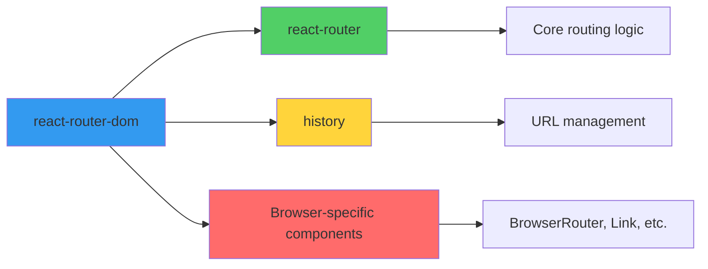

### Step 3: Project Structure Setup

Here's a recommended folder structure for a routed application:

```
my-portfolio/
├── src/
│   ├── components/
│   │   ├── Navbar.jsx
│   │   └── Footer.jsx
│   ├── pages/
│   │   ├── Home.jsx
│   │   ├── About.jsx
│   │   ├── Projects.jsx
│   │   ├── ProjectDetail.jsx
│   │   └── Contact.jsx
│   ├── App.jsx
│   └── main.jsx
└── package.json
```

---

## 🗺️ Basic Route Configuration {#basic-routes}

### Understanding the Router Components

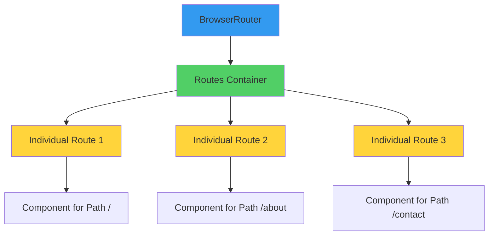

### Setting Up the Router in main.jsx

```jsx
// main.jsx
import React from 'react';
import ReactDOM from 'react-dom/client';
import { BrowserRouter } from 'react-router-dom';
import App from './App';
import './index.css';

ReactDOM.createRoot(document.getElementById('root')).render(
  <React.StrictMode>
    <BrowserRouter>
      <App />
    </BrowserRouter>
  </React.StrictMode>
);
```

**💡 Pro Tip:** Wrap your entire app with `BrowserRouter` at the highest level. This gives all components access to routing functionality.

### Creating Your First Routes in App.jsx

```jsx
// App.jsx
import { Routes, Route } from 'react-router-dom';
import Home from './pages/Home';
import About from './pages/About';
import Projects from './pages/Projects';
import Contact from './pages/Contact';
import Navbar from './components/Navbar';
import Footer from './components/Footer';

function App() {
  return (
    <div className="app">
      {/* Navbar appears on all pages */}
      <Navbar />
      
      {/* Routes define which component to show for each URL */}
      <Routes>
        <Route path="/" element={<Home />} />
        <Route path="/about" element={<About />} />
        <Route path="/projects" element={<Projects />} />
        <Route path="/contact" element={<Contact />} />
      </Routes>
      
      {/* Footer appears on all pages */}
      <Footer />
    </div>
  );
}

export default App;
```

### Creating Page Components

```jsx
// pages/Home.jsx
function Home() {
  return (
    <div className="home-page">
      <h1>Welcome to My Portfolio</h1>
      <p>I'm a web developer passionate about creating amazing experiences.</p>
    </div>
  );
}

export default Home;
```

```jsx
// pages/About.jsx
function About() {
  return (
    <div className="about-page">
      <h1>About Me</h1>
      <p>I have 5 years of experience in web development...</p>
    </div>
  );
}

export default About;
```

### Route Flow Visualization

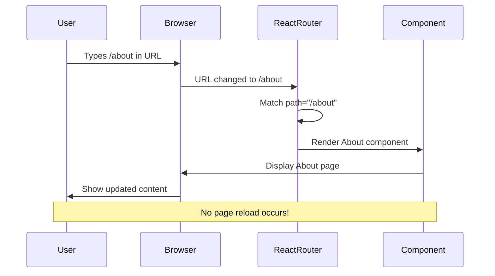

---

## 🧭 Navigation Components {#navigation}

### Link Component: Basic Navigation

The `Link` component is like an `<a>` tag, but it prevents page reloads.

```jsx
// components/Navbar.jsx
import { Link } from 'react-router-dom';

function Navbar() {
  return (
    <nav className="navbar">
      <h2>My Portfolio</h2>
      <ul>
        <li><Link to="/">Home</Link></li>
        <li><Link to="/about">About</Link></li>
        <li><Link to="/projects">Projects</Link></li>
        <li><Link to="/contact">Contact</Link></li>
      </ul>
    </nav>
  );
}

export default Navbar;
```

### 🎨 NavLink: Active State Styling

`NavLink` is like `Link` but with superpowers - it knows when it's active!

```jsx
// components/Navbar.jsx
import { NavLink } from 'react-router-dom';

function Navbar() {
  return (
    <nav className="navbar">
      <h2>My Portfolio</h2>
      <ul>
        <li>
          <NavLink 
            to="/" 
            className={({ isActive }) => isActive ? 'active-link' : ''}
          >
            Home
          </NavLink>
        </li>
        <li>
          <NavLink 
            to="/about"
            className={({ isActive }) => isActive ? 'active-link' : ''}
          >
            About
          </NavLink>
        </li>
        <li>
          <NavLink 
            to="/projects"
            className={({ isActive }) => isActive ? 'active-link' : ''}
          >
            Projects
          </NavLink>
        </li>
        <li>
          <NavLink 
            to="/contact"
            className={({ isActive }) => isActive ? 'active-link' : ''}
          >
            Contact
          </NavLink>
        </li>
      </ul>
    </nav>
  );
}

export default Navbar;
```

**CSS for active links:**

```css
/* index.css */
.navbar {
  display: flex;
  justify-content: space-between;
  align-items: center;
  padding: 1rem 2rem;
  background-color: #333;
  color: white;
}

.navbar ul {
  display: flex;
  list-style: none;
  gap: 2rem;
}

.navbar a {
  color: white;
  text-decoration: none;
  padding: 0.5rem 1rem;
  border-radius: 4px;
  transition: background-color 0.3s;
}

.navbar a:hover {
  background-color: #555;
}

.navbar .active-link {
  background-color: #007bff;
  font-weight: bold;
}
```

### Link vs NavLink Comparison

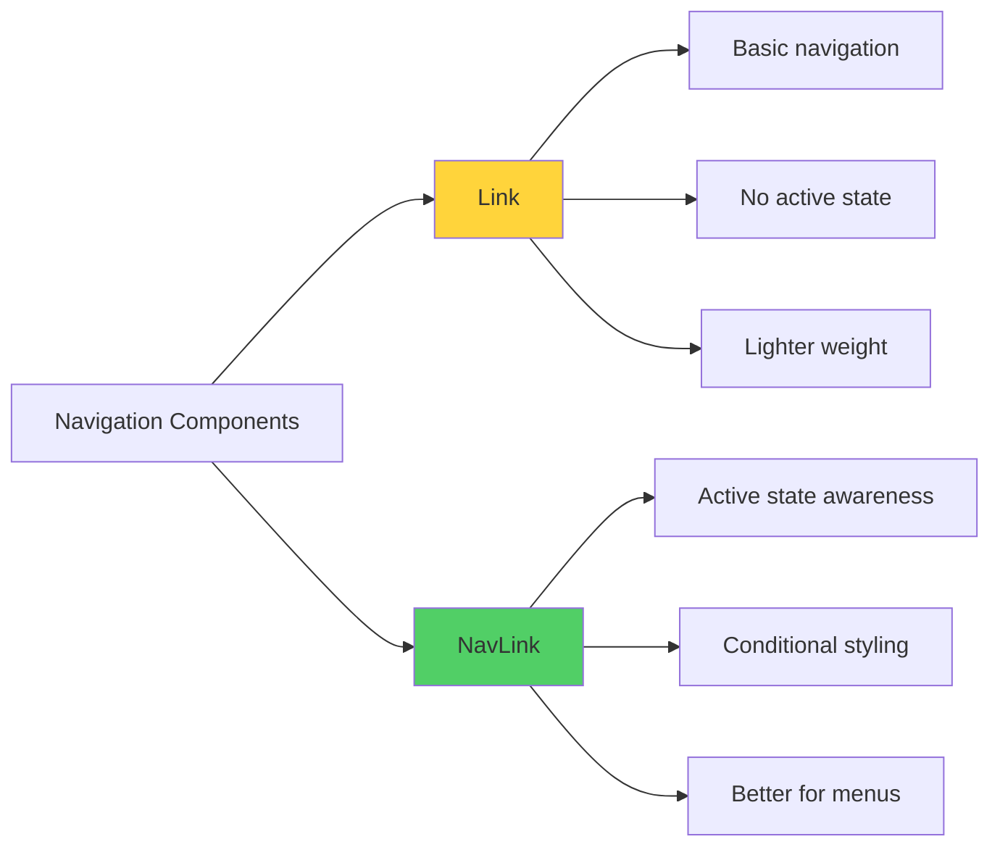

### 🎯 Real-World Example: E-Commerce Navigation

```jsx
// Real e-commerce site navigation
function ShopNavbar() {
  return (
    <nav className="shop-nav">
      <NavLink to="/shop/all">
        All Products
      </NavLink>
      <NavLink to="/shop/electronics">
        Electronics
      </NavLink>
      <NavLink to="/shop/clothing">
        Clothing
      </NavLink>
      <NavLink to="/cart" className={({ isActive }) => 
        isActive ? 'cart-active' : 'cart'
      }>
        🛒 Cart
      </NavLink>
    </nav>
  );
}
```

---

## 🔗 URL Parameters & Query Strings {#parameters}

### Understanding URL Anatomy

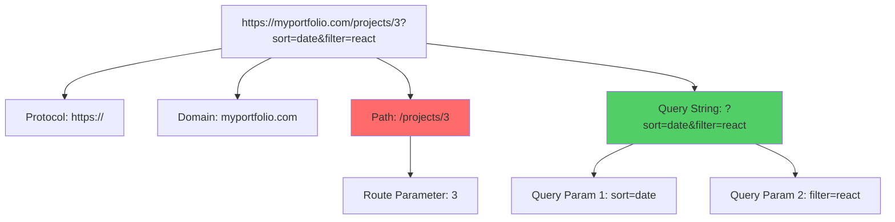

### Dynamic Route Parameters

Route parameters are parts of the URL that can change. They're perfect for showing specific items like blog posts, products, or projects.

**Route Setup:**

```jsx
// App.jsx
import ProjectDetail from './pages/ProjectDetail';

function App() {
  return (
    <Routes>
      <Route path="/" element={<Home />} />
      <Route path="/projects" element={<Projects />} />
      {/* Dynamic route with parameter */}
      <Route path="/projects/:id" element={<ProjectDetail />} />
      <Route path="/contact" element={<Contact />} />
    </Routes>
  );
}
```

**Using Parameters in Components:**

```jsx
// pages/ProjectDetail.jsx
import { useParams } from 'react-router-dom';

function ProjectDetail() {
  // useParams gives us access to URL parameters
  const { id } = useParams();
  
  // Mock project data (in real app, fetch from API)
  const projects = {
    1: { 
      title: 'E-Commerce Platform', 
      tech: 'React, Node.js, MongoDB',
      description: 'A full-stack e-commerce solution with payment integration.'
    },
    2: { 
      title: 'Weather App', 
      tech: 'React, OpenWeather API',
      description: 'Real-time weather forecasting application.'
    },
    3: { 
      title: 'Task Manager', 
      tech: 'React, Firebase',
      description: 'Collaborative task management tool with real-time updates.'
    }
  };
  
  const project = projects[id];
  
  if (!project) {
    return <div>Project not found!</div>;
  }
  
  return (
    <div className="project-detail">
      <h1>{project.title}</h1>
      <p><strong>Technologies:</strong> {project.tech}</p>
      <p>{project.description}</p>
    </div>
  );
}

export default ProjectDetail;
```

**Projects List with Links:**

```jsx
// pages/Projects.jsx
import { Link } from 'react-router-dom';

function Projects() {
  const projects = [
    { id: 1, title: 'E-Commerce Platform', preview: 'Online shopping solution' },
    { id: 2, title: 'Weather App', preview: 'Real-time weather data' },
    { id: 3, title: 'Task Manager', preview: 'Collaborative productivity' }
  ];
  
  return (
    <div className="projects-page">
      <h1>My Projects</h1>
      <div className="projects-grid">
        {projects.map(project => (
          <div key={project.id} className="project-card">
            <h3>{project.title}</h3>
            <p>{project.preview}</p>
            {/* Link to dynamic route */}
            <Link to={`/projects/${project.id}`}>
              View Details →
            </Link>
          </div>
        ))}
      </div>
    </div>
  );
}

export default Projects;
```

### Query Strings for Filtering and Sorting

Query strings are perfect for optional parameters like filters, sorting, and search terms.

```jsx
// pages/Projects.jsx - Advanced version with filtering
import { Link, useSearchParams } from 'react-router-dom';

function Projects() {
  const [searchParams, setSearchParams] = useSearchParams();
  
  // Get current filter from URL
  const filter = searchParams.get('tech') || 'all';
  const sort = searchParams.get('sort') || 'name';
  
  const projects = [
    { id: 1, title: 'E-Commerce Platform', tech: 'react' },
    { id: 2, title: 'Weather App', tech: 'react' },
    { id: 3, title: 'Task Manager', tech: 'vue' },
    { id: 4, title: 'Blog CMS', tech: 'angular' }
  ];
  
  // Filter projects
  const filteredProjects = filter === 'all' 
    ? projects 
    : projects.filter(p => p.tech === filter);
  
  // Sort projects
  const sortedProjects = [...filteredProjects].sort((a, b) => {
    if (sort === 'name') return a.title.localeCompare(b.title);
    return a.id - b.id;
  });
  
  return (
    <div className="projects-page">
      <h1>My Projects</h1>
      
      {/* Filter buttons */}
      <div className="filters">
        <button onClick={() => setSearchParams({ tech: 'all', sort })}>
          All
        </button>
        <button onClick={() => setSearchParams({ tech: 'react', sort })}>
          React
        </button>
        <button onClick={() => setSearchParams({ tech: 'vue', sort })}>
          Vue
        </button>
        <button onClick={() => setSearchParams({ tech: 'angular', sort })}>
          Angular
        </button>
      </div>
      
      {/* Sort buttons */}
      <div className="sort-options">
        <button onClick={() => setSearchParams({ tech: filter, sort: 'name' })}>
          Sort by Name
        </button>
        <button onClick={() => setSearchParams({ tech: filter, sort: 'id' })}>
          Sort by Date
        </button>
      </div>
      
      {/* Current filter display */}
      <p>Showing: {filter} projects, sorted by {sort}</p>
      
      {/* Projects display */}
      <div className="projects-grid">
        {sortedProjects.map(project => (
          <div key={project.id} className="project-card">
            <h3>{project.title}</h3>
            <span className="tech-badge">{project.tech}</span>
            <Link to={`/projects/${project.id}`}>View Details →</Link>
          </div>
        ))}
      </div>
    </div>
  );
}

export default Projects;
```

### Parameters Flow Diagram

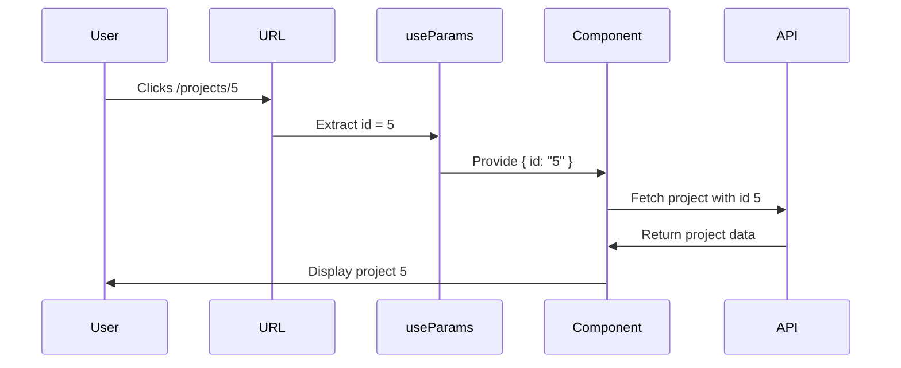

---

## 🎮 Programmatic Navigation {#programmatic}

### When to Use Programmatic Navigation

Programmatic navigation is useful when you need to navigate based on:

- ✅ Form submission success
- ✅ Authentication status
- ✅ After completing an action
- ✅ Based on user permissions
- ✅ Timed redirects

### Using useNavigate Hook

```jsx
// pages/Contact.jsx
import { useState } from 'react';
import { useNavigate } from 'react-router-dom';

function Contact() {
  const [formData, setFormData] = useState({
    name: '',
    email: '',
    message: ''
  });
  const navigate = useNavigate();
  
  const handleSubmit = (e) => {
    e.preventDefault();
    
    // Simulate form submission
    console.log('Form submitted:', formData);
    
    // Show success message (in real app, wait for API response)
    alert('Message sent successfully!');
    
    // Navigate to home page after submission
    navigate('/');
    
    // Alternative: Navigate to a thank you page
    // navigate('/thank-you');
  };
  
  return (
    <div className="contact-page">
      <h1>Contact Me</h1>
      <form onSubmit={handleSubmit}>
        <input
          type="text"
          placeholder="Your Name"
          value={formData.name}
          onChange={(e) => setFormData({...formData, name: e.target.value})}
          required
        />
        <input
          type="email"
          placeholder="Your Email"
          value={formData.email}
          onChange={(e) => setFormData({...formData, email: e.target.value})}
          required
        />
        <textarea
          placeholder="Your Message"
          value={formData.message}
          onChange={(e) => setFormData({...formData, message: e.target.value})}
          required
        />
        <button type="submit">Send Message</button>
      </form>
    </div>
  );
}

export default Contact;
```

### Advanced Navigation Options

```jsx
// Different navigation techniques
import { useNavigate } from 'react-router-dom';

function AdvancedNavigation() {
  const navigate = useNavigate();
  
  // Basic navigation
  const goToHome = () => {
    navigate('/');
  };
  
  // Navigate with state (pass data between pages)
  const goToProjectWithData = () => {
    navigate('/projects/1', { 
      state: { fromDashboard: true, userId: 123 } 
    });
  };
  
  // Replace current entry (can't go back)
  const replaceToLogin = () => {
    navigate('/login', { replace: true });
  };
  
  // Navigate backwards (like browser back button)
  const goBack = () => {
    navigate(-1);
  };
  
  // Navigate forward
  const goForward = () => {
    navigate(1);
  };
  
  // Navigate multiple steps back
  const goBackTwoPages = () => {
    navigate(-2);
  };
  
  return (
    <div>
      <button onClick={goToHome}>Go Home</button>
      <button onClick={goToProjectWithData}>View Project with Data</button>
      <button onClick={replaceToLogin}>Go to Login (Replace)</button>
      <button onClick={goBack}>Go Back</button>
      <button onClick={goForward}>Go Forward</button>
    </div>
  );
}
```

### Receiving Navigation State

```jsx
// pages/ProjectDetail.jsx
import { useParams, useLocation } from 'react-router-dom';

function ProjectDetail() {
  const { id } = useParams();
  const location = useLocation();
  
  // Access state passed from navigation
  const fromDashboard = location.state?.fromDashboard;
  const userId = location.state?.userId;
  
  return (
    <div>
      <h1>Project {id}</h1>
      {fromDashboard && (
        <p>Welcome back, User {userId}! You came from the dashboard.</p>
      )}
    </div>
  );
}
```

### 🚦 Protected Routes Example

```jsx
// components/ProtectedRoute.jsx
import { Navigate } from 'react-router-dom';

function ProtectedRoute({ children, isAuthenticated }) {
  // If not authenticated, redirect to login
  if (!isAuthenticated) {
    return <Navigate to="/login" replace />;
  }
  
  // If authenticated, show the protected content
  return children;
}

export default ProtectedRoute;
```

```jsx
// App.jsx - Using Protected Route
import ProtectedRoute from './components/ProtectedRoute';
import Dashboard from './pages/Dashboard';

function App() {
  const [isAuthenticated, setIsAuthenticated] = useState(false);
  
  return (
    <Routes>
      <Route path="/" element={<Home />} />
      <Route path="/login" element={<Login onLogin={() => setIsAuthenticated(true)} />} />
      
      {/* Protected route */}
      <Route 
        path="/dashboard" 
        element={
          <ProtectedRoute isAuthenticated={isAuthenticated}>
            <Dashboard />
          </ProtectedRoute>
        } 
      />
    </Routes>
  );
}
```

### Navigation Patterns Flowchart

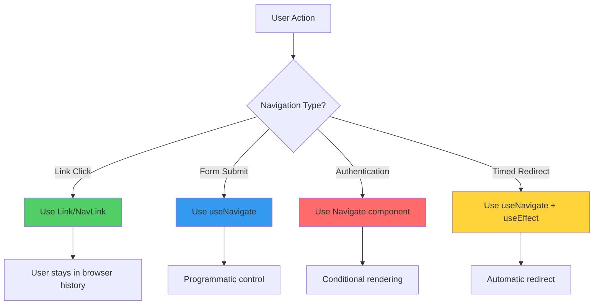

---

## 🎄 Nested Routes {#nested-routes}

### What are Nested Routes?

Nested routes allow you to create layouts with persistent components (like sidebars) and changing content areas. Think of it as **pages within pages**.

### 🏢 Real-World Example: Dashboard Application

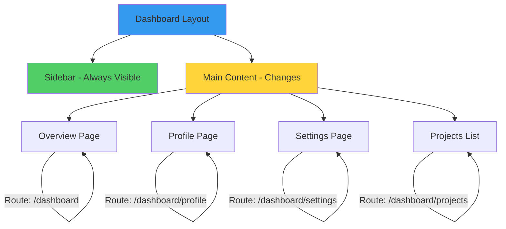

### Setting Up Nested Routes

```jsx
// App.jsx
import { Routes, Route } from 'react-router-dom';
import DashboardLayout from './layouts/DashboardLayout';
import Overview from './pages/dashboard/Overview';
import Profile from './pages/dashboard/Profile';
import Settings from './pages/dashboard/Settings';
import Projects from './pages/dashboard/Projects';

function App() {
  return (
    <Routes>
      <Route path="/" element={<Home />} />
      <Route path="/about" element={<About />} />
      
      {/* Nested routes for dashboard */}
      <Route path="/dashboard" element={<DashboardLayout />}>
        <Route index element={<Overview />} />
        <Route path="profile" element={<Profile />} />
        <Route path="settings" element={<Settings />} />
        <Route path="projects" element={<Projects />} />
      </Route>
    </Routes>
  );
}

export default App;
```

### Creating the Layout Component with Outlet

The **Outlet** component is where child routes will be rendered.

```jsx
// layouts/DashboardLayout.jsx
import { Outlet, NavLink } from 'react-router-dom';

function DashboardLayout() {
  return (
    <div className="dashboard-layout">
      {/* Sidebar - appears on all dashboard pages */}
      <aside className="dashboard-sidebar">
        <h2>Dashboard</h2>
        <nav>
          <NavLink to="/dashboard" end>
            📊 Overview
          </NavLink>
          <NavLink to="/dashboard/profile">
            👤 Profile
          </NavLink>
          <NavLink to="/dashboard/settings">
            ⚙️ Settings
          </NavLink>
          <NavLink to="/dashboard/projects">
            📁 Projects
          </NavLink>
        </nav>
      </aside>
      
      {/* Main content area - changes based on route */}
      <main className="dashboard-main">
        <Outlet />
      </main>
    </div>
  );
}

export default DashboardLayout;
```

**The `end` prop:** When you use `end` on a NavLink for `/dashboard`, it will only be active when the path is exactly `/dashboard`, not when it's `/dashboard/profile` or other nested routes.

### Child Route Components

```jsx
// pages/dashboard/Overview.jsx
function Overview() {
  return (
    <div className="overview">
      <h1>Welcome to Your Dashboard</h1>
      <div className="stats-grid">
        <div className="stat-card">
          <h3>Total Projects</h3>
          <p className="stat-number">12</p>
        </div>
        <div className="stat-card">
          <h3>Completed</h3>
          <p className="stat-number">8</p>
        </div>
        <div className="stat-card">
          <h3>In Progress</h3>
          <p className="stat-number">4</p>
        </div>
      </div>
    </div>
  );
}

export default Overview;
```

```jsx
// pages/dashboard/Profile.jsx
function Profile() {
  return (
    <div className="profile">
      <h1>Your Profile</h1>
      <div className="profile-info">
        
        <h2>John Doe</h2>
        <p>john.doe@example.com</p>
        <button>Edit Profile</button>
      </div>
    </div>
  );
}

export default Profile;
```

### Nested Routes Visualization

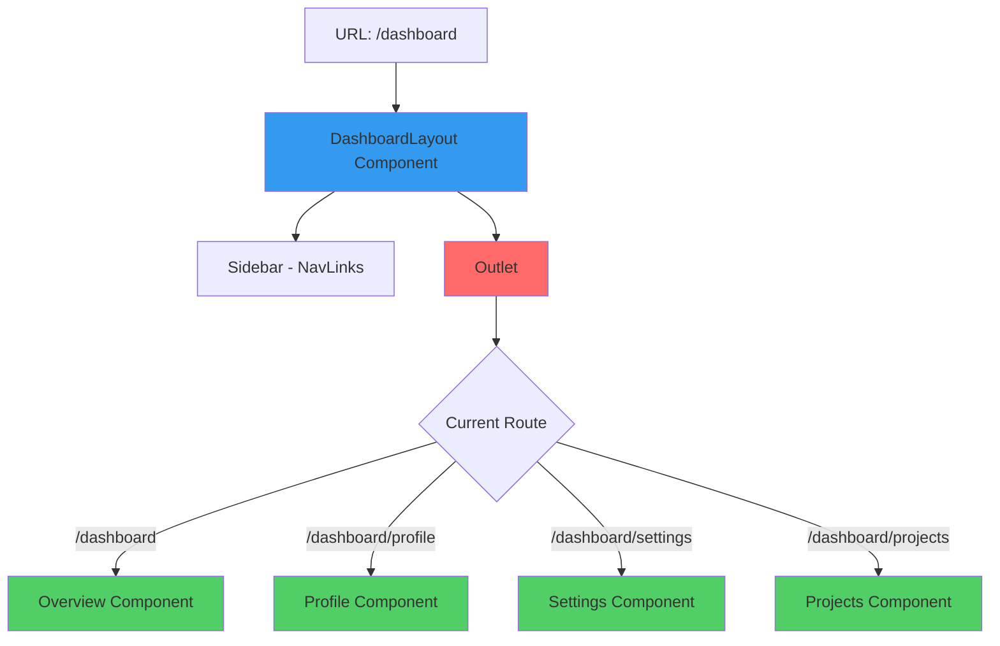

### Deeply Nested Routes

You can nest routes multiple levels deep!

```jsx
// App.jsx - Multi-level nesting
function App() {
  return (
    <Routes>
      <Route path="/dashboard" element={<DashboardLayout />}>
        <Route index element={<Overview />} />
        
        {/* Projects section with its own nested routes */}
        <Route path="projects" element={<ProjectsLayout />}>
          <Route index element={<ProjectsList />} />
          <Route path=":id" element={<ProjectDetail />} />
          <Route path=":id/edit" element={<ProjectEdit />} />
          <Route path="new" element={<ProjectCreate />} />
        </Route>
        
        <Route path="settings" element={<Settings />} />
      </Route>
    </Routes>
  );
}
```

```jsx
// layouts/ProjectsLayout.jsx
import { Outlet, useParams } from 'react-router-dom';

function ProjectsLayout() {
  return (
    <div className="projects-section">
      <h2>Projects Management</h2>
      <div className="projects-toolbar">
        <Link to="/dashboard/projects">All Projects</Link>
        <Link to="/dashboard/projects/new">New Project</Link>
      </div>
      <Outlet />
    </div>
  );
}
```

### CSS for Dashboard Layout

```css
/* DashboardLayout styles */
.dashboard-layout {
  display: flex;
  min-height: 100vh;
}

.dashboard-sidebar {
  width: 250px;
  background-color: #2c3e50;
  color: white;
  padding: 2rem 1rem;
}

.dashboard-sidebar h2 {
  margin-bottom: 2rem;
}

.dashboard-sidebar nav {
  display: flex;
  flex-direction: column;
  gap: 1rem;
}

.dashboard-sidebar a {
  color: white;
  text-decoration: none;
  padding: 0.75rem 1rem;
  border-radius: 4px;
  transition: background-color 0.3s;
}

.dashboard-sidebar a:hover {
  background-color: #34495e;
}

.dashboard-sidebar a.active {
  background-color: #3498db;
}

.dashboard-main {
  flex: 1;
  padding: 2rem;
  background-color: #ecf0f1;
}
```

---

## 🎨 Hands-On Project: Multi-Page Portfolio {#project}

### Project Overview

Let's convert a single-page portfolio into a professional multi-page application with routing!

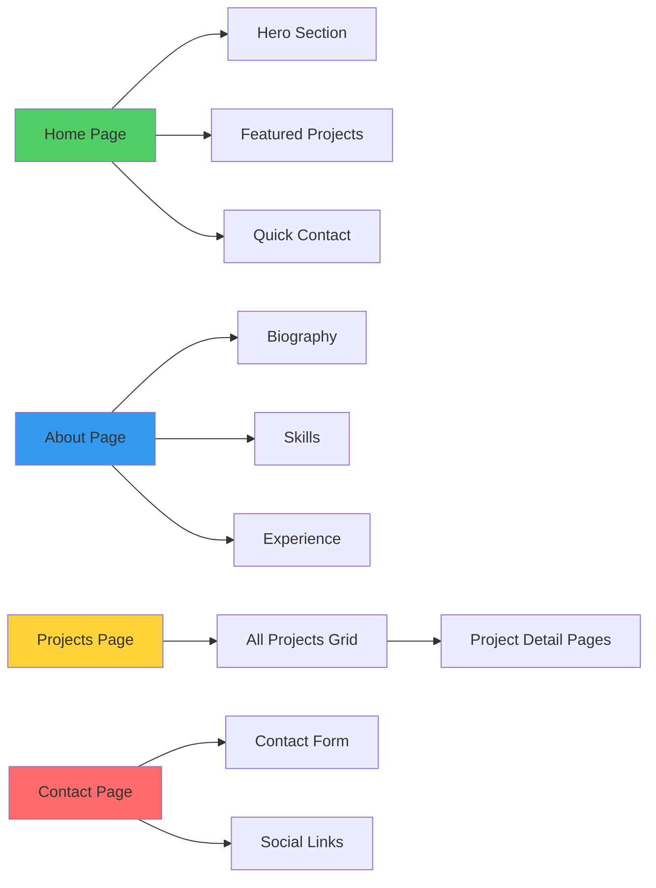

### Step 1: Project Setup

```bash
# Create new project
npm create vite@latest my-portfolio -- --template react
cd my-portfolio

# Install React Router
npm install react-router-dom

# Install dependencies
npm install
```

### Step 2: Folder Structure

```
my-portfolio/
├── public/
│   └── projects/
│       ├── project1.jpg
│       ├── project2.jpg
│       └── project3.jpg
├── src/
│   ├── components/
│   │   ├── Navbar.jsx
│   │   ├── Footer.jsx
│   │   ├── ProjectCard.jsx
│   │   └── SkillBadge.jsx
│   ├── pages/
│   │   ├── Home.jsx
│   │   ├── About.jsx
│   │   ├── Projects.jsx
│   │   ├── ProjectDetail.jsx
│   │   └── Contact.jsx
│   ├── data/
│   │   └── projectsData.js
│   ├── App.jsx
│   ├── App.css
│   └── main.jsx
└── package.json
```

### Step 3: Create Data File

```javascript
// src/data/projectsData.js
export const projectsData = [
  {
    id: 1,
    title: "E-Commerce Platform",
    description: "A full-stack online shopping platform with cart functionality, payment integration, and admin dashboard.",
    tech: ["React", "Node.js", "Express", "MongoDB", "Stripe"],
    image: "/projects/project1.jpg",
    liveUrl: "https://demo-ecommerce.com",
    githubUrl: "https://github.com/yourusername/ecommerce",
    featured: true,
    details: {
      challenge: "Building a scalable platform that handles real-time inventory and secure payments.",
      solution: "Implemented microservices architecture with Redis caching and JWT authentication.",
      results: "Reduced page load time by 60% and handled 1000+ concurrent users."
    }
  },
  {
    id: 2,
    title: "Weather Dashboard",
    description: "Real-time weather application with 7-day forecasts, location search, and interactive maps.",
    tech: ["React", "OpenWeather API", "Chart.js", "Leaflet"],
    image: "/projects/project2.jpg",
    liveUrl: "https://weather-dash.com",
    githubUrl: "https://github.com/yourusername/weather",
    featured: true,
    details: {
      challenge: "Presenting complex weather data in an intuitive, user-friendly interface.",
      solution: "Created custom data visualizations and implemented geolocation features.",
      results: "Achieved 95% user satisfaction rate and 50K+ monthly active users."
    }
  },
  {
    id: 3,
    title: "Task Management App",
    description: "Collaborative productivity tool with real-time updates, team features, and progress tracking.",
    tech: ["React", "Firebase", "Material-UI", "Redux"],
    image: "/projects/project3.jpg",
    liveUrl: "https://taskmaster-app.com",
    githubUrl: "https://github.com/yourusername/taskmanager",
    featured: false,
    details: {
      challenge: "Ensuring real-time synchronization across multiple users and devices.",
      solution: "Leveraged Firebase Realtime Database with optimistic UI updates.",
      results: "Enabled seamless collaboration for teams up to 50 members."
    }
  }
];
```

### Step 4: Main App Component

```jsx
// src/App.jsx
import { Routes, Route } from 'react-router-dom';
import Navbar from './components/Navbar';
import Footer from './components/Footer';
import Home from './pages/Home';
import About from './pages/About';
import Projects from './pages/Projects';
import ProjectDetail from './pages/ProjectDetail';
import Contact from './pages/Contact';
import './App.css';

function App() {
  return (
    <div className="app">
      <Navbar />
      <main className="main-content">
        <Routes>
          <Route path="/" element={<Home />} />
          <Route path="/about" element={<About />} />
          <Route path="/projects" element={<Projects />} />
          <Route path="/projects/:id" element={<ProjectDetail />} />
          <Route path="/contact" element={<Contact />} />
          <Route path="*" element={<NotFound />} />
        </Routes>
      </main>
      <Footer />
    </div>
  );
}

// 404 Page
function NotFound() {
  return (
    <div className="not-found">
      <h1>404 - Page Not Found</h1>
      <p>The page you're looking for doesn't exist.</p>
      <Link to="/">Go back home</Link>
    </div>
  );
}

export default App;
```

### Step 5: Navbar Component

```jsx
// src/components/Navbar.jsx
import { NavLink } from 'react-router-dom';
import './Navbar.css';

function Navbar() {
  return (
    <nav className="navbar">
      <div className="nav-container">
        <NavLink to="/" className="nav-logo">
          <span className="logo-icon">👨‍💻</span>
          <span>YourName</span>
        </NavLink>
        
        <ul className="nav-menu">
          <li>
            <NavLink 
              to="/" 
              className={({ isActive }) => isActive ? 'nav-link active' : 'nav-link'}
              end
            >
              Home
            </NavLink>
          </li>
          <li>
            <NavLink 
              to="/about" 
              className={({ isActive }) => isActive ? 'nav-link active' : 'nav-link'}
            >
              About
            </NavLink>
          </li>
          <li>
            <NavLink 
              to="/projects" 
              className={({ isActive }) => isActive ? 'nav-link active' : 'nav-link'}
            >
              Projects
            </NavLink>
          </li>
          <li>
            <NavLink 
              to="/contact" 
              className={({ isActive }) => isActive ? 'nav-link active' : 'nav-link'}
            >
              Contact
            </NavLink>
          </li>
        </ul>
      </div>
    </nav>
  );
}

export default Navbar;
```

### Step 6: Home Page

```jsx
// src/pages/Home.jsx
import { Link } from 'react-router-dom';
import { projectsData } from '../data/projectsData';
import ProjectCard from '../components/ProjectCard';
import './Home.css';

function Home() {
  const featuredProjects = projectsData.filter(p => p.featured);
  
  return (
    <div className="home">
      {/* Hero Section */}
      <section className="hero">
        <div className="hero-content">
          <h1 className="hero-title">
            Hi, I'm <span className="highlight">Your Name</span>
          </h1>
          <p className="hero-subtitle">
            Full-Stack Developer | Problem Solver | Tech Enthusiast
          </p>
          <p className="hero-description">
            I build exceptional digital experiences that make people's lives easier.
            Specializing in React, Node.js, and modern web technologies.
          </p>
          <div className="hero-buttons">
            <Link to="/projects" className="btn btn-primary">
              View My Work
            </Link>
            <Link to="/contact" className="btn btn-secondary">
              Get In Touch
            </Link>
          </div>
        </div>
        <div className="hero-image">
          <div className="floating-card">💻</div>
        </div>
      </section>
      
      {/* Featured Projects */}
      <section className="featured-projects">
        <h2>Featured Projects</h2>
        <div className="projects-grid">
          {featuredProjects.map(project => (
            <ProjectCard key={project.id} project={project} />
          ))}
        </div>
        <Link to="/projects" className="view-all-link">
          View All Projects →
        </Link>
      </section>
      
      {/* Quick Stats */}
      <section className="stats">
        <div className="stat-item">
          <h3>50+</h3>
          <p>Projects Completed</p>
        </div>
        <div className="stat-item">
          <h3>5+</h3>
          <p>Years Experience</p>
        </div>
        <div className="stat-item">
          <h3>30+</h3>
          <p>Happy Clients</p>
        </div>
      </section>
    </div>
  );
}

export default Home;
```

### Step 7: Projects Page with Filtering

```jsx
// src/pages/Projects.jsx
import { useState } from 'react';
import { useSearchParams } from 'react-router-dom';
import { projectsData } from '../data/projectsData';
import ProjectCard from '../components/ProjectCard';
import './Projects.css';

function Projects() {
  const [searchParams, setSearchParams] = useSearchParams();
  const techFilter = searchParams.get('tech') || 'all';
  
  // Get unique technologies
  const allTechs = ['all', ...new Set(projectsData.flatMap(p => p.tech))];
  
  // Filter projects
  const filteredProjects = techFilter === 'all'
    ? projectsData
    : projectsData.filter(p => p.tech.includes(techFilter));
  
  return (
    <div className="projects-page">
      <div className="projects-header">
        <h1>My Projects</h1>
        <p>A collection of my recent work and side projects</p>
      </div>
      
      {/* Technology Filter */}
      <div className="tech-filter">
        {allTechs.map(tech => (
          <button
            key={tech}
            className={techFilter === tech ? 'filter-btn active' : 'filter-btn'}
            onClick={() => setSearchParams(tech === 'all' ? {} : { tech })}
          >
            {tech === 'all' ? 'All' : tech}
          </button>
        ))}
      </div>
      
      {/* Projects Grid */}
      <div className="projects-grid">
        {filteredProjects.length > 0 ? (
          filteredProjects.map(project => (
            <ProjectCard key={project.id} project={project} />
          ))
        ) : (
          <p className="no-projects">No projects found with {techFilter}</p>
        )}
      </div>
    </div>
  );
}

export default Projects;
```

### Step 8: Project Detail Page

```jsx
// src/pages/ProjectDetail.jsx
import { useParams, useNavigate, Link } from 'react-router-dom';
import { projectsData } from '../data/projectsData';
import './ProjectDetail.css';

function ProjectDetail() {
  const { id } = useParams();
  const navigate = useNavigate();
  const project = projectsData.find(p => p.id === parseInt(id));
  
  if (!project) {
    return (
      <div className="project-not-found">
        <h1>Project Not Found</h1>
        <Link to="/projects">Back to Projects</Link>
      </div>
    );
  }
  
  return (
    <div className="project-detail">
      <button onClick={() => navigate(-1)} className="back-button">
        ← Back
      </button>
      
      <div className="project-hero">
        
      </div>
      
      <div className="project-content">
        <h1>{project.title}</h1>
        <p className="project-description">{project.description}</p>
        
        <div className="project-tech">
          <h3>Technologies Used</h3>
          <div className="tech-badges">
            {project.tech.map(tech => (
              <span key={tech} className="tech-badge">{tech}</span>
            ))}
          </div>
        </div>
        
        <div className="project-details">
          <div className="detail-section">
            <h3>🎯 Challenge</h3>
            <p>{project.details.challenge}</p>
          </div>
          
          <div className="detail-section">
            <h3>💡 Solution</h3>
            <p>{project.details.solution}</p>
          </div>
          
          <div className="detail-section">
            <h3>📊 Results</h3>
            <p>{project.details.results}</p>
          </div>
        </div>
        
        <div className="project-links">
          <a href={project.liveUrl} target="_blank" rel="noopener noreferrer" className="btn btn-primary">
            View Live Site 🚀
          </a>
          <a href={project.githubUrl} target="_blank" rel="noopener noreferrer" className="btn btn-secondary">
            View Code 💻
          </a>
        </div>
      </div>
    </div>
  );
}

export default ProjectDetail;
```

### Step 9: Contact Page with Form

```jsx
// src/pages/Contact.jsx
import { useState } from 'react';
import { useNavigate } from 'react-router-dom';
import './Contact.css';

function Contact() {
  const [formData, setFormData] = useState({
    name: '',
    email: '',
    subject: '',
    message: ''
  });
  const [submitted, setSubmitted] = useState(false);
  const navigate = useNavigate();
  
  const handleChange = (e) => {
    setFormData({
      ...formData,
      [e.target.name]: e.target.value
    });
  };
  
  const handleSubmit = (e) => {
    e.preventDefault();
    console.log('Form submitted:', formData);
    
    // Show success message
    setSubmitted(true);
    
    // Reset form
    setFormData({ name: '', email: '', subject: '', message: '' });
    
    // Navigate to home after 2 seconds
    setTimeout(() => {
      navigate('/');
    }, 2000);
  };
  
  return (
    <div className="contact-page">
      <div className="contact-header">
        <h1>Get In Touch</h1>
        <p>Have a project in mind? Let's work together!</p>
      </div>
      
      <div className="contact-container">
        {/* Contact Info */}
        <div className="contact-info">
          <h2>Contact Information</h2>
          <div className="info-item">
            <span className="icon">📧</span>
            <div>
              <h3>Email</h3>
              <p>your.email@example.com</p>
            </div>
          </div>
          <div className="info-item">
            <span className="icon">📱</span>
            <div>
              <h3>Phone</h3>
              <p>+1 (555) 123-4567</p>
            </div>
          </div>
          <div className="info-item">
            <span className="icon">📍</span>
            <div>
              <h3>Location</h3>
              <p>San Francisco, CA</p>
            </div>
          </div>
          
          <div className="social-links">
            <a href="https://github.com" target="_blank" rel="noopener noreferrer">GitHub</a>
            <a href="https://linkedin.com" target="_blank" rel="noopener noreferrer">LinkedIn</a>
            <a href="https://twitter.com" target="_blank" rel="noopener noreferrer">Twitter</a>
          </div>
        </div>
        
        {/* Contact Form */}
        <div className="contact-form-container">
          {submitted ? (
            <div className="success-message">
              <h2>✅ Message Sent!</h2>
              <p>Thank you for reaching out. I'll get back to you soon.</p>
            </div>
          ) : (
            <form onSubmit={handleSubmit} className="contact-form">
              <div className="form-group">
                <label htmlFor="name">Name *</label>
                <input
                  type="text"
                  id="name"
                  name="name"
                  value={formData.name}
                  onChange={handleChange}
                  required
                />
              </div>
              
              <div className="form-group">
                <label htmlFor="email">Email *</label>
                <input
                  type="email"
                  id="email"
                  name="email"
                  value={formData.email}
                  onChange={handleChange}
                  required
                />
              </div>
              
              <div className="form-group">
                <label htmlFor="subject">Subject *</label>
                <input
                  type="text"
                  id="subject"
                  name="subject"
                  value={formData.subject}
                  onChange={handleChange}
                  required
                />
              </div>
              
              <div className="form-group">
                <label htmlFor="message">Message *</label>
                <textarea
                  id="message"
                  name="message"
                  rows="6"
                  value={formData.message}
                  onChange={handleChange}
                  required
                />
              </div>
              
              <button type="submit" className="btn btn-primary">
                Send Message
              </button>
            </form>
          )}
        </div>
      </div>
    </div>
  );
}

export default Contact;
```

### Step 10: ProjectCard Component

```jsx
// src/components/ProjectCard.jsx
import { Link } from 'react-router-dom';
import './ProjectCard.css';

function ProjectCard({ project }) {
  return (
    <div className="project-card">
      <div className="project-image">
        
        <div className="project-overlay">
          <Link to={`/projects/${project.id}`} className="view-project-btn">
            View Project
          </Link>
        </div>
      </div>
      
      <div className="project-info">
        <h3>{project.title}</h3>
        <p>{project.description}</p>
        
        <div className="project-tech">
          {project.tech.slice(0, 3).map(tech => (
            <span key={tech} className="tech-tag">{tech}</span>
          ))}
          {project.tech.length > 3 && <span className="tech-tag">+{project.tech.length - 3}</span>}
        </div>
      </div>
    </div>
  );
}

export default ProjectCard;
```

---

## ✨ Best Practices {#best-practices}

### 1. Route Organization

```jsx
// ✅ Good: Organized and clear
<Routes>
  {/* Public routes */}
  <Route path="/" element={<Home />} />
  <Route path="/about" element={<About />} />
  
  {/* Projects routes */}
  <Route path="/projects" element={<Projects />} />
  <Route path="/projects/:id" element={<ProjectDetail />} />
  
  {/* Contact */}
  <Route path="/contact" element={<Contact />} />
  
  {/* 404 */}
  <Route path="*" element={<NotFound />} />
</Routes>

// ❌ Bad: Unorganized
<Routes>
  <Route path="/" element={<Home />} />
  <Route path="/projects/:id" element={<ProjectDetail />} />
  <Route path="/about" element={<About />} />
  <Route path="/contact" element={<Contact />} />
  <Route path="/projects" element={<Projects />} />
</Routes>
```

### 2. Always Include a 404 Route

```jsx
<Routes>
  {/* ... other routes ... */}
  <Route path="*" element={<NotFound />} />
</Routes>
```

### 3. Use Descriptive Path Names

```jsx
// ✅ Good: Clear and descriptive
<Route path="/blog/:slug" element={<BlogPost />} />
<Route path="/products/:category/:id" element={<Product />} />

// ❌ Bad: Unclear
<Route path="/b/:s" element={<BlogPost />} />
<Route path="/p/:c/:i" element={<Product />} />
```

### 4. Loading States for Route Transitions

```jsx
import { Suspense } from 'react';
import { Routes, Route } from 'react-router-dom';

function App() {
  return (
    <Suspense fallback={<LoadingSpinner />}>
      <Routes>
        <Route path="/" element={<Home />} />
        <Route path="/projects" element={<Projects />} />
      </Routes>
    </Suspense>
  );
}
```

### 5. Scroll to Top on Route Change

```jsx
// components/ScrollToTop.jsx
import { useEffect } from 'react';
import { useLocation } from 'react-router-dom';

function ScrollToTop() {
  const { pathname } = useLocation();
  
  useEffect(() => {
    window.scrollTo(0, 0);
  }, [pathname]);
  
  return null;
}

export default ScrollToTop;
```

```jsx
// App.jsx
import ScrollToTop from './components/ScrollToTop';

function App() {
  return (
    <BrowserRouter>
      <ScrollToTop />
      <Routes>
        {/* routes */}
      </Routes>
    </BrowserRouter>
  );
}
```

### 6. Environment-Based Base URL

```jsx
// vite.config.js
export default {
  base: process.env.NODE_ENV === 'production' ? '/my-portfolio/' : '/',
};
```

### 7. Route Constants

```javascript
// constants/routes.js
export const ROUTES = {
  HOME: '/',
  ABOUT: '/about',
  PROJECTS: '/projects',
  PROJECT_DETAIL: '/projects/:id',
  CONTACT: '/contact'
};

// Usage
import { ROUTES } from './constants/routes';
<Route path={ROUTES.HOME} element={<Home />} />
<Link to={ROUTES.PROJECTS}>Projects</Link>
```

---

## 🎓 Summary & Key Takeaways

### What We Learned

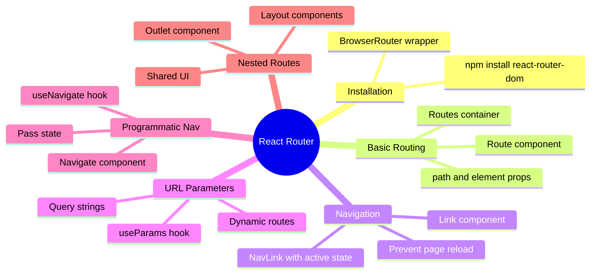

### Core Concepts Checklist

- ✅ **Client-side routing** prevents page reloads
- ✅ **BrowserRouter** wraps the entire app
- ✅ **Routes** container holds all Route components
- ✅ **Route** defines path and component mapping
- ✅ **Link** provides declarative navigation
- ✅ **NavLink** adds active state awareness
- ✅ **useParams** extracts URL parameters
- ✅ **useSearchParams** handles query strings
- ✅ **useNavigate** enables programmatic navigation
- ✅ **Outlet** renders child routes in nested routing

### Common Patterns Summary

| Pattern | When to Use | Example |
|---------|------------|---------|
| **Link** | User clicks to navigate | Menu, buttons, cards |
| **NavLink** | Need active state | Navigation bars |
| **useNavigate** | After form submit | Contact forms, auth |
| **URL Params** | Dynamic content | Blog posts, products |
| **Query Strings** | Filters, search | Product filters |
| **Nested Routes** | Layout with sidebar | Dashboard, admin |

---

## 🚀 Next Steps

### Practice Exercises

1. **Add a Blog Section**
   - Create `/blog` route with list of posts
   - Add `/blog/:slug` for individual posts
   - Implement categories using query strings

2. **Build a Product Catalog**
   - `/products` with grid view
   - `/products/:id` for product details
   - Add filtering by category and price

3. **Create an Admin Dashboard**
   - Nested routes under `/admin`
   - Different sections (users, posts, settings)
   - Implement protected routes

### Additional Resources

- 📚 [React Router Official Docs](https://reactrouter.com)
- 🎥 [React Router Tutorial - YouTube](https://youtube.com)
- 💻 [React Router Examples on GitHub](https://github.com)
- 📝 [MDN: History API](https://developer.mozilla.org)

---

## 🎯 Session Challenge

**Build a Complete Blog Application with:**

- Home page with featured posts
- Posts list with pagination
- Individual post pages with dynamic routing
- Category filtering using query strings
- Author pages
- Nested admin panel for creating/editing posts

**Bonus Points:**

- Add search functionality
- Implement related posts
- Create breadcrumb navigation
- Add page transitions

---

## 💡 Pro Tips

1. **Always think about user experience** - smooth transitions matter
2. **Use meaningful URLs** - `/projects/ecommerce-app` is better than `/projects/1`
3. **Implement loading states** - users should know something is happening
4. **Handle errors gracefully** - 404 pages should be helpful
5. **Test navigation flows** - ensure all links work correctly
6. **Consider SEO** - proper meta tags and titles for each route

---

## 🎉 Congratulations

You've now mastered React Router and can build professional multi-page applications! You understand how to:

- Set up client-side routing
- Create dynamic routes with parameters
- Implement navigation with Link and NavLink
- Handle programmatic navigation
- Build complex nested route structures
- Create smooth, app-like user experiences

**Keep building, keep learning, and happy coding! 🚀**

---

*Session 14 Complete - Ready for your next web development adventure!*
