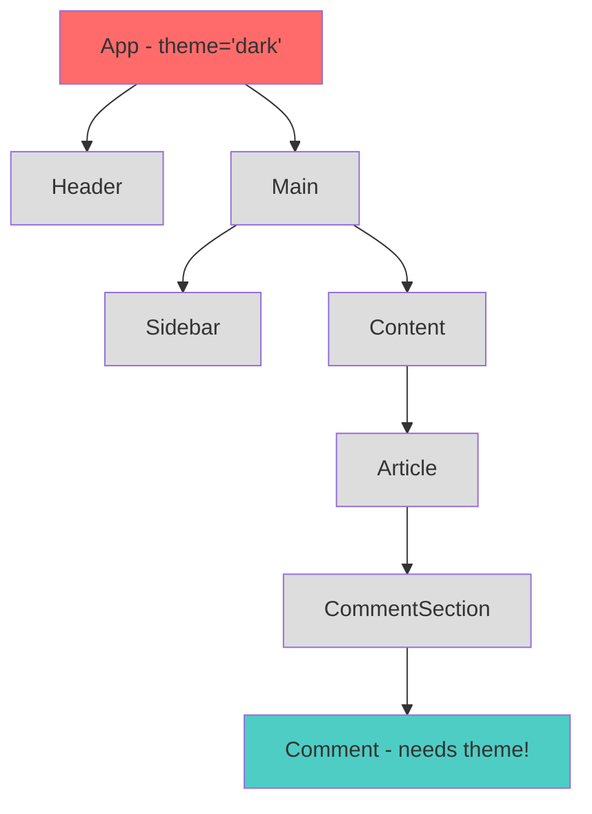
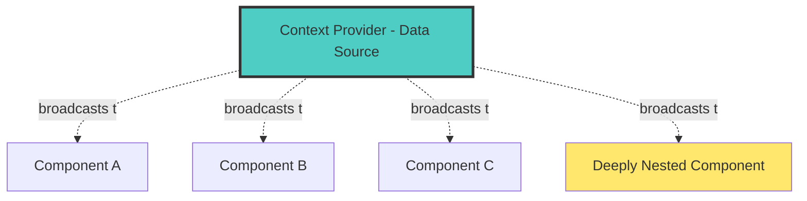
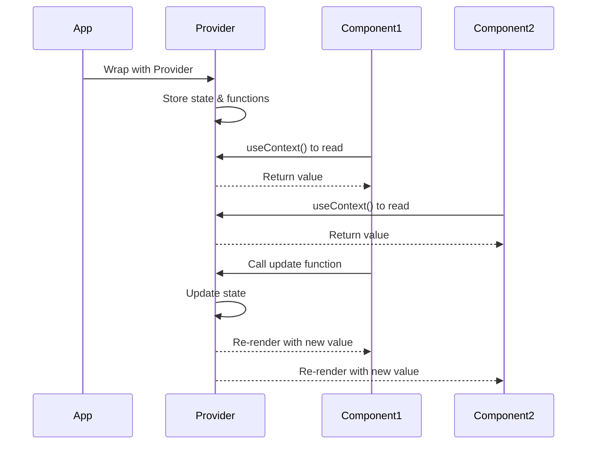
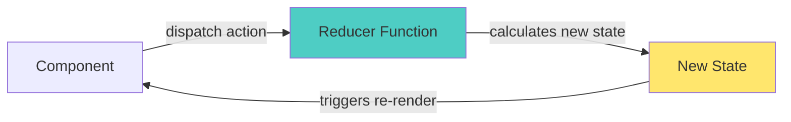
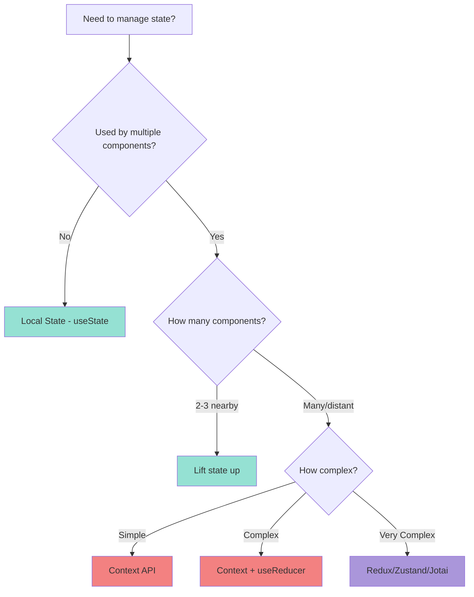
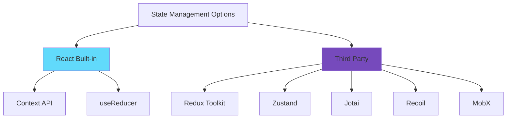
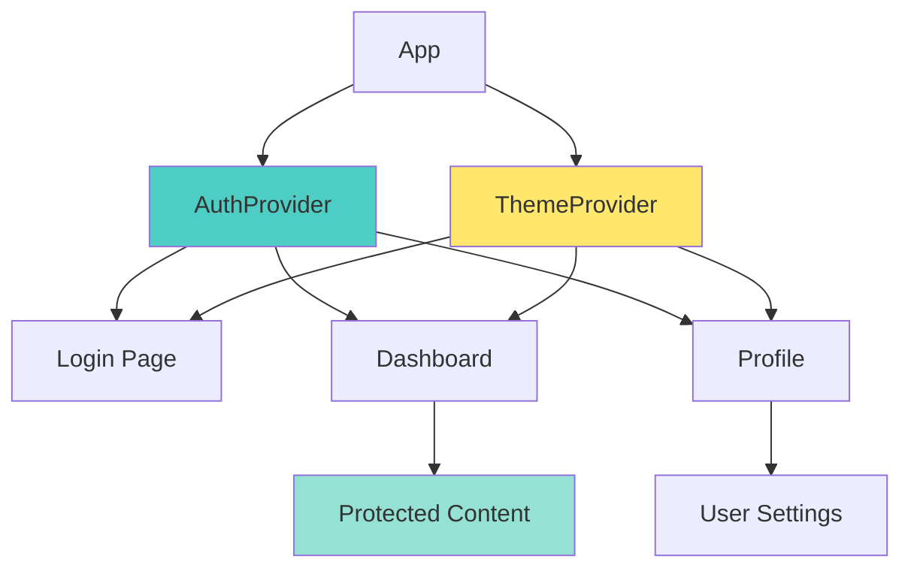

# 🚀 Session 15: Advanced React Concepts & State Management

## 📋 Session Overview

**Prerequisites:** Understanding of React Hooks (useState, useEffect)

---

## 🎯 Learning Objectives

By the end of this session, you will be able to:

- ✅ Understand and implement Context API for global state
- ✅ Use useReducer for complex state logic
- ✅ Make informed decisions about local vs global state
- ✅ Apply component composition patterns effectively
- ✅ Build a real-world authentication and theme management system

---

## 📖 Table of Contents

1. [The Problem: Prop Drilling](#1-the-problem-prop-drilling)
2. [Context API: The Solution](#2-context-api-the-solution)
3. [useReducer: Managing Complex State](#3-usereducer-managing-complex-state)
4. [Local vs Global State Decisions](#4-local-vs-global-state-decisions)
5. [Component Composition Patterns](#5-component-composition-patterns)
6. [Third-Party State Management](#6-third-party-state-management)
7. [Hands-On Project](#7-hands-on-project)

---

## 1. The Problem: Prop Drilling 🎭

### What is Prop Drilling?

Imagine you're working at a large company. To send a message from the CEO to an intern, it has to pass through: CEO → VP → Manager → Team Lead → Senior Dev → Junior Dev → Intern. That's exhausting!

**Prop drilling** is when you pass props through multiple component layers just to reach a deeply nested component.



### Real-World Example: E-Commerce App

```jsx
// ❌ BAD: Prop Drilling Hell
function App() {
  const [user, setUser] = useState(null);
  
  return <Layout user={user} setUser={setUser} />;
}

function Layout({ user, setUser }) {
  return (
    <div>
      <Header user={user} setUser={setUser} />
      <MainContent user={user} />
    </div>
  );
}

function Header({ user, setUser }) {
  return <Navigation user={user} setUser={setUser} />;
}

function Navigation({ user, setUser }) {
  return <UserMenu user={user} setUser={setUser} />;
}

function UserMenu({ user, setUser }) {
  // Finally! We can use user here!
  return <div>{user?.name}</div>;
}
```

**Problems with this approach:**

- 🔴 Passing props through 5 components that don't need them
- 🔴 Hard to maintain and refactor
- 🔴 Intermediate components are unnecessarily coupled
- 🔴 Code becomes messy and harder to read

---

## 2. Context API: The Solution 🎯

### What is Context API?

Think of Context as a **broadcasting system** in your React app. Instead of passing messages hand-to-hand, you broadcast it, and any component that wants to listen can tune in!



### Creating a Context: Step-by-Step

#### Step 1: Create the Context

```jsx
import { createContext, useContext, useState } from 'react';

// Think of this as creating a radio frequency
const ThemeContext = createContext();
```

#### Step 2: Create a Provider Component

```jsx
// The broadcaster - sends out the signal
export function ThemeProvider({ children }) {
  const [theme, setTheme] = useState('light');
  
  const toggleTheme = () => {
    setTheme(prev => prev === 'light' ? 'dark' : 'light');
  };
  
  const value = {
    theme,
    toggleTheme
  };
  
  return (
    <ThemeContext.Provider value={value}>
      {children}
    </ThemeContext.Provider>
  );
}
```

#### Step 3: Create a Custom Hook (Best Practice)

```jsx
// The radio receiver - tunes into the broadcast
export function useTheme() {
  const context = useContext(ThemeContext);
  
  if (context === undefined) {
    throw new Error('useTheme must be used within ThemeProvider');
  }
  
  return context;
}
```

#### Step 4: Use It Anywhere

```jsx
function App() {
  return (
    <ThemeProvider>
      <Header />
      <Main />
      <Footer />
    </ThemeProvider>
  );
}

// No prop drilling needed!
function Button() {
  const { theme, toggleTheme } = useTheme();
  
  return (
    <button 
      onClick={toggleTheme}
      style={{ 
        background: theme === 'dark' ? '#333' : '#fff',
        color: theme === 'dark' ? '#fff' : '#333'
      }}
    >
      Toggle Theme
    </button>
  );
}
```

### Context API Architecture



---

## 3. useReducer: Managing Complex State 🎮

### When to Use useReducer?

**Use `useState` when:**

- ✅ Simple state (strings, numbers, booleans)
- ✅ Independent state updates
- ✅ 2-3 related pieces of state

**Use `useReducer` when:**

- ✅ Complex state objects
- ✅ Multiple sub-values
- ✅ State transitions depend on previous state
- ✅ Multiple ways to update state

### Real-World Analogy: Shopping Cart

Think of a shopping cart in an e-commerce app. You can:

- ADD items
- REMOVE items
- UPDATE quantity
- CLEAR cart
- APPLY discount

This is perfect for `useReducer`!

### The useReducer Pattern



### Implementing a Shopping Cart with useReducer

```jsx
// Step 1: Define action types (constants prevent typos)
const ACTIONS = {
  ADD_ITEM: 'add_item',
  REMOVE_ITEM: 'remove_item',
  UPDATE_QUANTITY: 'update_quantity',
  CLEAR_CART: 'clear_cart',
  APPLY_DISCOUNT: 'apply_discount'
};

// Step 2: Create the reducer function
function cartReducer(state, action) {
  switch (action.type) {
    case ACTIONS.ADD_ITEM:
      // Check if item already exists
      const existingItem = state.items.find(
        item => item.id === action.payload.id
      );
      
      if (existingItem) {
        return {
          ...state,
          items: state.items.map(item =>
            item.id === action.payload.id
              ? { ...item, quantity: item.quantity + 1 }
              : item
          )
        };
      }
      
      return {
        ...state,
        items: [...state.items, { ...action.payload, quantity: 1 }]
      };
    
    case ACTIONS.REMOVE_ITEM:
      return {
        ...state,
        items: state.items.filter(item => item.id !== action.payload)
      };
    
    case ACTIONS.UPDATE_QUANTITY:
      return {
        ...state,
        items: state.items.map(item =>
          item.id === action.payload.id
            ? { ...item, quantity: action.payload.quantity }
            : item
        )
      };
    
    case ACTIONS.CLEAR_CART:
      return {
        ...state,
        items: []
      };
    
    case ACTIONS.APPLY_DISCOUNT:
      return {
        ...state,
        discount: action.payload
      };
    
    default:
      return state;
  }
}

// Step 3: Use in component
function ShoppingCart() {
  const [state, dispatch] = useReducer(cartReducer, {
    items: [],
    discount: 0
  });
  
  const addItem = (product) => {
    dispatch({
      type: ACTIONS.ADD_ITEM,
      payload: product
    });
  };
  
  const removeItem = (productId) => {
    dispatch({
      type: ACTIONS.REMOVE_ITEM,
      payload: productId
    });
  };
  
  const total = state.items.reduce(
    (sum, item) => sum + (item.price * item.quantity),
    0
  );
  
  const finalTotal = total - (total * state.discount / 100);
  
  return (
    <div>
      <h2>Shopping Cart</h2>
      {state.items.map(item => (
        <div key={item.id}>
          <span>{item.name}</span>
          <span>Qty: {item.quantity}</span>
          <span>${item.price}</span>
          <button onClick={() => removeItem(item.id)}>Remove</button>
        </div>
      ))}
      <p>Total: ${finalTotal.toFixed(2)}</p>
    </div>
  );
}
```

### Combining Context + useReducer

This is the **power combo** for global state management!

```jsx
const CartContext = createContext();

export function CartProvider({ children }) {
  const [state, dispatch] = useReducer(cartReducer, {
    items: [],
    discount: 0
  });
  
  // Create helper functions
  const value = {
    items: state.items,
    discount: state.discount,
    addItem: (product) => dispatch({ 
      type: ACTIONS.ADD_ITEM, 
      payload: product 
    }),
    removeItem: (id) => dispatch({ 
      type: ACTIONS.REMOVE_ITEM, 
      payload: id 
    }),
    updateQuantity: (id, quantity) => dispatch({
      type: ACTIONS.UPDATE_QUANTITY,
      payload: { id, quantity }
    }),
    clearCart: () => dispatch({ type: ACTIONS.CLEAR_CART }),
    applyDiscount: (percent) => dispatch({
      type: ACTIONS.APPLY_DISCOUNT,
      payload: percent
    })
  };
  
  return (
    <CartContext.Provider value={value}>
      {children}
    </CartContext.Provider>
  );
}

export function useCart() {
  const context = useContext(CartContext);
  if (!context) {
    throw new Error('useCart must be used within CartProvider');
  }
  return context;
}
```

---

## 4. Local vs Global State Decisions 🤔

### The Decision Framework



### State Classification Guide

| State Type | Example | Where to Store |
|------------|---------|----------------|
| **UI State** | Modal open/closed, form values | Local (useState) |
| **Form State** | Input values, validation | Local or Form library |
| **Server Cache** | API data, user lists | React Query/SWR |
| **Global App State** | Auth, theme, language | Context API |
| **Complex Business Logic** | Shopping cart, orders | Context + useReducer |
| **Cross-cutting Concerns** | Notifications, routing | Context API |

### Real-World Examples

#### ✅ Good: Local State

```jsx
// A toggle button - only this component cares
function Accordion() {
  const [isOpen, setIsOpen] = useState(false);
  
  return (
    <div>
      <button onClick={() => setIsOpen(!isOpen)}>
        {isOpen ? 'Close' : 'Open'}
      </button>
      {isOpen && <div>Content here...</div>}
    </div>
  );
}
```

#### ✅ Good: Lifted State

```jsx
// Parent manages state for two children
function SearchPage() {
  const [query, setQuery] = useState('');
  
  return (
    <div>
      <SearchBar query={query} setQuery={setQuery} />
      <SearchResults query={query} />
    </div>
  );
}
```

#### ✅ Good: Global State

```jsx
// Authentication - needed everywhere
function App() {
  return (
    <AuthProvider>
      <Router>
        <Routes>
          <Route path="/dashboard" element={<Dashboard />} />
          <Route path="/profile" element={<Profile />} />
          <Route path="/settings" element={<Settings />} />
        </Routes>
      </Router>
    </AuthProvider>
  );
}

// Any component can access auth
function Dashboard() {
  const { user, logout } = useAuth();
  return <div>Welcome, {user.name}!</div>;
}
```

---

## 5. Component Composition Patterns 🧩

### Pattern 1: Children Prop Pattern

Instead of passing everything as props, compose components together!

```jsx
// ❌ BAD: Too many props
function Card({ title, content, footer, headerColor, onClose }) {
  return (
    <div className="card">
      <div style={{ background: headerColor }}>
        <h2>{title}</h2>
        <button onClick={onClose}>×</button>
      </div>
      <div>{content}</div>
      <div>{footer}</div>
    </div>
  );
}

// ✅ GOOD: Composition
function Card({ children }) {
  return <div className="card">{children}</div>;
}

function CardHeader({ children, onClose }) {
  return (
    <div className="card-header">
      {children}
      {onClose && <button onClick={onClose}>×</button>}
    </div>
  );
}

function CardBody({ children }) {
  return <div className="card-body">{children}</div>;
}

function CardFooter({ children }) {
  return <div className="card-footer">{children}</div>;
}

// Usage - much more flexible!
function App() {
  return (
    <Card>
      <CardHeader onClose={() => console.log('close')}>
        <h2>My Card</h2>
      </CardHeader>
      <CardBody>
        <p>This is the content</p>
      </CardBody>
      <CardFooter>
        <button>Action</button>
      </CardFooter>
    </Card>
  );
}
```

### Pattern 2: Render Props Pattern

Share logic between components!

```jsx
// Reusable mouse tracking logic
function MouseTracker({ render }) {
  const [position, setPosition] = useState({ x: 0, y: 0 });
  
  useEffect(() => {
    const handleMouseMove = (e) => {
      setPosition({ x: e.clientX, y: e.clientY });
    };
    
    window.addEventListener('mousemove', handleMouseMove);
    return () => window.removeEventListener('mousemove', handleMouseMove);
  }, []);
  
  return render(position);
}

// Usage
function App() {
  return (
    <MouseTracker 
      render={({ x, y }) => (
        <div>
          Mouse position: {x}, {y}
        </div>
      )}
    />
  );
}
```

### Pattern 3: Compound Components Pattern

Components that work together!

```jsx
const TabsContext = createContext();

function Tabs({ children, defaultTab }) {
  const [activeTab, setActiveTab] = useState(defaultTab);
  
  return (
    <TabsContext.Provider value={{ activeTab, setActiveTab }}>
      <div className="tabs">{children}</div>
    </TabsContext.Provider>
  );
}

function TabList({ children }) {
  return <div className="tab-list">{children}</div>;
}

function Tab({ id, children }) {
  const { activeTab, setActiveTab } = useContext(TabsContext);
  
  return (
    <button
      className={activeTab === id ? 'active' : ''}
      onClick={() => setActiveTab(id)}
    >
      {children}
    </button>
  );
}

function TabPanel({ id, children }) {
  const { activeTab } = useContext(TabsContext);
  
  return activeTab === id ? <div>{children}</div> : null;
}

// Attach as properties
Tabs.List = TabList;
Tabs.Tab = Tab;
Tabs.Panel = TabPanel;

// Usage - beautiful API!
function App() {
  return (
    <Tabs defaultTab="home">
      <Tabs.List>
        <Tabs.Tab id="home">Home</Tabs.Tab>
        <Tabs.Tab id="about">About</Tabs.Tab>
        <Tabs.Tab id="contact">Contact</Tabs.Tab>
      </Tabs.List>
      
      <Tabs.Panel id="home">
        <h2>Home Content</h2>
      </Tabs.Panel>
      <Tabs.Panel id="about">
        <h2>About Content</h2>
      </Tabs.Panel>
      <Tabs.Panel id="contact">
        <h2>Contact Content</h2>
      </Tabs.Panel>
    </Tabs>
  );
}
```

---

## 6. Third-Party State Management 📦

### Popular Solutions Comparison



| Library | Best For | Learning Curve | Bundle Size |
|---------|----------|----------------|-------------|
| **Context API** | Small-medium apps | Easy | 0kb (built-in) |
| **Redux Toolkit** | Large enterprise apps | Medium | ~12kb |
| **Zustand** | Medium apps, simple API | Easy | ~1kb |
| **Jotai** | Atomic state management | Easy | ~3kb |
| **Recoil** | Complex derived state | Medium | ~21kb |
| **MobX** | OOP-style state | Medium | ~16kb |

### Quick Example: Zustand

```jsx
import create from 'zustand';

// Create store - that's it!
const useStore = create((set) => ({
  count: 0,
  user: null,
  increment: () => set((state) => ({ count: state.count + 1 })),
  setUser: (user) => set({ user })
}));

// Use anywhere
function Counter() {
  const count = useStore((state) => state.count);
  const increment = useStore((state) => state.increment);
  
  return <button onClick={increment}>{count}</button>;
}
```

### When to Choose Third-Party?

**Stick with Context + useReducer if:**

- ✅ App has < 50 components
- ✅ State updates are straightforward
- ✅ Team is comfortable with React basics
- ✅ Don't need time-travel debugging

**Consider Redux Toolkit if:**

- ✅ Large team with many developers
- ✅ Need DevTools for debugging
- ✅ Complex async logic
- ✅ Need middleware (logging, analytics)

**Consider Zustand/Jotai if:**

- ✅ Want simpler API than Redux
- ✅ Small bundle size matters
- ✅ Need flexibility
- ✅ Modern React patterns

---

## 7. Hands-On Project: Auth & Theme System 🛠️

### Project Overview

We'll build a complete authentication and theme management system using Context API and useReducer.

**Features:**

- ✅ Login/Logout functionality
- ✅ Protected routes
- ✅ Light/Dark theme toggle
- ✅ Persistent theme preference
- ✅ User profile management

### Architecture Diagram



### Step 1: Theme Context

```jsx
// contexts/ThemeContext.jsx
import { createContext, useContext, useState, useEffect } from 'react';

const ThemeContext = createContext();

export function ThemeProvider({ children }) {
  // Load theme from localStorage or use system preference
  const [theme, setTheme] = useState(() => {
    const saved = localStorage.getItem('theme');
    if (saved) return saved;
    
    return window.matchMedia('(prefers-color-scheme: dark)').matches 
      ? 'dark' 
      : 'light';
  });
  
  // Persist theme changes
  useEffect(() => {
    localStorage.setItem('theme', theme);
    document.documentElement.setAttribute('data-theme', theme);
  }, [theme]);
  
  const toggleTheme = () => {
    setTheme(prev => prev === 'light' ? 'dark' : 'light');
  };
  
  const value = {
    theme,
    toggleTheme,
    isDark: theme === 'dark'
  };
  
  return (
    <ThemeContext.Provider value={value}>
      {children}
    </ThemeContext.Provider>
  );
}

export function useTheme() {
  const context = useContext(ThemeContext);
  if (!context) {
    throw new Error('useTheme must be used within ThemeProvider');
  }
  return context;
}
```

### Step 2: Auth Context with useReducer

```jsx
// contexts/AuthContext.jsx
import { createContext, useContext, useReducer, useEffect } from 'react';

const AuthContext = createContext();

// Action types
const AUTH_ACTIONS = {
  LOGIN_START: 'login_start',
  LOGIN_SUCCESS: 'login_success',
  LOGIN_FAILURE: 'login_failure',
  LOGOUT: 'logout',
  UPDATE_USER: 'update_user'
};

// Reducer
function authReducer(state, action) {
  switch (action.type) {
    case AUTH_ACTIONS.LOGIN_START:
      return {
        ...state,
        loading: true,
        error: null
      };
    
    case AUTH_ACTIONS.LOGIN_SUCCESS:
      return {
        user: action.payload,
        loading: false,
        error: null,
        isAuthenticated: true
      };
    
    case AUTH_ACTIONS.LOGIN_FAILURE:
      return {
        user: null,
        loading: false,
        error: action.payload,
        isAuthenticated: false
      };
    
    case AUTH_ACTIONS.LOGOUT:
      return {
        user: null,
        loading: false,
        error: null,
        isAuthenticated: false
      };
    
    case AUTH_ACTIONS.UPDATE_USER:
      return {
        ...state,
        user: { ...state.user, ...action.payload }
      };
    
    default:
      return state;
  }
}

export function AuthProvider({ children }) {
  // Initialize state from localStorage
  const [state, dispatch] = useReducer(authReducer, {
    user: null,
    loading: true,
    error: null,
    isAuthenticated: false
  }, (initialState) => {
    const saved = localStorage.getItem('user');
    if (saved) {
      return {
        ...initialState,
        user: JSON.parse(saved),
        isAuthenticated: true,
        loading: false
      };
    }
    return { ...initialState, loading: false };
  });
  
  // Persist user to localStorage
  useEffect(() => {
    if (state.user) {
      localStorage.setItem('user', JSON.stringify(state.user));
    } else {
      localStorage.removeItem('user');
    }
  }, [state.user]);
  
  // Login function
  const login = async (email, password) => {
    dispatch({ type: AUTH_ACTIONS.LOGIN_START });
    
    try {
      // Simulate API call
      await new Promise(resolve => setTimeout(resolve, 1000));
      
      // Mock authentication
      if (email && password) {
        const user = {
          id: '1',
          email,
          name: email.split('@')[0],
          avatar: `https://ui-avatars.com/api/?name=${email}`
        };
        
        dispatch({ 
          type: AUTH_ACTIONS.LOGIN_SUCCESS, 
          payload: user 
        });
        
        return { success: true };
      } else {
        throw new Error('Invalid credentials');
      }
    } catch (error) {
      dispatch({ 
        type: AUTH_ACTIONS.LOGIN_FAILURE, 
        payload: error.message 
      });
      return { success: false, error: error.message };
    }
  };
  
  // Logout function
  const logout = () => {
    dispatch({ type: AUTH_ACTIONS.LOGOUT });
  };
  
  // Update user profile
  const updateUser = (updates) => {
    dispatch({ 
      type: AUTH_ACTIONS.UPDATE_USER, 
      payload: updates 
    });
  };
  
  const value = {
    user: state.user,
    loading: state.loading,
    error: state.error,
    isAuthenticated: state.isAuthenticated,
    login,
    logout,
    updateUser
  };
  
  return (
    <AuthContext.Provider value={value}>
      {children}
    </AuthContext.Provider>
  );
}

export function useAuth() {
  const context = useContext(AuthContext);
  if (!context) {
    throw new Error('useAuth must be used within AuthProvider');
  }
  return context;
}
```

### Step 3: Protected Route Component

```jsx
// components/ProtectedRoute.jsx
import { Navigate } from 'react-router-dom';
import { useAuth } from '../contexts/AuthContext';

export function ProtectedRoute({ children }) {
  const { isAuthenticated, loading } = useAuth();
  
  if (loading) {
    return (
      <div style={{ 
        display: 'flex', 
        justifyContent: 'center', 
        alignItems: 'center', 
        height: '100vh' 
      }}>
        Loading...
      </div>
    );
  }
  
  return isAuthenticated ? children : <Navigate to="/login" replace />;
}
```

### Step 4: Login Component

```jsx
// pages/Login.jsx
import { useState } from 'react';
import { useNavigate } from 'react-router-dom';
import { useAuth } from '../contexts/AuthContext';
import { useTheme } from '../contexts/ThemeContext';

export function Login() {
  const [email, setEmail] = useState('');
  const [password, setPassword] = useState('');
  const { login, loading, error } = useAuth();
  const { theme } = useTheme();
  const navigate = useNavigate();
  
  const handleSubmit = async (e) => {
    e.preventDefault();
    const result = await login(email, password);
    if (result.success) {
      navigate('/dashboard');
    }
  };
  
  return (
    <div className={`login-page theme-${theme}`}>
      <form onSubmit={handleSubmit}>
        <h2>Login</h2>
        
        {error && <div className="error">{error}</div>}
        
        <input
          type="email"
          placeholder="Email"
          value={email}
          onChange={(e) => setEmail(e.target.value)}
          required
        />
        
        <input
          type="password"
          placeholder="Password"
          value={password}
          onChange={(e) => setPassword(e.target.value)}
          required
        />
        
        <button type="submit" disabled={loading}>
          {loading ? 'Logging in...' : 'Login'}
        </button>
      </form>
    </div>
  );
}
```

### Step 5: Dashboard with Theme Toggle

```jsx
// pages/Dashboard.jsx
import { useAuth } from '../contexts/AuthContext';
import { useTheme } from '../contexts/ThemeContext';

export function Dashboard() {
  const { user, logout } = useAuth();
  const { theme, toggleTheme, isDark } = useTheme();
  
  return (
    <div className={`dashboard theme-${theme}`}>
      <header>
        <h1>Dashboard</h1>
        
        <div className="user-controls">
          
          <span>Welcome, {user.name}!</span>
          
          <button onClick={toggleTheme}>
            {isDark ? '☀️' : '🌙'} {isDark ? 'Light' : 'Dark'} Mode
          </button>
          
          <button onClick={logout}>Logout</button>
        </div>
      </header>
      
      <main>
        <div className="stats">
          <div className="stat-card">
            <h3>Total Users</h3>
            <p>1,234</p>
          </div>
          <div className="stat-card">
            <h3>Active Sessions</h3>
            <p>456</p>
          </div>
          <div className="stat-card">
            <h3>Revenue</h3>
            <p>$78,900</p>
          </div>
        </div>
        
        <div className="recent-activity">
          <h2>Recent Activity</h2>
          <ul>
            <li>User John Doe registered</li>
            <li>New order #1234 placed</li>
            <li>Payment received from customer</li>
          </ul>
        </div>
      </main>
    </div>
  );
}
```

### Step 6: App Setup with Providers

```jsx
// App.jsx
import { BrowserRouter, Routes, Route, Navigate } from 'react-router-dom';
import { AuthProvider } from './contexts/AuthContext';
import { ThemeProvider } from './contexts/ThemeContext';
import { Login } from './pages/Login';
import { Dashboard } from './pages/Dashboard';
import { Profile } from './pages/Profile';
import { ProtectedRoute } from './components/ProtectedRoute';

function App() {
  return (
    <BrowserRouter>
      <AuthProvider>
        <ThemeProvider>
          <Routes>
            <Route path="/login" element={<Login />} />
            
            <Route 
              path="/dashboard" 
              element={
                <ProtectedRoute>
                  <Dashboard />
                </ProtectedRoute>
              } 
            />
            
            <Route 
              path="/profile" 
              element={
                <ProtectedRoute>
                  <Profile />
                </ProtectedRoute>
              } 
            />
            
            <Route path="/" element={<Navigate to="/dashboard" replace />} />
          </Routes>
        </ThemeProvider>
      </AuthProvider>
    </BrowserRouter>
  );
}

export default App;
```

### Step 7: Styling (CSS)

```css
/* styles/theme.css */

:root {
  /* Light theme */
  --bg-primary: #ffffff;
  --bg-secondary: #f5f5f5;
  --text-primary: #333333;
  --text-secondary: #666666;
  --border-color: #dddddd;
  --accent-color: #4ecdc4;
  --shadow: 0 2px 8px rgba(0, 0, 0, 0.1);
}

[data-theme="dark"] {
  /* Dark theme */
  --bg-primary: #1a1a1a;
  --bg-secondary: #2d2d2d;
  --text-primary: #ffffff;
  --text-secondary: #b0b0b0;
  --border-color: #404040;
  --accent-color: #4ecdc4;
  --shadow: 0 2px 8px rgba(0, 0, 0, 0.5);
}

body {
  margin: 0;
  font-family: -apple-system, BlinkMacSystemFont, 'Segoe UI', 'Roboto', sans-serif;
  background-color: var(--bg-primary);
  color: var(--text-primary);
  transition: background-color 0.3s ease, color 0.3s ease;
}

.login-page {
  display: flex;
  justify-content: center;
  align-items: center;
  min-height: 100vh;
  background: linear-gradient(135deg, var(--accent-color), #667eea);
}

.login-page form {
  background: var(--bg-primary);
  padding: 2rem;
  border-radius: 12px;
  box-shadow: var(--shadow);
  width: 100%;
  max-width: 400px;
}

.login-page h2 {
  margin-top: 0;
  color: var(--text-primary);
}

.login-page input {
  width: 100%;
  padding: 12px;
  margin-bottom: 1rem;
  border: 1px solid var(--border-color);
  border-radius: 6px;
  background: var(--bg-secondary);
  color: var(--text-primary);
  font-size: 16px;
  box-sizing: border-box;
}

.login-page button {
  width: 100%;
  padding: 12px;
  background: var(--accent-color);
  color: white;
  border: none;
  border-radius: 6px;
  font-size: 16px;
  font-weight: 600;
  cursor: pointer;
  transition: opacity 0.2s;
}

.login-page button:hover:not(:disabled) {
  opacity: 0.9;
}

.login-page button:disabled {
  opacity: 0.6;
  cursor: not-allowed;
}

.error {
  background: #ff6b6b;
  color: white;
  padding: 12px;
  border-radius: 6px;
  margin-bottom: 1rem;
}

.dashboard {
  min-height: 100vh;
  background: var(--bg-secondary);
}

.dashboard header {
  background: var(--bg-primary);
  padding: 1rem 2rem;
  box-shadow: var(--shadow);
  display: flex;
  justify-content: space-between;
  align-items: center;
}

.dashboard h1 {
  margin: 0;
  color: var(--text-primary);
}

.user-controls {
  display: flex;
  align-items: center;
  gap: 1rem;
}

.user-controls img {
  width: 40px;
  height: 40px;
  border-radius: 50%;
}

.user-controls button {
  padding: 8px 16px;
  border: none;
  border-radius: 6px;
  background: var(--accent-color);
  color: white;
  cursor: pointer;
  font-weight: 500;
  transition: opacity 0.2s;
}

.user-controls button:hover {
  opacity: 0.9;
}

.dashboard main {
  padding: 2rem;
  max-width: 1200px;
  margin: 0 auto;
}

.stats {
  display: grid;
  grid-template-columns: repeat(auto-fit, minmax(250px, 1fr));
  gap: 1.5rem;
  margin-bottom: 2rem;
}

.stat-card {
  background: var(--bg-primary);
  padding: 1.5rem;
  border-radius: 12px;
  box-shadow: var(--shadow);
}

.stat-card h3 {
  margin: 0 0 0.5rem 0;
  color: var(--text-secondary);
  font-size: 14px;
  text-transform: uppercase;
  letter-spacing: 0.5px;
}

.stat-card p {
  margin: 0;
  font-size: 32px;
  font-weight: 700;
  color: var(--text-primary);
}

.recent-activity {
  background: var(--bg-primary);
  padding: 1.5rem;
  border-radius: 12px;
  box-shadow: var(--shadow);
}

.recent-activity h2 {
  margin-top: 0;
  color: var(--text-primary);
}

.recent-activity ul {
  list-style: none;
  padding: 0;
}

.recent-activity li {
  padding: 12px;
  border-bottom: 1px solid var(--border-color);
  color: var(--text-secondary);
}

.recent-activity li:last-child {
  border-bottom: none;
}
```

---

## 🎯 Practice Challenges

### Challenge 1: Add Notification System

Create a global notification context that can display success/error messages from anywhere in the app.

**Requirements:**

- Show notifications at the top of the screen
- Auto-dismiss after 3 seconds
- Support different types (success, error, info, warning)
- Stack multiple notifications

**Hint:** Use Context + useReducer to manage an array of notifications.

### Challenge 2: Shopping Cart Enhancement

Extend the shopping cart with:

- Persist cart to localStorage
- Add discount code functionality
- Calculate tax and shipping
- Undo last action feature

### Challenge 3: Multi-Step Form

Build a multi-step registration form with:

- Step 1: Personal Info
- Step 2: Address
- Step 3: Preferences
- Step 4: Review & Submit

Use Context to share form state across steps.

---

## 📊 Performance Optimization Tips

### 1. Prevent Unnecessary Re-renders

```jsx
// ❌ BAD: Creates new object on every render
function Provider({ children }) {
  const [user, setUser] = useState(null);
  
  return (
    <Context.Provider value={{ user, setUser }}>
      {children}
    </Context.Provider>
  );
}

// ✅ GOOD: Memoize the value
function Provider({ children }) {
  const [user, setUser] = useState(null);
  
  const value = useMemo(
    () => ({ user, setUser }),
    [user]
  );
  
  return (
    <Context.Provider value={value}>
      {children}
    </Context.Provider>
  );
}
```

### 2. Split Contexts for Different Concerns

```jsx
// ❌ BAD: One huge context
<AppContext.Provider value={{ 
  user, 
  theme, 
  cart, 
  notifications, 
  settings 
}}>
  {children}
</AppContext.Provider>

// ✅ GOOD: Separate contexts
<AuthProvider>
  <ThemeProvider>
    <CartProvider>
      <NotificationProvider>
        {children}
      </NotificationProvider>
    </CartProvider>
  </ThemeProvider>
</AuthProvider>
```

### 3. Optimize Context Consumers

```jsx
// ❌ BAD: Component re-renders when ANY context value changes
function Component() {
  const { user, theme, settings } = useApp();
  return <div>{user.name}</div>;
}

// ✅ GOOD: Only subscribe to what you need
function Component() {
  const user = useApp(state => state.user);
  return <div>{user.name}</div>;
}
```

---

## 🔍 Common Pitfalls & Solutions

### Pitfall 1: Context Provider Hell

**Problem:**

```jsx
<Provider1>
  <Provider2>
    <Provider3>
      <Provider4>
        <Provider5>
          <App />
        </Provider5>
      </Provider4>
    </Provider3>
  </Provider2>
</Provider1>
```

**Solution:**

```jsx
// Create a composed provider
function AppProviders({ children }) {
  return (
    <AuthProvider>
      <ThemeProvider>
        <CartProvider>
          <NotificationProvider>
            {children}
          </NotificationProvider>
        </CartProvider>
      </ThemeProvider>
    </AuthProvider>
  );
}

// Clean usage
<AppProviders>
  <App />
</AppProviders>
```

### Pitfall 2: Forgetting Error Boundaries

```jsx
// Wrap providers with error boundary
class ProviderErrorBoundary extends React.Component {
  state = { hasError: false };
  
  static getDerivedStateFromError(error) {
    return { hasError: true };
  }
  
  componentDidCatch(error, errorInfo) {
    console.error('Provider Error:', error, errorInfo);
  }
  
  render() {
    if (this.state.hasError) {
      return <h1>Something went wrong with app state.</h1>;
    }
    return this.props.children;
  }
}
```

### Pitfall 3: Not Handling Loading States

```jsx
// Always handle loading states in providers
function AuthProvider({ children }) {
  const [state, dispatch] = useReducer(reducer, initialState);
  
  // Check auth on mount
  useEffect(() => {
    const checkAuth = async () => {
      dispatch({ type: 'LOADING' });
      try {
        const user = await fetchCurrentUser();
        dispatch({ type: 'SUCCESS', payload: user });
      } catch (error) {
        dispatch({ type: 'ERROR', payload: error });
      }
    };
    
    checkAuth();
  }, []);
  
  // Show loading screen while checking auth
  if (state.loading) {
    return <LoadingSpinner />;
  }
  
  return (
    <AuthContext.Provider value={state}>
      {children}
    </AuthContext.Provider>
  );
}
```

---

## 🎓 Key Takeaways

### ✅ Do's

- **Do** use Context for truly global state (auth, theme, language)
- **Do** combine Context + useReducer for complex state logic
- **Do** create custom hooks for context consumers
- **Do** memoize context values to prevent unnecessary re-renders
- **Do** split contexts by concern (separation of concerns)
- **Do** add error boundaries around providers
- **Do** use component composition to avoid prop drilling

### ❌ Don'ts

- **Don't** use Context for frequently changing values (causes re-renders)
- **Don't** put all state in global context (keep things local when possible)
- **Don't** forget to handle loading and error states
- **Don't** create contexts without considering performance
- **Don't** overcomplicate with third-party libraries unless needed
- **Don't** nest providers unnecessarily

---

## 🚀 Next Steps

### Level Up Your Skills

1. **Master React Query / SWR**
   - Learn server state management
   - Understand caching strategies
   - Handle optimistic updates

2. **Explore Redux Toolkit**
   - When your app grows complex
   - Learn middleware patterns
   - Use Redux DevTools

3. **Study Advanced Patterns**
   - Render props
   - Higher-order components
   - Custom hooks composition

4. **Performance Optimization**
   - React DevTools Profiler
   - Code splitting with React.lazy
   - Virtualization for large lists

---

## 📚 Additional Resources

### Documentation

- [React Context API](https://react.dev/reference/react/useContext)
- [useReducer Hook](https://react.dev/reference/react/useReducer)
- [Component Composition](https://react.dev/learn/passing-props-to-a-component#passing-jsx-as-children)

### Articles

- "Application State Management with React" by Kent C. Dodds
- "React Context Performance Best Practices"
- "When to use Context vs Redux"

### Video Tutorials

- "Mastering React Context" - Web Dev Simplified
- "Advanced React Patterns" - Kent C. Dodds
- "State Management in React 2024" - Fireship

### Interactive Learning

- [React Patterns](https://reactpatterns.com/)
- [JavaScript Patterns](https://www.patterns.dev/)

---

## 💡 Quick Reference Cheat Sheet

### Creating Context

```jsx
const MyContext = createContext(defaultValue);
```

### Provider Pattern

```jsx
<MyContext.Provider value={value}>
  {children}
</MyContext.Provider>
```

### Consumer Hook

```jsx
const value = useContext(MyContext);
```

### useReducer Syntax

```jsx
const [state, dispatch] = useReducer(reducer, initialState);
```

### Dispatch Action

```jsx
dispatch({ type: 'ACTION_TYPE', payload: data });
```

### Memoize Context Value

```jsx
const value = useMemo(() => ({ state, actions }), [state]);
```

---

## 🎉 Congratulations

You've completed the Advanced React Concepts & State Management session! You now understand:

✅ How to avoid prop drilling with Context API  
✅ Managing complex state with useReducer  
✅ Making smart decisions about state placement  
✅ Building composable and reusable components  
✅ When to reach for third-party state management  
✅ Implementing real-world auth and theme systems  

### 🏆 Assignment

Build a **Complete Todo Application** with:

- User authentication (login/logout)
- Theme switching (light/dark)
- Todo CRUD operations (Create, Read, Update, Delete)
- Filtering (All, Active, Completed)
- Persistent storage (localStorage)
- Category management
- Search functionality

Use Context API + useReducer for state management!

---

### 📝 Feedback & Questions

Remember: **State management is about finding the right tool for the job.** Start simple with local state and Context API, and only add complexity when your application truly needs it.

Happy coding! 🚀👨‍💻👩‍💻
