# 🚀 Session 16: Introduction to Backend Development and Node.js

## 📚 Table of Contents

1. [Understanding Client-Server Architecture](#client-server)
2. [What is Backend Development?](#backend-dev)
3. [Introduction to Node.js](#nodejs-intro)
4. [Node.js vs Browser JavaScript](#nodejs-vs-browser)
5. [Setting Up Node.js Environment](#setup)
6. [NPM and Dependency Management](#npm)
7. [Node.js Module System](#modules)
8. [Built-in Modules Overview](#builtin-modules)
9. [Creating Your First Server](#first-server)
10. [Hands-On Practice](#practice)

---

## 🎯 Learning Objectives

By the end of this session, you will be able to:

- ✅ Explain how client-server architecture works
- ✅ Understand the difference between frontend and backend JavaScript
- ✅ Install and configure Node.js development environment
- ✅ Create basic HTTP servers that handle multiple routes
- ✅ Use NPM to manage project dependencies and scripts
- ✅ Implement both CommonJS and ES6 module systems
- ✅ Apply built-in Node.js modules (fs, path, http, os)
- ✅ Build a functional web server from scratch
- ✅ Handle different HTTP methods (GET, POST, DELETE)
- ✅ Organize code using modular architecture
- ✅ Write clean, maintainable server-side code

```mermaid
graph LR
    A[📖 Learn Concepts] --> B[⚙️ Setup Environment]
    B --> C[💻 Write Code]
    C --> D[🧪 Test & Debug]
    D --> E[🚀 Build Projects]
    E --> F[✨ Master Node.js]
    
    style A fill:#e3f2fd
    style B fill:#fff3e0
    style C fill:#f3e5f5
    style D fill:#fce4ec
    style E fill:#e8f5e9
    style F fill:#fff9c4
```



### 📊 Success Criteria

You'll know you've mastered this session when you can:

| Skill Level | What You Can Do |
|-------------|-----------------|
| **Beginner** 🌱 | Create a basic HTTP server that responds with "Hello World" |
| **Intermediate** 🌿 | Build a server with multiple routes, handle different HTTP methods, and serve JSON |
| **Advanced** 🌳 | Create a full REST API with file operations, error handling, and modular code structure |

---

## 🌐 1. Understanding Client-Server Architecture {#client-server}

### The Restaurant Analogy 🍽️

Think of a restaurant:

- **Client (Frontend)**: You, the customer, looking at the menu and placing orders
- **Server (Backend)**: The kitchen that prepares your food
- **Database**: The refrigerator and pantry storing ingredients

```mermaid
graph LR
    A[👤 Client<br/>Browser] -->|HTTP Request<br/>I want pizza!| B[🖥️ Server<br/>Node.js]
    B -->|Process Request<br/>Making pizza...| C[🗄️ Database<br/>MongoDB/MySQL]
    C -->|Send Data<br/>Here are ingredients| B
    B -->|HTTP Response<br/>Here's your pizza!| A
    
    style A fill:#e1f5ff,stroke:#01579b
    style B fill:#fff3e0,stroke:#e65100
    style C fill:#f3e5f5,stroke:#4a148c
```



### Request-Response Cycle

When you visit a website like Amazon:

1. **You (Client)** type `amazon.com` in your browser
2. **Browser** sends a request: "Hey, give me Amazon's homepage!"
3. **Server** receives request: "Got it! Let me fetch the data..."
4. **Server** queries database: "Get user info, product recommendations..."
5. **Server** processes data and sends response: "Here's your personalized homepage!"
6. **Browser** displays the page

```mermaid
sequenceDiagram
    participant Client as 🖥️ Browser
    participant Server as ⚙️ Node.js Server
    participant DB as 🗄️ Database

    Client->>Server: GET /products
    Note over Server: Receives request<br/>Authenticates user
    Server->>DB: Query products
    DB-->>Server: Return products data
    Note over Server: Process data<br/>Format response
    Server-->>Client: JSON response
    Note over Client: Render products<br/>on page
```



---

## 💻 2. What is Backend Development? {#backend-dev}

### Frontend vs Backend: The Iceberg Model 🧊


### Real-World Example: Instagram Post Upload 📸

**Frontend (What you see):**

- Beautiful upload button
- Image preview
- Caption text box
- Share button animation

**Backend (What happens invisibly):**

```javascript
// Simplified backend flow
1. Authenticate user (Are you logged in?)
2. Validate image (Is it too large? Right format?)
3. Resize image (Create thumbnail, compress)
4. Upload to cloud storage (AWS S3)
5. Save metadata to database (Caption, timestamp, user ID)
6. Notify followers (Push notifications)
7. Update timeline cache
8. Return success response
```

### Backend Responsibilities 🎯

| Responsibility | Example | Why It's Important |
|----------------|---------|-------------------|
| **Authentication** | Login with email/password | Security & user identity |
| **Authorization** | Only post owner can delete | Access control |
| **Data Validation** | Email must be valid format | Data integrity |
| **Business Logic** | Calculate shipping cost | Core functionality |
| **Database Operations** | Save user profile | Data persistence |
| **API Integration** | Payment processing (Stripe) | Third-party services |
| **File Handling** | Upload profile picture | Media management |
| **Error Handling** | Server error 500 page | User experience |

---

## 🟢 3. Introduction to Node.js {#nodejs-intro}

### What is Node.js?

> **Node.js is a JavaScript runtime built on Chrome's V8 engine that allows you to run JavaScript on the server-side.**


### The Game-Changer: JavaScript Everywhere! 🌍

**Before Node.js (2009):**

```
Frontend Developer: "I write JavaScript!"
Backend Developer: "I write Python/Java/PHP/Ruby!"
Problem: Two different languages, two different mindsets
```

**After Node.js:**

```javascript
Frontend: const user = { name: "Alice", age: 25 };
Backend:  const user = { name: "Alice", age: 25 };
// Same language! Same syntax! Shared code possible!
```

### Why Node.js is Popular 🌟

1. **Non-blocking I/O** - Handles thousands of connections simultaneously
2. **Fast Execution** - V8 engine compiles JS to machine code
3. **Rich Ecosystem** - NPM has 2+ million packages
4. **Full-Stack JavaScript** - One language for everything
5. **Active Community** - Massive developer support

### Real-World Companies Using Node.js 🏢

- **Netflix**: Reduced startup time by 70%
- **PayPal**: Built 33% faster with fewer developers
- **LinkedIn**: 2-10x faster performance
- **Uber**: Processes millions of requests per second
- **NASA**: Keeps astronauts safe with Node.js

---

## ⚡ 4. Node.js vs Browser JavaScript {#nodejs-vs-browser}

### The Key Differences 🔑

```mermaid
graph LR
    subgraph "Browser JavaScript 🌐"
    A[Window Object]
    B[Document Object]
    C[DOM Manipulation]
    D[Fetch API]
    E[LocalStorage]
    end
    
    subgraph "Node.js JavaScript 🟢"
    F[Global Object]
    G[Process Object]
    H[File System]
    I[HTTP Server]
    J[Operating System]
    end
    
    style A fill:#e3f2fd
    style B fill:#e3f2fd
    style C fill:#e3f2fd
    style D fill:#e3f2fd
    style E fill:#e3f2fd
    style F fill:#e8f5e9
    style G fill:#e8f5e9
    style H fill:#e8f5e9
    style I fill:#e8f5e9
    style J fill:#e8f5e9
```



### Side-by-Side Comparison 📊

| Feature | Browser JavaScript | Node.js |
|---------|-------------------|---------|
| **Purpose** | Interact with web pages | Build server applications |
| **Global Object** | `window` | `global` |
| **DOM Access** | ✅ `document.getElementById()` | ❌ No DOM |
| **File System** | ❌ No direct access | ✅ `fs` module |
| **HTTP Server** | ❌ Cannot create | ✅ `http` module |
| **Modules** | ES6 modules (import/export) | CommonJS + ES6 modules |
| **Environment Variables** | Limited | Full access via `process.env` |

### Code Examples 💻

**Browser JavaScript:**

```javascript
// Manipulate the webpage
document.getElementById('btn').addEventListener('click', () => {
  alert('Button clicked!');
});

// Make HTTP request
fetch('https://api.example.com/data')
  .then(response => response.json())
  .then(data => console.log(data));

// Access browser info
console.log(window.location.href);
console.log(navigator.userAgent);
```

**Node.js JavaScript:**

```javascript
// Read files from computer
const fs = require('fs');
fs.readFile('data.txt', 'utf8', (err, data) => {
  console.log(data);
});

// Create HTTP server
const http = require('http');
const server = http.createServer((req, res) => {
  res.end('Hello World!');
});
server.listen(3000);

// Access system info
console.log(process.version);
console.log(process.platform);
```

### What You CAN'T Do 🚫

**In Browser:**

```javascript
// ❌ These will NOT work in browser
const fs = require('fs'); // Error: fs is not defined
const http = require('http'); // Error: http is not defined
process.exit(); // Error: process is not defined
```

**In Node.js:**

```javascript
// ❌ These will NOT work in Node.js
document.getElementById('btn'); // Error: document is not defined
window.alert('Hi'); // Error: window is not defined
localStorage.setItem('key', 'value'); // Error: localStorage is not defined
```

---

## 🔧 5. Setting Up Node.js Environment {#setup}

### Step-by-Step Installation Guide 📥

#### Step 1: Download Node.js

Visit [nodejs.org](https://nodejs.org) and download the **LTS version** (Long Term Support)

```mermaid
graph LR
    A[Visit nodejs.org] --> B[Choose LTS Version<br/>Recommended for most users]
    B --> C[Download Installer<br/>Windows: .msi<br/>Mac: .pkg<br/>Linux: instructions]
    C --> D[Run Installer]
    D --> E[Follow Installation Wizard]
    E --> F[Installation Complete! 🎉]
    
    style A fill:#e3f2fd
    style F fill:#c8e6c9
```



#### Step 2: Verify Installation

Open your terminal/command prompt:

```bash
# Check Node.js version
node --version
# Output: v20.10.0 (your version may differ)

# Check NPM version (comes with Node.js)
npm --version
# Output: 10.2.3
```

#### Step 3: Your First Node.js Program! 🎉

Create a file called `hello.js`:

```javascript
// hello.js
console.log('🎉 Hello from Node.js!');
console.log('Welcome to Backend Development!');

// Node.js specific code
console.log('Node version:', process.version);
console.log('Platform:', process.platform);
```

Run it in terminal:

```bash
node hello.js
```

Output:

```
🎉 Hello from Node.js!
Welcome to Backend Development!
Node version: v20.10.0
Platform: darwin
```

### Setting Up Your Development Environment 🛠️

#### Recommended Code Editor Setup

**Visual Studio Code Extensions:**

- **Node.js Extension Pack**: Essential Node.js tools
- **ESLint**: Code quality
- **Prettier**: Code formatting
- **REST Client**: Test APIs
- **npm Intellisense**: Auto-complete for npm modules

---

## 📦 6. NPM and Dependency Management {#npm}

### What is NPM?

**NPM** (Node Package Manager) is like the **App Store for JavaScript libraries**.


### Real-World Analogy 🏗️

Building a house:

- **Without NPM**: Make your own bricks, cement, pipes, wires
- **With NPM**: Buy pre-made materials from the store

```javascript
// Without NPM - Write everything yourself 😰
function validateEmail(email) {
  // 50 lines of regex code...
}

// With NPM - Use tested library 😊
const validator = require('validator');
validator.isEmail('test@example.com'); // true
```

### Essential NPM Commands 🎯

```bash
# Initialize new Node.js project
npm init
# Creates package.json file

# Quick init (skip questions)
npm init -y

# Install a package locally
npm install express
# Short form: npm i express

# Install as dev dependency
npm install --save-dev nodemon
# Short form: npm i -D nodemon

# Install globally
npm install -g typescript

# Install specific version
npm install express@4.18.0

# Uninstall package
npm uninstall express

# Update packages
npm update

# List installed packages
npm list

# Check outdated packages
npm outdated
```

### Understanding package.json 📄

Your project's **blueprint** and **shopping list**:

```json
{
  "name": "my-first-backend",
  "version": "1.0.0",
  "description": "My first Node.js backend application",
  "main": "server.js",
  "scripts": {
    "start": "node server.js",
    "dev": "nodemon server.js",
    "test": "jest"
  },
  "keywords": ["backend", "nodejs", "express"],
  "author": "Your Name",
  "license": "MIT",
  "dependencies": {
    "express": "^4.18.2",
    "mongoose": "^7.0.3"
  },
  "devDependencies": {
    "nodemon": "^2.0.22"
  }
}
```

**Key Sections:**

| Section | Purpose | Example |
|---------|---------|---------|
| **name** | Project name | "my-app" |
| **version** | Project version | "1.0.0" |
| **scripts** | Custom commands | "start": "node app.js" |
| **dependencies** | Production packages | Express, MongoDB driver |
| **devDependencies** | Development tools | Nodemon, Jest |

### Version Numbers Explained 🔢

```
  ^4.18.2
  │ │  │ └─ Patch (bug fixes)
  │ │  └─── Minor (new features, backwards compatible)
  │ └────── Major (breaking changes)
  └──────── Caret: Install 4.x.x (but not 5.0.0)
```

**Version Symbols:**

- `^4.18.2` - Compatible with 4.x.x (default)
- `~4.18.2` - Compatible with 4.18.x
- `4.18.2` - Exact version only
- `*` - Latest version (risky!)

### node_modules Folder 📁

After `npm install`, you'll see a **huge** `node_modules` folder:


**Important Rules:**

1. ⚠️ **Never edit node_modules** directly
2. 🚫 **Never commit to Git** (add to .gitignore)
3. 🔄 **Can be regenerated** with `npm install`

### package-lock.json 🔒

**Auto-generated** file that locks exact versions:

```json
{
  "name": "my-app",
  "version": "1.0.0",
  "lockfileVersion": 2,
  "requires": true,
  "packages": {
    "node_modules/express": {
      "version": "4.18.2",
      "resolved": "https://registry.npmjs.org/express/-/express-4.18.2.tgz",
      "integrity": "sha512-5/PsL6iGPdfQ/lKM1UuielYgv3BUoJfz1aUwU9vHZ+J7gyvwdQXFEBIEIaxeGf0GIcreATNyBExtalisDbuMqQ=="
    }
  }
}
```

**Why it matters:**

- Ensures everyone gets **exact same versions**
- Prevents "works on my machine" problems
- **Commit this to Git!**

---

## 🧩 7. Node.js Module System {#modules}

### What are Modules? 📦

**Modules** are reusable pieces of code, like LEGO blocks:


### Why Use Modules? 🤔

**Without Modules:**

```javascript
// One massive file with 5000 lines 😱
// math functions
// user functions  
// database functions
// API functions
// Hard to maintain!
```

**With Modules:**

```javascript
// math.js - 50 lines
// user.js - 100 lines
// database.js - 80 lines
// api.js - 120 lines
// Easy to maintain! 😊
```

### CommonJS Modules (Traditional) 📚

#### Exporting Modules

**Method 1: Single Export**

```javascript
// calculator.js
function add(a, b) {
  return a + b;
}

function subtract(a, b) {
  return a - b;
}

function multiply(a, b) {
  return a * b;
}

// Export single object
module.exports = {
  add,
  subtract,
  multiply
};
```

**Method 2: Multiple Exports**

```javascript
// utils.js

// Export as you define
exports.formatDate = function(date) {
  return date.toISOString();
};

exports.generateId = function() {
  return Math.random().toString(36).substr(2, 9);
};

exports.capitalize = function(str) {
  return str.charAt(0).toUpperCase() + str.slice(1);
};
```

#### Importing Modules

```javascript
// app.js

// Import entire module
const calculator = require('./calculator');
console.log(calculator.add(5, 3)); // 8

// Import with destructuring
const { add, multiply } = require('./calculator');
console.log(add(10, 5)); // 15
console.log(multiply(4, 3)); // 12

// Import utils
const utils = require('./utils');
console.log(utils.capitalize('hello')); // Hello
```

### ES6 Modules (Modern) 🆕

#### Exporting Modules

```javascript
// user.js

// Named exports
export function createUser(name, email) {
  return { name, email, id: Date.now() };
}

export function deleteUser(id) {
  console.log(`User ${id} deleted`);
}

// Default export
export default class User {
  constructor(name) {
    this.name = name;
  }
  
  greet() {
    return `Hello, I'm ${this.name}`;
  }
}
```

#### Importing Modules

```javascript
// app.js

// Import default
import User from './user.js';

// Import named exports
import { createUser, deleteUser } from './user.js';

// Import everything
import * as UserModule from './user.js';

// Using imports
const user = new User('Alice');
console.log(user.greet()); // Hello, I'm Alice

const newUser = createUser('Bob', 'bob@example.com');
console.log(newUser);
```

### Using ES6 Modules in Node.js ⚙️

Add to `package.json`:

```json
{
  "type": "module"
}
```

Or use `.mjs` extension:

```bash
user.mjs
app.mjs
```

### Module Types Comparison 📊

| Feature | CommonJS | ES6 Modules |
|---------|----------|-------------|
| **Syntax** | `require()` / `module.exports` | `import` / `export` |
| **Loading** | Synchronous | Asynchronous |
| **Default in Node.js** | ✅ Yes | ⚠️ Need config |
| **Browser Support** | ❌ No | ✅ Yes |
| **Tree Shaking** | ❌ No | ✅ Yes |
| **Future** | Legacy | Standard |

### Real-World Project Structure 🏗️

```
my-backend/
│
├── node_modules/      # Dependencies (don't commit)
├── src/
│   ├── models/        # Data models
│   │   ├── user.js
│   │   └── product.js
│   │
│   ├── routes/        # API routes
│   │   ├── userRoutes.js
│   │   └── productRoutes.js
│   │
│   ├── controllers/   # Business logic
│   │   ├── userController.js
│   │   └── productController.js
│   │
│   ├── utils/         # Helper functions
│   │   ├── validation.js
│   │   └── logger.js
│   │
│   └── config/        # Configuration
│       └── database.js
│
├── app.js             # Main application
├── package.json       # Project metadata
├── package-lock.json  # Locked dependencies
└── .gitignore         # Ignore node_modules
```

---

## 🔌 8. Built-in Modules Overview {#builtin-modules}

Node.js comes with **powerful built-in modules** - no installation needed!


### 1. File System (fs) Module 📁

**Read, write, and manipulate files**

```javascript
const fs = require('fs');

// Read file synchronously (blocks code)
const dataSync = fs.readFileSync('data.txt', 'utf8');
console.log(dataSync);

// Read file asynchronously (recommended)
fs.readFile('data.txt', 'utf8', (err, data) => {
  if (err) {
    console.error('Error reading file:', err);
    return;
  }
  console.log('File contents:', data);
});

// Write to file
fs.writeFile('output.txt', 'Hello World!', (err) => {
  if (err) throw err;
  console.log('File saved!');
});

// Append to file
fs.appendFile('log.txt', 'New log entry\n', (err) => {
  if (err) throw err;
  console.log('Log appended!');
});

// Check if file exists
fs.access('file.txt', fs.constants.F_OK, (err) => {
  console.log(err ? 'File does not exist' : 'File exists');
});

// Delete file
fs.unlink('temp.txt', (err) => {
  if (err) throw err;
  console.log('File deleted!');
});

// Create directory
fs.mkdir('uploads', { recursive: true }, (err) => {
  if (err) throw err;
  console.log('Directory created!');
});

// Read directory contents
fs.readdir('./', (err, files) => {
  if (err) throw err;
  console.log('Files:', files);
});
```

### 2. Path Module 🛤️

**Handle file paths across different operating systems**

```javascript
const path = require('path');

// Join paths (works on Windows and Unix)
const fullPath = path.join('/users', 'john', 'documents', 'file.txt');
console.log(fullPath); // /users/john/documents/file.txt

// Get file extension
const ext = path.extname('photo.jpg');
console.log(ext); // .jpg

// Get filename
const filename = path.basename('/users/john/photo.jpg');
console.log(filename); // photo.jpg

// Get directory name
const dirname = path.dirname('/users/john/photo.jpg');
console.log(dirname); // /users/john

// Parse path
const parsed = path.parse('/users/john/photo.jpg');
console.log(parsed);
/* {
  root: '/',
  dir: '/users/john',
  base: 'photo.jpg',
  ext: '.jpg',
  name: 'photo'
} */

// Current directory
console.log(__dirname); // Directory of current file
console.log(__filename); // Full path of current file
```

### 3. HTTP Module 🌐

**Create web servers**

```javascript
const http = require('http');

// Create basic server
const server = http.createServer((req, res) => {
  // Set response headers
  res.writeHead(200, { 'Content-Type': 'text/html' });
  
  // Send response
  res.end('<h1>Hello from Node.js Server!</h1>');
});

// Listen on port 3000
server.listen(3000, () => {
  console.log('Server running at http://localhost:3000/');
});
```

**Routing example:**

```javascript
const http = require('http');

const server = http.createServer((req, res) => {
  const url = req.url;
  
  if (url === '/') {
    res.writeHead(200, { 'Content-Type': 'text/html' });
    res.end('<h1>Home Page</h1>');
  } 
  else if (url === '/about') {
    res.writeHead(200, { 'Content-Type': 'text/html' });
    res.end('<h1>About Page</h1>');
  }
  else if (url === '/api/users') {
    res.writeHead(200, { 'Content-Type': 'application/json' });
    res.end(JSON.stringify({ users: ['Alice', 'Bob', 'Charlie'] }));
  }
  else {
    res.writeHead(404, { 'Content-Type': 'text/html' });
    res.end('<h1>404 - Page Not Found</h1>');
  }
});

server.listen(3000);
```

### 4. OS Module 💻

**Get system information**

```javascript
const os = require('os');

// System information
console.log('Platform:', os.platform()); // darwin, win32, linux
console.log('CPU Architecture:', os.arch()); // x64, arm
console.log('CPU Cores:', os.cpus().length);
console.log('Total Memory:', os.totalmem() / 1024 / 1024 / 1024, 'GB');
console.log('Free Memory:', os.freemem() / 1024 / 1024 / 1024, 'GB');
console.log('Home Directory:', os.homedir());
console.log('Hostname:', os.hostname());
console.log('Uptime:', os.uptime() / 60 / 60, 'hours');

// User info
console.log('User:', os.userInfo());
```

### 5. Events Module 🎪

**Create and handle custom events**

```javascript
const EventEmitter = require('events');

// Create event emitter
const myEmitter = new EventEmitter();

// Register event listener
myEmitter.on('userRegistered', (username, email) => {
  console.log(`New user registered: ${username} (${email})`);
  // Send welcome email
  // Create user profile
});

// Emit event
myEmitter.emit('userRegistered', 'Alice', 'alice@example.com');

// One-time listener
myEmitter.once('serverStarted', () => {
  console.log('Server started successfully!');
});

myEmitter.emit('serverStarted'); // Runs
myEmitter.emit('serverStarted'); // Doesn't run (once only)
```

**Real-world example: Logger**

```javascript
const EventEmitter = require('events');

class Logger extends EventEmitter {
  log(message) {
    console.log(message);
    this.emit('messageLogged', { message, timestamp: new Date() });
  }
}

const logger = new Logger();

// Listen for log events
logger.on('messageLogged', (data) => {
  console.log('Event fired:', data);
  // Save to database
  // Send to monitoring service
});

logger.log('Application started');
```

### 6. URL Module 🔗

**Parse and manipulate URLs**

```javascript
const url = require('url');

const myURL = new URL('https://example.com:8080/path?name=John&age=30#section');

console.log('Protocol:', myURL.protocol); // https:
console.log('Hostname:', myURL.hostname); // example.com
console.log('Port:', myURL.port); // 8080
console.log('Pathname:', myURL.pathname); // /path
console.log('Search:', myURL.search); // ?name=John&age=30
console.log('Hash:', myURL.hash); // #section

// Get query parameters
console.log('Name:', myURL.searchParams.get('name')); // John
console.log('Age:', myURL.searchParams.get('age')); // 30
```

### Built-in Modules Quick Reference 📚

| Module | Purpose | Common Methods |
|--------|---------|----------------|
| **fs** | File operations | `readFile`, `writeFile`, `mkdir` |
| **path** | Path manipulation | `join`, `resolve`, `extname` |
| **http** | HTTP server | `createServer`, `request` |
| **https** | HTTPS server | Same as http (secure) |
| **os** | System info | `platform`, `cpus`, `freemem` |
| **events** | Event handling | `on`, `emit`, `once` |
| **url** | URL parsing | `parse`, `format` |
| **crypto** | Encryption | `createHash`, `randomBytes` |
| **stream** | Data streaming | `Readable`, `Writable` |
| **util** | Utilities | `promisify`, `format` |

---

## 🚀 9. Creating Your First Server {#first-server}

### Basic HTTP Server 🌐

Let's build a real server step-by-step!

#### Step 1: Create server.js

```javascript
// server.js
const http = require('http');

// Create server
const server = http.createServer((req, res) => {
  // Set response header
  res.writeHead(200, { 'Content-Type': 'text/plain' });
  
  // Send response
  res.end('Hello from my first Node.js server!');
});

// Define port
const PORT = 3000;

// Start server
server.listen(PORT, () => {
  console.log(`🚀 Server is running on http://localhost:${PORT}`);
});
```

#### Step 2: Run the server

```bash
node server.js
```

#### Step 3: Visit in browser

Open: `http://localhost:3000`

You'll see: **Hello from my first Node.js server!**


### Building a Real-World Server 🏗️

Let's create a more practical server with multiple routes:

```javascript
// app.js
const http = require('http');
const fs = require('fs');
const path = require('path');

const server = http.createServer((req, res) => {
  console.log(`${req.method} ${req.url}`);
  
  // Homepage
  if (req.url === '/' && req.method === 'GET') {
    res.writeHead(200, { 'Content-Type': 'text/html' });
    res.end(`
      <!DOCTYPE html>
      <html>
        <head>
          <title>My First Server</title>
          <style>
            body { 
              font-family: Arial; 
              max-width: 800px; 
              margin: 50px auto; 
              padding: 20px;
              background: #f0f0f0;
            }
            h1 { color: #2c3e50; }
            .card {
              background: white;
              padding: 20px;
              border-radius: 8px;
              margin: 20px 0;
              box-shadow: 0 2px 4px rgba(0,0,0,0.1);
            }
          </style>
        </head>
        <body>
          <h1>🚀 Welcome to My Node.js Server!</h1>
          <div class="card">
            <h2>Available Routes:</h2>
            <ul>
              <li><a href="/about">About</a></li>
              <li><a href="/api/users">API - Users</a></li>
              <li><a href="/api/products">API - Products</a></li>
            </ul>
          </div>
        </body>
      </html>
    `);
  }
  
  // About page
  else if (req.url === '/about' && req.method === 'GET') {
    res.writeHead(200, { 'Content-Type': 'text/html' });
    res.end(`
      <!DOCTYPE html>
      <html>
        <body style="font-family: Arial; padding: 50px;">
          <h1>About Page</h1>
          <p>This is a Node.js server built from scratch!</p>
          <a href="/">Back to Home</a>
        </body>
      </html>
    `);
  }
  
  // API - Users
  else if (req.url === '/api/users' && req.method === 'GET') {
    const users = [
      { id: 1, name: 'Alice', email: 'alice@example.com' },
      { id: 2, name: 'Bob', email: 'bob@example.com' },
      { id: 3, name: 'Charlie', email: 'charlie@example.com' }
    ];
    
    res.writeHead(200, { 'Content-Type': 'application/json' });
    res.end(JSON.stringify(users, null, 2));
  }
  
  // API - Products
  else if (req.url === '/api/products' && req.method === 'GET') {
    const products = [
      { id: 1, name: 'Laptop', price: 999 },
      { id: 2, name: 'Phone', price: 699 },
      { id: 3, name: 'Tablet', price: 499 }
    ];
    
    res.writeHead(200, { 'Content-Type': 'application/json' });
    res.end(JSON.stringify({ success: true, data: products }));
  }
  
  // 404 Not Found
  else {
    res.writeHead(404, { 'Content-Type': 'text/html' });
    res.end(`
      <!DOCTYPE html>
      <html>
        <body style="font-family: Arial; padding: 50px; text-align: center;">
          <h1>404 - Page Not Found</h1>
          <p>The page you're looking for doesn't exist.</p>
          <a href="/">Go to Homepage</a>
        </body>
      </html>
    `);
  }
});

const PORT = 3000;
server.listen(PORT, () => {
  console.log(`✅ Server running at http://localhost:${PORT}`);
  console.log(`🌐 Visit http://localhost:${PORT} in your browser`);
});
```

### Server Request Lifecycle 🔄


### Understanding Request and Response 📡

#### Request Object (req)

```javascript
const server = http.createServer((req, res) => {
  console.log('URL:', req.url);           // /api/users
  console.log('Method:', req.method);     // GET, POST, PUT, DELETE
  console.log('Headers:', req.headers);   // { host: 'localhost:3000', ... }
  
  // Parse URL for query parameters
  const url = new URL(req.url, `http://${req.headers.host}`);
  console.log('Pathname:', url.pathname);       // /api/users
  console.log('Query Params:', url.searchParams); // ?name=John
});
```

#### Response Object (res)

```javascript
// Set status code and headers
res.writeHead(200, {
  'Content-Type': 'application/json',
  'X-Custom-Header': 'My Value'
});

// Send response body
res.end(JSON.stringify({ message: 'Success' }));

// Or write in chunks
res.write('Part 1\n');
res.write('Part 2\n');
res.end('Done!');
```

### HTTP Status Codes 📊

```javascript
// Success codes (2xx)
res.writeHead(200); // OK
res.writeHead(201); // Created
res.writeHead(204); // No Content

// Redirect codes (3xx)
res.writeHead(301); // Moved Permanently
res.writeHead(302); // Found (Temporary Redirect)

// Client error codes (4xx)
res.writeHead(400); // Bad Request
res.writeHead(401); // Unauthorized
res.writeHead(403); // Forbidden
res.writeHead(404); // Not Found

// Server error codes (5xx)
res.writeHead(500); // Internal Server Error
res.writeHead(503); // Service Unavailable
```

### Serving Static Files 📄

```javascript
// static-server.js
const http = require('http');
const fs = require('fs');
const path = require('path');

const server = http.createServer((req, res) => {
  // Build file path
  let filePath = path.join(__dirname, 'public', req.url === '/' ? 'index.html' : req.url);
  
  // Get file extension
  const extname = path.extname(filePath);
  
  // Set content type based on extension
  let contentType = 'text/html';
  switch (extname) {
    case '.js':
      contentType = 'text/javascript';
      break;
    case '.css':
      contentType = 'text/css';
      break;
    case '.json':
      contentType = 'application/json';
      break;
    case '.png':
      contentType = 'image/png';
      break;
    case '.jpg':
      contentType = 'image/jpg';
      break;
  }
  
  // Read and serve file
  fs.readFile(filePath, (err, content) => {
    if (err) {
      if (err.code === 'ENOENT') {
        // File not found
        res.writeHead(404, { 'Content-Type': 'text/html' });
        res.end('<h1>404 - File Not Found</h1>');
      } else {
        // Server error
        res.writeHead(500);
        res.end(`Server Error: ${err.code}`);
      }
    } else {
      // Success
      res.writeHead(200, { 'Content-Type': contentType });
      res.end(content);
    }
  });
});

server.listen(3000, () => {
  console.log('Static file server running on port 3000');
});
```

### Handling POST Requests 📮

```javascript
const http = require('http');

const server = http.createServer((req, res) => {
  if (req.url === '/api/users' && req.method === 'POST') {
    let body = '';
    
    // Collect data chunks
    req.on('data', chunk => {
      body += chunk.toString();
    });
    
    // Process complete data
    req.on('end', () => {
      try {
        const user = JSON.parse(body);
        console.log('Received user:', user);
        
        // Validate and save to database (simulated)
        const newUser = {
          id: Date.now(),
          ...user,
          createdAt: new Date()
        };
        
        res.writeHead(201, { 'Content-Type': 'application/json' });
        res.end(JSON.stringify({
          success: true,
          message: 'User created successfully',
          data: newUser
        }));
      } catch (error) {
        res.writeHead(400, { 'Content-Type': 'application/json' });
        res.end(JSON.stringify({
          success: false,
          message: 'Invalid JSON'
        }));
      }
    });
  } else {
    res.writeHead(404, { 'Content-Type': 'application/json' });
    res.end(JSON.stringify({ error: 'Route not found' }));
  }
});

server.listen(3000);
```

### Testing POST with cURL

```bash
# Send POST request
curl -X POST http://localhost:3000/api/users \
  -H "Content-Type: application/json" \
  -d '{"name":"Alice","email":"alice@example.com"}'
```

---

## 💪 10. Hands-On Practice {#practice}

### Practice Project 1: Personal Portfolio API 🎨

**Objective**: Create an API for your portfolio website

**Requirements**:

1. **GET /**: Homepage with welcome message
2. **GET /api/projects**: List of your projects
3. **GET /api/skills**: List of your skills
4. **GET /api/contact**: Your contact information

**Starter Code**:

```javascript
const http = require('http');

const projects = [
  { id: 1, name: 'Todo App', tech: ['React', 'Node.js'], url: 'github.com/...' },
  { id: 2, name: 'Weather App', tech: ['JavaScript', 'API'], url: 'github.com/...' }
];

const skills = ['JavaScript', 'Node.js', 'React', 'HTML', 'CSS'];

const contact = {
  email: 'your@email.com',
  github: 'github.com/yourusername',
  linkedin: 'linkedin.com/in/yourusername'
};

const server = http.createServer((req, res) => {
  // Your code here
});

server.listen(3000, () => {
  console.log('Portfolio API running on port 3000');
});
```

### Practice Project 2: Simple Blog API 📝

**Objective**: Create a blog API with CRUD operations

**Requirements**:

1. **GET /api/posts**: Get all blog posts
2. **GET /api/posts/:id**: Get single post (parse URL)
3. **POST /api/posts**: Create new post
4. **DELETE /api/posts/:id**: Delete post

**Challenge**: Store posts in a JSON file using the `fs` module

### Practice Project 3: File Upload Server 📤

**Objective**: Create a server that receives and saves files

**Hints**:

- Use `req.on('data')` to receive file chunks
- Use `fs.writeFile()` to save the file
- Handle different file types (images, text, etc.)

### Practice Project 4: URL Shortener 🔗

**Objective**: Create a URL shortening service

**Features**:

1. **POST /shorten**: Accepts long URL, returns short code
2. **GET /:code**: Redirects to original URL
3. Store mappings in JSON file

**Example**:

```javascript
// POST /shorten
// Body: { "url": "https://verylongurl.com/page?param=value" }
// Response: { "shortUrl": "http://localhost:3000/abc123" }

// GET /abc123
// Redirects to original URL
```

### Debugging Tips 🐛

1. **Console log everything**:

```javascript
console.log('Request URL:', req.url);
console.log('Request Method:', req.method);
console.log('Request Headers:', req.headers);
```

2. **Use nodemon for auto-restart**:

```bash
npm install -g nodemon
nodemon server.js
```

3. **Test with different tools**:

- Browser for GET requests
- Postman for all HTTP methods
- cURL for command-line testing

4. **Handle errors gracefully**:

```javascript
process.on('uncaughtException', (err) => {
  console.error('Uncaught Exception:', err);
});

server.on('error', (err) => {
  console.error('Server Error:', err);
});
```

---

## 🎯 Session Summary

### What We Learned Today ✅


### Key Concepts Recap 📝

1. **Backend Development**: Server-side programming that handles business logic, databases, and APIs

2. **Node.js**: JavaScript runtime that allows running JavaScript outside the browser

3. **NPM**: Package manager for installing and managing dependencies

4. **Modules**: Reusable code blocks (CommonJS and ES6 formats)

5. **HTTP Server**: Listen for requests and send responses

6. **Built-in Modules**: Powerful tools like `fs`, `path`, `http`, `os`

### Next Steps 🚀

1. **Practice**: Build the projects mentioned above
2. **Explore**: Try different built-in modules
3. **Learn**: Express.js framework (next session)
4. **Build**: Create a real-world API project

### Resources 📚

- **Official Documentation**: [nodejs.org/docs](https://nodejs.org/docs)
- **NPM Registry**: [npmjs.com](https://www.npmjs.com)
- **MDN Web Docs**: [developer.mozilla.org](https://developer.mozilla.org)
- **Node.js Best Practices**: [github.com/goldbergyoni/nodebestpractices](https://github.com/goldbergyoni/nodebestpractices)

### Common Beginner Mistakes ⚠️

| Mistake | Solution |
|---------|----------|
| Forgetting to call `res.end()` | Always end the response |
| Not handling errors | Use try-catch and error callbacks |
| Blocking code with sync operations | Use async versions of fs methods |
| Not setting proper Content-Type | Set correct headers for responses |
| Editing node_modules | Never modify installed packages |
| Committing node_modules to Git | Add to .gitignore |

### Interview Questions 🎤

1. **What is Node.js and how is it different from JavaScript?**
   - Node.js is a JavaScript runtime, browser JS runs in browser

2. **What is NPM?**
   - Node Package Manager for managing dependencies

3. **Explain the difference between `require()` and `import`**
   - `require()` is CommonJS (sync), `import` is ES6 (async)

4. **What are built-in modules in Node.js?**
   - Pre-installed modules like fs, http, path, os

5. **How do you create an HTTP server in Node.js?**
   - Use `http.createServer()` and `server.listen()`

---

## 🎊 Congratulations

You've completed **Session 16: Introduction to Backend Development and Node.js**!

You now understand:

- ✅ How client-server communication works
- ✅ What Node.js is and why it's powerful
- ✅ How to set up a Node.js environment
- ✅ How to manage dependencies with NPM
- ✅ How to create and use modules
- ✅ How to build HTTP servers from scratch

**Keep practicing and building!** 🚀

---

### Quick Reference Card 🎴

```javascript
// Import module
const http = require('http');

// Create server
const server = http.createServer((req, res) => {
  res.writeHead(200, { 'Content-Type': 'text/plain' });
  res.end('Hello World');
});

// Listen on port
server.listen(3000, () => console.log('Server running'));

// Read file
const fs = require('fs');
fs.readFile('file.txt', 'utf8', (err, data) => {
  console.log(data);
});

// Join paths
const path = require('path');
const fullPath = path.join(__dirname, 'folder', 'file.txt');

// Install package
// npm install package-name

// Run script
// npm start
```

---

**Happy Coding! 💻✨**
