# 🚀 Session 17: Express.js and Building Web APIs

## 📋 Table of Contents

1. [Introduction to Web Servers](#introduction)
2. [Express.js Fundamentals](#express-fundamentals)
3. [HTTP Methods Deep Dive](#http-methods)
4. [RESTful API Design](#restful-design)
5. [Middleware Magic](#middleware)
6. [Error Handling](#error-handling)
7. [Hands-On Project](#hands-on-project)

---

## 🎯 **Learning Objectives**

By the end of this session, you will be able to:

* ✅ Explain the **client-server architecture** and the **HTTP request–response cycle**
* ✅ Understand the **role of Express.js** in building and managing web servers
* ✅ **Set up and configure** an Express.js project from scratch
* ✅ Build a **RESTful API** implementing CRUD operations (GET, POST, PUT, DELETE)
* ✅ Use and manage **middleware** for logging, validation, authentication, and JSON parsing
* ✅ Work with **route parameters**, **query parameters**, and **dynamic routing**
* ✅ Handle **errors gracefully** using middleware, async/await, and custom error classes
* ✅ Apply **REST design principles** — resource-based URLs, HTTP methods, and status codes
* ✅ Implement **filtering, sorting, and pagination** in API endpoints
* ✅ Test APIs using **Postman, Thunder Client, or cURL**
* ✅ Apply **best practices** for scalability, security, and clean code organization
* ✅ Develop and document a **complete Portfolio API** following industry standards

---

## 🌐 Introduction to Web Servers {#introduction}

### What is a Web Server?

Think of a web server as a **restaurant**:

* **Client (Browser/App)**: The customer who orders food
* **Server**: The waiter who takes orders and brings food
* **Kitchen (Backend)**: Where the actual work happens
* **Menu**: The API endpoints available

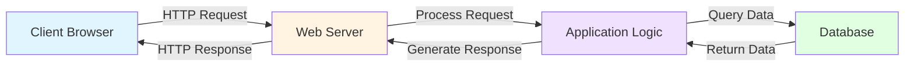

### Why Express.js?

**Express.js** is like having a **Swiss Army knife** for building web servers in Node.js.

| Feature | Without Express | With Express |
|---------|----------------|--------------|
| **Code Complexity** | 50+ lines | 10 lines |
| **Routing** | Manual parsing | Built-in |
| **Middleware** | Complex setup | Simple `.use()` |
| **Learning Curve** | Steep | Gentle |

---

## ⚡ Express.js Fundamentals {#express-fundamentals}

### Installation & Setup

**Step 1: Initialize Your Project**

```bash
# Create project directory
mkdir portfolio-api
cd portfolio-api

# Initialize npm
npm init -y

# Install Express
npm install express
```

**Step 2: Create Your First Server**

Create a file called `server.js`:

```javascript
// Import Express
const express = require('express');

// Create Express application
const app = express();

// Define port
const PORT = 3000;

// Create your first route
app.get('/', (req, res) => {
  res.send('Hello, World! 🌍');
});

// Start the server
app.listen(PORT, () => {
  console.log(`🚀 Server is running on http://localhost:${PORT}`);
});
```

**Step 3: Run Your Server**

```bash
node server.js
```

Visit `http://localhost:3000` in your browser! 🎉

### Understanding the Code

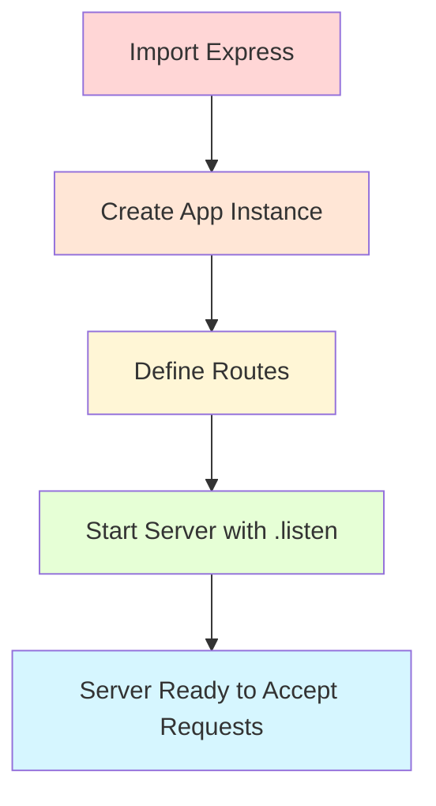

**Key Components:**

* `const app = express()`: Creates an Express application instance
* `app.get()`: Defines a route that responds to GET requests
* `req`: Request object (incoming data)
* `res`: Response object (outgoing data)
* `app.listen()`: Starts the server on specified port

---

## 🔄 HTTP Methods Deep Dive {#http-methods}

### The CRUD Operations

Think of HTTP methods like **actions in a library**:

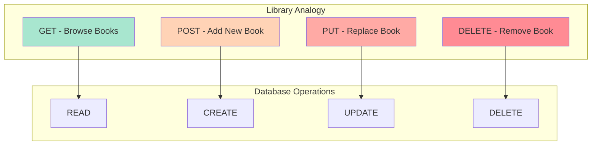

### 1️⃣ GET - Retrieve Data

**Use Case**: Fetching user profiles, product lists, blog posts

```javascript
// Get all projects
app.get('/api/projects', (req, res) => {
  const projects = [
    { id: 1, name: 'E-commerce Website', tech: 'React, Node.js' },
    { id: 2, name: 'Weather App', tech: 'JavaScript, API' },
    { id: 3, name: 'Task Manager', tech: 'Vue.js, Firebase' }
  ];
  
  res.json(projects);
});

// Get single project by ID
app.get('/api/projects/:id', (req, res) => {
  const projectId = req.params.id;
  const project = { id: projectId, name: 'E-commerce Website' };
  
  res.json(project);
});
```

**Real-World Example**: Like checking Amazon product details - you're just viewing, not changing anything.

### 2️⃣ POST - Create Data

**Use Case**: User registration, creating new posts, submitting forms

```javascript
// Middleware to parse JSON
app.use(express.json());

// Create new project
app.post('/api/projects', (req, res) => {
  const newProject = {
    id: Date.now(), // Simple ID generation
    name: req.body.name,
    tech: req.body.tech,
    description: req.body.description
  };
  
  // In real app, save to database
  projects.push(newProject);
  
  res.status(201).json({
    message: 'Project created successfully! 🎉',
    project: newProject
  });
});
```

**Real-World Example**: Like posting a new photo on Instagram - you're adding new content.

### 3️⃣ PUT - Update Data

**Use Case**: Editing profiles, updating settings, modifying posts

```javascript
// Update project
app.put('/api/projects/:id', (req, res) => {
  const projectId = req.params.id;
  
  const updatedProject = {
    id: projectId,
    name: req.body.name,
    tech: req.body.tech,
    description: req.body.description
  };
  
  res.json({
    message: 'Project updated successfully! ✅',
    project: updatedProject
  });
});
```

**Real-World Example**: Like editing your Facebook post - you're changing existing content.

### 4️⃣ DELETE - Remove Data

**Use Case**: Deleting accounts, removing items from cart, archiving posts

```javascript
// Delete project
app.delete('/api/projects/:id', (req, res) => {
  const projectId = req.params.id;
  
  // In real app, remove from database
  res.json({
    message: `Project ${projectId} deleted successfully! 🗑️`
  });
});
```

**Real-World Example**: Like removing an item from your Netflix watchlist.

---

## 🎯 RESTful API Design Principles {#restful-design}

### What is REST?

**REST** (Representational State Transfer) is like having a **universal language** for APIs.

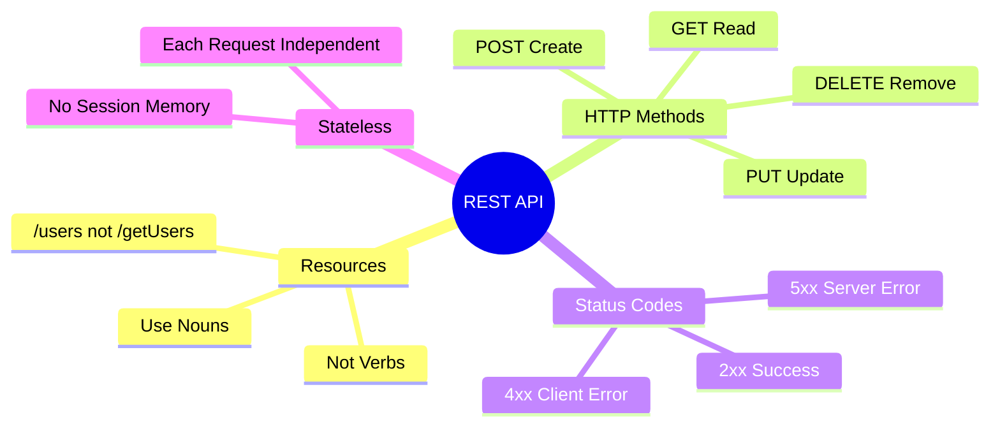

### REST Design Principles

#### 1. **Use Nouns for Resources**

✅ **Good**:

```
GET    /api/projects       # Get all projects
GET    /api/projects/5     # Get project with ID 5
POST   /api/projects       # Create new project
PUT    /api/projects/5     # Update project 5
DELETE /api/projects/5     # Delete project 5
```

❌ **Bad**:

```
GET  /api/getAllProjects
GET  /api/getProjectById/5
POST /api/createNewProject
POST /api/updateProject/5
POST /api/deleteProject/5
```

#### 2. **Resource Hierarchy**

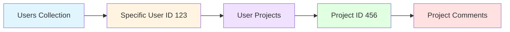

**Example Structure**:

```javascript
// User's projects
GET /api/users/123/projects

// Specific project of a user
GET /api/users/123/projects/456

// Comments on a project
GET /api/projects/456/comments
```

#### 3. **Use HTTP Status Codes Properly**

| Code | Meaning | Use Case |
|------|---------|----------|
| **200** | OK | Successful GET, PUT, DELETE |
| **201** | Created | Successful POST |
| **204** | No Content | Successful DELETE with no response body |
| **400** | Bad Request | Invalid data sent by client |
| **401** | Unauthorized | Authentication required |
| **403** | Forbidden | Authenticated but no permission |
| **404** | Not Found | Resource doesn't exist |
| **500** | Server Error | Something went wrong on server |

#### 4. **Filtering, Sorting, and Pagination**

```javascript
// Filtering
GET /api/projects?tech=react&status=completed

// Sorting
GET /api/projects?sort=name&order=asc

// Pagination
GET /api/projects?page=2&limit=10

// Combined
GET /api/projects?tech=react&sort=date&page=1&limit=20
```

**Implementation Example**:

```javascript
app.get('/api/projects', (req, res) => {
  const { tech, sort, page = 1, limit = 10 } = req.query;
  
  let filteredProjects = projects;
  
  // Filter by technology
  if (tech) {
    filteredProjects = filteredProjects.filter(p => 
      p.tech.toLowerCase().includes(tech.toLowerCase())
    );
  }
  
  // Sort by field
  if (sort) {
    filteredProjects.sort((a, b) => 
      a[sort].localeCompare(b[sort])
    );
  }
  
  // Pagination
  const startIndex = (page - 1) * limit;
  const endIndex = page * limit;
  const paginatedProjects = filteredProjects.slice(startIndex, endIndex);
  
  res.json({
    page: parseInt(page),
    limit: parseInt(limit),
    total: filteredProjects.length,
    data: paginatedProjects
  });
});
```

---

## 🔧 Middleware Magic {#middleware}

### What is Middleware?

Middleware is like a **security checkpoint at an airport** - every request passes through it before reaching its destination.

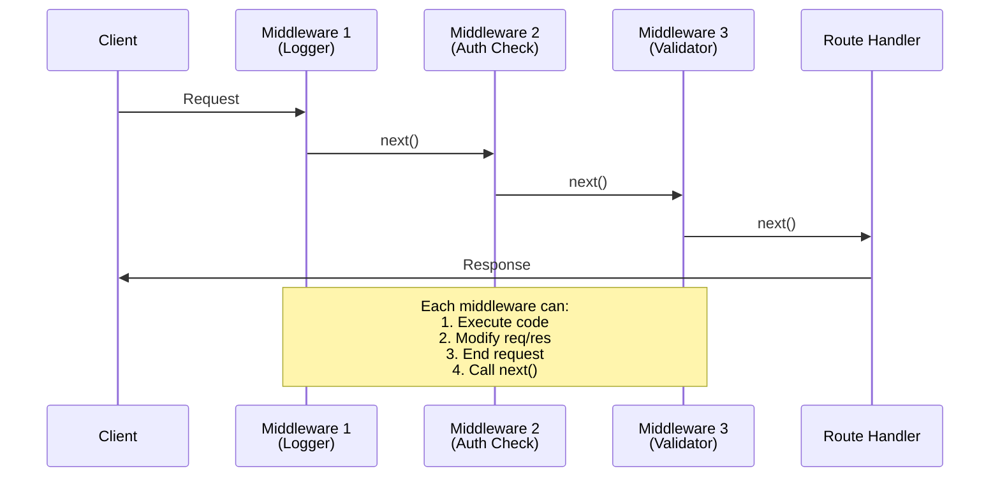

### Types of Middleware

#### 1. **Application-Level Middleware**

```javascript
// Logger middleware - logs every request
app.use((req, res, next) => {
  console.log(`${req.method} ${req.url} - ${new Date().toISOString()}`);
  next(); // Pass control to next middleware
});

// JSON parser middleware
app.use(express.json());

// URL-encoded parser middleware
app.use(express.urlencoded({ extended: true }));
```

#### 2. **Route-Level Middleware**

```javascript
// Authentication middleware
const authenticate = (req, res, next) => {
  const token = req.headers.authorization;
  
  if (!token) {
    return res.status(401).json({ error: 'No token provided' });
  }
  
  // Verify token (simplified)
  if (token === 'valid-token-123') {
    req.user = { id: 1, name: 'Ayush Raj' };
    next();
  } else {
    return res.status(401).json({ error: 'Invalid token' });
  }
};

// Use middleware on specific route
app.get('/api/profile', authenticate, (req, res) => {
  res.json({ user: req.user });
});
```

#### 3. **Error-Handling Middleware**

```javascript
// Must have 4 parameters: err, req, res, next
app.use((err, req, res, next) => {
  console.error('Error:', err.message);
  
  res.status(err.status || 500).json({
    error: {
      message: err.message,
      status: err.status || 500
    }
  });
});
```

### Real-World Middleware Examples

#### Request Logging

```javascript
const requestLogger = (req, res, next) => {
  const start = Date.now();
  
  res.on('finish', () => {
    const duration = Date.now() - start;
    console.log(`${req.method} ${req.url} - ${res.statusCode} - ${duration}ms`);
  });
  
  next();
};

app.use(requestLogger);
```

#### CORS (Cross-Origin Resource Sharing)

```javascript
app.use((req, res, next) => {
  res.header('Access-Control-Allow-Origin', '*');
  res.header('Access-Control-Allow-Methods', 'GET, POST, PUT, DELETE');
  res.header('Access-Control-Allow-Headers', 'Content-Type, Authorization');
  next();
});
```

#### Input Validation

```javascript
const validateProject = (req, res, next) => {
  const { name, tech } = req.body;
  
  if (!name || !tech) {
    return res.status(400).json({ 
      error: 'Name and tech are required fields' 
    });
  }
  
  if (name.length < 3) {
    return res.status(400).json({ 
      error: 'Name must be at least 3 characters' 
    });
  }
  
  next();
};

app.post('/api/projects', validateProject, (req, res) => {
  // Handle project creation
});
```

---

## 🚨 Error Handling {#error-handling}

### Error Handling Strategy

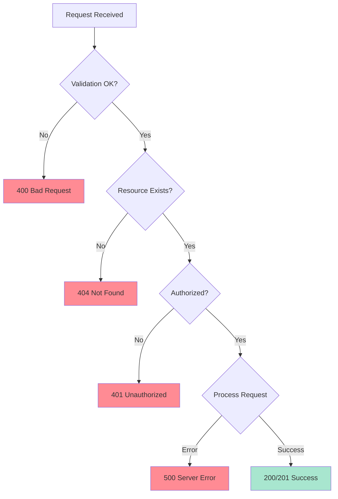

### Implementing Error Handling

#### 1. **Custom Error Class**

```javascript
class AppError extends Error {
  constructor(message, statusCode) {
    super(message);
    this.statusCode = statusCode;
    this.isOperational = true;
    
    Error.captureStackTrace(this, this.constructor);
  }
}

// Usage
throw new AppError('Project not found', 404);
```

#### 2. **Async Error Handler**

```javascript
// Wrapper to catch async errors
const asyncHandler = (fn) => {
  return (req, res, next) => {
    Promise.resolve(fn(req, res, next)).catch(next);
  };
};

// Usage
app.get('/api/projects/:id', asyncHandler(async (req, res) => {
  const project = await findProjectById(req.params.id);
  
  if (!project) {
    throw new AppError('Project not found', 404);
  }
  
  res.json(project);
}));
```

#### 3. **Global Error Handler**

```javascript
app.use((err, req, res, next) => {
  err.statusCode = err.statusCode || 500;
  err.message = err.message || 'Internal Server Error';
  
  // Development vs Production
  if (process.env.NODE_ENV === 'development') {
    res.status(err.statusCode).json({
      status: err.statusCode,
      message: err.message,
      stack: err.stack,
      error: err
    });
  } else {
    // Production - don't leak error details
    res.status(err.statusCode).json({
      status: err.statusCode,
      message: err.isOperational ? err.message : 'Something went wrong'
    });
  }
});
```

#### 4. **404 Handler**

```javascript
// Catch all undefined routes
app.all('*', (req, res, next) => {
  next(new AppError(`Can't find ${req.originalUrl} on this server!`, 404));
});
```

---

## 🎨 Hands-On Project: Portfolio API {#hands-on-project}

### Project Overview

We'll build a complete **Portfolio API** with:

* ✅ Projects management (CRUD operations)
* ✅ Skills listing
* ✅ Contact form submission
* ✅ About me information
* ✅ Middleware for validation and logging
* ✅ Proper error handling

### Project Structure

```
portfolio-api/
│
├── server.js           # Main server file
├── routes/
│   ├── projects.js     # Project routes
│   ├── skills.js       # Skills routes
│   └── contact.js      # Contact routes
├── middleware/
│   ├── logger.js       # Request logging
│   └── validator.js    # Input validation
├── data/
│   └── mockData.js     # Sample data
└── package.json
```

### Complete Implementation

#### **Step 1: Setup and Dependencies**

```bash
npm init -y
npm install express
npm install --save-dev nodemon
```

Update `package.json`:

```json
{
  "scripts": {
    "start": "node server.js",
    "dev": "nodemon server.js"
  }
}
```

#### **Step 2: Create Mock Data** (`data/mockData.js`)

```javascript
const projects = [
  {
    id: 1,
    name: 'E-commerce Platform',
    description: 'Full-stack online shopping platform with payment integration',
    tech: ['React', 'Node.js', 'MongoDB', 'Stripe'],
    github: 'https://github.com/username/ecommerce',
    live: 'https://myecommerce.com',
    image: 'https://via.placeholder.com/400x300',
    featured: true
  },
  {
    id: 2,
    name: 'Weather Dashboard',
    description: 'Real-time weather app with 7-day forecast',
    tech: ['JavaScript', 'OpenWeather API', 'Chart.js'],
    github: 'https://github.com/username/weather',
    live: 'https://myweather.com',
    image: 'https://via.placeholder.com/400x300',
    featured: false
  },
  {
    id: 3,
    name: 'Task Management App',
    description: 'Collaborative task manager with real-time updates',
    tech: ['Vue.js', 'Firebase', 'Vuex'],
    github: 'https://github.com/username/taskapp',
    live: 'https://mytasks.com',
    image: 'https://via.placeholder.com/400x300',
    featured: true
  }
];

const skills = [
  { category: 'Frontend', items: ['HTML', 'CSS', 'JavaScript', 'React', 'Vue.js'] },
  { category: 'Backend', items: ['Node.js', 'Express', 'Python', 'Django'] },
  { category: 'Database', items: ['MongoDB', 'PostgreSQL', 'Firebase'] },
  { category: 'Tools', items: ['Git', 'Docker', 'AWS', 'VS Code'] }
];

const about = {
  name: 'Ayush Raj',
  title: 'Full Stack Developer',
  bio: 'Passionate developer with 3+ years of experience building web applications',
  email: 'ayush.raj@example.com',
  location: 'San Francisco, CA',
  social: {
    github: 'https://github.com/ayushraj',
    linkedin: 'https://linkedin.com/in/ayushraj',
    twitter: 'https://twitter.com/ayushraj'
  }
};

module.exports = { projects, skills, about };
```

#### **Step 3: Logger Middleware** (`middleware/logger.js`)

```javascript
const logger = (req, res, next) => {
  const timestamp = new Date().toISOString();
  const method = req.method;
  const url = req.url;
  
  console.log(`[${timestamp}] ${method} ${url}`);
  
  // Log response time
  const start = Date.now();
  res.on('finish', () => {
    const duration = Date.now() - start;
    console.log(`[${timestamp}] ${method} ${url} - ${res.statusCode} - ${duration}ms`);
  });
  
  next();
};

module.exports = logger;
```

#### **Step 4: Validator Middleware** (`middleware/validator.js`)

```javascript
const validateProject = (req, res, next) => {
  const { name, description, tech } = req.body;
  const errors = [];
  
  if (!name || name.trim().length < 3) {
    errors.push('Name must be at least 3 characters');
  }
  
  if (!description || description.trim().length < 10) {
    errors.push('Description must be at least 10 characters');
  }
  
  if (!tech || !Array.isArray(tech) || tech.length === 0) {
    errors.push('At least one technology is required');
  }
  
  if (errors.length > 0) {
    return res.status(400).json({ 
      error: 'Validation failed', 
      details: errors 
    });
  }
  
  next();
};

const validateContact = (req, res, next) => {
  const { name, email, message } = req.body;
  const errors = [];
  
  if (!name || name.trim().length < 2) {
    errors.push('Name must be at least 2 characters');
  }
  
  // Simple email validation
  const emailRegex = /^[^\s@]+@[^\s@]+\.[^\s@]+$/;
  if (!email || !emailRegex.test(email)) {
    errors.push('Valid email is required');
  }
  
  if (!message || message.trim().length < 10) {
    errors.push('Message must be at least 10 characters');
  }
  
  if (errors.length > 0) {
    return res.status(400).json({ 
      error: 'Validation failed', 
      details: errors 
    });
  }
  
  next();
};

module.exports = { validateProject, validateContact };
```

#### **Step 5: Main Server File** (`server.js`)

```javascript
const express = require('express');
const logger = require('./middleware/logger');
const { validateProject, validateContact } = require('./middleware/validator');
const { projects, skills, about } = require('./data/mockData');

const app = express();
const PORT = 3000;

// Middleware
app.use(express.json());
app.use(logger);

// CORS
app.use((req, res, next) => {
  res.header('Access-Control-Allow-Origin', '*');
  res.header('Access-Control-Allow-Methods', 'GET, POST, PUT, DELETE, OPTIONS');
  res.header('Access-Control-Allow-Headers', 'Content-Type, Authorization');
  next();
});

// ============================================
// ROUTES
// ============================================

// Home Route
app.get('/', (req, res) => {
  res.json({
    message: '🎨 Welcome to Portfolio API',
    version: '1.0.0',
    endpoints: {
      projects: '/api/projects',
      skills: '/api/skills',
      about: '/api/about',
      contact: '/api/contact'
    }
  });
});

// --------------------------------------------
// PROJECTS ROUTES
// --------------------------------------------

// GET all projects
app.get('/api/projects', (req, res) => {
  const { tech, featured } = req.query;
  let filteredProjects = [...projects];
  
  // Filter by technology
  if (tech) {
    filteredProjects = filteredProjects.filter(p =>
      p.tech.some(t => t.toLowerCase().includes(tech.toLowerCase()))
    );
  }
  
  // Filter by featured
  if (featured === 'true') {
    filteredProjects = filteredProjects.filter(p => p.featured);
  }
  
  res.json({
    count: filteredProjects.length,
    projects: filteredProjects
  });
});

// GET single project
app.get('/api/projects/:id', (req, res) => {
  const projectId = parseInt(req.params.id);
  const project = projects.find(p => p.id === projectId);
  
  if (!project) {
    return res.status(404).json({ 
      error: 'Project not found' 
    });
  }
  
  res.json(project);
});

// POST create project
app.post('/api/projects', validateProject, (req, res) => {
  const newProject = {
    id: projects.length + 1,
    ...req.body,
    featured: req.body.featured || false
  };
  
  projects.push(newProject);
  
  res.status(201).json({
    message: 'Project created successfully! 🎉',
    project: newProject
  });
});

// PUT update project
app.put('/api/projects/:id', validateProject, (req, res) => {
  const projectId = parseInt(req.params.id);
  const projectIndex = projects.findIndex(p => p.id === projectId);
  
  if (projectIndex === -1) {
    return res.status(404).json({ 
      error: 'Project not found' 
    });
  }
  
  projects[projectIndex] = {
    ...projects[projectIndex],
    ...req.body,
    id: projectId
  };
  
  res.json({
    message: 'Project updated successfully! ✅',
    project: projects[projectIndex]
  });
});

// DELETE project
app.delete('/api/projects/:id', (req, res) => {
  const projectId = parseInt(req.params.id);
  const projectIndex = projects.findIndex(p => p.id === projectId);
  
  if (projectIndex === -1) {
    return res.status(404).json({ 
      error: 'Project not found' 
    });
  }
  
  const deletedProject = projects.splice(projectIndex, 1);
  
  res.json({
    message: 'Project deleted successfully! 🗑️',
    project: deletedProject[0]
  });
});

// --------------------------------------------
// SKILLS ROUTES
// --------------------------------------------

// GET all skills
app.get('/api/skills', (req, res) => {
  res.json(skills);
});

// GET skills by category
app.get('/api/skills/:category', (req, res) => {
  const category = req.params.category;
  const skillCategory = skills.find(
    s => s.category.toLowerCase() === category.toLowerCase()
  );
  
  if (!skillCategory) {
    return res.status(404).json({ 
      error: 'Category not found' 
    });
  }
  
  res.json(skillCategory);
});

// --------------------------------------------
// ABOUT ROUTE
// --------------------------------------------

app.get('/api/about', (req, res) => {
  res.json(about);
});

// --------------------------------------------
// CONTACT ROUTE
// --------------------------------------------

app.post('/api/contact', validateContact, (req, res) => {
  const { name, email, message } = req.body;
  
  // In real app, send email or save to database
  console.log('Contact form submission:', { name, email, message });
  
  res.status(201).json({
    message: 'Thank you for your message! I\'ll get back to you soon. 📧',
    submission: {
      name,
      email,
      receivedAt: new Date().toISOString()
    }
  });
});

// --------------------------------------------
// ERROR HANDLING
// --------------------------------------------

// 404 handler
app.use((req, res) => {
  res.status(404).json({
    error: 'Route not found',
    message: `Cannot ${req.method} ${req.url}`
  });
});

// Global error handler
app.use((err, req, res, next) => {
  console.error('Error:', err);
  
  res.status(err.statusCode || 500).json({
    error: err.message || 'Internal Server Error',
    ...(process.env.NODE_ENV === 'development' && { stack: err.stack })
  });
});

// --------------------------------------------
// START SERVER
// --------------------------------------------

app.listen(PORT, () => {
  console.log(`
  ╔═══════════════════════════════════════╗
  ║   🚀 Portfolio API Server Running    ║
  ║                                       ║
  ║   Port: ${PORT}                          ║
  ║   URL: http://localhost:${PORT}         ║
  ║                                       ║
  ║   📚 API Documentation:               ║
  ║   http://localhost:${PORT}/             ║
  ╚═══════════════════════════════════════╝
  `);
});
```

---

## 🧪 Testing Your API

### Using cURL

```bash
# Get all projects
curl http://localhost:3000/api/projects

# Get featured projects
curl http://localhost:3000/api/projects?featured=true

# Get single project
curl http://localhost:3000/api/projects/1

# Create project
curl -X POST http://localhost:3000/api/projects \
  -H "Content-Type: application/json" \
  -d '{
    "name": "Blog Platform",
    "description": "Personal blogging platform with markdown support",
    "tech": ["React", "Express", "MongoDB"]
  }'

# Update project
curl -X PUT http://localhost:3000/api/projects/1 \
  -H "Content-Type: application/json" \
  -d '{
    "name": "Updated E-commerce Platform",
    "description": "Enhanced shopping platform",
    "tech": ["React", "Node.js", "PostgreSQL"]
  }'

# Delete project
curl -X DELETE http://localhost:3000/api/projects/1

# Get skills
curl http://localhost:3000/api/skills

# Submit contact form
curl -X POST http://localhost:3000/api/contact \
  -H "Content-Type: application/json" \
  -d '{
    "name": "Jane Smith",
    "email": "jane@example.com",
    "message": "I would like to discuss a project opportunity"
  }'
```

### Using Postman or Thunder Client

1. **Install Thunder Client** (VS Code Extension) or **Postman**
2. **Create a new request collection** named "Portfolio API"
3. **Test each endpoint**:

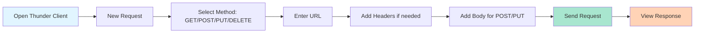

**Example Test Cases:**

| Method | Endpoint | Body | Expected Status |
|--------|----------|------|-----------------|
| GET | `/api/projects` | None | 200 |
| GET | `/api/projects/1` | None | 200 |
| GET | `/api/projects/999` | None | 404 |
| POST | `/api/projects` | Valid project data | 201 |
| POST | `/api/projects` | Missing fields | 400 |
| PUT | `/api/projects/1` | Updated data | 200 |
| DELETE | `/api/projects/1` | None | 200 |

---

## 🎯 Best Practices & Tips

### 1. **API Versioning**

Always version your APIs to maintain backward compatibility:

```javascript
// Version 1
app.use('/api/v1/projects', projectsRouterV1);

// Version 2 (with breaking changes)
app.use('/api/v2/projects', projectsRouterV2);
```

### 2. **Environment Variables**

Never hardcode sensitive data:

```bash
# Create .env file
PORT=3000
NODE_ENV=development
DATABASE_URL=mongodb://localhost:27017/portfolio
API_KEY=your-secret-key
```

```javascript
// Use dotenv package
require('dotenv').config();

const PORT = process.env.PORT || 3000;
const dbUrl = process.env.DATABASE_URL;
```

### 3. **Security Headers**

Use helmet for security:

```bash
npm install helmet
```

```javascript
const helmet = require('helmet');
app.use(helmet());
```

### 4. **Rate Limiting**

Prevent abuse with rate limiting:

```bash
npm install express-rate-limit
```

```javascript
const rateLimit = require('express-rate-limit');

const limiter = rateLimit({
  windowMs: 15 * 60 * 1000, // 15 minutes
  max: 100, // limit each IP to 100 requests per windowMs
  message: 'Too many requests from this IP'
});

app.use('/api/', limiter);
```

### 5. **API Documentation**

Document your API endpoints clearly:

```javascript
/**
 * @route   GET /api/projects
 * @desc    Get all projects with optional filtering
 * @query   {string} tech - Filter by technology
 * @query   {boolean} featured - Filter featured projects
 * @access  Public
 */
app.get('/api/projects', (req, res) => {
  // Implementation
});
```

---

## 🚀 Advanced Topics (Next Steps)

### 1. **Database Integration**

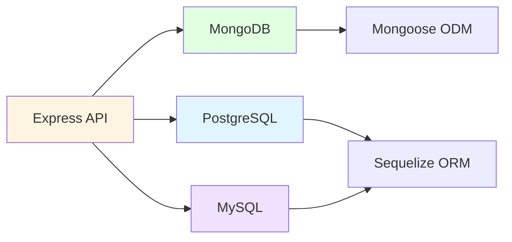

**Example with MongoDB:**

```javascript
const mongoose = require('mongoose');

// Define schema
const projectSchema = new mongoose.Schema({
  name: String,
  description: String,
  tech: [String],
  featured: Boolean
});

// Create model
const Project = mongoose.model('Project', projectSchema);

// Use in routes
app.get('/api/projects', async (req, res) => {
  const projects = await Project.find();
  res.json(projects);
});
```

### 2. **Authentication & Authorization**

```javascript
const jwt = require('jsonwebtoken');

// Generate token
const token = jwt.sign({ userId: user.id }, 'secret-key', { 
  expiresIn: '7d' 
});

// Verify token middleware
const auth = (req, res, next) => {
  const token = req.header('Authorization')?.replace('Bearer ', '');
  
  if (!token) {
    return res.status(401).json({ error: 'No token provided' });
  }
  
  try {
    const decoded = jwt.verify(token, 'secret-key');
    req.userId = decoded.userId;
    next();
  } catch (err) {
    res.status(401).json({ error: 'Invalid token' });
  }
};

// Protected route
app.get('/api/profile', auth, (req, res) => {
  // req.userId is available
});
```

### 3. **File Upload**

```javascript
const multer = require('multer');

const storage = multer.diskStorage({
  destination: './uploads/',
  filename: (req, file, cb) => {
    cb(null, Date.now() + '-' + file.originalname);
  }
});

const upload = multer({ storage });

app.post('/api/upload', upload.single('image'), (req, res) => {
  res.json({ 
    message: 'File uploaded',
    filename: req.file.filename 
  });
});
```

### 4. **WebSocket Integration**

```javascript
const http = require('http');
const socketIo = require('socket.io');

const server = http.createServer(app);
const io = socketIo(server);

io.on('connection', (socket) => {
  console.log('New client connected');
  
  socket.on('message', (data) => {
    io.emit('message', data); // Broadcast to all
  });
});
```

---

## 📝 Common Patterns & Code Snippets

### Async/Await Error Wrapper

```javascript
const asyncHandler = fn => (req, res, next) =>
  Promise.resolve(fn(req, res, next)).catch(next);

// Usage
app.get('/api/data', asyncHandler(async (req, res) => {
  const data = await fetchData();
  res.json(data);
}));
```

### Response Formatter

```javascript
const sendResponse = (res, statusCode, data, message = null) => {
  res.status(statusCode).json({
    success: statusCode < 400,
    message,
    data,
    timestamp: new Date().toISOString()
  });
};

// Usage
sendResponse(res, 200, projects, 'Projects fetched successfully');
```

### Pagination Helper

```javascript
const paginate = (array, page, limit) => {
  const startIndex = (page - 1) * limit;
  const endIndex = page * limit;
  
  return {
    data: array.slice(startIndex, endIndex),
    pagination: {
      page,
      limit,
      total: array.length,
      pages: Math.ceil(array.length / limit),
      hasNext: endIndex < array.length,
      hasPrev: startIndex > 0
    }
  };
};
```

---

## 🎓 Practice Exercises

### Exercise 1: Add Categories to Projects

**Task**: Add a `/api/categories` endpoint that returns unique categories from all projects.

**Hint**:

```javascript
app.get('/api/categories', (req, res) => {
  // Extract unique technologies from all projects
  // Return as array
});
```

### Exercise 2: Search Functionality

**Task**: Implement search across project names and descriptions.

**Expected**: `/api/projects/search?q=weather` should return matching projects.

### Exercise 3: Statistics Endpoint

**Task**: Create `/api/stats` that returns:

* Total number of projects
* Total number of skills
* Most used technology
* Number of featured projects

### Exercise 4: Project Views Counter

**Task**: Add a view counter that increments each time a project is viewed.

**Hint**: Add a `views` field to each project and increment on GET.

### Exercise 5: Related Projects

**Task**: For `/api/projects/:id/related`, return 3 projects with similar technologies.

---

## 🔍 Debugging Tips

### 1. **Use console.log Strategically**

```javascript
app.get('/api/projects', (req, res) => {
  console.log('📥 Request received:', req.method, req.url);
  console.log('🔍 Query params:', req.query);
  console.log('📤 Sending response...');
  res.json(projects);
});
```

### 2. **Check Request/Response in Browser DevTools**

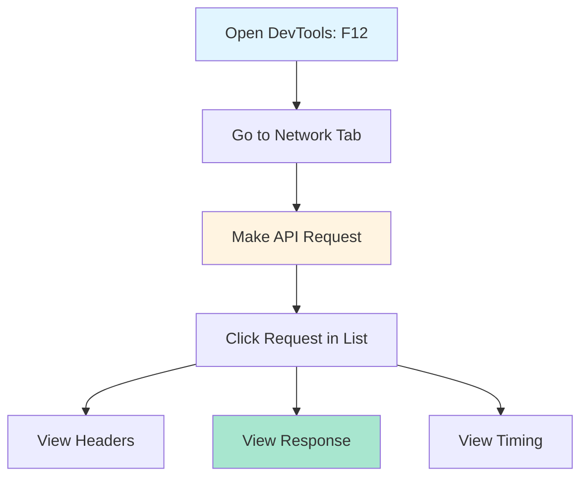

### 3. **Test Middleware Order**

Middleware executes in order - be careful!

```javascript
// ❌ Wrong - body won't be parsed
app.post('/api/projects', (req, res) => {
  console.log(req.body); // undefined
});
app.use(express.json());

// ✅ Correct
app.use(express.json());
app.post('/api/projects', (req, res) => {
  console.log(req.body); // { name: "...", ... }
});
```

---

## 📚 Additional Resources

### Official Documentation

* **Express.js**: <https://expressjs.com/>
* **Node.js**: <https://nodejs.org/>
* **MDN HTTP**: <https://developer.mozilla.org/en-US/docs/Web/HTTP>

### Recommended Tools

* **Postman**: API testing platform
* **Thunder Client**: VS Code extension for API testing
* **Nodemon**: Auto-restart server on file changes
* **Morgan**: Advanced HTTP request logger

### Learning Path

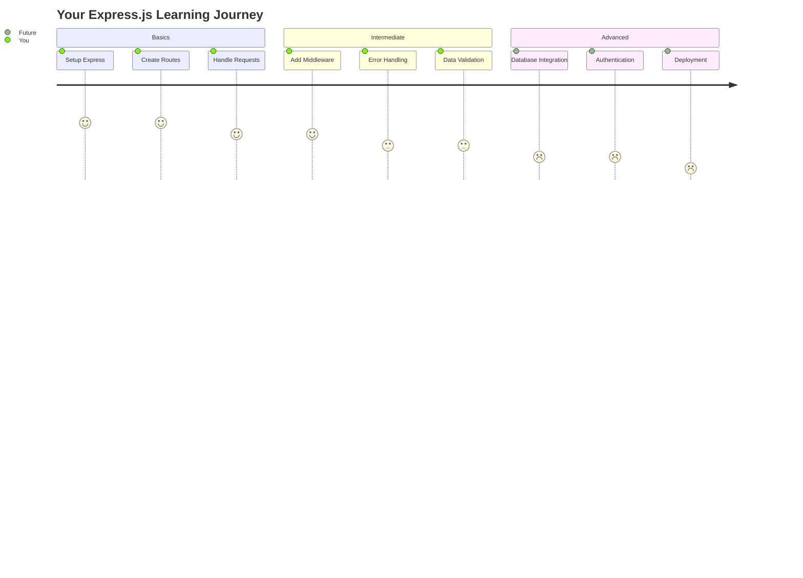

---

## 🎯 Key Takeaways

### ✅ What You've Learned

1. **Express.js Basics**
   * Server setup and configuration
   * Route creation and handling
   * Request/response cycle

2. **HTTP Methods**
   * GET for retrieving data
   * POST for creating data
   * PUT for updating data
   * DELETE for removing data

3. **RESTful API Design**
   * Resource-based URLs
   * Proper HTTP status codes
   * Consistent naming conventions

4. **Middleware**
   * Request processing pipeline
   * Custom middleware creation
   * Built-in middleware usage

5. **Error Handling**
   * Try-catch blocks
   * Error middleware
   * Status code management

### 🎓 Final Checklist

* [ ] Understand client-server architecture
* [ ] Can create Express server from scratch
* [ ] Know all CRUD operations
* [ ] Understand REST principles
* [ ] Can write custom middleware
* [ ] Implement proper error handling
* [ ] Test APIs using Postman/cURL
* [ ] Apply best practices and security

---

## 🚀 What's Next?

### Session 18 Preview: Database Integration

* MongoDB with Mongoose
* CRUD operations with real database
* Data modeling and relationships
* Database queries and optimization

### Keep Building

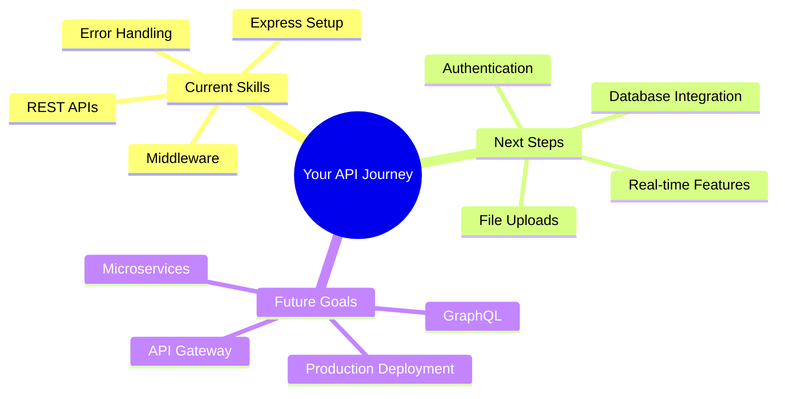

---

## 💬 Remember

> "The best way to learn is by building. Start small, iterate often, and don't be afraid to make mistakes. Every error is a learning opportunity!"

### Happy Coding! 🎉

Got questions? Keep experimenting with the Portfolio API and try building your own endpoints. The more you practice, the more comfortable you'll become with Express.js!

---

**Created with ❤️ for aspiring developers**
*Session 17 | Express.js & REST APIs*
