# 🏗️ Session 18: Understanding MVC Architecture and Project Structure

## 📚 Table of Contents

1. [Introduction to MVC](#introduction)
2. [The Restaurant Analogy](#restaurant-analogy)
3. [MVC Components Explained](#mvc-components)
4. [Separation of Concerns](#separation-of-concerns)
5. [Express.js MVC Structure](#express-mvc-structure)
6. [Hands-On Implementation](#hands-on)
7. [Best Practices](#best-practices)

---

**🎯 Learning Objectives**
*By the end of this session, you will be able to:*

* ✔️ Understand the MVC pattern, its purpose, and the roles of Model, View, Controller
* ✔️ Apply separation of concerns by clearly dividing business logic, data operations, and request handling
* ✔️ Structure an Express.js project using proper MVC folder conventions
* ✔️ Build Models for validation, business rules, and database interactions
* ✔️ Create lean Controllers that coordinate between routes, models, and responses
* ✔️ Organize routes to map endpoints to controller methods effectively
* ✔️ Implement complete CRUD operations following MVC principles
* ✔️ Format consistent API responses as the View layer in REST APIs
* ✔️ Refactor monolithic code into a clean MVC structure that scales
* ✔️ Apply consistent error handling and test each MVC layer independently

---

## 🎯 Introduction to MVC {#introduction}

**MVC (Model-View-Controller)** is a software architectural pattern that separates an application into three interconnected components. Think of it as organizing your code into specialized teams, where each team has a specific job.

### Why MVC Matters

Imagine building a house without any blueprint or organization:

* Plumbers working where electricians need to be
* Painters not knowing which walls are finished
* No clear plan for anyone to follow

**That's what coding without MVC looks like!**

MVC solves this by creating clear boundaries and responsibilities.

---

## 🍽️ The Restaurant Analogy {#restaurant-analogy}

Let's understand MVC through something we all know: **a restaurant!**

```mermaid
graph LR
    A[👤 Customer<br/>User] -->|Places Order| B[📋 Waiter<br/>Controller]
    B -->|Sends Order| C[👨‍🍳 Chef<br/>Model]
    C -->|Retrieves Ingredients| D[(🥘 Storage<br/>Database)]
    C -->|Prepares Food| B
    B -->|Serves Dish| E[🍽️ Plate<br/>View]
    E -->|Displays| A
```



### Breaking Down the Restaurant

| Component | Restaurant Role | MVC Role | Responsibility |
|-----------|----------------|----------|----------------|
| **Customer** | Person ordering | User/Client | Makes requests |
| **Waiter** | Takes orders, serves | **Controller** | Handles requests, coordinates |
| **Chef** | Prepares food | **Model** | Processes data, business logic |
| **Storage** | Refrigerator/Pantry | Database | Stores ingredients/data |
| **Plate** | Presentation | **View** | Displays results |

### Real-World Flow

1. **Customer (User)**: "I'd like a pizza with extra cheese!"
2. **Waiter (Controller)**: Takes the order, validates it, sends to kitchen
3. **Chef (Model)**: Gets ingredients, follows recipe, creates pizza
4. **Storage (Database)**: Provides dough, cheese, toppings
5. **Waiter (Controller)**: Picks up prepared pizza
6. **Plate (View)**: Pizza beautifully presented
7. **Customer (User)**: Receives and enjoys!

---

## 🧩 MVC Components Explained {#mvc-components}

### 1. 📊 MODEL - The Data Expert

**What it does:** Handles all data-related operations and business logic.


#### Real Example: User Model

Think of a **User Profile** in a social media app:

**Responsibilities:**

* Define what a user looks like (name, email, password)
* Save new users to database
* Find users by email
* Update user information
* Validate email format
* Hash passwords for security

```javascript
// User Model Example
class User {
  constructor(name, email, password) {
    this.name = name;
    this.email = email;
    this.password = password;
  }

  // Business Logic: Validate email
  validateEmail() {
    const emailRegex = /^[^\s@]+@[^\s@]+\.[^\s@]+$/;
    return emailRegex.test(this.email);
  }

  // Database Operation: Save user
  async save() {
    // Save to database
  }

  // Database Operation: Find user
  static async findByEmail(email) {
    // Query database
  }
}
```

**Key Point:** The Model doesn't care HOW the data is displayed or WHO requested it. It just manages the data!

---

### 2. 🎮 CONTROLLER - The Traffic Cop

**What it does:** Receives requests, coordinates between Model and View, sends responses.


#### Real Example: User Controller

Imagine the controller as an **event manager** at a concert:

**Responsibilities:**

* Check tickets (validate requests)
* Direct people to seats (route to right function)
* Coordinate with security (call models)
* Announce schedule changes (send responses)

```javascript
// User Controller Example
class UserController {
  
  // Handle user registration
  async registerUser(req, res) {
    try {
      // 1. Extract data from request
      const { name, email, password } = req.body;
      
      // 2. Validate input
      if (!name || !email || !password) {
        return res.status(400).json({ 
          error: "All fields required" 
        });
      }
      
      // 3. Call Model to create user
      const user = new User(name, email, password);
      
      // 4. Validate business rules
      if (!user.validateEmail()) {
        return res.status(400).json({ 
          error: "Invalid email format" 
        });
      }
      
      // 5. Save to database via Model
      await user.save();
      
      // 6. Send success response
      res.status(201).json({ 
        message: "User created successfully",
        user: { name, email }
      });
      
    } catch (error) {
      // Handle errors
      res.status(500).json({ 
        error: "Server error" 
      });
    }
  }
  
  // Handle user login
  async loginUser(req, res) {
    // Similar coordination logic
  }
}
```

**Key Point:** The Controller doesn't handle data directly or care about database details. It just coordinates!

---

### 3. 🎨 VIEW - The Presenter

**What it does:** Presents data to the user in a consumable format.


#### In REST APIs (Our Focus)

In modern REST APIs, the "View" is typically **JSON responses**:

```javascript
// View Example: JSON Response Formatting
class UserView {
  
  // Format single user for response
  static formatUser(user) {
    return {
      id: user.id,
      name: user.name,
      email: user.email,
      createdAt: user.createdAt,
      // Note: Password is NEVER sent!
    };
  }
  
  // Format list of users
  static formatUserList(users) {
    return {
      count: users.length,
      users: users.map(user => this.formatUser(user))
    };
  }
  
  // Format error response
  static formatError(message, statusCode) {
    return {
      status: 'error',
      statusCode,
      message
    };
  }
}
```

#### In Traditional Web Apps

Views would be HTML templates:

```html
<!-- User Profile View (EJS Template) -->
<div class="user-profile">
  <h1>Welcome, <%= user.name %>!</h1>
  <p>Email: <%= user.email %></p>
  <p>Member since: <%= user.createdAt %></p>
</div>
```

**Key Point:** The View only formats data for presentation. It doesn't process or validate data!

---

## 🎯 Separation of Concerns {#separation-of-concerns}

### The Single Responsibility Principle

Each component should have **ONE job** and do it well.


### ❌ Bad Example: Everything in One File

```javascript
// BAD: All logic mixed together
app.post('/users', async (req, res) => {
  const { name, email, password } = req.body;
  
  // Validation logic
  if (!name || !email || !password) {
    return res.status(400).json({ error: "Missing fields" });
  }
  
  // Business logic
  const emailRegex = /^[^\s@]+@[^\s@]+\.[^\s@]+$/;
  if (!emailRegex.test(email)) {
    return res.status(400).json({ error: "Invalid email" });
  }
  
  // Database logic
  const hashedPassword = await bcrypt.hash(password, 10);
  const query = "INSERT INTO users (name, email, password) VALUES (?, ?, ?)";
  const result = await db.query(query, [name, email, hashedPassword]);
  
  // Response formatting
  res.status(201).json({
    id: result.insertId,
    name,
    email
  });
});
```

**Problems:**

* ❌ Hard to test
* ❌ Can't reuse code
* ❌ Difficult to modify
* ❌ Messy and confusing

### ✅ Good Example: MVC Separation

```javascript
// GOOD: Separated concerns

// Model (models/User.js)
class User {
  validateEmail() { /* ... */ }
  async save() { /* ... */ }
}

// Controller (controllers/userController.js)
class UserController {
  async registerUser(req, res) {
    const user = new User(req.body);
    await user.save();
    res.json(UserView.format(user));
  }
}

// Route (routes/userRoutes.js)
router.post('/users', userController.registerUser);
```

**Benefits:**

* ✅ Each file has one purpose
* ✅ Easy to test individually
* ✅ Reusable components
* ✅ Clear and organized

---

## 🏗️ Express.js MVC Structure {#express-mvc-structure}

### Ideal Project Structure

```
my-express-api/
│
├── 📁 src/
│   ├── 📁 models/           # Data & Business Logic
│   │   ├── User.js
│   │   ├── Product.js
│   │   └── Order.js
│   │
│   ├── 📁 controllers/      # Request Handlers
│   │   ├── userController.js
│   │   ├── productController.js
│   │   └── orderController.js
│   │
│   ├── 📁 routes/           # Route Definitions
│   │   ├── userRoutes.js
│   │   ├── productRoutes.js
│   │   └── orderRoutes.js
│   │
│   ├── 📁 middlewares/      # Custom Middleware
│   │   ├── auth.js
│   │   ├── validation.js
│   │   └── errorHandler.js
│   │
│   ├── 📁 config/           # Configuration
│   │   ├── database.js
│   │   └── environment.js
│   │
│   ├── 📁 utils/            # Helper Functions
│   │   ├── helpers.js
│   │   └── constants.js
│   │
│   └── 📄 app.js            # Express App Setup
│
├── 📄 server.js             # Entry Point
├── 📄 package.json
└── 📄 .env                  # Environment Variables
```

### Flow Diagram


---

## 💻 Hands-On Implementation {#hands-on}

### Project: Blog API with MVC

Let's build a **Blog Post API** using proper MVC architecture.

### Step 1: Setup Project Structure

```bash
# Create project directory
mkdir blog-api
cd blog-api

# Initialize npm
npm init -y

# Install dependencies
npm install express dotenv

# Create folder structure
mkdir src
mkdir src/models src/controllers src/routes src/config src/middlewares
```

### Step 2: Create the Model

**File: `src/models/Post.js`**

```javascript
// Post Model - Handles data and business logic
class Post {
  constructor(title, content, author) {
    this.title = title;
    this.content = content;
    this.author = author;
    this.createdAt = new Date();
    this.id = null;
  }

  // Business Logic: Validate post
  validate() {
    const errors = [];
    
    if (!this.title || this.title.trim().length === 0) {
      errors.push('Title is required');
    }
    
    if (this.title && this.title.length > 100) {
      errors.push('Title must be less than 100 characters');
    }
    
    if (!this.content || this.content.trim().length === 0) {
      errors.push('Content is required');
    }
    
    if (this.content && this.content.length < 50) {
      errors.push('Content must be at least 50 characters');
    }
    
    if (!this.author || this.author.trim().length === 0) {
      errors.push('Author is required');
    }
    
    return {
      isValid: errors.length === 0,
      errors
    };
  }

  // Database Operations (In-memory for demo)
  static posts = [];
  static nextId = 1;

  // Create post
  async save() {
    const validation = this.validate();
    if (!validation.isValid) {
      throw new Error(validation.errors.join(', '));
    }

    this.id = Post.nextId++;
    Post.posts.push(this);
    return this;
  }

  // Get all posts
  static async findAll() {
    return Post.posts;
  }

  // Get post by ID
  static async findById(id) {
    return Post.posts.find(post => post.id === parseInt(id));
  }

  // Update post
  static async update(id, updateData) {
    const postIndex = Post.posts.findIndex(p => p.id === parseInt(id));
    if (postIndex === -1) return null;

    Post.posts[postIndex] = {
      ...Post.posts[postIndex],
      ...updateData,
      id: parseInt(id) // Ensure ID doesn't change
    };

    return Post.posts[postIndex];
  }

  // Delete post
  static async delete(id) {
    const postIndex = Post.posts.findIndex(p => p.id === parseInt(id));
    if (postIndex === -1) return false;

    Post.posts.splice(postIndex, 1);
    return true;
  }
}

module.exports = Post;
```

### Step 3: Create the Controller

**File: `src/controllers/postController.js`**

```javascript
const Post = require('../models/Post');

// Post Controller - Handles HTTP requests and coordinates
class PostController {
  
  // CREATE - Handle new post creation
  async createPost(req, res) {
    try {
      const { title, content, author } = req.body;

      // Create new post instance
      const post = new Post(title, content, author);

      // Save via model (includes validation)
      const savedPost = await post.save();

      // Send success response
      res.status(201).json({
        status: 'success',
        message: 'Post created successfully',
        data: savedPost
      });

    } catch (error) {
      res.status(400).json({
        status: 'error',
        message: error.message
      });
    }
  }

  // READ - Get all posts
  async getAllPosts(req, res) {
    try {
      const posts = await Post.findAll();

      res.status(200).json({
        status: 'success',
        count: posts.length,
        data: posts
      });

    } catch (error) {
      res.status(500).json({
        status: 'error',
        message: 'Failed to fetch posts'
      });
    }
  }

  // READ - Get single post
  async getPostById(req, res) {
    try {
      const { id } = req.params;
      const post = await Post.findById(id);

      if (!post) {
        return res.status(404).json({
          status: 'error',
          message: 'Post not found'
        });
      }

      res.status(200).json({
        status: 'success',
        data: post
      });

    } catch (error) {
      res.status(500).json({
        status: 'error',
        message: 'Failed to fetch post'
      });
    }
  }

  // UPDATE - Update existing post
  async updatePost(req, res) {
    try {
      const { id } = req.params;
      const { title, content, author } = req.body;

      const updatedPost = await Post.update(id, { title, content, author });

      if (!updatedPost) {
        return res.status(404).json({
          status: 'error',
          message: 'Post not found'
        });
      }

      res.status(200).json({
        status: 'success',
        message: 'Post updated successfully',
        data: updatedPost
      });

    } catch (error) {
      res.status(400).json({
        status: 'error',
        message: error.message
      });
    }
  }

  // DELETE - Remove post
  async deletePost(req, res) {
    try {
      const { id } = req.params;
      const deleted = await Post.delete(id);

      if (!deleted) {
        return res.status(404).json({
          status: 'error',
          message: 'Post not found'
        });
      }

      res.status(200).json({
        status: 'success',
        message: 'Post deleted successfully'
      });

    } catch (error) {
      res.status(500).json({
        status: 'error',
        message: 'Failed to delete post'
      });
    }
  }
}

module.exports = new PostController();
```

### Step 4: Create Routes

**File: `src/routes/postRoutes.js`**

```javascript
const express = require('express');
const router = express.Router();
const postController = require('../controllers/postController');

// Define routes and map to controller methods
router.post('/', postController.createPost);
router.get('/', postController.getAllPosts);
router.get('/:id', postController.getPostById);
router.put('/:id', postController.updatePost);
router.delete('/:id', postController.deletePost);

module.exports = router;
```

### Step 5: Create Express App

**File: `src/app.js`**

```javascript
const express = require('express');
const postRoutes = require('./routes/postRoutes');

// Create Express application
const app = express();

// Middleware
app.use(express.json()); // Parse JSON bodies

// Routes
app.use('/api/posts', postRoutes);

// Health check route
app.get('/health', (req, res) => {
  res.json({ status: 'OK', message: 'Server is running' });
});

// 404 Handler
app.use((req, res) => {
  res.status(404).json({
    status: 'error',
    message: 'Route not found'
  });
});

// Error Handler
app.use((err, req, res, next) => {
  console.error(err.stack);
  res.status(500).json({
    status: 'error',
    message: 'Something went wrong!'
  });
});

module.exports = app;
```

### Step 6: Create Server Entry Point

**File: `server.js`**

```javascript
const app = require('./src/app');

const PORT = process.env.PORT || 3000;

app.listen(PORT, () => {
  console.log(`🚀 Server running on http://localhost:${PORT}`);
  console.log(`📝 API endpoint: http://localhost:${PORT}/api/posts`);
});
```

### Step 7: Test the API

**Start the server:**

```bash
node server.js
```

**Test with these requests:**

```bash
# 1. Create a post
curl -X POST http://localhost:3000/api/posts \
  -H "Content-Type: application/json" \
  -d '{
    "title": "Understanding MVC Architecture",
    "content": "MVC is a design pattern that separates application into three main components: Model, View, and Controller. This separation helps organize code better and makes it more maintainable.",
    "author": "Ayush Raj"
  }'

# 2. Get all posts
curl http://localhost:3000/api/posts

# 3. Get specific post
curl http://localhost:3000/api/posts/1

# 4. Update a post
curl -X PUT http://localhost:3000/api/posts/1 \
  -H "Content-Type: application/json" \
  -d '{
    "title": "MVC Architecture - Updated",
    "content": "Updated content about MVC pattern with more details about how each component works together to create maintainable applications.",
    "author": "Ayush Raj"
  }'

# 5. Delete a post
curl -X DELETE http://localhost:3000/api/posts/1
```

---

## 🎓 Best Practices {#best-practices}

### 1. Keep Controllers Thin

```javascript
// ❌ BAD: Fat controller
async createPost(req, res) {
  // Validation logic
  if (!req.body.title) return res.status(400).json({...});
  if (req.body.title.length > 100) return res.status(400).json({...});
  
  // Business logic
  const slug = req.body.title.toLowerCase().replace(/\s/g, '-');
  
  // Database logic
  const query = "INSERT INTO posts...";
  // ... more logic
}

// ✅ GOOD: Thin controller
async createPost(req, res) {
  const post = new Post(req.body);
  const savedPost = await post.save();
  res.json(savedPost);
}
```

### 2. Models Should Handle Business Logic

```javascript
// ✅ GOOD: Logic in model
class User {
  isEligibleForDiscount() {
    return this.membershipYears > 1 && this.purchaseCount > 10;
  }
}

// ❌ BAD: Logic in controller
if (user.membershipYears > 1 && user.purchaseCount > 10) {
  // apply discount
}
```

### 3. Use Meaningful Names

```javascript
// ❌ BAD
class UC {
  async cp(req, res) { }
}

// ✅ GOOD
class UserController {
  async createPost(req, res) { }
}
```

### 4. One Route File Per Resource

```
routes/
  ├── userRoutes.js      # All /users routes
  ├── postRoutes.js      # All /posts routes
  └── commentRoutes.js   # All /comments routes
```

### 5. Error Handling Middleware

```javascript
// Create centralized error handler
// src/middlewares/errorHandler.js
const errorHandler = (err, req, res, next) => {
  console.error(err.stack);
  
  res.status(err.statusCode || 500).json({
    status: 'error',
    message: err.message || 'Internal server error'
  });
};

module.exports = errorHandler;
```

---

## 📊 MVC Benefits Summary


---

## 🎯 Key Takeaways

### Remember These Points

1. **Model** = Data + Business Logic
   * Defines data structure
   * Handles database operations
   * Contains business rules

2. **Controller** = Traffic Manager
   * Receives requests
   * Validates input
   * Coordinates Model and View
   * Sends responses

3. **View** = Presentation Layer
   * Formats data for output
   * In APIs: JSON responses
   * In web apps: HTML templates

4. **Separation of Concerns** = Each component has ONE job

5. **Organization** = Maintainable, scalable, testable code

---

## 📎 Appendix: Advanced Architecture with Service Layer

### 🔧 Beyond Basic MVC: Introducing Services

As your application grows, you'll notice that controllers can become bloated with complex business logic. This is where the **Service Layer** comes in - it's an additional layer that sits between Controllers and Models.

### Why Add a Service Layer?


### The Problem: Fat Controllers

**❌ Without Services:**

```javascript
// userController.js - TOO MUCH LOGIC!
class UserController {
  async registerUser(req, res) {
    try {
      // 1. Extract and validate
      const { name, email, password } = req.body;
      
      // 2. Check if user exists
      const existingUser = await User.findByEmail(email);
      if (existingUser) {
        return res.status(400).json({ error: 'User already exists' });
      }
      
      // 3. Hash password
      const hashedPassword = await bcrypt.hash(password, 10);
      
      // 4. Create user
      const user = new User(name, email, hashedPassword);
      await user.save();
      
      // 5. Generate token
      const token = jwt.sign({ id: user.id }, process.env.JWT_SECRET);
      
      // 6. Send welcome email
      await sendEmail(email, 'Welcome!', 'Thanks for joining...');
      
      // 7. Log registration
      await AuditLog.create({ action: 'USER_REGISTERED', userId: user.id });
      
      res.status(201).json({ user, token });
    } catch (error) {
      res.status(500).json({ error: error.message });
    }
  }
}
```

**✅ With Services:**

```javascript
// userController.js - THIN AND CLEAN!
class UserController {
  async registerUser(req, res) {
    try {
      const result = await userService.registerUser(req.body);
      res.status(201).json(result);
    } catch (error) {
      res.status(400).json({ error: error.message });
    }
  }
}

// userService.js - ALL BUSINESS LOGIC HERE!
class UserService {
  async registerUser(userData) {
    const { name, email, password } = userData;
    
    // All the complex logic from above
    await this.checkUserExists(email);
    const hashedPassword = await this.hashPassword(password);
    const user = await this.createUser(name, email, hashedPassword);
    const token = await this.generateToken(user);
    await this.sendWelcomeEmail(email);
    await this.logRegistration(user.id);
    
    return { user, token };
  }
  
  async checkUserExists(email) { /* ... */ }
  async hashPassword(password) { /* ... */ }
  async createUser(name, email, hash) { /* ... */ }
  async generateToken(user) { /* ... */ }
  async sendWelcomeEmail(email) { /* ... */ }
  async logRegistration(userId) { /* ... */ }
}
```

---

### 📁 Enhanced Project Structure with Services

```
my-express-api/
│
├── 📁 src/
│   │
│   ├── 📁 models/              # Data & Database Layer
│   │   ├── User.js             # User schema and database queries
│   │   ├── Product.js          # Product schema and database queries
│   │   └── Order.js            # Order schema and database queries
│   │
│   ├── 📁 services/            # Business Logic Layer (NEW!)
│   │   ├── userService.js      # User-related business operations
│   │   ├── productService.js   # Product-related business operations
│   │   ├── orderService.js     # Order-related business operations
│   │   ├── emailService.js     # Email sending logic
│   │   ├── paymentService.js   # Payment processing logic
│   │   └── authService.js      # Authentication/authorization logic
│   │
│   ├── 📁 controllers/         # Request/Response Handlers
│   │   ├── userController.js   # Handle user HTTP requests
│   │   ├── productController.js # Handle product HTTP requests
│   │   └── orderController.js  # Handle order HTTP requests
│   │
│   ├── 📁 routes/              # Route Definitions
│   │   ├── userRoutes.js       # User endpoint routes
│   │   ├── productRoutes.js    # Product endpoint routes
│   │   └── orderRoutes.js      # Order endpoint routes
│   │
│   ├── 📁 middlewares/         # Custom Middleware
│   │   ├── auth.js             # Authentication middleware
│   │   ├── validation.js       # Request validation
│   │   └── errorHandler.js     # Error handling
│   │
│   ├── 📁 utils/               # Helper Functions
│   │   ├── helpers.js          # Generic helper functions
│   │   ├── constants.js        # Application constants
│   │   └── validators.js       # Validation utilities
│   │
│   ├── 📁 config/              # Configuration
│   │   ├── database.js         # Database connection
│   │   └── environment.js      # Environment variables
│   │
│   └── 📄 app.js               # Express App Setup
│
├── 📄 server.js                # Entry Point
├── 📄 package.json
└── 📄 .env                     # Environment Variables
```

---

### 🔄 Request Flow with Service Layer


---

### 🎯 Layer Responsibilities

| Layer | Responsibility | Example |
|-------|---------------|---------|
| **Route** | Map URLs to controllers | `POST /users → userController.create` |
| **Middleware** | Validate, authenticate, authorize | Check if user is logged in |
| **Controller** | Handle HTTP request/response | Extract data, call service, send response |
| **Service** | Business logic & orchestration | Register user + send email + log action |
| **Model** | Data structure & DB operations | Define User schema, save to DB |
| **Database** | Store and retrieve data | PostgreSQL, MongoDB, MySQL |

---

### 💡 Real Example: Blog with Services

**File: `src/services/postService.js`**

```javascript
const Post = require('../models/Post');
const emailService = require('./emailService');
const notificationService = require('./notificationService');

class PostService {
  
  // Complex business logic for creating a post
  async createPost(postData, authorId) {
    // 1. Validate author exists
    const author = await User.findById(authorId);
    if (!author) {
      throw new Error('Author not found');
    }
    
    // 2. Check if user has permission to post
    if (!author.isVerified) {
      throw new Error('Only verified users can create posts');
    }
    
    // 3. Check daily post limit
    const todayPostCount = await Post.countByAuthorToday(authorId);
    if (todayPostCount >= 5) {
      throw new Error('Daily post limit reached');
    }
    
    // 4. Create the post
    const post = new Post({
      ...postData,
      authorId,
      status: 'published'
    });
    await post.save();
    
    // 5. Notify followers
    await notificationService.notifyFollowers(authorId, post.id);
    
    // 6. Send confirmation email to author
    await emailService.sendPostPublishedEmail(author.email, post.title);
    
    // 7. Update author stats
    await this.updateAuthorStats(authorId);
    
    return post;
  }
  
  // Reusable method
  async updateAuthorStats(authorId) {
    const postCount = await Post.countByAuthor(authorId);
    await User.updateStats(authorId, { totalPosts: postCount });
  }
  
  // Another business operation
  async publishScheduledPosts() {
    const posts = await Post.findScheduledForNow();
    
    for (const post of posts) {
      await this.createPost(post, post.authorId);
    }
    
    return posts.length;
  }
}

module.exports = new PostService();
```

**File: `src/controllers/postController.js`**

```javascript
const postService = require('../services/postService');

class PostController {
  
  // Controller stays clean and focused on HTTP
  async createPost(req, res) {
    try {
      const authorId = req.user.id; // From auth middleware
      const post = await postService.createPost(req.body, authorId);
      
      res.status(201).json({
        status: 'success',
        data: post
      });
    } catch (error) {
      res.status(400).json({
        status: 'error',
        message: error.message
      });
    }
  }
}

module.exports = new PostController();
```

---

### 🧪 Benefits of Service Layer

#### 1. **Reusability**

```javascript
// Same service method used in multiple places
class OrderController {
  async createOrder(req, res) {
    const order = await orderService.createOrder(req.body);
    res.json(order);
  }
}

class WebhookController {
  async handlePayment(req, res) {
    // REUSING the same service method!
    const order = await orderService.createOrder(req.body);
    res.json(order);
  }
}

// Background job also uses same service
cron.schedule('0 * * * *', async () => {
  await orderService.processRecurringOrders();
});
```

#### 2. **Testability**

```javascript
// Easy to test service independently
describe('UserService', () => {
  it('should register user successfully', async () => {
    const userData = { name: 'John', email: 'john@test.com' };
    const result = await userService.registerUser(userData);
    
    expect(result).toHaveProperty('user');
    expect(result).toHaveProperty('token');
  });
  
  it('should throw error if email exists', async () => {
    await expect(
      userService.registerUser({ email: 'existing@test.com' })
    ).rejects.toThrow('User already exists');
  });
});
```

#### 3. **Single Responsibility**

```javascript
// Each service has ONE clear purpose
emailService.js       → Handles all email sending
paymentService.js     → Handles all payment processing
authService.js        → Handles all authentication
notificationService.js → Handles all notifications
```

#### 4. **Easy to Maintain**

```javascript
// When business logic changes, update only the service
// Before: Need to update logic in 5 different controllers
// After: Update logic in 1 service, all controllers benefit

// src/services/discountService.js
class DiscountService {
  calculateDiscount(user, amount) {
    // Change discount rules HERE only
    if (user.isPremium) return amount * 0.2;
    if (user.membershipYears > 5) return amount * 0.15;
    return amount * 0.05;
  }
}

// All controllers automatically get updated logic
checkoutController.js  → Uses discountService
cartController.js      → Uses discountService
orderController.js     → Uses discountService
```

---

### 🆚 Comparison: MVC vs MVC+S


---

### 📝 When to Use Services?

✅ **Use Services When:**

* Business logic involves multiple models
* You need to call external APIs
* Operations require multiple steps
* Logic is reused across controllers
* Application is growing in complexity

❌ **Services May Not Be Needed When:**

* Simple CRUD operations only
* Small application with few features
* Direct model operations are sufficient
* No complex business rules

---

### 🎯 Key Takeaways

1. **Services** = Business Logic Layer between Controllers and Models
2. **Controllers** become thin request handlers
3. **Services** handle complex operations, orchestration, and business rules
4. **Models** focus purely on data and database operations
5. **Better organization** = Easier to test, maintain, and scale

---

### 🚀 Refactoring Challenge

**Take your Blog API and add a Service Layer:**

1. Create `src/services/postService.js`
2. Move business logic from controller to service
3. Add these features via service:
   * Check if user can post (daily limit)
   * Generate slug from title
   * Count words in content
   * Update author statistics
   * Send notification on new post

**Compare the before and after!**

---

## 🚀 Practice Challenge

**Build a Todo API using MVC:**

Requirements:

* Create Todo model with validation
* Implement TodoController with CRUD operations
* Set up proper routes
* Add error handling
* Test all endpoints

Features:

* Create todo (title, description, completed)
* List all todos
* Get single todo
* Update todo status
* Delete todo
* Filter by completed/incomplete

Good luck! 🎉

---

## 📚 Additional Resources

* [Express.js Official Docs](https://expressjs.com/)
* [MVC Pattern Wikipedia](https://en.wikipedia.org/wiki/Model–view–controller)
* [Node.js Best Practices](https://github.com/goldbergyoni/nodebestpractices)

---
**Remember:** Start simple with MVC, add Services when complexity grows! 🌱➡️🌳

**Happy Coding! 💻✨**
