# 🌐 Session 1: Getting Started with Web Development

*Level: Beginner*

---

## 🎯 Learning Objectives

By the end of this session, you will:

- Understand how the internet and websites work
- Distinguish between frontend and backend development
- Know what the MERN stack is and why it's popular
- Have a development environment ready for coding
- Explore real-world web development career opportunities

---

## 📋 Session Agenda

1. **Internet Basics**
2. **Frontend vs Backend**
3. **MERN Stack Introduction**
4. **Career Opportunities**
5. **Development Environment Setup**

---

## 🌍 Part 1: How the Internet Works

### The Big Picture

Think of the internet like a massive postal system. When you want to visit a website like **Netflix**, here's what happens:

```mermaid
sequenceDiagram
    participant User as 👤 You (Client)
    participant Browser as 🌐 Browser
    participant DNS as 📋 DNS Server
    participant Server as 🖥️ Netflix Server
    
    User->>Browser: Types "netflix.com"
    Browser->>DNS: "Where is netflix.com?"
    DNS->>Browser: "It's at 54.88.172.29"
    Browser->>Server: "Give me the Netflix homepage"
    Server->>Browser: Sends HTML, CSS, JS files
    Browser->>User: Displays Netflix interface
```



### Key Components Explained

#### 🌐 **Browsers**

*Your Window to the Web*

- **Examples:** Chrome, Firefox, Safari, Edge
- **Job:** Translate code into visual websites
- **Real Example:** When you type `amazon.com`, your browser requests Amazon's files and displays the shopping interface

#### 🖥️ **Servers**

*The Digital Warehouses*

- **What they do:** Store and serve website files
- **Real Example:** Netflix has thousands of servers worldwide storing movies, user data, and the website code
- **Types:** Web servers (Apache, Nginx), Database servers (MySQL, MongoDB)

#### 📡 **Communication Protocol (HTTP/HTTPS)**

*The Language of the Web*

- **HTTP:** Like sending a postcard (anyone can read it)
- **HTTPS:** Like sending a sealed, encrypted letter
- **Real Example:** Your bank uses HTTPS so your account info stays private

### 💡 **Fun Fact Corner**
>
> Every second, Google processes over 99,000 searches! That's millions of client-server communications happening simultaneously.

---

## 🎨 Part 2: Frontend vs Backend Development

### The Restaurant Analogy

Think of a website like a restaurant:

```mermaid
graph TD
    A[🏪 Restaurant Website] --> B[👨‍🍳 Backend - Kitchen]
    A --> C[🍽️ Frontend - Dining Area]
    
    B --> B1[📋 Menu Database]
    B --> B2[🔐 Order Processing]
    B --> B3[💳 Payment System]
    
    C --> C1[🎨 Beautiful Interface]
    C --> C2[📱 User Interactions]
    C --> C3[🖼️ Visual Design]
```



### 🎨 Frontend Development

*What Users See and Touch*

**Technologies:**

- **HTML:** The skeleton (structure)
- **CSS:** The skin (styling)  
- **JavaScript:** The muscles (interactivity)

**Real-World Example - Instagram:**

```
HTML: Creates photo containers, comment sections, like buttons
CSS: Makes it look beautiful with filters, animations, layouts
JavaScript: Handles double-tap to like, infinite scroll, story viewing
```

**Frontend Developer Tasks:**

- Design responsive layouts that work on phones and computers
- Create smooth animations (like TikTok's video transitions)
- Ensure fast loading times
- Make websites accessible for everyone

### ⚙️ Backend Development

*The Behind-the-Scenes Magic*

**What Backend Does:**

- Manages databases (storing your Instagram photos)
- Handles user authentication (login/logout)
- Processes business logic (recommendation algorithms)
- Manages server infrastructure

**Real-World Example - Uber:**

```
When you request a ride:
1. Backend finds nearby drivers in the database
2. Calculates optimal routes and pricing
3. Processes payment through payment APIs
4. Sends notifications to driver and rider
5. Tracks the ride in real-time
```

**Backend Technologies:**

- **Servers:** Node.js, Python (Django), Java (Spring)
- **Databases:** MongoDB, PostgreSQL, Redis
- **APIs:** RESTful services, GraphQL

### 🔄 How They Work Together

```mermaid
flowchart LR
    A[👤 User clicks 'Order Food'] --> B[🎨 Frontend captures click]
    B --> C[📡 Sends request to Backend]
    C --> D[⚙️ Backend processes order]
    D --> E[🗄️ Saves to Database]
    E --> F[📧 Sends confirmation email]
    F --> G[🎨 Frontend shows success message]
```



---

## 🚀 Part 3: Introduction to MERN Stack

### What is MERN?

MERN is like a complete toolkit for building modern web applications. Think of it as the "iPhone of web development" - everything works seamlessly together.

```mermaid
graph TB
    A[🌐 MERN Stack] --> M[🍃 MongoDB]
    A --> E[⚡ Express.js]
    A --> R[⚛️ React]
    A --> N[🟢 Node.js]
    
    M --> M1[📊 Database Layer]
    E --> E1[🛠️ Backend Framework]
    R --> R1[🎨 Frontend Library]
    N --> N1[🖥️ Runtime Environment]
    
    style M fill:#4DB33D
    style E fill:#000000,color:#fff
    style R fill:#61DAFB
    style N fill:#8CC84B
```



### 🍃 **MongoDB** - The Data Warehouse

*NoSQL Database*

**What it does:** Stores your application data
**Real Example:** Spotify uses MongoDB-like databases to store:

- 🎵 Song metadata (title, artist, duration)
- 👤 User profiles and playlists
- 📊 Listening history and recommendations

**Why it's awesome:**

- Flexible data structure (no rigid tables)
- Scales easily (handles millions of users)
- Works perfectly with JavaScript

### ⚡ **Express.js** - The Waiter

*Backend Web Framework*

**What it does:** Handles server requests and responses
**Real Example:** When you search on Amazon:

```javascript
// Express.js handles the search request
app.get('/search', (req, res) => {
  const searchTerm = req.query.q;
  const results = database.findProducts(searchTerm);
  res.json(results);
});
```

**Why developers love it:**

- Lightweight and fast
- Minimal setup required
- Extensive middleware ecosystem

### ⚛️ **React** - The Artist

*Frontend JavaScript Library*

**What it does:** Creates dynamic, interactive user interfaces
**Real Example:** Facebook (created React) uses it for:

- 🔄 Real-time news feed updates
- 💬 Instant messaging
- 👍 Interactive like buttons
- 📱 Responsive design across devices

**React's Superpowers:**

```jsx
// React component for a simple counter
function LikeButton() {
  const [likes, setLikes] = useState(0);
  
  return (
    <button onClick={() => setLikes(likes + 1)}>
      ❤️ {likes} Likes
    </button>
  );
}
```

### 🟢 **Node.js** - The Engine

*JavaScript Runtime*

**What it does:** Runs JavaScript outside the browser
**Real Example:** Netflix uses Node.js for:

- 🎬 Streaming video content
- 📊 Real-time analytics
- 🔐 User authentication
- 📱 API services for mobile apps

**Why it's revolutionary:**

- Same language (JavaScript) for frontend and backend
- Super fast and efficient
- Huge ecosystem (npm packages)

### 🔗 **How MERN Components Connect**

```mermaid
flowchart TD
    A[👤 User Action] --> B[⚛️ React Frontend]
    B --> C[📡 HTTP Request]
    C --> D[⚡ Express.js Server]
    D --> E[🟢 Node.js Runtime]
    E --> F[🍃 MongoDB Database]
    F --> G[📤 Data Response]
    G --> H[🎨 Updated UI]
    
    style A fill:#FFE5B4
    style B fill:#61DAFB
    style D fill:#000000,color:#fff
    style E fill:#8CC84B
    style F fill:#4DB33D
```



### 🌟 **Real-World MERN Applications**

| Company | What They Built | MERN Usage |
|---------|----------------|------------|
| **WhatsApp** | Messaging Platform | React for UI, Node.js for real-time messaging |
| **Airbnb** | Booking Platform | React for listings, Express for bookings API |
| **Instagram** | Social Media | React for stories/feed, MongoDB for user data |
| **Slack** | Team Communication | Full MERN stack for real-time collaboration |

---

## 💼 Part 4: Career Opportunities in Web Development

### 🎯 **Job Roles & Salaries in India** (2024 Data)

```mermaid
mindmap
  root)🚀 Web Dev Careers in India(
    Frontend
      UI/UX Developer
        ₹4-8 LPA
      React Developer
        ₹6-12 LPA
      Mobile Dev
        ₹7-15 LPA
    Backend
      API Developer
        ₹5-10 LPA
      DevOps Engineer
        ₹8-18 LPA
      Database Admin
        ₹6-12 LPA
    Full Stack
      MERN Developer
        ₹7-15 LPA
      Tech Lead
        ₹15-30 LPA
      Startup CTO
        ₹25-50+ LPA
```



### 🇮🇳 **Indian Web Development Market Insights**

**Top Hiring Cities:**

- **Bangalore** - Tech capital, highest salaries
- **Hyderabad** - Microsoft, Google, Amazon hubs
- **Pune** - Growing startup ecosystem
- **Mumbai** - Financial tech companies
- **Delhi NCR** - E-commerce and fintech
- **Chennai** - Traditional IT services

**Major Indian Companies Hiring:**

- **Product Companies:** Flipkart, Zomato, Paytm, Ola, Swiggy
- **Service Companies:** TCS, Infosys, Wipro, HCL, Tech Mahindra
- **Startups:** BYJU'S, Unacademy, PhonePe, Razorpay, Freshworks

**Remote Work Trends:**

- 70% companies offer hybrid/remote options post-2024
- International remote opportunities: $30k-80k annually
- Freelancing rates: ₹500-3000 per hour

### 🏢 **Industry Applications**

| Industry | Technology Use | Example Projects |
|----------|----------------|------------------|
| **E-commerce** | MERN for shopping platforms | Amazon, Shopify clones |
| **Social Media** | React for real-time feeds | Instagram, Twitter alternatives |
| **Healthcare** | Secure patient portals | Telemedicine platforms |
| **Finance** | Transaction processing | Banking apps, crypto exchanges |
| **Education** | Learning management systems | Online course platforms |
| **Entertainment** | Streaming services | Netflix-like applications |

### 📈 **Career Progression Path**

#### **🚀 Phase 1: Beginner Journey (0-1 year)**

```mermaid
flowchart LR
    A[📚 Month 1-3<br/>HTML, CSS, JS Basics] --> B[⚛️ Month 4-6<br/>React & Node.js] 
    B --> C[💼 Month 7-12<br/>Portfolio & Job Hunt]
    
    A --> A1[✅ Build static websites<br/>📊 Skill Level: 3/5]
    B --> B1[✅ Interactive components<br/>📊 Skill Level: 4/5]
    C --> C1[✅ 2-3 projects ready<br/>🎯 Apply for internships]
    
    style A fill:#FFE5B4
    style B fill:#B4E5FF
    style C fill:#B4FFB4
```



#### **💼 Phase 2: Junior Developer (1-3 years)**

```mermaid
timeline
    title Junior Developer Growth Path
    
    Year 1 : Master MERN Stack
           : Join Development Team
           : Learn Code Reviews
           : Salary: ₹4-6 LPA
    
    Year 2 : Production Features
           : Testing Frameworks
           : CI/CD & Deployment
           : Salary: ₹6-8 LPA
    
    Year 3 : Mentor Newcomers
           : Lead Small Features
           : System Design Basics
           : Salary: ₹8-12 LPA
```



#### **🎯 Phase 3: Senior Paths (3+ years)**

```mermaid
flowchart TD
    A[🧑‍💻 Senior Developer<br/>3+ Years Experience] --> B[🏗️ Technical Track]
    A --> C[👥 Management Track]
    A --> D[🚀 Entrepreneurial Track]
    
    B --> B1[🔧 Tech Lead<br/>₹15-25 LPA]
    B --> B2[🏛️ Principal Engineer<br/>₹25-40 LPA]
    B --> B3[🎯 Solution Architect<br/>₹30-50 LPA]
    
    C --> C1[👨‍💼 Engineering Manager<br/>₹20-35 LPA]
    C --> C2[📊 VP Engineering<br/>₹40-60 LPA]
    
    D --> D1[🏢 Startup Founder<br/>Equity + ₹10-50 LPA]
    D --> D2[💼 Freelance Consultant<br/>₹2000-5000/hour]
    
    style A fill:#FF6B6B
    style B fill:#4ECDC4
    style C fill:#45B7D1
    style D fill:#96CEB4
```



### 📊 **Alternative: Skills Progression Table**

| Phase | Duration | Key Skills | Projects | Salary Range |
|-------|----------|------------|----------|--------------|
| **🌱 Beginner** | 0-12 months | HTML, CSS, JS basics<br/>React fundamentals<br/>Git basics | Personal portfolio<br/>2-3 small projects<br/>Clone popular websites | ₹2-4 LPA |
| **🔧 Junior** | 1-3 years | Full MERN stack<br/>Testing frameworks<br/>Deployment skills | Team projects<br/>Production features<br/>Open source contributions | ₹4-12 LPA |
| **🚀 Mid-Level** | 3-5 years | System design<br/>Architecture patterns<br/>Team leadership | End-to-end applications<br/>Technical mentoring<br/>Process improvements | ₹12-25 LPA |
| **⭐ Senior** | 5+ years | Strategic thinking<br/>Technology decisions<br/>Business understanding | Platform architecture<br/>Team building<br/>Product strategy | ₹25-50+ LPA |

---

## 🛠️ Part 5: Development Environment Setup

### **Essential Tools Checklist**

#### 📝 **Code Editor - VS Code**

*Your primary weapon*

**Why VS Code?**

- Free and open-source
- Huge extension marketplace
- Built-in Git integration
- Excellent debugging tools

**Must-Have Extensions:**

```
🔌 ES7+ React/Redux/React-Native snippets
🎨 Prettier - Code formatter
🔍 Auto Rename Tag
🌈 Bracket Pair Colorizer
⚡ Live Server
```

#### 🌐 **Browser Developer Tools**

*Your debugging superpower*

**Chrome DevTools Features:**

- **Elements:** Inspect and modify HTML/CSS live
- **Console:** Test JavaScript code instantly
- **Network:** Monitor API requests
- **Application:** Check stored data

**Quick Demo Exercise:**

1. Right-click on any webpage → "Inspect"
2. Find an image element
3. Change its `src` attribute
4. Watch the image change instantly!

#### 🟢 **Node.js Installation**

*JavaScript runtime for your computer*

**Installation Steps:**

1. Visit `nodejs.org`
2. Download LTS version
3. Run installer
4. Verify: Open terminal, type `node --version`

#### 📦 **Package Manager - npm/yarn**

*The app store for code*

```bash
# Check npm version
npm --version

# Install a package (example)
npm install express

# Create a new project
npm init
```

### 🚀 **Quick Start Project Structure**

```
my-first-website/
├── 📁 frontend/
│   ├── 📄 index.html
│   ├── 🎨 style.css
│   └── ⚡ script.js
├── 📁 backend/
│   ├── 🖥️ server.js
│   └── 📁 routes/
└── 📄 package.json
```

---

## 🎯 Practice Exercises

### **Exercise 1: Browser Detective** (5 minutes)

1. Open Chrome DevTools on any website
2. Find 3 different HTML elements
3. Change the text of a heading
4. Modify a button's color using CSS

### **Exercise 2: Environment Check** (5 minutes)

1. Open terminal/command prompt
2. Check Node.js version: `node --version`
3. Check npm version: `npm --version`
4. Create a new folder for projects

### **Exercise 3: Plan Your First App** (10 minutes)

Think of a simple web app idea and identify:

- What would the **frontend** show users?
- What **data** would you need to store?
- What **backend logic** would you need?

---

## 📚 Next Session Preview

**Session 2: HTML & CSS Fundamentals**

- Building your first webpage
- CSS styling and layouts
- Responsive design principles
- Hands-on: Create a personal portfolio page

---

## 🔗 Helpful Resources

### **Documentation & Learning**

- [MDN Web Docs](https://developer.mozilla.org/) - The web developer's encyclopedia
- [React Official Docs](https://react.dev/) - Learn React from the creators
- [Node.js Docs](https://nodejs.org/docs/) - Server-side JavaScript guide

### **Practice Platforms**

- [CodePen](https://codepen.io/) - Frontend playground
- [freeCodeCamp](https://freecodecamp.org/) - Free coding curriculum
- [GitHub](https://github.com/) - Code hosting and collaboration

### **Community**

- [Stack Overflow](https://stackoverflow.com/) - Programming Q&A
- [Dev.to](https://dev.to/) - Developer community
- [Reddit r/webdev](https://reddit.com/r/webdev) - Web development discussions

---

## 🎉 Congratulations

You've completed your first step into the exciting world of web development! You now understand:

- ✅ How the internet works
- ✅ The difference between frontend and backend
- ✅ What makes MERN stack powerful
- ✅ Career opportunities available
- ✅ Your development environment is ready

**Remember:** Every expert was once a beginner. The key is consistent practice and never stop learning!

---

*Happy Coding! 🚀*
