# 🎨 Session 22: Templating Engines & Dynamic Route Handling

## 📚 Table of Contents

1. [Introduction to Template Engines](#introduction)
2. [Template Engines Overview](#template-engines-overview)
3. [Setting Up Template Engines](#setup)
4. [Dynamic Views with Database Content](#dynamic-views)
5. [Template Inheritance & Partials](#inheritance)
6. [Dynamic Routes & URL Parameters](#dynamic-routes)
7. [Query Strings & Middleware](#query-middleware)
8. [Route Organization](#route-organization)
9. [SSR vs CSR](#ssr-vs-csr)
10. [Hands-On Project](#hands-on)

---

## 🎯 What You'll Learn Today

* ✅ Transform JSON APIs into actual web pages with dynamic content
* ✅ Use template engines (EJS) to render HTML with your data
* ✅ Build reusable components like headers and footers that work across all pages
* ✅ Handle dynamic URLs like `/products/123` where the ID changes
* ✅ Process filters and search queries from URL parameters
* ✅ Protect routes so only logged-in users can access certain pages
* ✅ Organize your code professionally with separate route files and controllers
* ✅ Build a complete full-stack app from scratch combining authentication with real pages
* ✅ Understand when to use server-side rendering vs client-side rendering

---

## 🌟 Introduction to Template Engines {#introduction}

### What is a Template Engine?

Imagine you're sending birthday invitations to 100 friends. Instead of writing each invitation from scratch, you create a **template** with blank spaces for the name, date, and venue. Template engines work the same way for web pages!

**Template Engine = HTML Structure + Dynamic Data = Final Web Page**

```mermaid
graph LR
    A[📊 Database Data] --> B[🎨 Template Engine]
    C[📝 HTML Template] --> B
    B --> D[✨ Dynamic Web Page]
    style B fill:#ff6b6b,color:#fff
    style D fill:#51cf66,color:#fff
```



### Why Do We Need Template Engines?

**❌ Without Template Engine:**

```javascript
// Manually creating HTML in JavaScript (messy!)
app.get('/user', (req, res) => {
  const html = '<html><body><h1>' + user.name + '</h1><p>' + user.email + '</p></body></html>';
  res.send(html);
});
```

**✅ With Template Engine:**

```javascript
// Clean and maintainable
app.get('/user', (req, res) => {
  res.render('user', { name: user.name, email: user.email });
});
```

---

## 🎭 Template Engines Overview {#template-engines-overview}

### The Big Three Template Engines


### Comparison Table

| Feature | EJS | Handlebars | Pug |
|---------|-----|------------|-----|
| **Syntax** | HTML-like with `<% %>` | Minimal logic `{{ }}` | Indentation-based |
| **Learning Curve** | ⭐ Easy | ⭐⭐ Moderate | ⭐⭐⭐ Steep |
| **Logic in Templates** | ✅ Full JavaScript | ⚠️ Limited | ✅ Full |
| **Popular With** | Beginners | Large teams | Experienced devs |
| **Best For** | Quick prototypes | Separation of concerns | Clean, concise code |

### Syntax Comparison - Same Output

**EJS:**

```ejs
<ul>
  <% users.forEach(user => { %>
    <li><%= user.name %></li>
  <% }); %>
</ul>
```

**Handlebars:**

```handlebars
<ul>
  {{#each users}}
    <li>{{name}}</li>
  {{/each}}
</ul>
```

**Pug:**

```pug
ul
  each user in users
    li= user.name
```

---

## ⚙️ Setting Up Template Engines {#setup}

### Setting Up EJS (We'll Use This!)

**Step 1: Install EJS**

```bash
npm install ejs
```

**Step 2: Configure Express**

```javascript
const express = require('express');
const app = express();

// Set EJS as the view engine
app.set('view engine', 'ejs');

// Set the directory for template files (default: 'views')
app.set('views', './views');

app.listen(3000, () => {
  console.log('Server running on http://localhost:3000');
});
```

**Step 3: Create Project Structure**

```
my-app/
│
├── views/
│   ├── pages/
│   │   ├── home.ejs
│   │   ├── about.ejs
│   │   └── products.ejs
│   │
│   ├── partials/
│   │   ├── header.ejs
│   │   ├── footer.ejs
│   │   └── navbar.ejs
│   │
│   └── layouts/
│       └── main.ejs
│
├── public/
│   ├── css/
│   └── js/
│
├── routes/
│   ├── index.js
│   └── products.js
│
└── app.js
```

### EJS Syntax Essentials

```ejs
<!-- 1. Output Escaped Data (Safe from XSS) -->
<h1><%= pageTitle %></h1>

<!-- 2. Output Unescaped HTML (Use Carefully!) -->
<div><%- htmlContent %></div>

<!-- 3. JavaScript Logic (No Output) -->
<% if (user.isLoggedIn) { %>
  <p>Welcome back, <%= user.name %>!</p>
<% } else { %>
  <p>Please log in</p>
<% } %>

<!-- 4. Loops -->
<% products.forEach(product => { %>
  <div class="product">
    <h3><%= product.name %></h3>
    <p>$<%= product.price %></p>
  </div>
<% }); %>

<!-- 5. Include Partials -->
<%- include('partials/header') %>
```

---

## 🎪 Dynamic Views with Database Content {#dynamic-views}

### Real-World Example: E-Commerce Product Page


### Complete Example: Product Listing

**app.js:**

```javascript
const express = require('express');
const app = express();

app.set('view engine', 'ejs');

// Mock database
const products = [
  { id: 1, name: 'MacBook Pro', price: 2499, category: 'Electronics', inStock: true },
  { id: 2, name: 'Nike Air Max', price: 129, category: 'Fashion', inStock: true },
  { id: 3, name: 'Coffee Maker', price: 89, category: 'Home', inStock: false },
  { id: 4, name: 'iPhone 15', price: 999, category: 'Electronics', inStock: true }
];

// Route: Homepage
app.get('/', (req, res) => {
  res.render('home', {
    pageTitle: 'Welcome to ShopHub',
    totalProducts: products.length,
    featuredProducts: products.slice(0, 2)
  });
});

// Route: All Products
app.get('/products', (req, res) => {
  res.render('products', {
    pageTitle: 'All Products',
    products: products,
    currentDate: new Date().toLocaleDateString()
  });
});

app.listen(3000);
```

**views/products.ejs:**

```ejs
<!DOCTYPE html>
<html>
<head>
  <title><%= pageTitle %></title>
  <style>
    .product-card {
      border: 1px solid #ddd;
      padding: 20px;
      margin: 10px;
      border-radius: 8px;
    }
    .in-stock { color: green; }
    .out-of-stock { color: red; }
  </style>
</head>
<body>
  <h1><%= pageTitle %></h1>
  <p>Last updated: <%= currentDate %></p>
  
  <div class="products-container">
    <% if (products.length === 0) { %>
      <p>No products available</p>
    <% } else { %>
      <% products.forEach(product => { %>
        <div class="product-card">
          <h2><%= product.name %></h2>
          <p><strong>Category:</strong> <%= product.category %></p>
          <p><strong>Price:</strong> $<%= product.price %></p>
          
          <% if (product.inStock) { %>
            <p class="in-stock">✓ In Stock</p>
            <button>Add to Cart</button>
          <% } else { %>
            <p class="out-of-stock">✗ Out of Stock</p>
            <button disabled>Notify Me</button>
          <% } %>
        </div>
      <% }); %>
    <% } %>
  </div>
  
  <p>Total Products: <%= products.length %></p>
</body>
</html>
```

---

## 🧩 Template Inheritance & Reusable Partials {#inheritance}

### The Power of Partials

Think of partials like **LEGO blocks** - create once, use everywhere!


### Building Modular Templates

**views/partials/header.ejs:**

```ejs
<header>
  <div class="logo">
    <h1>🛍️ ShopHub</h1>
  </div>
  <nav>
    <a href="/">Home</a>
    <a href="/products">Products</a>
    <a href="/about">About</a>
    
    <% if (user && user.isLoggedIn) { %>
      <span>Hello, <%= user.name %>!</span>
      <a href="/logout">Logout</a>
    <% } else { %>
      <a href="/login">Login</a>
    <% } %>
  </nav>
</header>
```

**views/partials/footer.ejs:**

```ejs
<footer>
  <div class="footer-content">
    <p>&copy; <%= new Date().getFullYear() %> ShopHub. All rights reserved.</p>
    <div class="social-links">
      <a href="#">Twitter</a>
      <a href="#">Facebook</a>
      <a href="#">Instagram</a>
    </div>
  </div>
</footer>
```

**views/layouts/main.ejs:**

```ejs
<!DOCTYPE html>
<html lang="en">
<head>
  <meta charset="UTF-8">
  <meta name="viewport" content="width=device-width, initial-scale=1.0">
  <title><%= pageTitle %> - ShopHub</title>
  <link rel="stylesheet" href="/css/style.css">
</head>
<body>
  <%- include('../partials/header', { user: user }) %>
  
  <main>
    <!-- Page-specific content goes here -->
    <%- body %>
  </main>
  
  <%- include('../partials/footer') %>
  
  <script src="/js/main.js"></script>
</body>
</html>
```

**views/pages/home.ejs:**

```ejs
<%- include('../partials/header', { user: user }) %>

<main>
  <h1>Welcome to ShopHub!</h1>
  <p>We have <%= totalProducts %> amazing products for you.</p>
  
  <div class="featured-section">
    <h2>Featured Products</h2>
    <% featuredProducts.forEach(product => { %>
      <div class="featured-product">
        <h3><%= product.name %></h3>
        <p>$<%= product.price %></p>
      </div>
    <% }); %>
  </div>
</main>

<%- include('../partials/footer') %>
```

---

## 🎯 Dynamic Routes & URL Parameters {#dynamic-routes}

### Understanding Dynamic Routes


### URL Parameters in Action

**app.js:**

```javascript
const express = require('express');
const app = express();

app.set('view engine', 'ejs');

// Mock database
const products = [
  { id: 1, name: 'MacBook Pro', price: 2499, description: 'Powerful laptop for professionals', images: ['img1.jpg', 'img2.jpg'] },
  { id: 2, name: 'Nike Air Max', price: 129, description: 'Comfortable running shoes', images: ['shoe1.jpg'] },
  { id: 3, name: 'Coffee Maker', price: 89, description: 'Brew perfect coffee every morning', images: ['coffee1.jpg'] }
];

const users = [
  { id: 1, name: 'Alice Johnson', email: 'alice@example.com', role: 'admin' },
  { id: 2, name: 'Bob Smith', email: 'bob@example.com', role: 'user' }
];

// Dynamic Route: Single Product
app.get('/products/:id', (req, res) => {
  const productId = parseInt(req.params.id); // URL parameter
  const product = products.find(p => p.id === productId);
  
  if (!product) {
    return res.status(404).render('404', {
      pageTitle: 'Product Not Found',
      message: `Product with ID ${productId} does not exist`
    });
  }
  
  res.render('product-detail', {
    pageTitle: product.name,
    product: product,
    relatedProducts: products.filter(p => p.id !== productId).slice(0, 2)
  });
});

// Dynamic Route: User Profile
app.get('/users/:userId/profile', (req, res) => {
  const userId = parseInt(req.params.userId);
  const user = users.find(u => u.id === userId);
  
  if (!user) {
    return res.status(404).send('User not found');
  }
  
  res.render('user-profile', {
    pageTitle: `${user.name}'s Profile`,
    user: user
  });
});

// Multiple Parameters: Category and Product
app.get('/category/:categoryName/products/:productId', (req, res) => {
  const { categoryName, productId } = req.params;
  
  res.render('category-product', {
    pageTitle: 'Product Details',
    category: categoryName,
    productId: productId
  });
});

app.listen(3000);
```

**views/product-detail.ejs:**

```ejs
<!DOCTYPE html>
<html>
<head>
  <title><%= pageTitle %></title>
</head>
<body>
  <div class="product-detail">
    <h1><%= product.name %></h1>
    
    <div class="product-images">
      <% product.images.forEach(image => { %>
        " alt="<%= product.name %>">
      <% }); %>
    </div>
    
    <p class="price">$<%= product.price %></p>
    <p class="description"><%= product.description %></p>
    
    <button>Add to Cart</button>
    <button>Buy Now</button>
  </div>
  
  <div class="related-products">
    <h2>You Might Also Like</h2>
    <% relatedProducts.forEach(related => { %>
      <div class="related-item">
        <h3><a href="/products/<%= related.id %>"><%= related.name %></a></h3>
        <p>$<%= related.price %></p>
      </div>
    <% }); %>
  </div>
</body>
</html>
```

---

## 🔍 Query Strings & Route Middleware {#query-middleware}

### Understanding Query Strings

**URL Structure:**

```
https://shophub.com/products?category=electronics&sort=price&order=asc&inStock=true
                           │
                           └─ Query String starts here
```


### Query String Implementation

**app.js:**

```javascript
const express = require('express');
const app = express();

app.set('view engine', 'ejs');

const products = [
  { id: 1, name: 'MacBook Pro', price: 2499, category: 'electronics', inStock: true },
  { id: 2, name: 'Nike Air Max', price: 129, category: 'fashion', inStock: true },
  { id: 3, name: 'Coffee Maker', price: 89, category: 'home', inStock: false },
  { id: 4, name: 'iPhone 15', price: 999, category: 'electronics', inStock: true },
  { id: 5, name: 'Desk Lamp', price: 45, category: 'home', inStock: true }
];

// Route with Query String Processing
app.get('/products', (req, res) => {
  let filteredProducts = [...products];
  
  // Filter by category
  if (req.query.category) {
    filteredProducts = filteredProducts.filter(
      p => p.category === req.query.category
    );
  }
  
  // Filter by stock status
  if (req.query.inStock === 'true') {
    filteredProducts = filteredProducts.filter(p => p.inStock === true);
  }
  
  // Sort by price
  if (req.query.sort === 'price') {
    const order = req.query.order === 'desc' ? -1 : 1;
    filteredProducts.sort((a, b) => (a.price - b.price) * order);
  }
  
  // Search by name
  if (req.query.search) {
    const searchTerm = req.query.search.toLowerCase();
    filteredProducts = filteredProducts.filter(
      p => p.name.toLowerCase().includes(searchTerm)
    );
  }
  
  res.render('products', {
    pageTitle: 'Products',
    products: filteredProducts,
    filters: {
      category: req.query.category || 'all',
      inStock: req.query.inStock || 'all',
      sort: req.query.sort || 'none',
      search: req.query.search || ''
    }
  });
});

app.listen(3000);
```

**views/products.ejs:**

```ejs
<!DOCTYPE html>
<html>
<head>
  <title><%= pageTitle %></title>
</head>
<body>
  <h1>Products</h1>
  
  <!-- Filter Form -->
  <form method="GET" action="/products">
    <div>
      <label>Category:</label>
      <select name="category">
        <option value="">All</option>
        <option value="electronics" <%= filters.category === 'electronics' ? 'selected' : '' %>>Electronics</option>
        <option value="fashion" <%= filters.category === 'fashion' ? 'selected' : '' %>>Fashion</option>
        <option value="home" <%= filters.category === 'home' ? 'selected' : '' %>>Home</option>
      </select>
    </div>
    
    <div>
      <label>
        <input type="checkbox" name="inStock" value="true" <%= filters.inStock === 'true' ? 'checked' : '' %>>
        In Stock Only
      </label>
    </div>
    
    <div>
      <label>Sort:</label>
      <select name="sort">
        <option value="">None</option>
        <option value="price" <%= filters.sort === 'price' ? 'selected' : '' %>>Price</option>
      </select>
      
      <select name="order">
        <option value="asc">Low to High</option>
        <option value="desc">High to Low</option>
      </select>
    </div>
    
    <div>
      <input type="text" name="search" placeholder="Search products..." value="<%= filters.search %>">
    </div>
    
    <button type="submit">Apply Filters</button>
  </form>
  
  <!-- Product Results -->
  <div class="results">
    <p>Found <%= products.length %> products</p>
    
    <% if (products.length === 0) { %>
      <p>No products match your filters.</p>
    <% } else { %>
      <% products.forEach(product => { %>
        <div class="product-card">
          <h3><a href="/products/<%= product.id %>"><%= product.name %></a></h3>
          <p>$<%= product.price %></p>
          <p>Category: <%= product.category %></p>
          <p><%= product.inStock ? '✓ In Stock' : '✗ Out of Stock' %></p>
        </div>
      <% }); %>
    <% } %>
  </div>
</body>
</html>
```

### Middleware: The Guardians of Routes


### Middleware Implementation

**middleware/auth.js:**

```javascript
// Authentication Middleware
function isAuthenticated(req, res, next) {
  // Simulate checking if user is logged in
  if (req.session && req.session.userId) {
    return next(); // User is authenticated, proceed
  }
  
  // Not authenticated, redirect to login
  res.redirect('/login?redirect=' + req.originalUrl);
}

// Admin Authorization Middleware
function isAdmin(req, res, next) {
  if (req.session && req.session.userRole === 'admin') {
    return next();
  }
  
  res.status(403).render('error', {
    pageTitle: 'Access Denied',
    message: 'You do not have permission to access this page'
  });
}

module.exports = { isAuthenticated, isAdmin };
```

**middleware/validation.js:**

```javascript
// Validation Middleware
function validateProductId(req, res, next) {
  const productId = parseInt(req.params.id);
  
  if (isNaN(productId) || productId < 1) {
    return res.status(400).render('error', {
      pageTitle: 'Invalid Product ID',
      message: 'Please provide a valid product ID'
    });
  }
  
  req.productId = productId; // Attach to request
  next();
}

function validateQueryParams(req, res, next) {
  const allowedCategories = ['electronics', 'fashion', 'home'];
  
  if (req.query.category && !allowedCategories.includes(req.query.category)) {
    return res.status(400).render('error', {
      pageTitle: 'Invalid Category',
      message: 'Please select a valid category'
    });
  }
  
  next();
}

module.exports = { validateProductId, validateQueryParams };
```

**app.js with Middleware:**

```javascript
const express = require('express');
const app = express();
const { isAuthenticated, isAdmin } = require('./middleware/auth');
const { validateProductId, validateQueryParams } = require('./middleware/validation');

app.set('view engine', 'ejs');

// Global Middleware (runs for all routes)
app.use((req, res, next) => {
  console.log(`${req.method} ${req.url} - ${new Date().toISOString()}`);
  next();
});

// Public route - no middleware
app.get('/', (req, res) => {
  res.render('home', { pageTitle: 'Home' });
});

// Protected route - requires authentication
app.get('/dashboard', isAuthenticated, (req, res) => {
  res.render('dashboard', {
    pageTitle: 'Dashboard',
    user: req.session.user
  });
});

// Admin route - requires authentication AND admin role
app.get('/admin', isAuthenticated, isAdmin, (req, res) => {
  res.render('admin', {
    pageTitle: 'Admin Panel'
  });
});

// Route with validation middleware
app.get('/products/:id', validateProductId, (req, res) => {
  const productId = req.productId; // From middleware
  // Fetch and render product...
});

// Route with query validation
app.get('/products', validateQueryParams, (req, res) => {
  // Process query parameters...
});

app.listen(3000);
```

---

## 📁 Route Organization for Maintainable Applications {#route-organization}

### The Problem: Messy app.js

```javascript
// ❌ BAD: Everything in one file (app.js becomes 1000+ lines!)
app.get('/', (req, res) => { /* ... */ });
app.get('/products', (req, res) => { /* ... */ });
app.get('/products/:id', (req, res) => { /* ... */ });
app.post('/products', (req, res) => { /* ... */ });
app.get('/users', (req, res) => { /* ... */ });
app.get('/users/:id', (req, res) => { /* ... */ });
app.get('/orders', (req, res) => { /* ... */ });
// ... 50 more routes ...
```

### The Solution: Organized Route Structure


### Implementing Organized Routes

**Project Structure:**

```
my-app/
├── routes/
│   ├── index.js      (Home routes)
│   ├── products.js   (Product routes)
│   ├── users.js      (User routes)
│   └── admin.js      (Admin routes)
├── controllers/
│   ├── productController.js
│   └── userController.js
├── middleware/
│   ├── auth.js
│   └── validation.js
├── views/
└── app.js
```

**app.js (Clean and Simple!):**

```javascript
const express = require('express');
const app = express();

// View engine setup
app.set('view engine', 'ejs');

// Middleware
app.use(express.json());
app.use(express.urlencoded({ extended: true }));
app.use(express.static('public'));

// Import route modules
const indexRoutes = require('./routes/index');
const productRoutes = require('./routes/products');
const userRoutes = require('./routes/users');
const adminRoutes = require('./routes/admin');

// Mount routes
app.use('/', indexRoutes);                  // http://localhost:3000/
app.use('/products', productRoutes);        // http://localhost:3000/products
app.use('/users', userRoutes);              // http://localhost:3000/users
app.use('/admin', adminRoutes);             // http://localhost:3000/admin

// 404 handler
app.use((req, res) => {
  res.status(404).render('404', {
    pageTitle: 'Page Not Found'
  });
});

app.listen(3000, () => {
  console.log('Server running on http://localhost:3000');
});
```

**routes/products.js:**

```javascript
const express = require('express');
const router = express.Router();
const { isAuthenticated, isAdmin } = require('../middleware/auth');
const { validateProductId } = require('../middleware/validation');

// Mock database
const products = [
  { id: 1, name: 'MacBook Pro', price: 2499, category: 'electronics' },
  { id: 2, name: 'Nike Air Max', price: 129, category: 'fashion' }
];

// GET /products - List all products
router.get('/', (req, res) => {
  res.render('products/index', {
    pageTitle: 'All Products',
    products: products
  });
});

// GET /products/new - Show create form (must be before /:id route!)
router.get('/new', isAuthenticated, isAdmin, (req, res) => {
  res.render('products/new', {
    pageTitle: 'Add New Product'
  });
});

// GET /products/:id - Show single product
router.get('/:id', validateProductId, (req, res) => {
  const product = products.find(p => p.id === req.productId);
  
  if (!product) {
    return res.status(404).render('404', {
      pageTitle: 'Product Not Found'
    });
  }
  
  res.render('products/show', {
    pageTitle: product.name,
    product: product
  });
});

// POST /products - Create new product
router.post('/', isAuthenticated, isAdmin, (req, res) => {
  const newProduct = {
    id: products.length + 1,
    name: req.body.name,
    price: parseFloat(req.body.price),
    category: req.body.category
  };
  
  products.push(newProduct);
  res.redirect('/products');
});

// GET /products/:id/edit - Show edit form
router.get('/:id/edit', isAuthenticated, isAdmin, validateProductId, (req, res) => {
  const product = products.find(p => p.id === req.productId);
  
  res.render('products/edit', {
    pageTitle: 'Edit Product',
    product: product
  });
});

// PUT /products/:id - Update product
router.put('/:id', isAuthenticated, isAdmin, validateProductId, (req, res) => {
  const product = products.find(p => p.id === req.productId);
  
  product.name = req.body.name;
  product.price = parseFloat(req.body.price);
  product.category = req.body.category;
  
  res.redirect(`/products/${product.id}`);
});

// DELETE /products/:id - Delete product
router.delete('/:id', isAuthenticated, isAdmin, validateProductId, (req, res) => {
  const index = products.findIndex(p => p.id === req.productId);
  products.splice(index, 1);
  
  res.redirect('/products');
});

module.exports = router;
```

**routes/users.js:**

```javascript
const express = require('express');
const router = express.Router();
const { isAuthenticated } = require('../middleware/auth');

const users = [
  { id: 1, name: 'Alice Johnson', email: 'alice@example.com', role: 'admin' },
  { id: 2, name: 'Bob Smith', email: 'bob@example.com', role: 'user' }
];

// GET /users - List all users (admin only)
router.get('/', isAuthenticated, (req, res) => {
  res.render('users/index', {
    pageTitle: 'Users',
    users: users
  });
});

// GET /users/:id - User profile
router.get('/:id', isAuthenticated, (req, res) => {
  const userId = parseInt(req.params.id);
  const user = users.find(u => u.id === userId);
  
  if (!user) {
    return res.status(404).render('404', {
      pageTitle: 'User Not Found'
    });
  }
  
  res.render('users/profile', {
    pageTitle: `${user.name}'s Profile`,
    user: user
  });
});

module.exports = router;
```

**routes/index.js:**

```javascript
const express = require('express');
const router = express.Router();

// GET / - Homepage
router.get('/', (req, res) => {
  res.render('home', {
    pageTitle: 'Welcome to ShopHub',
    featuredProducts: [
      { id: 1, name: 'MacBook Pro', price: 2499 },
      { id: 2, name: 'iPhone 15', price: 999 }
    ]
  });
});

// GET /about - About page
router.get('/about', (req, res) => {
  res.render('about', {
    pageTitle: 'About Us',
    companyInfo: {
      founded: 2020,
      employees: 50,
      mission: 'Delivering quality products to customers worldwide'
    }
  });
});

// GET /contact - Contact page
router.get('/contact', (req, res) => {
  res.render('contact', {
    pageTitle: 'Contact Us'
  });
});

module.exports = router;
```

### Using Controllers for Better Organization

**controllers/productController.js:**

```javascript
const products = [
  { id: 1, name: 'MacBook Pro', price: 2499, category: 'electronics' },
  { id: 2, name: 'Nike Air Max', price: 129, category: 'fashion' }
];

// Controller functions
exports.getAllProducts = (req, res) => {
  res.render('products/index', {
    pageTitle: 'All Products',
    products: products
  });
};

exports.getProductById = (req, res) => {
  const product = products.find(p => p.id === req.productId);
  
  if (!product) {
    return res.status(404).render('404', {
      pageTitle: 'Product Not Found'
    });
  }
  
  res.render('products/show', {
    pageTitle: product.name,
    product: product
  });
};

exports.createProduct = (req, res) => {
  const newProduct = {
    id: products.length + 1,
    name: req.body.name,
    price: parseFloat(req.body.price),
    category: req.body.category
  };
  
  products.push(newProduct);
  res.redirect('/products');
};

exports.updateProduct = (req, res) => {
  const product = products.find(p => p.id === req.productId);
  
  product.name = req.body.name;
  product.price = parseFloat(req.body.price);
  product.category = req.body.category;
  
  res.redirect(`/products/${product.id}`);
};

exports.deleteProduct = (req, res) => {
  const index = products.findIndex(p => p.id === req.productId);
  products.splice(index, 1);
  
  res.redirect('/products');
};
```

**routes/products.js (Updated with Controllers):**

```javascript
const express = require('express');
const router = express.Router();
const productController = require('../controllers/productController');
const { isAuthenticated, isAdmin } = require('../middleware/auth');
const { validateProductId } = require('../middleware/validation');

// Clean and readable routes!
router.get('/', productController.getAllProducts);
router.get('/:id', validateProductId, productController.getProductById);
router.post('/', isAuthenticated, isAdmin, productController.createProduct);
router.put('/:id', isAuthenticated, isAdmin, validateProductId, productController.updateProduct);
router.delete('/:id', isAuthenticated, isAdmin, validateProductId, productController.deleteProduct);

module.exports = router;
```

---

## ⚡ Server-Side Rendering (SSR) vs Client-Side Rendering (CSR) {#ssr-vs-csr}

### The Great Rendering Debate


### Detailed Comparison

**🖥️ Server-Side Rendering (SSR) - What We've Been Doing!**

```javascript
// Express + EJS (SSR)
app.get('/products', (req, res) => {
  // Server does all the work
  const products = database.getProducts(); // Fetch data
  
  // Render HTML on server
  res.render('products', { products: products });
  // Browser receives complete HTML ready to display
});
```

**HTML Received by Browser (SSR):**

```html
<!-- Complete, ready-to-display HTML -->
<!DOCTYPE html>
<html>
<body>
  <h1>Products</h1>
  <div class="product">MacBook Pro - $2499</div>
  <div class="product">iPhone 15 - $999</div>
  <div class="product">Nike Air Max - $129</div>
</body>
</html>
```

---

**🌐 Client-Side Rendering (CSR) - React, Vue, Angular**

```javascript
// Express API endpoint (CSR)
app.get('/api/products', (req, res) => {
  // Server just sends data, no HTML
  const products = database.getProducts();
  res.json(products); // Send JSON data
});
```

**HTML Received by Browser (CSR):**

```html
<!-- Minimal HTML, mostly empty -->
<!DOCTYPE html>
<html>
<body>
  <div id="root"></div> <!-- Empty container -->
  <script src="app.js"></script> <!-- JavaScript does the work -->
</body>
</html>
```

**JavaScript Then Builds the Page:**

```javascript
// React example (runs in browser)
fetch('/api/products')
  .then(res => res.json())
  .then(products => {
    // JavaScript creates HTML elements
    products.forEach(product => {
      const div = document.createElement('div');
      div.textContent = `${product.name} - ${product.price}`;
      document.getElementById('root').appendChild(div);
    });
  });
```

### Comparison Table

| Aspect | SSR (Template Engines) | CSR (React/Vue) |
|--------|------------------------|-----------------|
| **First Paint** | 🟢 Fast - HTML ready instantly | 🔴 Slower - Wait for JS download |
| **SEO** | 🟢 Excellent - Search engines see content | 🟡 Requires extra setup |
| **Initial Load** | 🟢 Light - Just HTML | 🔴 Heavy - Large JS bundles |
| **Interactivity** | 🔴 Requires page reloads | 🟢 Smooth, app-like experience |
| **Server Load** | 🔴 Higher - Renders every request | 🟢 Lower - Serves static files |
| **Use Case** | Content-heavy sites, blogs, e-commerce | SPAs, dashboards, complex UIs |
| **Learning Curve** | 🟢 Easier | 🔴 Steeper |
| **Examples** | WordPress, traditional websites | Gmail, Facebook, Twitter |

### Visual Performance Comparison

**SSR (Server-Side Rendering) Timeline:**

* HTML Download: 0-100ms
* Page Visible: 100-150ms  
* Interactive: 150-200ms
* **Total: 200ms** ✅

**CSR (Client-Side Rendering) Timeline:**

* HTML Download: 0-50ms
* JS Download: 50-300ms
* API Request: 300-450ms
* Page Visible: 450-500ms
* Interactive: 500-550ms
* **Total: 550ms** (2.75x slower)


**Key Takeaway:** SSR delivers a visible, interactive page in 200ms, while CSR takes 550ms - making SSR 2.75x faster for initial page load!

### Hybrid Approach: The Best of Both Worlds


**Modern frameworks like Next.js (React) and Nuxt.js (Vue) combine both:**

* First page load: SSR (fast, SEO-friendly)
* Subsequent navigation: CSR (smooth, interactive)

### Real-World Use Cases

**Use SSR When:**

* ✅ SEO is critical (blogs, e-commerce, news sites)
* ✅ Content changes frequently
* ✅ Users expect fast initial loads
* ✅ Building with limited JavaScript
* ✅ Simple, content-focused applications

**Use CSR When:**

* ✅ Building complex web applications (dashboards, admin panels)
* ✅ SEO is less important (internal tools)
* ✅ Users interact heavily with the page
* ✅ You need offline functionality
* ✅ Real-time updates are essential

**Examples:**

* **SSR:** Blog (WordPress), E-commerce (Shopify), News sites
* **CSR:** Gmail, Trello, Figma, Spotify Web Player
* **Hybrid:** Amazon (product pages SSR, checkout flow CSR), Twitter

---

## 🚀 Hands-On Project: Transform API to Full-Stack Application {#hands-on}

### Project Overview: Building "TaskMaster" - A Task Management App

We'll transform a simple REST API into a full-featured web application with:

* ✅ User authentication
* ✅ Dynamic templates
* ✅ CRUD operations
* ✅ Query filtering
* ✅ Organized routes


### Project Setup

**1. Initialize Project:**

```bash
mkdir taskmaster
cd taskmaster
npm init -y
npm install express ejs express-session bcrypt
```

**2. Create Project Structure:**

```
taskmaster/
├── views/
│   ├── layouts/
│   │   └── main.ejs
│   ├── partials/
│   │   ├── header.ejs
│   │   ├── footer.ejs
│   │   └── navbar.ejs
│   ├── pages/
│   │   ├── home.ejs
│   │   ├── login.ejs
│   │   ├── register.ejs
│   │   ├── dashboard.ejs
│   │   └── 404.ejs
│   └── tasks/
│       ├── index.ejs
│       ├── show.ejs
│       ├── new.ejs
│       └── edit.ejs
├── routes/
│   ├── index.js
│   ├── auth.js
│   ├── tasks.js
│   └── admin.js
├── middleware/
│   ├── auth.js
│   └── validation.js
├── controllers/
│   ├── taskController.js
│   └── authController.js
├── public/
│   ├── css/
│   │   └── style.css
│   └── js/
│       └── main.js
└── app.js
```

### Complete Application Code

**app.js:**

```javascript
const express = require('express');
const session = require('express-session');
const app = express();

// View engine setup
app.set('view engine', 'ejs');

// Middleware
app.use(express.json());
app.use(express.urlencoded({ extended: true }));
app.use(express.static('public'));

// Session setup
app.use(session({
  secret: 'your-secret-key',
  resave: false,
  saveUninitialized: false,
  cookie: { maxAge: 3600000 } // 1 hour
}));

// Make user available in all templates
app.use((req, res, next) => {
  res.locals.user = req.session.user || null;
  res.locals.currentPath = req.path;
  next();
});

// Import routes
const indexRoutes = require('./routes/index');
const authRoutes = require('./routes/auth');
const taskRoutes = require('./routes/tasks');
const adminRoutes = require('./routes/admin');

// Mount routes
app.use('/', indexRoutes);
app.use('/auth', authRoutes);
app.use('/tasks', taskRoutes);
app.use('/admin', adminRoutes);

// 404 handler
app.use((req, res) => {
  res.status(404).render('pages/404', {
    pageTitle: 'Page Not Found',
    message: `The page ${req.url} does not exist.`
  });
});

// Start server
const PORT = process.env.PORT || 3000;
app.listen(PORT, () => {
  console.log(`🚀 TaskMaster running on http://localhost:${PORT}`);
});
```

**middleware/auth.js:**

```javascript
function isAuthenticated(req, res, next) {
  if (req.session && req.session.user) {
    return next();
  }
  
  req.session.returnTo = req.originalUrl;
  res.redirect('/auth/login');
}

function isAdmin(req, res, next) {
  if (req.session && req.session.user && req.session.user.role === 'admin') {
    return next();
  }
  
  res.status(403).render('pages/403', {
    pageTitle: 'Access Denied',
    message: 'You do not have permission to access this page.'
  });
}

function isGuest(req, res, next) {
  if (!req.session || !req.session.user) {
    return next();
  }
  
  res.redirect('/dashboard');
}

module.exports = { isAuthenticated, isAdmin, isGuest };
```

**controllers/taskController.js:**

```javascript
// Mock database
let tasks = [
  { id: 1, title: 'Complete project proposal', description: 'Write and submit the Q4 project proposal', status: 'pending', priority: 'high', userId: 1, createdAt: new Date('2025-11-01') },
  { id: 2, title: 'Review code submissions', description: 'Review pull requests from team members', status: 'in-progress', priority: 'medium', userId: 1, createdAt: new Date('2025-11-10') },
  { id: 3, title: 'Update documentation', description: 'Update API documentation with new endpoints', status: 'completed', priority: 'low', userId: 2, createdAt: new Date('2025-11-15') }
];

let nextId = 4;

// Get all tasks for current user (with filtering)
exports.getAllTasks = (req, res) => {
  const userId = req.session.user.id;
  let userTasks = tasks.filter(t => t.userId === userId);
  
  // Apply filters
  if (req.query.status) {
    userTasks = userTasks.filter(t => t.status === req.query.status);
  }
  
  if (req.query.priority) {
    userTasks = userTasks.filter(t => t.priority === req.query.priority);
  }
  
  if (req.query.search) {
    const searchTerm = req.query.search.toLowerCase();
    userTasks = userTasks.filter(t => 
      t.title.toLowerCase().includes(searchTerm) ||
      t.description.toLowerCase().includes(searchTerm)
    );
  }
  
  // Sort
  if (req.query.sort === 'date') {
    userTasks.sort((a, b) => b.createdAt - a.createdAt);
  } else if (req.query.sort === 'priority') {
    const priorityOrder = { high: 1, medium: 2, low: 3 };
    userTasks.sort((a, b) => priorityOrder[a.priority] - priorityOrder[b.priority]);
  }
  
  res.render('tasks/index', {
    pageTitle: 'My Tasks',
    tasks: userTasks,
    filters: {
      status: req.query.status || 'all',
      priority: req.query.priority || 'all',
      search: req.query.search || '',
      sort: req.query.sort || 'none'
    },
    stats: {
      total: userTasks.length,
      pending: userTasks.filter(t => t.status === 'pending').length,
      inProgress: userTasks.filter(t => t.status === 'in-progress').length,
      completed: userTasks.filter(t => t.status === 'completed').length
    }
  });
};

// Get single task
exports.getTaskById = (req, res) => {
  const taskId = parseInt(req.params.id);
  const task = tasks.find(t => t.id === taskId);
  
  if (!task) {
    return res.status(404).render('pages/404', {
      pageTitle: 'Task Not Found',
      message: 'The requested task does not exist.'
    });
  }
  
  // Check if user owns this task
  if (task.userId !== req.session.user.id && req.session.user.role !== 'admin') {
    return res.status(403).render('pages/403', {
      pageTitle: 'Access Denied',
      message: 'You do not have permission to view this task.'
    });
  }
  
  res.render('tasks/show', {
    pageTitle: task.title,
    task: task
  });
};

// Show create form
exports.showCreateForm = (req, res) => {
  res.render('tasks/new', {
    pageTitle: 'Create New Task'
  });
};

// Create new task
exports.createTask = (req, res) => {
  const newTask = {
    id: nextId++,
    title: req.body.title,
    description: req.body.description,
    status: req.body.status || 'pending',
    priority: req.body.priority || 'medium',
    userId: req.session.user.id,
    createdAt: new Date()
  };
  
  tasks.push(newTask);
  res.redirect('/tasks');
};

// Show edit form
exports.showEditForm = (req, res) => {
  const taskId = parseInt(req.params.id);
  const task = tasks.find(t => t.id === taskId);
  
  if (!task || task.userId !== req.session.user.id) {
    return res.status(404).render('pages/404', {
      pageTitle: 'Task Not Found'
    });
  }
  
  res.render('tasks/edit', {
    pageTitle: 'Edit Task',
    task: task
  });
};

// Update task
exports.updateTask = (req, res) => {
  const taskId = parseInt(req.params.id);
  const task = tasks.find(t => t.id === taskId);
  
  if (!task || task.userId !== req.session.user.id) {
    return res.status(404).send('Task not found');
  }
  
  task.title = req.body.title;
  task.description = req.body.description;
  task.status = req.body.status;
  task.priority = req.body.priority;
  
  res.redirect(`/tasks/${taskId}`);
};

// Delete task
exports.deleteTask = (req, res) => {
  const taskId = parseInt(req.params.id);
  const taskIndex = tasks.findIndex(t => t.id === taskId && t.userId === req.session.user.id);
  
  if (taskIndex === -1) {
    return res.status(404).send('Task not found');
  }
  
  tasks.splice(taskIndex, 1);
  res.redirect('/tasks');
};

module.exports.tasks = tasks; // Export for admin routes
```

**routes/tasks.js:**

```javascript
const express = require('express');
const router = express.Router();
const taskController = require('../controllers/taskController');
const { isAuthenticated } = require('../middleware/auth');

// All task routes require authentication
router.use(isAuthenticated);

// Task routes
router.get('/', taskController.getAllTasks);
router.get('/new', taskController.showCreateForm);
router.post('/', taskController.createTask);
router.get('/:id', taskController.getTaskById);
router.get('/:id/edit', taskController.showEditForm);
router.post('/:id/update', taskController.updateTask);
router.post('/:id/delete', taskController.deleteTask);

module.exports = router;
```

**views/partials/header.ejs:**

```ejs
<!DOCTYPE html>
<html lang="en">
<head>
  <meta charset="UTF-8">
  <meta name="viewport" content="width=device-width, initial-scale=1.0">
  <title><%= pageTitle %> - TaskMaster</title>
  <style>
    * {
      margin: 0;
      padding: 0;
      box-sizing: border-box;
    }
    
    body {
      font-family: 'Segoe UI', Tahoma, Geneva, Verdana, sans-serif;
      background: linear-gradient(135deg, #667eea 0%, #764ba2 100%);
      min-height: 100vh;
      color: #333;
    }
    
    .container {
      max-width: 1200px;
      margin: 0 auto;
      padding: 20px;
    }
    
    nav {
      background: white;
      padding: 15px 0;
      box-shadow: 0 2px 10px rgba(0,0,0,0.1);
      margin-bottom: 30px;
    }
    
    nav .container {
      display: flex;
      justify-content: space-between;
      align-items: center;
    }
    
    nav .logo {
      font-size: 24px;
      font-weight: bold;
      color: #667eea;
    }
    
    nav ul {
      list-style: none;
      display: flex;
      gap: 20px;
    }
    
    nav a {
      text-decoration: none;
      color: #333;
      padding: 8px 16px;
      border-radius: 5px;
      transition: all 0.3s;
    }
    
    nav a:hover, nav a.active {
      background: #667eea;
      color: white;
    }
    
    .main-content {
      background: white;
      border-radius: 10px;
      padding: 30px;
      box-shadow: 0 5px 20px rgba(0,0,0,0.1);
      min-height: 500px;
    }
    
    h1 {
      color: #667eea;
      margin-bottom: 20px;
    }
    
    .btn {
      display: inline-block;
      padding: 10px 20px;
      background: #667eea;
      color: white;
      text-decoration: none;
      border-radius: 5px;
      border: none;
      cursor: pointer;
      transition: all 0.3s;
    }
    
    .btn:hover {
      background: #764ba2;
      transform: translateY(-2px);
    }
    
    .btn-secondary {
      background: #6c757d;
    }
    
    .btn-danger {
      background: #dc3545;
    }
    
    .task-card {
      border: 1px solid #e0e0e0;
      padding: 20px;
      margin: 15px 0;
      border-radius: 8px;
      transition: all 0.3s;
    }
    
    .task-card:hover {
      box-shadow: 0 5px 15px rgba(0,0,0,0.1);
      transform: translateX(5px);
    }
    
    .priority-high { border-left: 4px solid #dc3545; }
    .priority-medium { border-left: 4px solid #ffc107; }
    .priority-low { border-left: 4px solid #28a745; }
    
    .status-badge {
      display: inline-block;
      padding: 5px 10px;
      border-radius: 15px;
      font-size: 12px;
      font-weight: bold;
    }
    
    .status-pending { background: #fff3cd; color: #856404; }
    .status-in-progress { background: #d1ecf1; color: #0c5460; }
    .status-completed { background: #d4edda; color: #155724; }
    
    form {
      max-width: 600px;
    }
    
    .form-group {
      margin-bottom: 20px;
    }
    
    label {
      display: block;
      margin-bottom: 5px;
      font-weight: bold;
      color: #555;
    }
    
    input, select, textarea {
      width: 100%;
      padding: 10px;
      border: 1px solid #ddd;
      border-radius: 5px;
      font-size: 14px;
    }
    
    textarea {
      min-height: 100px;
      resize: vertical;
    }
    
    .filter-bar {
      background: #f8f9fa;
      padding: 20px;
      border-radius: 8px;
      margin-bottom: 20px;
    }
    
    .filter-bar form {
      display: flex;
      gap: 15px;
      flex-wrap: wrap;
      align-items: end;
    }
    
    .filter-bar .form-group {
      margin-bottom: 0;
      flex: 1;
      min-width: 150px;
    }
    
    .stats {
      display: grid;
      grid-template-columns: repeat(auto-fit, minmax(200px, 1fr));
      gap: 20px;
      margin-bottom: 30px;
    }
    
    .stat-card {
      background: linear-gradient(135deg, #667eea 0%, #764ba2 100%);
      color: white;
      padding: 20px;
      border-radius: 10px;
      text-align: center;
    }
    
    .stat-card h3 {
      font-size: 36px;
      margin-bottom: 10px;
    }
    
    .stat-card p {
      opacity: 0.9;
    }
    
    .alert {
      padding: 15px;
      border-radius: 5px;
      margin-bottom: 20px;
    }
    
    .alert-success {
      background: #d4edda;
      color: #155724;
      border: 1px solid #c3e6cb;
    }
    
    .alert-error {
      background: #f8d7da;
      color: #721c24;
      border: 1px solid #f5c6cb;
    }
  </style>
</head>
<body>
  <nav>
    <div class="container">
      <div class="logo">📝 TaskMaster</div>
      <ul>
        <li><a href="/" class="<%= currentPath === '/' ? 'active' : '' %>">Home</a></li>
        <% if (user) { %>
          <li><a href="/dashboard" class="<%= currentPath === '/dashboard' ? 'active' : '' %>">Dashboard</a></li>
          <li><a href="/tasks" class="<%= currentPath.startsWith('/tasks') ? 'active' : '' %>">My Tasks</a></li>
          <% if (user.role === 'admin') { %>
            <li><a href="/admin" class="<%= currentPath.startsWith('/admin') ? 'active' : '' %>">Admin</a></li>
          <% } %>
          <li><span style="color: #667eea;">Hello, <%= user.name %>!</span></li>
          <li><a href="/auth/logout">Logout</a></li>
        <% } else { %>
          <li><a href="/auth/login">Login</a></li>
          <li><a href="/auth/register">Register</a></li>
        <% } %>
      </ul>
    </div>
  </nav>
```

**views/partials/footer.ejs:**

```ejs
  <footer style="text-align: center; padding: 30px; color: white; margin-top: 50px;">
    <p>&copy; <%= new Date().getFullYear() %> TaskMaster. Built with ❤️ using Express & EJS</p>
    <p style="opacity: 0.8; font-size: 14px; margin-top: 10px;">
      Session 22: Templating Engines & Dynamic Route Handling
    </p>
  </footer>
</body>
</html>
```

**views/tasks/index.ejs:**

```ejs
<%- include('../partials/header') %>

<div class="container">
  <div class="main-content">
    <div style="display: flex; justify-content: space-between; align-items: center; margin-bottom: 30px;">
      <h1>📋 My Tasks</h1>
      <a href="/tasks/new" class="btn">+ Create New Task</a>
    </div>
    
    <!-- Statistics -->
    <div class="stats">
      <div class="stat-card">
        <h3><%= stats.total %></h3>
        <p>Total Tasks</p>
      </div>
      <div class="stat-card">
        <h3><%= stats.pending %></h3>
        <p>Pending</p>
      </div>
      <div class="stat-card">
        <h3><%= stats.inProgress %></h3>
        <p>In Progress</p>
      </div>
      <div class="stat-card">
        <h3><%= stats.completed %></h3>
        <p>Completed</p>
      </div>
    </div>
    
    <!-- Filters -->
    <div class="filter-bar">
      <form method="GET" action="/tasks">
        <div class="form-group">
          <label>Status</label>
          <select name="status">
            <option value="">All</option>
            <option value="pending" <%= filters.status === 'pending' ? 'selected' : '' %>>Pending</option>
            <option value="in-progress" <%= filters.status === 'in-progress' ? 'selected' : '' %>>In Progress</option>
            <option value="completed" <%= filters.status === 'completed' ? 'selected' : '' %>>Completed</option>
          </select>
        </div>
        
        <div class="form-group">
          <label>Priority</label>
          <select name="priority">
            <option value="">All</option>
            <option value="high" <%= filters.priority === 'high' ? 'selected' : '' %>>High</option>
            <option value="medium" <%= filters.priority === 'medium' ? 'selected' : '' %>>Medium</option>
            <option value="low" <%= filters.priority === 'low' ? 'selected' : '' %>>Low</option>
          </select>
        </div>
        
        <div class="form-group">
          <label>Sort By</label>
          <select name="sort">
            <option value="">None</option>
            <option value="date" <%= filters.sort === 'date' ? 'selected' : '' %>>Date</option>
            <option value="priority" <%= filters.sort === 'priority' ? 'selected' : '' %>>Priority</option>
          </select>
        </div>
        
        <div class="form-group">
          <label>Search</label>
          <input type="text" name="search" placeholder="Search tasks..." value="<%= filters.search %>">
        </div>
        
        <div class="form-group">
          <label>&nbsp;</label>
          <button type="submit" class="btn">Apply Filters</button>
        </div>
      </form>
    </div>
    
    <!-- Task List -->
    <div class="task-list">
      <% if (tasks.length === 0) { %>
        <div style="text-align: center; padding: 50px; color: #999;">
          <h2>📭 No tasks found</h2>
          <p>Create your first task to get started!</p>
          <a href="/tasks/new" class="btn" style="margin-top: 20px;">Create Task</a>
        </div>
      <% } else { %>
        <% tasks.forEach(task => { %>
          <div class="task-card priority-<%= task.priority %>">
            <div style="display: flex; justify-content: space-between; align-items: start;">
              <div style="flex: 1;">
                <h3 style="margin-bottom: 10px;">
                  <a href="/tasks/<%= task.id %>" style="color: #333; text-decoration: none;">
                    <%= task.title %>
                  </a>
                </h3>
                <p style="color: #666; margin-bottom: 15px;"><%= task.description %></p>
                <div style="display: flex; gap: 10px; flex-wrap: wrap;">
                  <span class="status-badge status-<%= task.status %>">
                    <%= task.status.replace('-', ' ').toUpperCase() %>
                  </span>
                  <span style="color: #999; font-size: 14px;">
                    Priority: <strong style="color: <%= task.priority === 'high' ? '#dc3545' : task.priority === 'medium' ? '#ffc107' : '#28a745' %>">
                      <%= task.priority.toUpperCase() %>
                    </strong>
                  </span>
                  <span style="color: #999; font-size: 14px;">
                    Created: <%= task.createdAt.toLocaleDateString() %>
                  </span>
                </div>
              </div>
              <div style="display: flex; gap: 10px;">
                <a href="/tasks/<%= task.id %>/edit" class="btn btn-secondary" style="padding: 8px 15px; font-size: 14px;">Edit</a>
                <form method="POST" action="/tasks/<%= task.id %>/delete" style="display: inline;">
                  <button type="submit" class="btn btn-danger" style="padding: 8px 15px; font-size: 14px;" onclick="return confirm('Are you sure you want to delete this task?')">Delete</button>
                </form>
              </div>
            </div>
          </div>
        <% }); %>
      <% } %>
    </div>
  </div>
</div>

<%- include('../partials/footer') %>
```

**views/tasks/new.ejs:**

```ejs
<%- include('../partials/header') %>

<div class="container">
  <div class="main-content">
    <h1>✏️ Create New Task</h1>
    
    <form method="POST" action="/tasks">
      <div class="form-group">
        <label for="title">Task Title *</label>
        <input type="text" id="title" name="title" required placeholder="Enter task title">
      </div>
      
      <div class="form-group">
        <label for="description">Description *</label>
        <textarea id="description" name="description" required placeholder="Describe your task in detail"></textarea>
      </div>
      
      <div class="form-group">
        <label for="status">Status</label>
        <select id="status" name="status">
          <option value="pending" selected>Pending</option>
          <option value="in-progress">In Progress</option>
          <option value="completed">Completed</option>
        </select>
      </div>
      
      <div class="form-group">
        <label for="priority">Priority</label>
        <select id="priority" name="priority">
          <option value="low">Low</option>
          <option value="medium" selected>Medium</option>
          <option value="high">High</option>
        </select>
      </div>
      
      <div style="display: flex; gap: 10px; margin-top: 30px;">
        <button type="submit" class="btn">Create Task</button>
        <a href="/tasks" class="btn btn-secondary">Cancel</a>
      </div>
    </form>
  </div>
</div>

<%- include('../partials/footer') %>
```

**views/tasks/show.ejs:**

```ejs
<%- include('../partials/header') %>

<div class="container">
  <div class="main-content">
    <div style="display: flex; justify-content: space-between; align-items: center; margin-bottom: 30px;">
      <h1>📄 Task Details</h1>
      <div style="display: flex; gap: 10px;">
        <a href="/tasks/<%= task.id %>/edit" class="btn btn-secondary">Edit Task</a>
        <a href="/tasks" class="btn">Back to Tasks</a>
      </div>
    </div>
    
    <div class="task-card priority-<%= task.priority %>" style="margin: 0;">
      <h2 style="margin-bottom: 20px; color: #667eea;"><%= task.title %></h2>
      
      <div style="margin-bottom: 30px;">
        <h3 style="color: #666; font-size: 16px; margin-bottom: 10px;">Description:</h3>
        <p style="font-size: 18px; line-height: 1.6;"><%= task.description %></p>
      </div>
      
      <div style="display: grid; grid-template-columns: repeat(auto-fit, minmax(200px, 1fr)); gap: 20px; background: #f8f9fa; padding: 20px; border-radius: 8px;">
        <div>
          <p style="color: #999; font-size: 14px; margin-bottom: 5px;">Status</p>
          <span class="status-badge status-<%= task.status %>">
            <%= task.status.replace('-', ' ').toUpperCase() %>
          </span>
        </div>
        
        <div>
          <p style="color: #999; font-size: 14px; margin-bottom: 5px;">Priority</p>
          <p style="font-size: 18px; font-weight: bold; color: <%= task.priority === 'high' ? '#dc3545' : task.priority === 'medium' ? '#ffc107' : '#28a745' %>">
            <%= task.priority.toUpperCase() %>
          </p>
        </div>
        
        <div>
          <p style="color: #999; font-size: 14px; margin-bottom: 5px;">Created On</p>
          <p style="font-size: 18px; font-weight: bold;">
            <%= task.createdAt.toLocaleDateString('en-US', { year: 'numeric', month: 'long', day: 'numeric' }) %>
          </p>
        </div>
        
        <div>
          <p style="color: #999; font-size: 14px; margin-bottom: 5px;">Task ID</p>
          <p style="font-size: 18px; font-weight: bold;">#<%= task.id %></p>
        </div>
      </div>
      
      <div style="margin-top: 30px; display: flex; gap: 10px;">
        <a href="/tasks/<%= task.id %>/edit" class="btn">Edit Task</a>
        <form method="POST" action="/tasks/<%= task.id %>/delete" style="display: inline;">
          <button type="submit" class="btn btn-danger" onclick="return confirm('Are you sure you want to delete this task?')">Delete Task</button>
        </form>
      </div>
    </div>
  </div>
</div>

<%- include('../partials/footer') %>
```

**views/tasks/edit.ejs:**

```ejs
<%- include('../partials/header') %>

<div class="container">
  <div class="main-content">
    <h1>✏️ Edit Task</h1>
    
    <form method="POST" action="/tasks/<%= task.id %>/update">
      <div class="form-group">
        <label for="title">Task Title *</label>
        <input type="text" id="title" name="title" required value="<%= task.title %>">
      </div>
      
      <div class="form-group">
        <label for="description">Description *</label>
        <textarea id="description" name="description" required><%= task.description %></textarea>
      </div>
      
      <div class="form-group">
        <label for="status">Status</label>
        <select id="status" name="status">
          <option value="pending" <%= task.status === 'pending' ? 'selected' : '' %>>Pending</option>
          <option value="in-progress" <%= task.status === 'in-progress' ? 'selected' : '' %>>In Progress</option>
          <option value="completed" <%= task.status === 'completed' ? 'selected' : '' %>>Completed</option>
        </select>
      </div>
      
      <div class="form-group">
        <label for="priority">Priority</label>
        <select id="priority" name="priority">
          <option value="low" <%= task.priority === 'low' ? 'selected' : '' %>>Low</option>
          <option value="medium" <%= task.priority === 'medium' ? 'selected' : '' %>>Medium</option>
          <option value="high" <%= task.priority === 'high' ? 'selected' : '' %>>High</option>
        </select>
      </div>
      
      <div style="display: flex; gap: 10px; margin-top: 30px;">
        <button type="submit" class="btn">Update Task</button>
        <a href="/tasks/<%= task.id %>" class="btn btn-secondary">Cancel</a>
      </div>
    </form>
  </div>
</div>

<%- include('../partials/footer') %>
```

**views/pages/dashboard.ejs:**

```ejs
<%- include('../partials/header') %>

<div class="container">
  <div class="main-content">
    <h1>🎯 Welcome back, <%= user.name %>!</h1>
    <p style="color: #666; font-size: 18px; margin-bottom: 40px;">Here's your task overview</p>
    
    <div class="stats">
      <div class="stat-card">
        <h3><%= stats.total %></h3>
        <p>Total Tasks</p>
      </div>
      <div class="stat-card">
        <h3><%= stats.pending %></h3>
        <p>Pending Tasks</p>
      </div>
      <div class="stat-card">
        <h3><%= stats.inProgress %></h3>
        <p>In Progress</p>
      </div>
      <div class="stat-card">
        <h3><%= stats.completed %></h3>
        <p>Completed</p>
      </div>
    </div>
    
    <div style="display: grid; grid-template-columns: repeat(auto-fit, minmax(300px, 1fr)); gap: 20px; margin-top: 40px;">
      <div style="background: linear-gradient(135deg, #667eea 0%, #764ba2 100%); color: white; padding: 30px; border-radius: 10px;">
        <h2 style="margin-bottom: 15px;">🚀 Quick Actions</h2>
        <div style="display: flex; flex-direction: column; gap: 10px;">
          <a href="/tasks/new" class="btn" style="background: white; color: #667eea;">Create New Task</a>
          <a href="/tasks" class="btn" style="background: rgba(255,255,255,0.2);">View All Tasks</a>
        </div>
      </div>
      
      <div style="background: #f8f9fa; padding: 30px; border-radius: 10px;">
        <h2 style="margin-bottom: 15px;">📊 Productivity</h2>
        <p style="font-size: 16px; color: #666;">
          You've completed <strong style="color: #28a745;"><%= stats.completed %></strong> tasks!
        </p>
        <p style="font-size: 14px; color: #999; margin-top: 10px;">
          <% if (stats.pending > 0) { %>
            Keep going! <%= stats.pending %> tasks remaining.
          <% } else { %>
            🎉 All caught up! Great job!
          <% } %>
        </p>
      </div>
    </div>
    
    <% if (recentTasks.length > 0) { %>
      <div style="margin-top: 40px;">
        <h2 style="margin-bottom: 20px;">Recent Tasks</h2>
        <% recentTasks.forEach(task => { %>
          <div class="task-card priority-<%= task.priority %>">
            <h3><a href="/tasks/<%= task.id %>" style="color: #333; text-decoration: none;"><%= task.title %></a></h3>
            <p style="color: #666; margin: 10px 0;"><%= task.description.substring(0, 100) %>...</p>
            <span class="status-badge status-<%= task.status %>">
              <%= task.status.replace('-', ' ').toUpperCase() %>
            </span>
          </div>
        <% }); %>
      </div>
    <% } %>
  </div>
</div>

<%- include('../partials/footer') %>
```

**routes/index.js:**

```javascript
const express = require('express');
const router = express.Router();
const { isAuthenticated } = require('../middleware/auth');
const { tasks } = require('../controllers/taskController');

// Homepage
router.get('/', (req, res) => {
  res.render('pages/home', {
    pageTitle: 'Home',
    features: [
      { icon: '✅', title: 'Easy Task Management', description: 'Create, edit, and organize your tasks effortlessly' },
      { icon: '🎯', title: 'Priority System', description: 'Set priorities to focus on what matters most' },
      { icon: '📊', title: 'Progress Tracking', description: 'Monitor your productivity with visual stats' },
      { icon: '🔒', title: 'Secure & Private', description: 'Your tasks are safe and accessible only to you' }
    ]
  });
});

// Dashboard
router.get('/dashboard', isAuthenticated, (req, res) => {
  const userTasks = tasks.filter(t => t.userId === req.session.user.id);
  
  res.render('pages/dashboard', {
    pageTitle: 'Dashboard',
    stats: {
      total: userTasks.length,
      pending: userTasks.filter(t => t.status === 'pending').length,
      inProgress: userTasks.filter(t => t.status === 'in-progress').length,
      completed: userTasks.filter(t => t.status === 'completed').length
    },
    recentTasks: userTasks.slice(0, 3)
  });
});

module.exports = router;
```

**views/pages/home.ejs:**

```ejs
<%- include('../partials/header') %>

<div class="container">
  <div style="text-align: center; padding: 60px 20px; background: white; border-radius: 15px; margin-bottom: 40px;">
    <h1 style="font-size: 48px; margin-bottom: 20px; background: linear-gradient(135deg, #667eea 0%, #764ba2 100%); -webkit-background-clip: text; -webkit-text-fill-color: transparent;">
      Welcome to TaskMaster
    </h1>
    <p style="font-size: 24px; color: #666; margin-bottom: 40px;">
      Organize your life, one task at a time
    </p>
    
    <% if (!user) { %>
      <div style="display: flex; gap: 20px; justify-content: center;">
        <a href="/auth/register" class="btn" style="padding: 15px 40px; font-size: 18px;">Get Started</a>
        <a href="/auth/login" class="btn btn-secondary" style="padding: 15px 40px; font-size: 18px;">Login</a>
      </div>
    <% } else { %>
      <a href="/dashboard" class="btn" style="padding: 15px 40px; font-size: 18px;">Go to Dashboard</a>
    <% } %>
  </div>
  
  <div style="background: white; border-radius: 15px; padding: 40px;">
    <h2 style="text-align: center; margin-bottom: 40px; color: #667eea;">Features</h2>
    
    <div style="display: grid; grid-template-columns: repeat(auto-fit, minmax(250px, 1fr)); gap: 30px;">
      <% features.forEach(feature => { %>
        <div style="text-align: center; padding: 20px;">
          <div style="font-size: 48px; margin-bottom: 15px;"><%= feature.icon %></div>
          <h3 style="margin-bottom: 10px; color: #333;"><%= feature.title %></h3>
          <p style="color: #666;"><%= feature.description %></p>
        </div>
      <% }); %>
    </div>
  </div>
</div>

<%- include('../partials/footer') %>
```

---

## 🎓 Key Takeaways & Best Practices

### 1. **Template Engine Selection**


### 2. **Route Organization Best Practices**

✅ **DO:**

* Separate routes by feature (products, users, orders)
* Use controllers for business logic
* Apply middleware at appropriate levels
* Keep route handlers thin
* Use meaningful route names

❌ **DON'T:**

* Put all routes in app.js
* Mix business logic with route handlers
* Repeat middleware across routes
* Create deeply nested routes without reason

### 3. **Template Best Practices**

```ejs
<!-- ✅ GOOD: Clean and maintainable -->
<% products.forEach(product => { %>
  <div class="product">
    <h3><%= product.name %></h3>
    <p>$<%= product.price %></p>
  </div>
<% }); %>

<!-- ❌ BAD: Too much logic in template -->
<% 
  const expensiveProducts = products.filter(p => p.price > 1000);
  const discountedPrice = calculateDiscount(expensiveProducts);
  // ... more business logic
%>
```

### 4. **Security Considerations**

```javascript
// Always validate and sanitize user input
function validateTaskInput(req, res, next) {
  const { title, description } = req.body;
  
  if (!title || title.trim().length === 0) {
    return res.status(400).send('Title is required');
  }
  
  if (title.length > 200) {
    return res.status(400).send('Title too long');
  }
  
  next();
}

// Use <%= %> for escaping (prevents XSS)
<h1><%= userInput %></h1>  // Safe - escaped

// Avoid <%- %> unless you control the content
<div><%- htmlContent %></div>  // Dangerous if user-controlled
```

### 5. **Performance Tips**

```javascript
// Cache compiled templates in production
if (process.env.NODE_ENV === 'production') {
  app.set('view cache', true);
}

// Use partials efficiently - don't over-nest
// ✅ GOOD
<%- include('partials/header') %>

// ❌ BAD - too many nested includes
<%- include('layouts/main', { 
  content: include('sections/hero', {
    subsection: include('components/button')
  })
}) %>
```

---

## 📝 Practice Exercises

### Exercise 1: Blog Platform (Beginner)

Create a simple blog with:

* Homepage listing all posts
* Individual post pages
* Create/Edit/Delete posts
* Category filtering
* Search functionality

### Exercise 2: E-Commerce Store (Intermediate)

Build an online store with:

* Product catalog with categories
* Product detail pages
* Shopping cart (using sessions)
* User authentication
* Order history

### Exercise 3: Social Network (Advanced)

Develop a mini social network with:

* User profiles
* Friend system
* Post creation with comments
* Like/Unlike functionality
* Activity feed
* User search

---

## 🎯 Session Summary

Congratulations! You've learned:

✅ Template engines (EJS, Handlebars, Pug)  
✅ Dynamic content rendering  
✅ Template inheritance & partials  
✅ URL parameters & dynamic routes  
✅ Query string processing  
✅ Middleware for authentication & validation  
✅ Route organization & controllers  
✅ SSR vs CSR comparison  
✅ Built a complete full-stack application!

### Next Steps

1. **Add database integration** (MongoDB, PostgreSQL)
2. **Implement real authentication** (Passport.js, JWT)
3. **Add file uploads** (Multer)
4. **Deploy your application** (Heroku, Vercel, Railway)
5. **Learn frontend frameworks** (React, Vue) for CSR

---

## 📚 Additional Resources

* [EJS Documentation](https://ejs.co/)
* [Express.js Routing Guide](https://expressjs.com/en/guide/routing.html)
* [Handlebars Documentation](https://handlebarsjs.com/)
* [Pug Documentation](https://pugjs.org/)
* [MDN: Express/Node Tutorial](https://developer.mozilla.org/en-US/docs/Learn/Server-side/Express_Nodejs)

---

**Happy Coding! 🚀**

*Remember: The best way to learn is by building. Start with the TaskMaster project and expand it with your own features!*
