# 🐛 Session 24: Web Development Debugging & Developer Tools

## 📚 Table of Contents

1. [Introduction to Debugging](#introduction)
2. [Browser Developer Tools](#browser-devtools)
3. [JavaScript Debugging Techniques](#js-debugging)
4. [React Developer Tools](#react-devtools)
5. [Network Debugging](#network-debugging)
6. [Performance Optimization](#performance)
7. [Memory Leak Detection](#memory-leaks)
8. [Cross-Browser Testing](#cross-browser)
9. [Production Error Tracking](#error-tracking)
10. [Debugging Strategies & Best Practices](#strategies)

---

## 🎯 Learning Objectives

By the end of this session, you will be able to:

* ✅ Master Browser DevTools to inspect elements, debug JavaScript with breakpoints, and analyze network requests
* ✅ Use React Developer Tools to inspect component hierarchy, props, state, and profile performance issues
* ✅ Debug API calls and fix common issues like CORS errors, authentication failures, and payload problems
* ✅ Optimize application performance using code splitting, lazy loading, memoization, and virtual scrolling
* ✅ Detect and prevent memory leaks caused by event listeners, timers, and detached DOM nodes
* ✅ Implement production error tracking with Sentry to monitor and fix bugs in live applications
* ✅ Test and fix cross-browser compatibility issues using feature detection and polyfills
* ✅ Apply systematic debugging strategies to efficiently identify, reproduce, and resolve bugs

---

## 🎯 Introduction to Debugging {#introduction}

### What is Debugging?

**Debugging** is the process of identifying, analyzing, and removing errors (bugs) from your code. It's one of the most critical skills for any developer.


### Types of Bugs

| Bug Type | Description | Example |
|----------|-------------|---------|
| **Syntax Errors** | Code that violates language rules | Missing semicolons, typos |
| **Runtime Errors** | Errors that occur during execution | Undefined variables, null references |
| **Logic Errors** | Code runs but produces wrong results | Incorrect calculations, wrong conditions |
| **Performance Issues** | Code is slow or inefficient | Memory leaks, infinite loops |

### Real-World Example

**Scenario:** Users complain that your e-commerce checkout page is broken.

```javascript
// ❌ Bug: Checkout fails silently
function calculateTotal(items) {
  let total = 0;
  for (let i = 0; i <= items.length; i++) {
    total += items[i].price;
  }
  return total;
}

// ✅ Fixed: Array index out of bounds
function calculateTotal(items) {
  let total = 0;
  for (let i = 0; i < items.length; i++) {  // Changed <= to <
    total += items[i].price;
  }
  return total;
}
```

---

## 🔧 Browser Developer Tools {#browser-devtools}

### Opening Developer Tools

| Browser | Shortcut |
|---------|----------|
| Chrome/Edge | `F12` or `Ctrl+Shift+I` (Windows) / `Cmd+Option+I` (Mac) |
| Firefox | `F12` or `Ctrl+Shift+I` (Windows) / `Cmd+Option+I` (Mac) |
| Safari | `Cmd+Option+I` (Enable in Preferences first) |

### 1. Elements Panel 🎨

The **Elements** panel lets you inspect and modify HTML and CSS in real-time.


#### Practical Use Case: Fixing Layout Issues

**Problem:** Your navigation bar looks broken on mobile devices.

**Steps:**

1. **Open DevTools** → Elements tab
2. **Toggle Device Toolbar** (`Ctrl+Shift+M`)
3. **Inspect the navbar element**
4. **Modify CSS in real-time:**

```css
/* Original broken CSS */
.navbar {
  display: flex;
  width: 1200px;  /* ❌ Fixed width breaks mobile */
}

/* Fixed CSS */
.navbar {
  display: flex;
  width: 100%;  /* ✅ Responsive */
  max-width: 1200px;
}
```

5. **Copy the working CSS** back to your stylesheet

#### Key Features

* **🔍 Inspect Element:** Right-click any element → "Inspect"
* **✏️ Edit HTML:** Double-click any element to edit
* **🎨 CSS Playground:** Add/remove styles instantly
* **📱 Device Simulation:** Test different screen sizes
* **🖱️ Hover States:** Force `:hover`, `:active`, `:focus` states

---

### 2. Console Panel 💻

The **Console** is your debugging command center.


#### Console Methods

```javascript
// Basic logging
console.log('Simple message');

// Multiple values
console.log('User:', username, 'Age:', age);

// Styled output
console.log('%c Important Message', 'color: red; font-size: 20px; font-weight: bold');

// Warning
console.warn('⚠️ API rate limit approaching');

// Error
console.error('❌ Failed to load user data');

// Table format (great for arrays/objects)
const users = [
  { name: 'Alice', age: 28, role: 'Developer' },
  { name: 'Bob', age: 32, role: 'Designer' }
];
console.table(users);

// Grouping logs
console.group('User Authentication');
console.log('Checking credentials...');
console.log('Token validated ✓');
console.groupEnd();

// Timing operations
console.time('Data Fetch');
await fetchData();
console.timeEnd('Data Fetch');  // Outputs: Data Fetch: 234ms

// Assert (only logs if condition is false)
console.assert(age >= 18, 'User must be 18 or older');
```

#### Real-World Debugging Example

**Problem:** Users report that their shopping cart total is incorrect.

```javascript
function calculateCartTotal(cartItems) {
  console.log('🛒 Calculating cart total...');
  console.log('Cart items:', cartItems);
  
  let total = 0;
  
  cartItems.forEach((item, index) => {
    console.log(`Item ${index + 1}:`, {
      name: item.name,
      price: item.price,
      quantity: item.quantity,
      subtotal: item.price * item.quantity
    });
    
    total += item.price * item.quantity;
  });
  
  console.log('💰 Final total:', total.toFixed(2));
  console.assert(total >= 0, '❌ Total cannot be negative!');
  
  return total;
}
```

---

### 3. Network Panel 🌐

Monitor all network requests and responses.


#### Key Columns Explained

| Column | What It Shows | Why It Matters |
|--------|---------------|----------------|
| **Name** | URL of the request | Identify which API is called |
| **Status** | HTTP status code (200, 404, 500) | Detect failed requests |
| **Type** | Resource type (XHR, JS, CSS, img) | Filter specific requests |
| **Size** | Response size | Find large files slowing your app |
| **Time** | Request duration | Identify slow endpoints |
| **Waterfall** | Visual timeline | See request sequencing |

#### Common HTTP Status Codes


#### Debugging API Calls

**Problem:** User login fails with no error message.

**Steps:**

1. Open Network tab
2. Click "Clear" to reset
3. Attempt login
4. Find the login request (usually `/api/login` or similar)
5. Click on it to see details:

```javascript
// Request Payload
{
  "email": "user@example.com",
  "password": "********"
}

// Response (Status 401)
{
  "error": "Invalid credentials",
  "message": "Email or password is incorrect"
}
```

**Solution:** Display the error message to the user!

#### Network Filtering

```javascript
// Filter by type:
// - XHR: AJAX requests
// - JS: JavaScript files
// - CSS: Stylesheets
// - Img: Images
// - Media: Audio/Video
// - Font: Web fonts

// Search for specific requests
// Type in filter box: "api/users"
```

---

### 4. Performance Panel ⚡

Analyze runtime performance and identify bottlenecks.


#### How to Profile Performance

1. **Open Performance tab**
2. **Click Record (●)**
3. **Perform the slow action** (scroll, click, animation)
4. **Stop recording**
5. **Analyze the flame chart**

#### What to Look For

```javascript
// ❌ Performance Problem
function updateDashboard() {
  // Long task (>50ms blocks the main thread)
  for (let i = 0; i < 1000000; i++) {
    // Heavy computation
    complexCalculation();
  }
  updateUI();
}

// ✅ Optimized Version
function updateDashboard() {
  // Break into chunks
  const chunkSize = 1000;
  let i = 0;
  
  function processChunk() {
    const end = Math.min(i + chunkSize, 1000000);
    for (; i < end; i++) {
      complexCalculation();
    }
    
    if (i < 1000000) {
      // Let browser breathe
      requestAnimationFrame(processChunk);
    } else {
      updateUI();
    }
  }
  
  processChunk();
}
```

#### Key Performance Metrics

| Metric | Target | What It Means |
|--------|--------|---------------|
| **FPS** | 60 FPS | Smooth animations |
| **FCP** (First Contentful Paint) | < 1.8s | User sees something |
| **LCP** (Largest Contentful Paint) | < 2.5s | Main content visible |
| **TTI** (Time to Interactive) | < 3.8s | Page is fully interactive |
| **CLS** (Cumulative Layout Shift) | < 0.1 | No unexpected layout shifts |

---

## 🐞 JavaScript Debugging Techniques {#js-debugging}

### Using Breakpoints

**Breakpoints** pause code execution so you can inspect variables and flow.


### Types of Breakpoints

#### 1. Line-of-Code Breakpoint

**How:** Click the line number in Sources tab

```javascript
function processOrder(order) {
  const total = calculateTotal(order.items);  // Click line number here
  const tax = calculateTax(total);
  const shipping = calculateShipping(order);
  return total + tax + shipping;
}
```

#### 2. Conditional Breakpoint

**How:** Right-click line number → "Add conditional breakpoint"

```javascript
function processOrders(orders) {
  orders.forEach(order => {
    // Only pause when order.total > 1000
    processOrder(order);  // Condition: order.total > 1000
  });
}
```

#### 3. DOM Change Breakpoint

**How:** Right-click element in Elements tab → Break on → Subtree modifications

```javascript
// Automatically pauses when this element changes
document.getElementById('user-profile').innerHTML = newContent;
```

#### 4. XHR/Fetch Breakpoint

**How:** Sources tab → XHR Breakpoints → Add → Enter URL pattern

```javascript
// Pauses on any fetch to /api/users
fetch('/api/users/123')
  .then(response => response.json())
  .then(data => console.log(data));
```

### Stepping Through Code


### Real-World Debugging Scenario

**Problem:** E-commerce discount code not applying correctly.

```javascript
function applyDiscount(cart, discountCode) {
  // Set breakpoint here
  const discount = getDiscountDetails(discountCode);
  
  // Step Into (F11) to enter this function
  if (!discount) {
    return { error: 'Invalid discount code' };
  }
  
  // Inspect variables in Scope panel
  let totalDiscount = 0;
  
  if (discount.type === 'percentage') {
    // Bug was here: forgot to divide by 100
    totalDiscount = cart.total * (discount.value / 100);  // Fixed!
  } else if (discount.type === 'fixed') {
    totalDiscount = discount.value;
  }
  
  // Watch expression: cart.total - totalDiscount
  return {
    originalTotal: cart.total,
    discountAmount: totalDiscount,
    finalTotal: cart.total - totalDiscount
  };
}
```

**Using the Debugger:**

1. **Set breakpoint** on line 2
2. **Step through** each line (F10)
3. **Hover over variables** to see values
4. **Add watch expressions**: `discount.value`, `totalDiscount`
5. **Notice:** `discount.value = 20` but `totalDiscount = 20` (not 20%)
6. **Fix:** Divide by 100 for percentage discounts

### The `debugger` Statement

```javascript
function complexCalculation(data) {
  let result = 0;
  
  data.forEach(item => {
    // Programmatic breakpoint
    debugger;  // Execution will pause here when DevTools is open
    result += item.value * item.multiplier;
  });
  
  return result;
}
```

### Watch Expressions

Add expressions to monitor their values as you step through code:

```javascript
// In Watch panel, add:
// - this.state.user
// - items.length
// - total > 100
// - localStorage.getItem('cart')
```

---

## ⚛️ React Developer Tools {#react-devtools}

### Installation

**Chrome/Edge:** [Install from Chrome Web Store](https://chrome.google.com/webstore)  
**Firefox:** [Install from Firefox Add-ons](https://addons.mozilla.org/firefox)


### Components Tab

#### Inspecting Component Hierarchy

```jsx
// Your React App
function App() {
  return (
    <div>
      <Header />
      <ProductList>
        <ProductCard />
        <ProductCard />
        <ProductCard />
      </ProductList>
      <Footer />
    </div>
  );
}

// In React DevTools, you'll see:
// App
//   ├── Header
//   ├── ProductList
//   │   ├── ProductCard
//   │   ├── ProductCard
//   │   └── ProductCard
//   └── Footer
```

#### Viewing and Editing Props/State

```jsx
function ProductCard({ product }) {
  const [quantity, setQuantity] = useState(1);
  const [isInCart, setIsInCart] = useState(false);
  
  return (
    <div>
      <h3>{product.name}</h3>
      <p>${product.price}</p>
      <button onClick={() => setQuantity(quantity + 1)}>
        Add {quantity} to cart
      </button>
    </div>
  );
}

// In React DevTools:
// Props:
//   product: {name: "Laptop", price: 999, id: "123"}
// State:
//   quantity: 1
//   isInCart: false
//
// You can click and EDIT these values in real-time!
```

#### Hooks Inspector

```jsx
function UserProfile() {
  const [user, setUser] = useState(null);
  const [loading, setLoading] = useState(true);
  const theme = useContext(ThemeContext);
  const prevUser = useRef(null);
  
  useEffect(() => {
    fetchUser().then(setUser);
  }, []);
  
  // React DevTools shows ALL hooks in order:
  // 1. State: user = null
  // 2. State: loading = true
  // 3. Context: theme = {dark: true}
  // 4. Ref: prevUser = {current: null}
  // 5. Effect: (mounted)
}
```

### Profiler Tab

#### Recording a Profile

1. **Click record button (●)**
2. **Interact with your app** (click, type, scroll)
3. **Stop recording**
4. **Analyze results**


#### Interpreting Results

**Flamegraph View:**

* **Width** = time spent rendering
* **Color** = how long component took
  * 🟢 Green: Fast (<5ms)
  * 🟡 Yellow: Moderate (5-15ms)
  * 🔴 Red: Slow (>15ms)

```jsx
// ❌ Performance Problem
function ProductList({ products }) {
  return (
    <div>
      {products.map(product => (
        // Re-renders ALL products on any change
        <ProductCard key={product.id} product={product} />
      ))}
    </div>
  );
}

// ✅ Optimized Version
const ProductCard = React.memo(({ product }) => {
  return (
    <div>
      <h3>{product.name}</h3>
      <p>${product.price}</p>
    </div>
  );
});

function ProductList({ products }) {
  return (
    <div>
      {products.map(product => (
        // Only re-renders when product changes
        <ProductCard key={product.id} product={product} />
      ))}
    </div>
  );
}
```

### Component Filtering

```javascript
// Filter components by name
// Type "Product" to show only Product-related components

// Filter by Hook
// Select "useState" to see all components using state

// Filter by Component Type
// Show only Host components (DOM elements)
// Show only Class components
// Show only Function components
```

---

## 🌐 Network Debugging {#network-debugging}

### Debugging API Calls


### Common Network Issues

#### 1. CORS Errors

**Error in Console:**

```
Access to fetch at 'https://api.example.com' from origin 'http://localhost:3000' 
has been blocked by CORS policy
```

**What it means:** Server hasn't allowed your domain to access its resources.

**Solution (Backend):**

```javascript
// Express.js example
const cors = require('cors');
app.use(cors({
  origin: 'http://localhost:3000',  // Allow your frontend
  credentials: true
}));
```

#### 2. Request Payload Errors

```javascript
// ❌ Wrong: Sending string instead of JSON
fetch('/api/users', {
  method: 'POST',
  body: 'name=John&email=john@example.com'  // Wrong format
});

// ✅ Correct: Send JSON
fetch('/api/users', {
  method: 'POST',
  headers: {
    'Content-Type': 'application/json',
  },
  body: JSON.stringify({
    name: 'John',
    email: 'john@example.com'
  })
});
```

#### 3. Authentication Issues

```javascript
// ❌ Forgot to send auth token
fetch('/api/protected-data')
  .then(res => res.json())  // Returns 401 Unauthorized

// ✅ Include auth token
fetch('/api/protected-data', {
  headers: {
    'Authorization': `Bearer ${localStorage.getItem('token')}`
  }
})
  .then(res => res.json());
```

### Network Throttling

**Test slow connections:**

1. Open Network tab
2. Click "No throttling" dropdown
3. Select "Slow 3G" or "Fast 3G"
4. Test your app's behavior

```javascript
// Show loading state for slow connections
function ProductList() {
  const [products, setProducts] = useState([]);
  const [loading, setLoading] = useState(true);
  
  useEffect(() => {
    setLoading(true);
    fetch('/api/products')
      .then(res => res.json())
      .then(data => {
        setProducts(data);
        setLoading(false);
      });
  }, []);
  
  if (loading) {
    return <LoadingSpinner />;  // Important for slow connections!
  }
  
  return <div>{products.map(...)}</div>;
}
```

### Request/Response Headers

```javascript
// Inspecting headers in Network tab
// Request Headers:
{
  "Accept": "application/json",
  "Authorization": "Bearer eyJhbGc...",
  "Content-Type": "application/json",
  "User-Agent": "Mozilla/5.0..."
}

// Response Headers:
{
  "Content-Type": "application/json",
  "Cache-Control": "max-age=3600",
  "Access-Control-Allow-Origin": "*",
  "Set-Cookie": "session=abc123; HttpOnly"
}
```

### Preserving Logs

**Problem:** Logs disappear on page reload/navigation

**Solution:**

1. Network tab → Check "Preserve log"
2. Console tab → Check "Preserve log"

```javascript
// Now you can see the network request that caused a redirect
fetch('/api/login', { method: 'POST', ... })
  .then(res => {
    if (res.ok) {
      window.location.href = '/dashboard';  // Redirect
      // Logs are preserved!
    }
  });
```

---

## ⚡ Performance Optimization {#performance}

### Performance Budget


**Total target:** < 700KB initial load

### Optimization Strategies

#### 1. Code Splitting

```javascript
// ❌ Loading everything upfront
import AdminPanel from './AdminPanel';
import Dashboard from './Dashboard';
import Reports from './Reports';

function App() {
  return (
    <Routes>
      <Route path="/admin" element={<AdminPanel />} />
      <Route path="/dashboard" element={<Dashboard />} />
      <Route path="/reports" element={<Reports />} />
    </Routes>
  );
}

// ✅ Lazy load routes
const AdminPanel = lazy(() => import('./AdminPanel'));
const Dashboard = lazy(() => import('./Dashboard'));
const Reports = lazy(() => import('./Reports'));

function App() {
  return (
    <Suspense fallback={<LoadingSpinner />}>
      <Routes>
        <Route path="/admin" element={<AdminPanel />} />
        <Route path="/dashboard" element={<Dashboard />} />
        <Route path="/reports" element={<Reports />} />
      </Routes>
    </Suspense>
  );
}
```

**Impact:** Initial bundle size reduced by 60%!

#### 2. Image Optimization

```html
<!-- ❌ Unoptimized image -->
  <!-- 2.5 MB! -->

<!-- ✅ Optimized with modern formats -->
<picture>
  <source srcset="hero-image.webp" type="image/webp" />
  <source srcset="hero-image.jpg" type="image/jpeg" />
  
</picture>
```

#### 3. Debouncing & Throttling

```javascript
// ❌ Fires on every keystroke (hundreds of requests)
function SearchBar() {
  const [query, setQuery] = useState('');
  
  const handleSearch = (e) => {
    setQuery(e.target.value);
    fetch(`/api/search?q=${e.target.value}`);  // Too many requests!
  };
  
  return <input onChange={handleSearch} />;
}

// ✅ Debounced search (waits for user to stop typing)
function SearchBar() {
  const [query, setQuery] = useState('');
  
  const debouncedSearch = useMemo(
    () => debounce((value) => {
      fetch(`/api/search?q=${value}`);
    }, 300),  // Wait 300ms after last keystroke
    []
  );
  
  const handleSearch = (e) => {
    setQuery(e.target.value);
    debouncedSearch(e.target.value);
  };
  
  return <input onChange={handleSearch} />;
}

// Utility function
function debounce(func, wait) {
  let timeout;
  return function executedFunction(...args) {
    const later = () => {
      clearTimeout(timeout);
      func(...args);
    };
    clearTimeout(timeout);
    timeout = setTimeout(later, wait);
  };
}
```

#### 4. Memoization

```javascript
// ❌ Expensive calculation runs on every render
function ProductList({ products, filter }) {
  const filteredProducts = products.filter(p => p.category === filter)
    .sort((a, b) => b.rating - a.rating)
    .slice(0, 10);  // Recalculates even when products/filter don't change!
  
  return <div>{filteredProducts.map(...)}</div>;
}

// ✅ Memoized calculation
function ProductList({ products, filter }) {
  const filteredProducts = useMemo(() => {
    return products
      .filter(p => p.category === filter)
      .sort((a, b) => b.rating - a.rating)
      .slice(0, 10);
  }, [products, filter]);  // Only recalculates when these change
  
  return <div>{filteredProducts.map(...)}</div>;
}
```

#### 5. Virtual Scrolling

```javascript
// ❌ Rendering 10,000 items (browser crashes!)
function ProductList({ products }) {
  return (
    <div>
      {products.map(product => (
        <ProductCard key={product.id} product={product} />
      ))}
    </div>
  );
}

// ✅ Only render visible items (using react-window)
import { FixedSizeList } from 'react-window';

function ProductList({ products }) {
  return (
    <FixedSizeList
      height={600}
      itemCount={products.length}
      itemSize={100}
      width="100%"
    >
      {({ index, style }) => (
        <div style={style}>
          <ProductCard product={products[index]} />
        </div>
      )}
    </FixedSizeList>
  );
}
```

### Performance Checklist

* [ ] Minify JavaScript, CSS, and HTML
* [ ] Enable Gzip/Brotli compression
* [ ] Use CDN for static assets
* [ ] Implement browser caching
* [ ] Lazy load images and routes
* [ ] Remove unused code (tree shaking)
* [ ] Use production builds
* [ ] Optimize database queries
* [ ] Implement service workers
* [ ] Monitor Core Web Vitals

---

## 🧠 Memory Leak Detection {#memory-leaks}

### What is a Memory Leak?

**Memory leak** = Your app uses more memory over time and doesn't release it.


### Common Causes

#### 1. Event Listeners Not Removed

```javascript
// ❌ Memory leak
function Component() {
  useEffect(() => {
    setInterval(() => {
      console.log('Polling data...');
      fetchData();
    }, 1000);
    // Timer keeps running even after component unmounts!
  }, []);
}

// ✅ Fixed
function Component() {
  useEffect(() => {
    const intervalId = setInterval(() => {
      console.log('Polling data...');
      fetchData();
    }, 1000);
    
    return () => {
      clearInterval(intervalId);  // Clear timer on unmount
    };
  }, []);
}
```

#### 3. Detached DOM Nodes

```javascript
// ❌ Memory leak
let cachedElements = [];

function cacheElement() {
  const element = document.getElementById('user-profile');
  cachedElements.push(element);  // Holds reference
  element.remove();  // Removed from DOM but still in memory!
}

// ✅ Fixed
function cacheElement() {
  const element = document.getElementById('user-profile');
  // Don't cache DOM elements, cache data instead
  const userData = {
    name: element.dataset.name,
    id: element.dataset.id
  };
  cachedElements.push(userData);
  element.remove();
}
```

#### 4. Closures Holding References

```javascript
// ❌ Memory leak
function createHandler() {
  const largeData = new Array(1000000).fill('data');  // 10 MB
  
  return function handler() {
    console.log('Handler called');
    // largeData is captured in closure but never used!
  };
}

// Every time createHandler is called, 10 MB is leaked

// ✅ Fixed
function createHandler() {
  return function handler() {
    console.log('Handler called');
    // No unnecessary data captured
  };
}
```

### Detecting Memory Leaks

#### Using Chrome DevTools Memory Profiler

**Steps:**

1. Open DevTools → Memory tab
2. Take a "Heap snapshot"
3. Interact with your app (open/close components)
4. Take another snapshot
5. Compare snapshots


**What to look for:**

* Increasing number of detached DOM nodes
* Growing arrays/objects
* Event listeners that multiply

#### Recording Allocation Timeline

```javascript
// Test this component for leaks
function LeakyComponent() {
  const [data, setData] = useState([]);
  
  useEffect(() => {
    // This keeps adding to array without limit
    const interval = setInterval(() => {
      setData(prev => [...prev, new Array(1000).fill('leak')]);
    }, 100);
    
    // Forgot to clear interval = memory grows forever!
  }, []);
}
```

**How to test:**

1. Memory tab → Allocation instrumentation timeline
2. Click Record
3. Mount/unmount component several times
4. Stop recording
5. Look for memory that's not being freed

---

## 🌍 Cross-Browser Testing {#cross-browser}

### Why Cross-Browser Testing Matters

Different browsers can render the same code differently.

```mermaid
graph TD
    A[Your Code] --> B[Chrome]
    A --> C[Firefox]
    A --> D[Safari]
    A --> E[Edge]
    B --> F[✓ Works]
    C --> G[✓ Works]
    D --> H[✗ Broken Layout]
    E --> I[✓ Works]
```



### Browser Market Share (2024)

| Browser | Market Share | Priority |
|---------|-------------|----------|
| Chrome | ~65% | 🔴 Critical |
| Safari | ~20% | 🔴 Critical |
| Edge | ~5% | 🟡 Important |
| Firefox | ~3% | 🟡 Important |
| Opera | ~2% | 🟢 Nice to have |

### Common Browser Compatibility Issues

#### 1. CSS Flexbox/Grid

```css
/* ❌ Problem: Old Safari versions */
.container {
  display: flex;
  gap: 20px;  /* gap not supported in Safari < 14.1 */
}

/* ✅ Solution: Fallback with margins */
.container {
  display: flex;
  margin: -10px;  /* Negative margin trick */
}

.container > * {
  margin: 10px;  /* Creates 20px gap between items */
}
```

#### 2. JavaScript Features

```javascript
// ❌ Problem: Optional chaining not in IE11
const userName = user?.profile?.name;

// ✅ Solution: Transpile with Babel or use fallback
const userName = user && user.profile && user.profile.name;

// ❌ Problem: Nullish coalescing (??) not widely supported
const count = userInput ?? 0;

// ✅ Solution: Use OR operator (but watch for falsy values)
const count = userInput !== null && userInput !== undefined ? userInput : 0;
```

#### 3. CSS Vendor Prefixes

```css
/* ❌ Missing prefixes */
.box {
  transform: rotate(45deg);
  user-select: none;
}

/* ✅ With vendor prefixes for older browsers */
.box {
  -webkit-transform: rotate(45deg);
  -moz-transform: rotate(45deg);
  -ms-transform: rotate(45deg);
  transform: rotate(45deg);
  
  -webkit-user-select: none;
  -moz-user-select: none;
  -ms-user-select: none;
  user-select: none;
}

/* 💡 Better: Use autoprefixer in your build process */
```

### Testing Tools

#### 1. BrowserStack / Sauce Labs

* Test on real devices
* 100+ browser/OS combinations
* Screenshot comparison

#### 2. Can I Use (caniuse.com)

```javascript
// Check before using:
// - CSS Grid
// - Intersection Observer API
// - Web Share API
// - CSS :has() selector
```

#### 3. Polyfills

```javascript
// Load polyfills for older browsers
import 'core-js/stable';  // ES6+ features
import 'regenerator-runtime/runtime';  // async/await

// Or use polyfill.io
<script src="https://polyfill.io/v3/polyfill.min.js"></script>
```

### Feature Detection

```javascript
// ❌ Browser detection (fragile)
if (navigator.userAgent.includes('Safari')) {
  // Use Safari-specific code
}

// ✅ Feature detection (robust)
if ('IntersectionObserver' in window) {
  // Use Intersection Observer
  const observer = new IntersectionObserver(callback);
} else {
  // Fallback: use scroll events
  window.addEventListener('scroll', fallbackCallback);
}

// ✅ Check CSS support
if (CSS.supports('display', 'grid')) {
  element.classList.add('use-grid');
} else {
  element.classList.add('use-flexbox');
}
```

---

## 📊 Production Error Tracking {#error-tracking}

### Why Error Tracking Matters

You can't debug what you can't see. Most bugs happen in production with real users.


### Popular Error Tracking Tools

| Tool | Best For | Price |
|------|----------|-------|
| **Sentry** | Full-featured tracking | Free tier + paid |
| **LogRocket** | Session replay + errors | Paid |
| **Rollbar** | Real-time monitoring | Free tier + paid |
| **Bugsnag** | Mobile + web errors | Paid |

### Setting Up Sentry

```javascript
// 1. Install
npm install @sentry/react

// 2. Initialize
import * as Sentry from "@sentry/react";

Sentry.init({
  dsn: "https://your-sentry-dsn@sentry.io/project-id",
  environment: process.env.NODE_ENV,
  release: "my-app@1.0.0",
  
  // Performance monitoring
  tracesSampleRate: 1.0,
  
  // Filter sensitive data
  beforeSend(event, hint) {
    // Remove passwords from error data
    if (event.request) {
      delete event.request.data?.password;
    }
    return event;
  }
});

// 3. Wrap your app
const App = () => {
  return (
    <Sentry.ErrorBoundary fallback={<ErrorFallback />}>
      <YourApp />
    </Sentry.ErrorBoundary>
  );
};
```

### What Error Tracking Captures

```javascript
// Automatic error capture
function CheckoutPage() {
  const [cart, setCart] = useState(null);
  
  // This error is automatically captured by Sentry
  const total = cart.items.reduce((sum, item) => sum + item.price, 0);
  // TypeError: Cannot read property 'items' of null
  
  return <div>Total: ${total}</div>;
}

// Manual error capture with context
try {
  await processPayment(paymentData);
} catch (error) {
  Sentry.captureException(error, {
    tags: {
      payment_method: 'credit_card',
      user_type: 'premium'
    },
    extra: {
      orderTotal: cart.total,
      itemCount: cart.items.length
    },
    user: {
      id: user.id,
      email: user.email
    }
  });
}
```

### Error Information Captured

**In production, you'll see:**

```javascript
{
  "error": "TypeError: Cannot read property 'items' of null",
  "stackTrace": [
    "at CheckoutPage (CheckoutPage.jsx:15)",
    "at renderWithHooks (react-dom.production.min.js:123)",
    "at updateFunctionComponent (react-dom.production.min.js:456)"
  ],
  "breadcrumbs": [  // User actions leading to error
    { "type": "navigation", "url": "/checkout" },
    { "type": "click", "target": "button.apply-coupon" },
    { "type": "xhr", "url": "/api/cart", "status": 200 }
  ],
  "user": {
    "id": "user_123",
    "email": "user@example.com"
  },
  "browser": "Chrome 120.0",
  "os": "Windows 10",
  "device": "Desktop"
}
```

### Error Boundaries

```javascript
// Custom error boundary component
class ErrorBoundary extends React.Component {
  constructor(props) {
    super(props);
    this.state = { hasError: false, error: null };
  }

  static getDerivedStateFromError(error) {
    return { hasError: true, error };
  }

  componentDidCatch(error, errorInfo) {
    // Log to error tracking service
    Sentry.captureException(error, {
      contexts: {
        react: {
          componentStack: errorInfo.componentStack
        }
      }
    });
  }

  render() {
    if (this.state.hasError) {
      return (
        <div className="error-fallback">
          <h2>Something went wrong</h2>
          <details>
            <summary>Error details</summary>
            <pre>{this.state.error.toString()}</pre>
          </details>
          <button onClick={() => window.location.reload()}>
            Reload page
          </button>
        </div>
      );
    }

    return this.props.children;
  }
}

// Usage
function App() {
  return (
    <ErrorBoundary>
      <Header />
      <ErrorBoundary>
        <MainContent />  {/* Isolated error boundary */}
      </ErrorBoundary>
      <Footer />
    </ErrorBoundary>
  );
}
```

### Source Maps

**Why:** Production code is minified and unreadable. Source maps link minified code back to original source.

```javascript
// webpack.config.js
module.exports = {
  devtool: 'source-map',  // Generate source maps
  
  // Upload source maps to Sentry
  plugins: [
    new SentryWebpackPlugin({
      authToken: process.env.SENTRY_AUTH_TOKEN,
      org: "your-org",
      project: "your-project",
      include: "./build",
      ignore: ["node_modules"]
    })
  ]
};
```

---

## 🎯 Debugging Strategies & Best Practices {#strategies}

### The Scientific Method of Debugging


### 1. Reproduce Consistently

**Before debugging, answer:**

* What are the exact steps to trigger the bug?
* Does it happen every time or randomly?
* What's different when it works vs. doesn't work?

```javascript
// Bad: "Login sometimes doesn't work"
// Good: "Login fails when email contains uppercase letters"

// Test case
function testLogin() {
  // ✓ Works
  login('user@example.com', 'password123');
  
  // ✗ Fails
  login('User@Example.com', 'password123');
  
  // Hypothesis: Email comparison is case-sensitive
}
```

### 2. Binary Search Debugging

When code worked before but broke after changes:

```mermaid
graph LR
    A[100 commits ago<br/>✓ Working] --> B[50 commits ago]
    B --> C{Works?}
    C -->|Yes| D[25 commits forward]
    C -->|No| E[25 commits back]
    D --> F[Find exact commit]
    E --> F
```



**Git bisect** automates this:

```bash
git bisect start
git bisect bad  # Current broken state
git bisect good abc123  # Last known working commit
# Git checks out middle commit
# Test if bug exists
git bisect good  # or git bisect bad
# Repeat until bug commit found
```

### 3. Rubber Duck Debugging

**Explain the problem out loud** (even to a rubber duck!) 🦆

```javascript
// "So this function is supposed to calculate the discount...
// It takes the original price and discount percentage...
// Then it multiplies... wait, should it multiply or divide?
// Oh! I'm multiplying by 20 instead of 0.20!"

function calculateDiscount(price, discountPercent) {
  // ❌ Bug
  return price - (price * discountPercent);  // 20% becomes 2000%!
  
  // ✅ Fixed
  return price - (price * (discountPercent / 100));
}
```

### 4. Divide and Conquer

**Isolate the problem:**

```javascript
// Large function with bug somewhere
function processOrder(order) {
  validateOrder(order);  // Bug here?
  calculateTotal(order);  // Or here?
  applyDiscounts(order);  // Maybe here?
  processPayment(order);  // Or here?
  sendConfirmation(order);  // Could be here?
}

// Add logging to narrow down
function processOrder(order) {
  console.log('1. Starting order processing', order);
  validateOrder(order);
  
  console.log('2. Validation passed');
  calculateTotal(order);
  
  console.log('3. Total calculated:', order.total);
  applyDiscounts(order);
  
  console.log('4. Discounts applied:', order.discount);
  processPayment(order);  // ← Console stops here! Bug found!
  
  console.log('5. Payment processed');
  sendConfirmation(order);
}
```

### 5. Check Your Assumptions

**Common false assumptions:**

```javascript
// ❌ Assumption: API always returns data
fetch('/api/users')
  .then(res => res.json())
  .then(data => {
    data.forEach(user => {  // TypeError if data is undefined!
      renderUser(user);
    });
  });

// ✅ Verify assumptions
fetch('/api/users')
  .then(res => {
    if (!res.ok) throw new Error('API failed');
    return res.json();
  })
  .then(data => {
    if (!Array.isArray(data)) {
      console.error('Expected array, got:', typeof data);
      return;
    }
    data.forEach(user => renderUser(user));
  })
  .catch(error => console.error('Error:', error));
```

### 6. Read Error Messages Carefully

```javascript
// Error message:
"Uncaught TypeError: Cannot read property 'map' of undefined at ProductList (ProductList.jsx:15:18)"

// What it tells you:
// 1. Type: TypeError (trying to use something that doesn't exist)
// 2. What: Calling .map() on undefined
// 3. Where: ProductList.jsx, line 15, column 18
// 4. When: During rendering (Uncaught = not in try/catch)

// Line 15 in ProductList.jsx:
return <div>{products.map(p => <ProductCard key={p.id} product={p} />)}</div>
//                    ^ products is undefined!

// Fix: Add default value or conditional rendering
function ProductList({ products = [] }) {  // Default to empty array
  return <div>{products.map(p => <ProductCard key={p.id} product={p} />)}</div>;
}
```

### 7. Use Console Strategically

```javascript
// ❌ Poor logging
console.log(data);
console.log(user);
console.log(result);
// Output: [Object] [Object] [Object]  (not helpful!)

// ✅ Better logging
console.log('📦 API Response:', data);
console.log('👤 Current User:', { id: user.id, name: user.name });
console.log('✅ Calculation Result:', { subtotal, tax, total: result });

// ✅ Structured logging
console.group('🛒 Checkout Process');
  console.log('Cart Items:', cart.items.length);
  console.log('Subtotal:', cart.subtotal);
  console.time('Calculate Tax');
  const tax = calculateTax(cart);
  console.timeEnd('Calculate Tax');  // Calculate Tax: 2.34ms
  console.log('Tax:', tax);
  console.log('Total:', cart.subtotal + tax);
console.groupEnd();

// ✅ Conditional logging
const DEBUG = true;
DEBUG && console.log('🐛 Debug:', { variable1, variable2, variable3 });
```

### 8. Test Edge Cases

```javascript
function formatName(firstName, lastName) {
  return `${firstName} ${lastName}`;
}

// Test cases:
formatName('John', 'Doe');  // ✓ "John Doe"
formatName('', 'Doe');  // ✗ " Doe" (extra space)
formatName('John', '');  // ✗ "John " (trailing space)
formatName('', '');  // ✗ " " (just a space)
formatName(null, 'Doe');  // ✗ "null Doe"
formatName('John', null);  // ✗ "John null"

// Fixed version
function formatName(firstName, lastName) {
  const parts = [firstName, lastName].filter(Boolean);
  return parts.join(' ') || 'Anonymous';
}
```

### Debugging Checklist

**Before asking for help:**

* [ ] Can you reproduce the bug consistently?
* [ ] Have you read the error message completely?
* [ ] Have you checked the browser console for errors?
* [ ] Have you verified your assumptions?
* [ ] Have you tested with different inputs?
* [ ] Have you checked if it's a caching issue? (Clear cache/hard refresh)
* [ ] Have you googled the exact error message?
* [ ] Can you explain the bug to someone else?

---

## 🎓 Hands-On Practice Exercises

### Exercise 1: Debug a Broken Form

```javascript
// This form doesn't submit. Find and fix all bugs!

function ContactForm() {
  const [name, setName] = useState('');
  const [email, setEmail] = useState('');
  const [message, setMessage] = useState('');

  const handleSubmit = () => {  // Bug #1: Missing event parameter
    if (name == '' || email == '' || message = '') {  // Bug #2: Assignment instead of comparison
      alert('Please fill all fields');
      return;
    }

    fetch('/api/contact', {
      method: 'POST',
      body: { name, email, message }  // Bug #3: Should use JSON.stringify
    })
    .then(res => res.json)  // Bug #4: Missing ()
    .then(data => {
      alert('Message sent!');
      setName('');
      setEmail('');
      setMessage('');
    });
  }

  return (
    <form onSubmit={handleSubmit}>  {/* Bug #5: Missing preventDefault */}
      <input value={name} onChange={e => setName(e.target.value)} />
      <input value={email} onChange={e => setEmail(e.target.value)} />
      <textarea value={message} onChange={e => setMessage(e.target.value)} />
      <button type="submit">Send</button>
    </form>
  );
}
```

### Exercise 2: Find the Memory Leak

```javascript
// This component causes memory leaks. Fix them!

function Timer() {
  const [count, setCount] = useState(0);

  useEffect(() => {
    setInterval(() => {  // Bug: Interval not cleared
      setCount(count + 1);  // Bug: Stale closure
    }, 1000);
  }, []);

  useEffect(() => {
    const handleClick = () => console.log('Clicked');
    document.addEventListener('click', handleClick);  // Bug: Listener not removed
  }, []);

  return <div>Count: {count}</div>;
}
```

### Exercise 3: Debug Performance Issue

```javascript
// This list is very slow. Optimize it!

function UserList({ users }) {
  return (
    <div>
      {users.map(user => {  // Bug: No key prop
        const formattedName = formatName(user);  // Bug: Expensive operation in render
        const userAge = calculateAge(user.birthday);  // Bug: Calculated every render
        
        return (
          <div onClick={() => {
            console.log('Clicked:', user);  // Bug: Creates new function every render
          }}>
            {formattedName} - {userAge} years old
          </div>
        );
      })}
    </div>
  );
}
```

---

## 🔑 Key Takeaways

### Essential Debugging Tools

1. **Browser DevTools** - Your primary debugging interface
2. **Console** - For logging and testing code snippets
3. **Network Tab** - For API debugging
4. **React DevTools** - For React-specific issues
5. **Performance Profiler** - For optimization
6. **Error Tracking** - For production monitoring

### Debugging Mindset


### Best Practices

1. **Debug early and often** - Don't wait for bugs to pile up
2. **Use version control** - Git helps track when bugs appeared
3. **Write tests** - Catch bugs before they reach production
4. **Log strategically** - Too much or too little is bad
5. **Monitor production** - Know when users encounter errors
6. **Learn from bugs** - Each bug teaches you something
7. **Stay updated** - Follow browser release notes and updates

---

## 📚 Additional Resources

### Documentation

* [Chrome DevTools Docs](https://developer.chrome.com/docs/devtools/)
* [Firefox Developer Tools](https://firefox-source-docs.mozilla.org/devtools-user/)
* [React DevTools Guide](https://react.dev/learn/react-developer-tools)

### Tools

* [Lighthouse](https://developers.google.com/web/tools/lighthouse) - Performance auditing
* [WebPageTest](https://www.webpagetest.org/) - Performance testing
* [Can I Use](https://caniuse.com/) - Browser compatibility
* [Bundle Analyzer](https://www.npmjs.com/package/webpack-bundle-analyzer) - Analyze bundle size

### Practice

* [Frontend Mentor](https://www.frontendmentor.io/) - Build real projects
* [Debugging Games](https://github.com/topics/debugging-game) - Practice debugging skills

---

## 🎯 Session Summary

Today you learned:

* ✅ How to use Browser Developer Tools effectively  
* ✅ JavaScript debugging with breakpoints and step-through  
* ✅ React DevTools for component debugging  
* ✅ Network debugging for API calls  
* ✅ Performance optimization techniques  
* ✅ Memory leak detection and prevention  
* ✅ Cross-browser compatibility testing  
* ✅ Production error tracking  
* ✅ Professional debugging strategies  

**Remember:** Debugging is a skill that improves with practice. Every bug you fix makes you a better developer! 🚀

---

**Next Steps:**

1. Practice with the hands-on exercises
2. Set up error tracking in your projects
3. Use DevTools daily in your development workflow
4. Share debugging tips with your peers

---

## 💪 Challenge Yourself

Now that you've learned professional debugging techniques, challenge yourself with these real-world scenarios:

### Week 1 Challenge

* Debug 5 different issues in your current project using only DevTools
* Set up Sentry or another error tracking service
* Create a performance report using Lighthouse

### Week 2 Challenge

* Profile your app's performance and optimize 3 bottlenecks
* Fix memory leaks in at least one component
* Test your app across 3 different browsers and document issues

### Week 3 Challenge

* Implement Error Boundaries in your React application
* Set up source maps for production debugging
* Create a debugging checklist for your team

---

## 🌟 Final Thoughts

Debugging is not just about fixing errors—it's about understanding how your code works, anticipating problems, and building better software. The best developers aren't those who write perfect code; they're the ones who can quickly identify and fix issues when they arise.

**Remember:**

* Every bug you encounter is a learning opportunity
* Debugging skills improve with consistent practice
* Don't be afraid to ask for help when stuck
* Document solutions to help future developers (including yourself!)

### The Debugging Mindset

```mermaid
graph TD
    A[Encounter Bug] --> B{Panic?}
    B -->|❌ No| C[Stay Calm]
    B -->|✅ Yes| D[Take a Break]
    D --> C
    C --> E[Reproduce Issue]
    E --> F[Form Hypothesis]
    F --> G[Test Solution]
    G --> H{Fixed?}
    H -->|Yes| I[Celebrate! 🎉]
    H -->|No| F
    I --> J[Document Learning]
    J --> K[Become Better Developer]
```



---

## 📞 Get Help & Stay Connected

### Community Resources

* **Stack Overflow** - Search before asking, provide minimal reproducible examples
* **GitHub Issues** - Check if others have faced similar problems
* **Dev.to & Hashnode** - Read debugging stories from other developers
* **Discord/Slack Communities** - Join developer communities for real-time help

### Keep Learning

* Follow browser DevTools updates and new features
* Subscribe to web performance newsletters
* Watch conference talks on debugging and optimization
* Contribute to open-source projects to practice debugging real codebases

---

## 📝 Session Feedback

**What worked well for you?**

* Which debugging technique was most helpful?
* What concepts need more clarification?
* What real-world examples would you like to see?

**Share your debugging wins!** 🏆
When you successfully debug a tricky issue using techniques from this session, celebrate it and share your experience with others!

---

## 🚀 You're Ready

You now have professional debugging tools and strategies in your toolkit. Go forth and squash those bugs with confidence! Remember: the code you debug today makes you a stronger developer tomorrow.

**Keep calm and debug on!** 🐛💻✨

---

**Thank you for learning with us!** If you found this guide helpful, share it with fellow developers.
