# 🚀 Web Development Career Path & Beyond: Session

## 📋 Session Overview

Welcome to the final and most crucial session of your web development journey! Today, we'll transform from learners to professionals, exploring how to showcase your work, plan your career, and continue growing in this ever-evolving field.

---

## 🎯 Learning Objectives

By the end of this session, you will be able to:

- Present your projects professionally and compellingly
- Understand diverse career paths in web development
- Create a strategic 6-month learning plan
- Build a strong professional online presence
- Navigate job searches and technical interviews with confidence

---

## 📊 The Web Development Career Landscape


---

## 🎨 Part 1: Professional Project Presentation

### Why Project Presentation Matters

In the tech industry, **how you present your work is as important as the work itself**. A well-presented project demonstrates:

- Communication skills (highly valued by employers)
- Understanding of business value
- Attention to detail
- Professional maturity

### The Anatomy of a Perfect Project Showcase


### Real-World Example: E-Commerce Project Presentation

**❌ Weak Presentation:**

> "I built an e-commerce website with React. It has a shopping cart and checkout."

**✅ Strong Presentation:**

> "I developed a responsive e-commerce platform that solves the problem of slow checkout experiences. Using React and Redux for state management, I implemented a one-click checkout system that reduced cart abandonment by simulating real-world payment flows. The site features lazy loading for images (improving load time by 40%), persistent cart state using localStorage, and mobile-first design. Challenges included handling asynchronous API calls and managing complex form validation, which I solved using custom React hooks."

### Project Presentation Template

# [Project Name] - One-line compelling description

## 🎯 The Problem

What real-world problem does this solve?

## 💡 The Solution

Your approach in 2-3 sentences

## 🛠️ Tech Stack

- Frontend: React, Tailwind CSS
- Backend: Node.js, Express
- Database: MongoDB
- Deployment: Vercel, Railway

## ✨ Key Features

1. **Feature Name** - What it does and why it matters
2. **Feature Name** - Technical highlight
3. **Feature Name** - User benefit

## 🚀 Live Demo & Code

- [Live Site](https://your-project.com)
- [GitHub Repo](https://github.com/you/project)

## 📊 Technical Highlights

- Performance optimization technique you used
- Challenging problem you solved
- Interesting algorithm or pattern implemented

## 📈 Results & Metrics

- Load time: <2 seconds
- Lighthouse score: 95+
- User feedback highlights

## 🎓 What I Learned

Key technical lessons and growth moments

---

## 👥 Part 2: Peer Code Review Best Practices

Code review is a critical professional skill. Here's how to give and receive feedback effectively.

### The Code Review Process

```mermaid
sequenceDiagram
    participant Dev as Developer
    participant Rev as Reviewer
    participant Code as Codebase

    Dev->>Code: Submit Pull Request
    Code->>Rev: Notify for Review
    Rev->>Code: Review Code
    Rev->>Dev: Provide Feedback
    Dev->>Code: Make Improvements
    Rev->>Code: Approve & Merge
    Code->>Dev: Celebrate! 🎉
```



### What to Look for in Code Reviews

**🔍 Code Quality Checklist:**

1. **Readability**

   - Are variable names descriptive?
   - Is the code self-documenting?
   - Are there helpful comments for complex logic?

2. **Functionality**

   - Does it work as intended?
   - Are edge cases handled?
   - Is error handling robust?

3. **Performance**

   - Any unnecessary re-renders (React)?
   - Efficient algorithms used?
   - Proper use of async/await?

4. **Security**

   - User input validated?
   - Sensitive data protected?
   - API keys not exposed?

5. **Best Practices**
   - DRY principle followed?
   - Proper component structure?
   - Consistent code style?

### How to Give Constructive Feedback

**❌ Poor Feedback:**

> "This code is bad. You should rewrite it."

**✅ Constructive Feedback:**

> "Great work on implementing this feature! I noticed the `fetchUserData` function could benefit from error handling. Consider wrapping it in a try-catch block to handle network failures gracefully. Here's an example: [code snippet]. What do you think?"

### Real Example: Code Review Session

**Code Being Reviewed:**

```javascript
function getData() {
  fetch("https://api.example.com/data")
    .then((res) => res.json())
    .then((data) => setData(data));
}
```

**Constructive Review Comments:**

1. **💡 Suggestion:** Add error handling for failed requests
2. **⚠️ Warning:** Missing loading state management
3. **✨ Enhancement:** Consider extracting to a custom hook
4. **👍 Praise:** Clean, readable function structure

**Improved Version:**

```javascript
async function getData() {
  try {
    setLoading(true);
    const response = await fetch("https://api.example.com/data");
    if (!response.ok) throw new Error("Failed to fetch");
    const data = await response.json();
    setData(data);
  } catch (error) {
    setError(error.message);
  } finally {
    setLoading(false);
  }
}
```

---

## 📚 Part 3: GitHub Portfolio Documentation Strategy

Your GitHub profile is your technical resume. Let's make it shine!

### The Perfect GitHub Repository Structure

```
project-name/
│
├── README.md                 # Your project's front page
├── .github/
│   └── workflows/           # CI/CD automation
├── src/                     # Source code
├── public/                  # Static assets
├── docs/                    # Additional documentation
│   ├── ARCHITECTURE.md      # System design
│   ├── CONTRIBUTING.md      # How others can help
│   └── API.md              # API documentation
├── tests/                   # Test files
├── .gitignore              # Files to ignore
├── LICENSE                  # Open source license
└── package.json            # Dependencies
```

### Crafting an Irresistible README

# 🌟 Project Name


[](license-link)
[](demo-link)

> One compelling sentence about what your project does

## 🎥 Demo


## ✨ Features

- 🚀 **Fast**: Lightning-quick load times
- 📱 **Responsive**: Works on all devices
- 🔒 **Secure**: Industry-standard security practices
- ♿ **Accessible**: WCAG 2.1 compliant

## 🛠️ Built With

- [React](https://reactjs.org/) - UI Framework
- [Tailwind CSS](https://tailwindcss.com/) - Styling
- [Firebase](https://firebase.google.com/) - Backend

## 🚀 Quick Start

```bash
# Clone the repo
git clone https://github.com/username/project.git

# Install dependencies
npm install

# Run locally
npm start
```

## 📸 Screenshots

| Home Page     | Dashboard          | Mobile View     |
| ------------- | ------------------ | --------------- |
|  |  |  |

## 🤝 Contributing

Contributions are welcome! See [CONTRIBUTING.md](CONTRIBUTING.md)

## 📝 License

MIT License

### GitHub Profile Optimization

**Your GitHub Profile Should Include:**

1. **Professional Profile Picture** - Clear, professional headshot
2. **Compelling Bio** - "Full-Stack Developer | React & Node.js Enthusiast | Building the future of web"
3. **Pinned Repositories** - Your 6 best projects showcasing different skills
4. **README Profile** - Special repository named after your username for a profile page
5. **Contribution Activity** - Regular commits showing consistency
6. **Organizations** - Join or create coding communities

### Sample GitHub Profile README

# Hi, I'm [Your Name] 👋

## 🚀 Full-Stack Developer | React & Node.js

I build web applications that solve real problems. Currently learning TypeScript and exploring cloud architecture.

### 🔭 Current Projects

- Building a task management SaaS
- Contributing to open-source React libraries

### 💻 Tech Stack

   

### 📊 GitHub Stats


### 📫 Let's Connect

[](your-linkedin) [](your-twitter) [](your-site)

---

## 💼 Part 4: Career Paths Deep Dive

### Path 1: Frontend Developer 🎨

**What You'll Do:**

- Build user interfaces and experiences
- Implement designs from mockups
- Optimize performance and accessibility
- Work closely with designers

**Key Skills:**

- HTML, CSS, JavaScript mastery
- React, Vue, or Angular
- Responsive design
- Browser DevTools expertise
- Performance optimization

**Real Job Example:**
_"Frontend Developer at Airbnb"_

- Build reusable React components
- Implement pixel-perfect designs
- A/B test new features
- Salary Range: $80k - $150k

**Career Progression:**


### Path 2: Backend Developer ⚙️

**What You'll Do:**

- Design and build APIs
- Manage databases and servers
- Implement business logic
- Ensure security and scalability

**Key Skills:**

- Server-side languages (Node.js, Python, Java)
- Database design (SQL, NoSQL)
- RESTful API design
- Authentication & authorization
- Server management

**Real Job Example:**
_"Backend Engineer at Stripe"_

- Build payment processing APIs
- Optimize database queries
- Implement fraud detection systems
- Salary Range: $90k - $160k

**Career Progression:**


### Path 3: Full-Stack Developer 🌐

**What You'll Do:**

- Handle both frontend and backend
- Bridge design and infrastructure
- Understand the complete system
- Wear multiple hats (especially in startups)

**Key Skills:**

- Frontend frameworks (React, Vue)
- Backend frameworks (Express, Django)
- Database management
- DevOps basics
- System design thinking

**Real Job Example:**
_"Full-Stack Developer at a Startup"_

- Build features end-to-end
- Deploy and monitor applications
- Work directly with founders
- Salary Range: $85k - $155k

**Career Progression:**


### Path 4: DevOps Engineer 🔧

**What You'll Do:**

- Automate deployment processes
- Manage cloud infrastructure
- Monitor system performance
- Ensure reliability and uptime

**Key Skills:**

- Docker & containerization
- CI/CD pipelines
- Cloud platforms (AWS, Azure, GCP)
- Infrastructure as Code
- Monitoring & logging

**Real Job Example:**
_"DevOps Engineer at Netflix"_

- Manage microservices infrastructure
- Implement auto-scaling systems
- Ensure 99.99% uptime
- Salary Range: $95k - $170k

---

## 🎯 Part 5: Specialization Deep Dive

### React Specialization 🔷

**Why Specialize in React?**

- Most popular frontend library
- Huge job market demand
- Strong ecosystem
- Component-based thinking transfers to other frameworks

**Learning Path:**


**Real Project Ideas:**

1. **Component Library** - Build your own UI library
2. **State Management App** - Complex dashboard with real-time data
3. **Animation Showcase** - Portfolio with Framer Motion
4. **Performance Optimizer** - Optimize a slow React app

### Node.js Backend Specialization 💚

**Why Specialize in Node.js?**

- JavaScript everywhere (full-stack with one language)
- Excellent for real-time applications
- Large package ecosystem (npm)
- Great for microservices

**Learning Path:**


**Real Project Ideas:**

1. **REST API** - E-commerce backend with payments
2. **Real-time Chat** - WebSocket-based messaging system
3. **Microservice** - Break monolith into services
4. **Serverless API** - AWS Lambda functions

### DevOps Engineering Specialization 🚀

**Why Specialize in DevOps?**

- High demand, competitive salaries
- Bridge between development and operations
- Automation and efficiency focus
- Cloud computing future

**Learning Path:**


**Real Project Ideas:**

1. **Docker Setup** - Containerize your full-stack app
2. **CI/CD Pipeline** - Automated testing and deployment
3. **Kubernetes Cluster** - Deploy microservices
4. **Monitoring Dashboard** - Set up Grafana monitoring

---

## 🌟 Part 6: Building Your Professional Online Presence

### The Three Pillars of Online Presence


### Your Portfolio Website Essentials

**Must-Have Sections:**

1. **Hero Section**

   - Your name and title
   - One compelling sentence about what you do
   - Call-to-action (View Projects, Contact Me)

2. **About Me**

   - Your story (how you got into web dev)
   - Your skills and interests
   - What makes you unique

3. **Projects**

   - 4-6 best projects with images
   - Brief description and tech stack
   - Links to live site and code

4. **Skills**

   - Technical skills with proficiency levels
   - Visual representation (icons, charts)

5. **Contact**
   - Email, LinkedIn, GitHub links
   - Contact form (bonus points!)

**Real Example Structure:**

```
Hero: "Hi, I'm Alex. I build web applications that make people's lives easier."

About: "Former teacher turned developer. I love solving complex problems
       with simple, elegant code. When I'm not coding, I'm hiking or
       contributing to open source."

Featured Projects:
- TaskFlow (Project Management SaaS)
- FoodieFinds (Restaurant Discovery App)
- CodeSnippet (Developer Tool)

Skills: React • Node.js • MongoDB • AWS • TypeScript

Contact: Let's build something together!
```

### LinkedIn Optimization

**Profile Headline Formula:**

```
[Role] | [Key Skills] | [What You're Passionate About]

Example: "Full-Stack Developer | React & Node.js | Building accessible web experiences"
```

**About Section Template:**

I'm a full-stack developer passionate about building web applications that solve real problems.

🔧 What I Do:
I specialize in React and Node.js, creating responsive, performant web applications from concept to deployment.

💡 What Drives Me:
I love the moment when complex problems click into place through elegant code. I'm particularly interested in accessibility and performance optimization.

🎓 Background:
Self-taught developer with a background in [your previous field]. This unique perspective helps me approach problems creatively.

🚀 Currently:
Working on [current project] and learning [new technology]

📫 Let's Connect:
Always happy to chat about web development, collaborate on projects, or grab virtual coffee!

**Activity Strategy:**

- Post 2-3 times per week
- Share learning insights
- Comment on others' posts
- Celebrate small wins
- Share useful resources

**Content Ideas:**

- "Today I learned..." posts
- Project launches
- Technical explanations
- Career journey updates
- Book/course recommendations

---

## 📝 Part 7: Resume Writing for Web Developers

### The Developer Resume Formula

**Traditional Resume ❌ vs Developer Resume ✅**

| Traditional                 | Developer              |
| --------------------------- | ---------------------- |
| Objective statement         | GitHub/Portfolio links |
| Generic skills list         | Project-focused        |
| Duties and responsibilities | Impact and metrics     |
| One-size-fits-all           | Tailored to job        |

### Structure of a Winning Developer Resume


### Real Resume Example

# AYUSH RAJ

Full-Stack Developer | React & Node.js Specialist

📧 <ayush.raj@email.com> | 📱 (555) 123-4567
🔗 linkedin.com/in/ayusofayush | 💻 github.com/ayusofayush | 🌐 ayushraj.dev

## SUMMARY

Full-stack developer with 2+ years of experience building responsive web applications.
Specialized in React and Node.js with a focus on performance optimization and user experience.
Contributed to open-source projects with 500+ GitHub stars.

## TECHNICAL SKILLS

**Frontend:** React, TypeScript, Next.js, Tailwind CSS, Redux
**Backend:** Node.js, Express, PostgreSQL, MongoDB, REST APIs
**Tools:** Git, Docker, AWS, Jest, CI/CD, Figma
**Concepts:** Responsive Design, Web Performance, Accessibility (WCAG)

## PROJECTS

### TaskFlow - Project Management SaaS | React, Node.js, MongoDB

[Live Site](link) | [GitHub](link)

- Built full-stack task management application with real-time updates using WebSockets
- Implemented JWT authentication system serving 200+ active users
- Optimized database queries reducing load time by 60%
- **Tech Highlights:** React Query for data fetching, MongoDB aggregation pipelines

### FoodieFinds - Restaurant Discovery App | Next.js, TypeScript, Mapbox

[Live Site](link) | [GitHub](link)

- Developed restaurant discovery platform with geolocation and filtering
- Integrated Mapbox API for interactive maps and location-based search
- Achieved 95+ Lighthouse score through code splitting and image optimization
- **Impact:** Featured on Indie Hackers with 1,000+ monthly users

### OpenWeather Dashboard - Weather Application | React, OpenWeather API

[Live Site](link) | [GitHub](link)

- Created responsive weather dashboard with 7-day forecasts and hourly data
- Implemented local storage for saved locations and user preferences
- **Learning Focus:** API integration, state management, responsive design

## EXPERIENCE

**Freelance Web Developer** | Self-Employed | June 2023 - Present

- Delivered 5+ client projects including e-commerce sites and portfolio websites
- Collaborated with designers using Figma to implement pixel-perfect interfaces
- Increased client website traffic by 40% through SEO and performance optimization

**Open Source Contributor** | Various Projects | 2023 - Present

- Contributed to React documentation with 3 merged pull requests
- Fixed bugs and added features to popular npm packages (1,000+ downloads)
- Active in developer communities (Stack Overflow reputation: 500+)

## EDUCATION

**Bachelor of Science in Computer Science** | University Name | 2022
Relevant Coursework: Data Structures, Algorithms, Web Development, Database Systems

## CERTIFICATIONS

- AWS Certified Cloud Practitioner (2024)
- Meta Front-End Developer Professional Certificate (2023)

### Power Phrases for Developer Resumes

**Instead of:** "Responsible for building features"
**Use:** "Architected and implemented 15+ React components serving 10,000+ users"

**Instead of:** "Worked on API development"
**Use:** "Designed RESTful API reducing response time by 40% through query optimization"

**Instead of:** "Improved website performance"
**Use:** "Increased Lighthouse performance score from 65 to 95 through lazy loading and code splitting"

### ATS (Applicant Tracking System) Tips

**❗ Critical for Getting Past Resume Filters:**

1. **Use standard section headings:** Experience, Education, Skills
2. **Include relevant keywords** from job description
3. **Avoid tables and graphics** (ATS can't read them)
4. **Use standard fonts:** Arial, Calibri, Times New Roman
5. **Save as .docx or PDF** (check job posting preference)
6. **Spell out acronyms first:** Application Programming Interface (API)

---

## 🤝 Part 8: Networking & Finding Mentorship

### Why Networking Matters

**The Hidden Job Market:**

- 70-80% of jobs are never publicly posted
- Referrals are 4x more likely to get hired
- Networking opens doors to opportunities you didn't know existed

### Where to Network (Online & Offline)


### How to Reach Out for Mentorship

**❌ Bad Outreach Message:**

> "Hi, I'm learning web dev. Can you be my mentor?"

**✅ Good Outreach Message:**

> "Hi [Name], I've been following your work on [specific project] and really admire your approach to [specific thing]. I'm a web developer focusing on React and recently built [brief project mention]. I'm particularly interested in learning more about [specific area]. Would you be open to a 15-minute virtual coffee chat? I'd love to learn from your experience with [specific topic]."

**Key Elements:**

1. Personalization (show you've done research)
2. Specific reason for reaching out
3. Your relevant background
4. Clear, small ask (not "be my mentor forever")
5. Respect for their time

### Building Genuine Relationships

**The Give-First Mentality:**


**Ways to Give Value:**

- Answer questions on Stack Overflow
- Write helpful blog posts
- Share useful resources
- Review others' code
- Contribute to open source
- Create educational content

### Developer Communities to Join

**Highly Recommended:**

1. **freeCodeCamp** - Forum and community
2. **Dev.to** - Developer blogging platform
3. **Hashnode** - Technical blogging
4. **Reddit r/webdev** - Daily discussions
5. **Discord Communities** - Real-time chat
   - Reactiflux (React)
   - Nodeiflux (Node.js)
   - The Programmer's Hangout

---

## 🚀 Part 9: Advanced Topics & Continuous Learning

### The Technology Roadmap


### TypeScript: Why It Matters

**JavaScript vs TypeScript:**

```javascript
// JavaScript - Runtime Errors
function calculateTotal(price, quantity) {
  return price * quantity;
}

calculateTotal("10", "5"); // Returns "1010" 😱

// TypeScript - Caught at Compile Time
function calculateTotal(price: number, quantity: number): number {
  return price * quantity;
}

calculateTotal("10", "5"); // ❌ Type Error!
```

**Benefits of TypeScript:**

- Catch bugs before runtime
- Better autocomplete and IntelliSense
- Self-documenting code
- Easier refactoring
- Industry standard for large projects

**Learning Path:**

1. Basic types (string, number, boolean)
2. Interfaces and type aliases
3. Generics
4. Advanced types (utility types)
5. TypeScript with React

### Next.js: The React Framework

**Why Next.js Over Plain React:**

| Feature     | Create React App    | Next.js               |
| ----------- | ------------------- | --------------------- |
| Routing     | React Router        | File-based routing    |
| SEO         | Client-side only    | Server-side rendering |
| Performance | Manual optimization | Built-in optimization |
| API Routes  | Separate backend    | Built-in API routes   |
| Deployment  | Manual setup        | One-click Vercel      |

**Next.js Superpowers:**


**Real-World Use Cases:**

- **E-commerce sites** - SEO and performance critical
- **Marketing sites** - Fast loading, good SEO
- **SaaS applications** - Authentication, API routes
- **Blogs** - Static generation for speed

### GraphQL: The API Revolution

**REST vs GraphQL:**

```javascript
// REST - Multiple Endpoints
// GET /users/123
// GET /users/123/posts
// GET /users/123/comments
// 3 separate requests! 🐌

// GraphQL - Single Request
query {
  user(id: "123") {
    name
    email
    posts {
      title
      content
    }
    comments {
      text
    }
  }
}
// One request, exactly what you need! ⚡
```

**When to Use GraphQL:**

- Mobile apps (reduce data transfer)
- Complex data relationships
- Multiple clients (web, mobile, etc.)
- Rapidly changing requirements

### Microservices Architecture

**Monolith vs Microservices:**


**When to Consider Microservices:**

- Large team (10+ developers)
- Different scaling needs per service
- Different technologies per service
- Need for independent deployments

**Warning:** Start with a monolith! Microservices add complexity.

### Serverless Architecture

**Traditional vs Serverless:**

| Traditional Server | Serverless           |
| ------------------ | -------------------- |
| Always running     | Runs on demand       |
| Pay for uptime     | Pay per execution    |
| Manage servers     | No server management |
| Scale manually     | Auto-scaling         |

**Popular Serverless Platforms:**

- AWS Lambda
- Vercel Functions
- Netlify Functions
- Cloudflare Workers

**Perfect Use Cases:**

- API endpoints with sporadic traffic
- Image processing/resizing
- Scheduled tasks (cron jobs)
- Webhook handlers

### DevOps Essentials

**The DevOps Workflow:**


**Docker in 2 Minutes:**

```dockerfile
# Dockerfile
FROM node:18
WORKDIR /app
COPY package*.json ./
RUN npm install
COPY . .
EXPOSE 3000
CMD ["npm", "start"]
```

**What This Does:**

1. Start with Node.js 18 image
2. Set working directory
3. Copy package files and install dependencies
4. Copy application code
5. Expose port 3000
6. Run the app

**Benefits:**

- "Works on my machine" problem solved
- Consistent environments (dev, staging, prod)
- Easy scaling
- Simple deployment

### Emerging Technologies

**AI Integration in Web Apps:**

```javascript
// OpenAI API Integration Example
const response = await openai.chat.completions.create({
  model: "gpt-4",
  messages: [{ role: "user", content: "Explain React hooks" }],
});

// Use AI-generated content in your app
const explanation = response.choices[0].message.content;
```

**Real Use Cases:**

- Content generation
- Chatbots and customer support
- Code completion
- Image generation
- Personalization

**Web3 & Blockchain:**

- Decentralized applications (dApps)
- Smart contracts
- Cryptocurrency payments
- NFT marketplaces

**Edge Computing:**

- Content delivery from closest server
- Reduced latency
- Better user experience globally
- Cloudflare Workers, Vercel Edge Functions

---

## 💼 Part 10: Job Search Strategy

### The Complete Job Search Framework


### Where to Find Jobs

**Top Job Boards for Developers:**

1. **LinkedIn** - Largest professional network
2. **Indeed** - High volume of postings
3. **AngelList/Wellfound** - Startup jobs
4. **We Work Remotely** - Remote positions
5. **Remote.co** - Remote-first companies
6. **Stack Overflow Jobs** - Developer-focused
7. **GitHub Jobs** - Tech company listings
8. **Hacker News: Who's Hiring** - Monthly thread

### The Numbers Game

**Realistic Application Strategy:**

Apply to 10 jobs → 3-4 responses
3-4 responses → 1-2 phone screens
1-2 phone screens → 1 technical interview
2-3 technical interviews → 1 offer

**This means:**

- Apply to 20-30 jobs per week
- Expect 4-6 week process minimum
- Stay persistent and don't get discouraged

### Customizing Your Application

**Generic Application ❌ vs Tailored Application ✅**

**Job Posting:** "Looking for React developer with experience in e-commerce"

**❌ Generic:**

> "I am a web developer with experience in React. I have built several projects."

**✅ Tailored:**

> "I'm excited about this React developer position at [Company]. I recently built TaskFlow, an e-commerce platform using React and Stripe integration, which aligns perfectly with your need for e-commerce experience. I'm particularly drawn to [Company's] focus on user experience, as demonstrated by my 95+ Lighthouse scores across projects."

### The Follow-Up Strategy

**Timeline:**


**Follow-Up Email Template:**

```
Subject: Following up on Full-Stack Developer application

Hi [Hiring Manager Name],

I wanted to follow up on my application for the Full-Stack Developer position I submitted on [date]. I'm very excited about the opportunity to contribute to [Company Name], particularly [specific project/value you admire].

Since applying, I've [recent achievement or learning]. I believe my experience with [relevant skill] would be valuable for your team.

I'd love to discuss how I can contribute to [specific team goal or project]. Are you available for a brief call this week?

Best regards,
[Your Name]
```

---

## 🎯 Part 11: Technical Interview Mastery

### Types of Technical Interviews


### Common Coding Challenge Topics

**You Should Be Comfortable With:**

1. **Arrays & Strings**

   - Two pointers technique
   - Sliding window
   - String manipulation

2. **Objects & Hash Maps**

   - Frequency counters
   - Fast lookups
   - Caching

3. **Recursion**

   - Base cases
   - Recursive calls
   - Tree traversal

4. **Async JavaScript**
   - Promises
   - Async/await
   - Error handling

### Real Coding Challenge Example

**Problem:** "Write a function that finds the first non-repeating character in a string."

**Approach:**

```javascript
// Step 1: Think Out Loud
"I'll use a frequency counter approach. First pass to count occurrences,
second pass to find the first character with count of 1."

// Step 2: Write Clean Code
function firstNonRepeating(str) {
  // Create frequency map
  const charCount = {};

  // Count each character
  for (const char of str) {
    charCount[char] = (charCount[char] || 0) + 1;
  }

  // Find first character with count of 1
  for (const char of str) {
    if (charCount[char] === 1) {
      return char;
    }
  }

  return null; // No non-repeating character
}

// Step 3: Test with Examples
console.log(firstNonRepeating("swiss")); // "w"
console.log(firstNonRepeating("aabbcc")); // null
console.log(firstNonRepeating("hello")); // "h"

// Step 4: Analyze Complexity
"Time Complexity: O(n) - two passes through string
Space Complexity: O(k) - k is number of unique characters"
```

**What Interviewers Love:**

- ✅ Thinking out loud
- ✅ Asking clarifying questions
- ✅ Clean, readable code
- ✅ Testing with edge cases
- ✅ Discussing trade-offs

### System Design Interview Strategy

**Sample Question:** "Design a URL shortener like bit.ly"

**The Framework:**

```mermaid
graph TB
    A[1. Clarify Requirements] --> B[2. High-Level Design]
    B --> C[3. Deep Dive]
    C --> D[4. Scale & Optimize]

    A --> A1[Functional Requirements]
    A --> A2[Non-Functional Requirements]

    B --> B1[Draw Components]
    B --> B2[Explain Flow]

    C --> C1[Database Schema]
    C --> C2[API Design]

    D --> D1[Caching Strategy]
    D --> D2[Load Balancing]

    style A fill:#43e97b
    style B fill:#4facfe
    style C fill:#fa709a
    style D fill:#feca57
```

**Step-by-Step Approach:**

**1. Clarify Requirements (5 min)**

- "How many URLs per day?"
- "Do URLs expire?"
- "Can users customize short URLs?"
- "Do we need analytics?"

**2. High-Level Design (10 min)**

```
[User] → [Load Balancer] → [Web Servers] → [Database]
                                ↓
                           [Cache Layer]
```

**3. Deep Dive (15 min)**

- Database schema
- URL generation algorithm
- Handling collisions
- Redirect mechanism

**4. Scale (10 min)**

- Caching strategy (Redis)
- Database sharding
- CDN for static assets
- Rate limiting

**Key Tip:** It's okay to not know everything! Show your thought process and how you'd solve problems.

### Behavioral Interview Questions

**The STAR Method:**

```
Situation: Set the context
Task: Explain the challenge
Action: What YOU did specifically
Result: Quantifiable outcome
```

**Common Questions & Frameworks:**

**"Tell me about a challenging bug you solved"**

**❌ Weak Answer:**

> "I had a bug once where the page wasn't loading. I debugged it and fixed it."

**✅ Strong Answer:**

> "At my last project, users reported a critical bug where checkout failed 30% of the time. I systematically isolated the issue by checking network requests, finding that a race condition occurred when multiple API calls finished simultaneously. I implemented a queue system using async/await properly, which reduced the error rate to 0.1%. This saved an estimated $10k in lost revenue monthly."

**More Common Questions:**

1. **"Why do you want to work here?"**

   - Research the company
   - Mention specific products/values
   - Connect to your goals

2. **"Describe a time you disagreed with a teammate"**

   - Show professionalism
   - Emphasize communication
   - Focus on positive resolution

3. **"What's your biggest weakness?"**
   - Be genuine but strategic
   - Show self-awareness
   - Explain how you're improving

### Interview Preparation Timeline

**4 Weeks Out:**

- Review data structures and algorithms
- Solve 2-3 LeetCode Easy problems daily
- Read about system design basics

**2 Weeks Out:**

- Solve LeetCode Medium problems
- Mock interviews with friends
- Practice explaining projects

**1 Week Out:**

- Company-specific preparation
- Review your projects in depth
- Prepare questions to ask
- Get good sleep

**Day Before:**

- Light review only
- Prepare interview environment
- Test your setup (for remote)
- Relax and rest

---

## 💰 Part 12: Salary Negotiation & Offer Evaluation

### Understanding Total Compensation

**It's Not Just Salary:**

```mermaid
pie title Total Compensation Package
    "Base Salary" : 60
    "Bonuses" : 10
    "Equity/Stock" : 15
    "Benefits" : 10
    "Perks" : 5
```

**What to Consider:**

1. **Base Salary** - Your regular paycheck
2. **Bonuses** - Performance-based
3. **Equity** - Stock options (especially startups)
4. **Health Benefits** - Insurance, HSA/FSA
5. **Retirement** - 401(k) matching
6. **Time Off** - PTO, sick days
7. **Professional Development** - Conference budget, courses
8. **Remote Work** - Flexibility, equipment stipend
9. **Growth Potential** - Promotion path

### Salary Research

**Where to Find Real Salary Data:**

1. **levels.fyi** - Tech company compensation
2. **Glassdoor** - Company reviews and salaries
3. **Payscale** - Industry averages
4. **LinkedIn Salary** - Market insights
5. **H1B Database** - Real salary data for sponsored positions

**Salary Ranges by Experience (US, 2024):**

| Level            | Frontend    | Backend     | Full-Stack  |
| ---------------- | ----------- | ----------- | ----------- |
| Junior (0-2 yrs) | $60k-85k    | $65k-90k    | $65k-90k    |
| Mid (2-5 yrs)    | $85k-120k   | $90k-130k   | $90k-130k   |
| Senior (5+ yrs)  | $120k-180k  | $130k-200k  | $130k-200k  |
| Staff/Principal  | $180k-300k+ | $200k-350k+ | $200k-350k+ |

**Note:** Varies significantly by location, company size, and industry.

### The Negotiation Framework

**When the Offer Comes:**

```mermaid
graph LR
    A[Receive Offer] --> B[Express Enthusiasm]
    B --> C[Ask for Time]
    C --> D[Research & Evaluate]
    D --> E[Prepare Counter]
    E --> F[Negotiate]
    F --> G{Satisfactory?}
    G -->|Yes| H[Accept]
    G -->|No| I[Continue Discussion]
    I --> J{Final Offer?}
    J -->|Yes| K[Accept or Decline]
    J -->|No| F

    style A fill:#43e97b
    style F fill:#fa709a
    style H fill:#667eea,color:#fff
```

### Negotiation Scripts

**When They Give You The Offer:**

**❌ Don't Say:**

> "Thank you! I accept!"

**✅ Do Say:**

> "Thank you so much for the offer! I'm really excited about the opportunity to join [Company]. Could I have a couple of days to review the details and get back to you? I want to make sure I'm making the best decision for both of us."

**Buying Time = Negotiation Power**

**When You're Ready to Negotiate:**

**❌ Weak Negotiation:**

> "Can you pay me more?"

**✅ Strong Negotiation:**

> "I'm thrilled about joining the team and contributing to [specific project]. Based on my research of market rates for my skill set and experience with [specific technologies], and considering my [unique value proposition], I was hoping we could discuss a base salary in the range of $X to $Y. Is there flexibility in the compensation package?"

**Key Elements:**

1. Reaffirm enthusiasm
2. Provide market data
3. Highlight your value
4. Give a range (not a single number)
5. Keep it collaborative

### What You Can Negotiate

**Most Negotiable:**

- ✅ Base salary
- ✅ Signing bonus
- ✅ Start date
- ✅ Remote work flexibility
- ✅ Professional development budget

**Sometimes Negotiable:**

- ⚠️ Equity/stock options
- ⚠️ Title
- ⚠️ Vacation days
- ⚠️ Equipment stipend

**Rarely Negotiable:**

- ❌ Health benefits (usually standard)
- ❌ Company-wide perks

### Evaluating Multiple Offers

**Decision Matrix:**

| Factor               | Company A | Company B | Weight | Score A  | Score B  |
| -------------------- | --------- | --------- | ------ | -------- | -------- |
| Compensation         | $100k     | $95k      | 30%    | 9        | 8        |
| Growth Opportunities | Good      | Excellent | 25%    | 7        | 9        |
| Tech Stack           | Legacy    | Modern    | 20%    | 6        | 9        |
| Work-Life Balance    | 50hrs/wk  | 40hrs/wk  | 15%    | 6        | 9        |
| Team/Culture         | Unknown   | Great fit | 10%    | 7        | 9        |
| **Total**            |           |           |        | **7.25** | **8.65** |

**Create Your Own Matrix:**

- List factors important to YOU
- Weight them by importance
- Score each offer objectively
- Calculate weighted average

### Red Flags to Watch For

**During the Interview Process:**

🚩 Disorganized interviews (shows company chaos)
🚩 Interviewer can't explain the role clearly
🚩 High turnover mentioned casually
🚩 Pressure to accept quickly
🚩 Vague answers about growth path
🚩 "We're a family" (often means poor boundaries)
🚩 Unpaid trial work requested
🚩 Negative Glassdoor reviews without response

**In the Offer:**

🚩 Below-market salary with no equity
🚩 Unlimited PTO (often means less time off)
🚩 No clear job description
🚩 Non-compete clauses (be cautious)
🚩 "We'll discuss raises later"

---

## 📚 Part 13: Creating Your 6-Month Learning Plan

### The Learning Plan Framework

```mermaid
gantt
    title 6-Month Developer Learning Plan
    dateFormat  YYYY-MM-DD
    section Months 1-2: Fundamentals
    Master JavaScript ES6+       :a1, 2024-01-01, 60d
    Build 3 React Projects       :a2, 2024-01-01, 60d
    section Months 3-4: Backend & Full-Stack
    Learn Node.js & Express      :a3, 2024-03-01, 60d
    Database Design (SQL/NoSQL)  :a4, 2024-03-01, 60d
    Build Full-Stack App         :a5, 2024-03-01, 60d
    section Months 5-6: Advanced & Job Prep
    TypeScript Integration       :a6, 2024-05-01, 60d
    System Design Fundamentals   :a7, 2024-05-01, 60d
    Interview Preparation        :a8, 2024-05-01, 60d
    Build Portfolio Website      :a9, 2024-05-01, 60d
```

### Month-by-Month Breakdown

**Months 1-2: Solidify Foundations**

**Learning Goals:**

- ✅ Deep dive into JavaScript (closures, async, prototypes)
- ✅ Master React hooks and patterns
- ✅ Responsive design mastery
- ✅ Git workflow proficiency

**Projects:**

1. **Weather Dashboard** - API integration, state management
2. **Task Manager** - CRUD operations, local storage
3. **Portfolio v1** - Showcase your work

**Daily Schedule:**

- 2 hours learning (courses, docs, articles)
- 2 hours building projects
- 1 hour coding challenges
- 30 min community engagement

**Months 3-4: Full-Stack Skills**

**Learning Goals:**

- ✅ Node.js and Express fundamentals
- ✅ RESTful API design
- ✅ Database modeling (MongoDB or PostgreSQL)
- ✅ Authentication and security basics

**Projects:**

1. **Blog Platform** - Full-stack CRUD with auth
2. **E-commerce API** - RESTful backend
3. **Real-time Chat** - WebSockets integration

**Daily Schedule:**

- 1.5 hours backend learning
- 1.5 hours frontend refinement
- 2 hours full-stack project work
- 1 hour reading documentation

**Months 5-6: Advanced Topics & Job Prep**

**Learning Goals:**

- ✅ TypeScript in React projects
- ✅ Testing (Jest, React Testing Library)
- ✅ Basic system design
- ✅ Interview preparation

**Projects:**

1. **Complex SaaS Application** - TypeScript, full testing coverage
2. **Open Source Contribution** - Real-world collaboration
3. **Portfolio v2** - Professional showcase with blog

**Daily Schedule:**

- 1 hour advanced concepts
- 2 hours portfolio projects
- 1 hour interview prep (LeetCode, system design)
- 1 hour networking and applications

### The Weekly Template

**Monday: Learning Day**

- 📚 New concept introduction
- 📝 Take detailed notes
- 💻 Small code-along examples

**Tuesday-Thursday: Building Days**

- 🔨 Work on current project
- 🐛 Debug and refactor
- ✅ Complete features

**Friday: Review & Community**

- 🔄 Code review your own work
- 📖 Write about what you learned
- 💬 Engage on Twitter/LinkedIn

**Saturday: Challenge Day**

- 🧩 LeetCode problems
- 🏗️ Mini-project or feature
- 🎥 Watch conference talks

**Sunday: Rest & Reflect**

- ⏸️ Light learning only
- 📓 Plan next week
- 🧠 Mental rest (important!)

### Learning Resources by Topic

**Frontend:**

- **JavaScript:** javascript.info, MDN Web Docs
- **React:** Official React docs, React.gg course
- **CSS:** CSS Tricks, Josh Comeau's blog
- **Performance:** web.dev by Google

**Backend:**

- **Node.js:** Official docs, NodeSchool
- **Databases:** PostgreSQL Tutorial, MongoDB University
- **APIs:** RESTful API Design (freeCodeCamp)

**System Design:**

- **Books:** "Designing Data-Intensive Applications"
- **Videos:** System Design Interview channel
- **Practice:** ByteByteGo, Design Gurus

**Coding Challenges:**

- **LeetCode** - Industry standard practice
- **HackerRank** - Broader problem sets
- **Codewars** - Gamified learning
- **Frontend Mentor** - Real design challenges

### Tracking Your Progress

**Weekly Review Questions:**

1. **What did I learn?** (Specific technologies/concepts)
2. **What did I build?** (Project progress)
3. **What challenged me?** (Areas for improvement)
4. **What's next?** (Next week's focus)
5. **Am I on track?** (Adjust plan if needed)

**Monthly Milestones:**

Month 1: ✅ 3 React projects completed
Month 2: ✅ JavaScript fundamentals solid
Month 3: ✅ First full-stack app deployed
Month 4: ✅ Backend skills proficient
Month 5: ✅ TypeScript conversion complete
Month 6: ✅ Portfolio live, applications sent

---

## 🎓 Part 14: Final Project Presentation Guidelines

### What Makes a Great Final Presentation

**The 10-Minute Presentation Structure:**

```mermaid
graph LR
    A[Introduction<br/>1 min] --> B[Problem<br/>1 min]
    B --> C[Solution Demo<br/>3 min]
    C --> D[Technical Deep Dive<br/>3 min]
    D --> E[Lessons & Next Steps<br/>2 min]

    style A fill:#43e97b
    style B fill:#4facfe
    style C fill:#fa709a
    style D fill:#feca57
    style E fill:#667eea,color:#fff
```

**Slide-by-Slide Breakdown:**

**Slide 1: Title**

- Project name
- Your name
- One-line description
- Links (GitHub, live demo)

**Slide 2: The Problem**

- What problem does this solve?
- Who experiences this problem?
- Why does it matter?

**Slide 3-5: Live Demo**

- Show, don't tell!
- Walk through key user flows
- Highlight unique features

**Slide 6-8: Technical Implementation**

- Architecture diagram
- Key technologies chosen and why
- Interesting problem you solved

**Slide 9: Challenges & Learnings**

- Biggest challenge faced
- How you overcame it
- What you'd do differently

**Slide 10: Next Steps**

- Future features planned
- What you'll improve
- Call to action (try it, contribute)

### Presentation Tips from Real Developers

**✅ Do:**

- Practice your demo multiple times
- Have a backup plan (video recording)
- Speak clearly and with enthusiasm
- Make eye contact with audience
- Be honest about limitations

**❌ Don't:**

- Read directly from slides
- Show every single feature
- Apologize for what's not done
- Go over time limit
- Skip the demo

### Handling Q&A Like a Pro

**Common Questions & How to Answer:**

**"Why did you choose [technology]?"**

> "I chose React because it allowed me to build reusable components, and the ecosystem support for [specific feature] was excellent. I also wanted to deepen my React skills as it's widely used in the industry."

**"How would you scale this?"**

> "Currently, it's designed for [current scale]. To scale, I'd implement caching with Redis, move to a microservices architecture, and use a CDN for static assets. I'm actually planning to learn more about these topics next."

**"What was the hardest bug?"**

> [Tell a specific story with the STAR method - shows problem-solving skills]

**"If you had more time, what would you add?"**

> "I'd love to add [specific feature], improve [specific area], and add comprehensive testing. I'm prioritizing [feature] next because it provides the most user value."

---

## 🎯 Putting It All Together: Your Action Plan

### This Week's Action Items

**✅ Immediate Steps (Do Today!):**

1. **Polish Your Best Project**

   - Update README with complete documentation
   - Add screenshots/GIF demos
   - Fix any known bugs
   - Deploy if not already live

2. **Update Your Resume**

   - Use the template provided
   - Quantify achievements
   - Tailor to your target role
   - Save as PDF

3. **Optimize LinkedIn**
   - Professional photo
   - Compelling headline
   - Complete About section
   - Add projects with links

**📅 This Week (Next 7 Days):**

1. **Network**

   - Connect with 5 developers on LinkedIn
   - Join 2 Discord communities
   - Comment on 3 posts in your field

2. **Apply**

   - Apply to 10 jobs (mix of stretch and realistic)
   - Customize each application
   - Set up job application tracker

3. **Learn**
   - Pick ONE new technology to focus on
   - Complete one tutorial
   - Build something small with it

### The 30-Day Challenge

**Week 1: Foundation**

- ✅ Complete all action items above
- ✅ Start your learning plan
- ✅ Apply to 10 jobs

**Week 2: Building**

- ✅ Work on one substantial project
- ✅ Write one technical blog post
- ✅ Apply to 10 more jobs
- ✅ Do 3 coding challenges

**Week 3: Networking**

- ✅ Attend one meetup or online event
- ✅ Reach out to 2 people for informational interviews
- ✅ Continue job applications (10 more)
- ✅ Contribute to open source

**Week 4: Refinement**

- ✅ Get feedback on your portfolio
- ✅ Practice mock interviews
- ✅ Update resume with new projects
- ✅ Keep applying and networking

### Success Metrics

**Track These Numbers:**

Week 1: ____ applications sent
Week 2: ____ responses received
Week 3: ____ interviews scheduled
Week 4: ____ offers received

**But Also Track:**

- ✨ Skills learned
- 🤝 Connections made
- 💪 Challenges overcome
- 📈 Projects completed
- 🎉 Small wins celebrated

---

## 🌟 Final Words of Wisdom

### The Developer Mindset

**Remember These Truths:**

1. **Imposter syndrome is normal** - Even senior developers Google basic things
2. **Comparison is the thief of joy** - Focus on your own progress
3. **Failure is data** - Every rejection teaches you something
4. **Consistency beats intensity** - 2 hours daily > 14 hours on Sunday
5. **Community accelerates growth** - Help others, ask questions, share knowledge

### The Journey vs. The Destination

```mermaid
graph LR
    A[Where You Are] -->|Learning| B[Junior Developer]
    B -->|Experience| C[Mid-Level Developer]
    C -->|Expertise| D[Senior Developer]
    D -->|Leadership| E[Tech Lead/Architect]

    A -.Continuous Learning.-> E

    style A fill:#43e97b
    style B fill:#4facfe
    style C fill:#fa709a
    style D fill:#feca57
    style E fill:#667eea,color:#fff
```

**The path isn't linear. You'll:**

- Learn new things constantly
- Face setbacks and bugs
- Celebrate breakthroughs
- Help others along the way
- Never stop growing

### Your Developer Manifesto

**Print this and put it on your wall:**

I am a developer.

I solve problems with code.
I learn something new every day.
I'm not afraid to say "I don't know" and then find out.
I write code for humans first, computers second.
I test, I break, I fix, I improve.
I help others because someone helped me.
I celebrate small wins and learn from failures.
I ship projects, not perfect code.
I am always becoming a better developer.

The journey is long, but I'm committed.

---

## 📊 Session Summary & Key Takeaways

### What We Covered

✅ **Project Presentation** - How to showcase your work professionally
✅ **Career Paths** - Frontend, Backend, Full-Stack, DevOps options
✅ **Professional Presence** - LinkedIn, GitHub, Portfolio optimization
✅ **Resume & Networking** - Getting noticed and making connections
✅ **Advanced Technologies** - TypeScript, Next.js, GraphQL, DevOps
✅ **Job Search Strategy** - Finding and landing your first role
✅ **Interview Preparation** - Technical and behavioral mastery
✅ **Negotiation** - Getting the compensation you deserve
✅ **Learning Plan** - 6-month roadmap for continued growth

### Your Next Steps Checklist

**📋 Today:**

- [ ] Update one project README
- [ ] Connect with 3 developers on LinkedIn
- [ ] Star this session's resources on GitHub

**📋 This Week:**

- [ ] Complete resume using template
- [ ] Apply to 10 jobs
- [ ] Start Month 1 of learning plan
- [ ] Join 2 developer communities

**📋 This Month:**

- [ ] Build one substantial project
- [ ] Publish one blog post
- [ ] Attend one meetup/event
- [ ] Get one informational interview

**📋 In 6 Months:**

- [ ] Have 3 portfolio-ready projects
- [ ] Active presence on LinkedIn/Twitter
- [ ] Completed learning plan milestones
- [ ] Landed first developer role or freelance clients

---

## 📚 Resource Library

### Essential Bookmarks

**Learning Platforms:**

- [freeCodeCamp](https://freecodecamp.org) - Comprehensive free courses
- [Frontend Mentor](https://frontendmentor.io) - Real design challenges
- [JavaScript.info](https://javascript.info) - Modern JS tutorial
- [web.dev](https://web.dev) - Google's web development resources

**Coding Practice:**

- [LeetCode](https://leetcode.com) - Technical interview prep
- [Frontend Masters](https://frontendmasters.com) - Deep dive courses
- [Exercism](https://exercism.org) - Practice with mentorship

**Documentation:**

- [MDN Web Docs](https://developer.mozilla.org) - Web technology reference
- [React Docs](https://react.dev) - Official React documentation
- [Node.js Docs](https://nodejs.org/docs) - Node.js API reference

**Communities:**

- [Dev.to](https://dev.to) - Developer blogging
- [Reddit r/webdev](https://reddit.com/r/webdev) - Daily discussions
- [Hashnode](https://hashnode.com) - Technical blogging
- [Discord Communities](https://discord.com) - Real-time chat

**Job Search:**

- [LinkedIn](https://linkedin.com) - Professional networking
- [Wellfound](https://wellfound.com) - Startup jobs
- [We Work Remotely](https://weworkremotely.com) - Remote positions
- [levels.fyi](https://levels.fyi) - Salary transparency

---

## 🎉 Congratulations, Developer

You've reached the end of this comprehensive session, but you're just beginning your journey as a professional web developer.

**Remember:**

> "The expert in anything was once a beginner." - Helen Hayes

> "First, solve the problem. Then, write the code." - John Johnson

> "Code is like humor. When you have to explain it, it's bad." - Cory House

**You have everything you need to succeed:**

- ✅ The skills to build amazing things
- ✅ The knowledge to present yourself professionally
- ✅ The roadmap to continue learning
- ✅ The tools to land your dream job

**Now go build something incredible! 🚀**

---

## 🤝 Stay Connected

**Questions? Stuck? Want to Share Your Progress?**

Remember, the developer community is here to support you. Don't hesitate to:

- Ask questions (there are no stupid questions!)
- Share your projects (even if they're not perfect)
- Help others (teaching reinforces your learning)
- Celebrate your wins (no matter how small)

**Your journey starts now. Make it count! 💪**

---

_"The best time to plant a tree was 20 years ago. The second best time is now."_

**- Ayush Raj**

---

# 🎓 End of Session

**Thank you for your dedication to learning. Now go make the web a better place!**
