# 🌐 Session 2: HTML - The Structure of Web Pages

*Building the Foundation of the Web*

---

## 📋 Session Overview

**Prerequisites:** Basic understanding of what the web is  

### 🎯 Learning Objectives

By the end of this session, you will:

- ✅ Understand how HTML creates the structure of web pages
- ✅ Write clean, semantic HTML code
- ✅ Choose appropriate HTML elements for different content types
- ✅ Build accessibility-friendly web pages
- ✅ Create the foundation for a personal portfolio website

---

## 🏗️ What is HTML?

**HTML (HyperText Markup Language)** is the backbone of every website. Think of it as the skeleton that gives structure to your web pages.

### 🏠 Real-World Analogy

Imagine building a house:

- **HTML** = The frame and structure (walls, rooms, doors)
- **CSS** = The decoration and styling (paint, furniture, lighting)
- **JavaScript** = The functionality (electricity, plumbing, smart features)

```mermaid
graph TD
    A[🏠 Website] --> B[🏗️ HTML Structure]
    A --> C[🎨 CSS Styling]
    A --> D[⚡ JavaScript Functionality]
    
    B --> E[📄 Content]
    B --> F[🔗 Links]
    B --> G[📋 Layout]
    
    C --> H[🌈 Colors]
    C --> I[📐 Layout]
    C --> J[✨ Animations]
    
    D --> K[🖱️ Interactions]
    D --> L[📊 Dynamic Content]
    D --> M[🔄 Updates]
```



---

## 📖 HTML Document Structure

Every HTML document follows a standard structure. Let's break it down:

### 🏛️ The Basic HTML Template

```html
<!DOCTYPE html>
<html lang="en">
<head>
    <meta charset="UTF-8">
    <meta name="viewport" content="width=device-width, initial-scale=1.0">
    <title>My First Web Page</title>
</head>
<body>
    <h1>Welcome to My Website!</h1>
    <p>This is where the magic happens.</p>
</body>
</html>
```

### 🔍 Breaking Down the Structure


### 📝 Essential Elements Explained

| Element | Purpose | Example |
|---------|---------|---------|
| `<!DOCTYPE html>` | Tells browser this is HTML5 | Always first line |
| `<html>` | Root container for all content | `<html lang="en">` |
| `<head>` | Contains metadata (invisible) | Page title, descriptions |
| `<body>` | Contains visible content | Text, images, buttons |
| `<title>` | Sets browser tab title | "About Us - Company Name" |

---

## 🏷️ Common HTML Tags & Their Superpowers

### 📰 Headings - The Hierarchy Champions

HTML headings work like a newspaper hierarchy:

```html
<h1>Breaking News</h1>          <!-- Main headline -->
<h2>World News</h2>             <!-- Section header -->
<h3>Politics Update</h3>        <!-- Sub-section -->
<h4>Local Election Results</h4> <!-- Sub-sub-section -->
<h5>District 5 Results</h5>     <!-- Minor heading -->
<h6>Precinct Details</h6>       <!-- Smallest heading -->
```

**Real Example: Blog Post Structure**

```html
<h1>The Ultimate Guide to Web Development</h1>
<h2>Frontend Technologies</h2>
<h3>HTML Fundamentals</h3>
<h4>Semantic Elements</h4>
<h3>CSS Styling</h3>
<h2>Backend Technologies</h2>
```

### 📝 Paragraphs & Text Formatting

```html
<!-- Regular paragraph -->
<p>This is a normal paragraph with regular text.</p>

<!-- Text formatting -->
<p>You can make text <strong>bold and important</strong> or 
   <em>italic for emphasis</em>.</p>

<!-- Line breaks -->
<p>Sometimes you need a<br>line break in your text.</p>
```

### 📋 Lists - Organizing Information

#### Unordered Lists (Bullet Points)

```html
<h3>My Favorite Programming Languages</h3>
<ul>
    <li>JavaScript - For interactive websites</li>
    <li>Python - For data science and backend</li>
    <li>HTML/CSS - For web structure and styling</li>
</ul>
```

#### Ordered Lists (Numbered)

```html
<h3>Steps to Build a Website</h3>
<ol>
    <li>Plan your content and structure</li>
    <li>Create HTML markup</li>
    <li>Add CSS styling</li>
    <li>Test and deploy</li>
</ol>
```

### 🔗 Links - Connecting the Web

```html
<!-- External link -->
<a href="https://www.github.com">Visit GitHub</a>

<!-- Link to another page on your site -->
<a href="about.html">About Me</a>

<!-- Email link -->
<a href="mailto:hello@example.com">Send me an email</a>

<!-- Link that opens in new tab -->
<a href="https://www.google.com" target="_blank">Google (New Tab)</a>
```

### 🖼️ Images - Visual Storytelling

```html
<!-- Basic image -->


<!-- Image with specific dimensions -->


<!-- Responsive image -->

```

**🔥 Pro Tip:** Always use descriptive `alt` text for accessibility!

---

## 🎯 HTML Attributes - Adding Superpowers

Attributes give HTML elements extra information and functionality:


### 📊 Common Attributes Table

| Attribute | Used With | Purpose | Example |
|-----------|-----------|---------|---------|
| `href` | `<a>` | Link destination | `href="about.html"` |
| `src` | `` | Image source | `src="photo.jpg"` |
| `alt` | `` | Alternative text | `alt="Profile photo"` |
| `id` | Any element | Unique identifier | `id="main-header"` |
| `class` | Any element | Style grouping | `class="highlight"` |
| `title` | Any element | Tooltip text | `title="Click for more info"` |

---

## 🚀 Semantic HTML5 - Meaningful Structure

HTML5 introduced semantic elements that describe the **meaning** of content, not just its appearance.

### 🏗️ Page Structure with Semantic Elements

```html
<!DOCTYPE html>
<html lang="en">
<head>
    <meta charset="UTF-8">
    <title>My Portfolio</title>
</head>
<body>
    <header>
        <h1>John Doe - Web Developer</h1>
        <nav>
            <ul>
                <li><a href="#about">About</a></li>
                <li><a href="#projects">Projects</a></li>
                <li><a href="#contact">Contact</a></li>
            </ul>
        </nav>
    </header>

    <main>
        <section id="about">
            <h2>About Me</h2>
            <p>I'm passionate about creating amazing web experiences...</p>
        </section>

        <section id="projects">
            <h2>My Projects</h2>
            <article>
                <h3>E-commerce Website</h3>
                <p>Built with HTML, CSS, and JavaScript...</p>
            </article>
        </section>
    </main>

    <footer>
        <p>&copy; 2025 John Doe. All rights reserved.</p>
    </footer>
</body>
</html>
```

### 🎭 Semantic Elements Explained

```mermaid
graph TD
    A[🏠 Webpage] --> B[📰 header]
    A --> C[🧭 nav]
    A --> D[📄 main]
    A --> E[🦶 footer]
    
    D --> F[📑 section]
    D --> G[📰 article]
    D --> H[🗃️ aside]
    
    B --> I[Site logo, main navigation]
    C --> J[Navigation links]
    F --> K[Thematic grouping of content]
    G --> L[Standalone content pieces]
    H --> M[Sidebar content]
    E --> N[Copyright, contact info]
```



### 🌟 Why Use Semantic HTML?

1. **🤖 Better SEO** - Search engines understand your content better
2. **♿ Accessibility** - Screen readers can navigate more easily
3. **📱 Device Compatibility** - Works better across different devices
4. **🧹 Cleaner Code** - More readable and maintainable
5. **🚀 Future-Proof** - Follows web standards

---

## ♿ Accessibility - Building for Everyone

Making your website accessible ensures everyone can use it, regardless of their abilities.

### 🎯 Key Accessibility Principles

#### 1. **Meaningful Alt Text for Images**

```html
<!-- ❌ Poor alt text -->


<!-- ✅ Good alt text -->

```

#### 2. **Proper Heading Structure**

```html
<!-- ✅ Logical heading hierarchy -->
<h1>Main Page Title</h1>
<h2>Section Title</h2>
<h3>Subsection Title</h3>
<h3>Another Subsection</h3>
<h2>Another Section</h2>
```

#### 3. **Descriptive Link Text**

```html
<!-- ❌ Poor link text -->
<a href="report.pdf">Click here</a>

<!-- ✅ Good link text -->
<a href="report.pdf">Download 2024 Annual Report (PDF)</a>
```

#### 4. **Form Labels**

```html
<label for="email">Email Address:</label>
<input type="email" id="email" name="email" required>
```

---

## 🛠️ Hands-On Practice: Building Your Portfolio

Let's create the HTML structure for a personal portfolio website!

### 🎯 Project Requirements

- Personal introduction
- Skills section
- Projects showcase
- Contact information
- Proper semantic structure
- Accessibility considerations

### 📝 Step-by-Step Build

```html
<!DOCTYPE html>
<html lang="en">
<head>
    <meta charset="UTF-8">
    <meta name="viewport" content="width=device-width, initial-scale=1.0">
    <title>Alex Johnson - Frontend Developer Portfolio</title>
</head>
<body>
    <!-- Navigation Header -->
    <header>
        <h1>Alex Johnson</h1>
        <p>Frontend Developer & UI Designer</p>
        
        <nav>
            <ul>
                <li><a href="#about">About</a></li>
                <li><a href="#skills">Skills</a></li>
                <li><a href="#projects">Projects</a></li>
                <li><a href="#contact">Contact</a></li>
            </ul>
        </nav>
    </header>

    <!-- Main Content Area -->
    <main>
        <!-- About Section -->
        <section id="about">
            <h2>About Me</h2>
            
            <p>Welcome to my portfolio! I'm a passionate frontend developer with 3 years of experience creating beautiful, functional websites. I specialize in HTML, CSS, JavaScript, and React.</p>
            <p>When I'm not coding, you can find me hiking, photography, or learning new technologies.</p>
        </section>

        <!-- Skills Section -->
        <section id="skills">
            <h2>My Skills</h2>
            <h3>Frontend Technologies</h3>
            <ul>
                <li>HTML5 & CSS3</li>
                <li>JavaScript (ES6+)</li>
                <li>React & Vue.js</li>
                <li>Responsive Design</li>
            </ul>
            
            <h3>Design Tools</h3>
            <ul>
                <li>Figma</li>
                <li>Adobe Photoshop</li>
                <li>Sketch</li>
            </ul>
        </section>

        <!-- Projects Section -->
        <section id="projects">
            <h2>Featured Projects</h2>
            
            <article>
                <h3>E-Commerce Website</h3>
                
                <p>A fully responsive online store built with HTML, CSS, and JavaScript. Features include product catalog, shopping cart, and user authentication.</p>
                <p><strong>Technologies:</strong> HTML, CSS, JavaScript, Local Storage</p>
                <a href="https://github.com/alexjohnson/ecommerce-site" target="_blank">View on GitHub</a>
            </article>
            
            <article>
                <h3>Weather Dashboard</h3>
                
                <p>Real-time weather application that displays current conditions and 5-day forecast for any city worldwide.</p>
                <p><strong>Technologies:</strong> HTML, CSS, JavaScript, Weather API</p>
                <a href="https://github.com/alexjohnson/weather-dashboard" target="_blank">View on GitHub</a>
            </article>
        </section>

        <!-- Contact Section -->
        <section id="contact">
            <h2>Get In Touch</h2>
            <p>I'm always interested in new opportunities and collaborations!</p>
            
            <address>
                <p><strong>Email:</strong> <a href="mailto:alex@example.com">alex@example.com</a></p>
                <p><strong>LinkedIn:</strong> <a href="https://linkedin.com/in/alexjohnson" target="_blank">linkedin.com/in/alexjohnson</a></p>
                <p><strong>GitHub:</strong> <a href="https://github.com/alexjohnson" target="_blank">github.com/alexjohnson</a></p>
            </address>
        </section>
    </main>

    <!-- Footer -->
    <footer>
        <p>&copy; 2025 Ayush Raj. All rights reserved.</p>
        <p>Built with ❤️ and lots of ☕</p>
    </footer>
</body>
</html>
```

---

## 🎓 Practice Exercises

### 🥇 Exercise 1: Basic Structure

Create an HTML page about your favorite hobby with:

- Proper document structure
- At least 3 different heading levels
- 2 paragraphs of text
- An unordered list of related items

### 🥈 Exercise 2: Semantic Layout

Build a simple blog post page with:

- `<header>` with site title and navigation
- `<main>` containing the blog post
- `<article>` for the post content
- `<footer>` with copyright information

### 🥉 Exercise 3: Accessibility Focus

Create a contact form with:

- Proper labels for all form fields
- Meaningful alt text for any images
- Logical heading hierarchy
- Descriptive link text

---

## 🔧 Tools & Resources

### 🛠️ Essential Tools

- **VS Code** - Popular code editor with HTML support
- **Browser DevTools** - Inspect and debug HTML
- **W3C Markup Validator** - Check HTML validity
- **WAVE** - Web accessibility evaluation tool

### 📚 Learning Resources

- [MDN Web Docs](https://developer.mozilla.org/en-US/docs/Web/HTML) - Comprehensive HTML reference
- [W3Schools HTML Tutorial](https://www.w3schools.com/html/) - Interactive learning
- [HTML5 Semantic Elements](https://www.w3schools.com/html/html5_semantic_elements.asp) - Semantic HTML guide

---

## ✅ Session Checklist

By the end of this session, you should be able to:

- [ ] Explain what HTML is and its role in web development
- [ ] Write a basic HTML document structure
- [ ] Use common HTML tags (headings, paragraphs, lists, links, images)
- [ ] Apply HTML attributes correctly
- [ ] Implement semantic HTML5 elements
- [ ] Consider accessibility in your HTML
- [ ] Create a basic portfolio website structure

---

## 🚀 What's Next?

In our next session, we'll learn **CSS** - the styling language that will make your HTML beautiful! We'll cover:

- CSS selectors and properties
- Layout techniques
- Responsive design
- Making your portfolio visually stunning

---

## 💡 Key Takeaways


**Remember:** HTML is the foundation of the web. Master it well, and everything else becomes easier! 🌟

---

*Happy Coding! 👨‍💻👩‍💻*

---
---
---
---

# 🌟 HTML Real-World Examples - Simple Tags, Powerful Results

*Making HTML approachable through familiar examples*

---

## 🎯 Learning Philosophy

HTML is like learning to write - you start with simple words and build to complex stories. Let's explore HTML through examples you see every day!

```mermaid
graph LR
    A[📱 Real World] --> B[🌐 HTML Version]
    C[📄 Newspaper] --> D[📰 News Website]
    E[📖 Recipe Card] --> F[🍳 Recipe Blog]
    G[📋 Resume] --> H[💼 Portfolio]
    I[🏪 Store Flyer] --> J[🛒 Product Page]
```



---

## 🍳 Example 1: Digital Recipe Card

*Everyone knows recipes - let's make one digital!*

### 📝 What You'd See in Real Life

```
Grandma's Chocolate Chip Cookies
Prep Time: 15 minutes | Cook Time: 12 minutes

Ingredients:
• 2 cups flour
• 1 cup butter
• 3/4 cup brown sugar

Instructions:
1. Preheat oven to 375°F
2. Mix dry ingredients
3. Bake for 12 minutes
```

### 🌐 HTML Version

```html
<!DOCTYPE html>
<html lang="en">
<head>
    <meta charset="UTF-8">
    <meta name="viewport" content="width=device-width, initial-scale=1.0">
    <title>Grandma's Chocolate Chip Cookies</title>
</head>
<body>
    <!-- Recipe Header -->
    <header>
        <h1>🍪 Grandma's Chocolate Chip Cookies</h1>
        <p><strong>Prep Time:</strong> 15 minutes | <strong>Cook Time:</strong> 12 minutes</p>
        <p><em>Serves 24 cookies</em></p>
    </header>

    <!-- Recipe Content -->
    <main>
        <!-- Ingredients Section -->
        <section>
            <h2>📋 Ingredients</h2>
            <ul>
                <li>2 cups all-purpose flour</li>
                <li>1 cup butter, softened</li>
                <li>3/4 cup packed brown sugar</li>
                <li>1/2 cup granulated sugar</li>
                <li>2 large eggs</li>
                <li>2 teaspoons vanilla extract</li>
                <li>1 teaspoon baking soda</li>
                <li>1 teaspoon salt</li>
                <li>2 cups chocolate chips</li>
            </ul>
        </section>

        <!-- Instructions Section -->
        <section>
            <h2>👩‍🍳 Instructions</h2>
            <ol>
                <li>Preheat your oven to 375°F (190°C)</li>
                <li>In a large bowl, mix flour, baking soda, and salt</li>
                <li>In another bowl, cream together butter and both sugars</li>
                <li>Beat in eggs one at a time, then vanilla</li>
                <li>Gradually mix in flour mixture</li>
                <li>Stir in chocolate chips</li>
                <li>Drop rounded tablespoons onto ungreased cookie sheets</li>
                <li>Bake 9-11 minutes until golden brown</li>
            </ol>
        </section>

        <!-- Tips Section -->
        <section>
            <h2>💡 Pro Tips</h2>
            <p><strong>For chewy cookies:</strong> Slightly underbake them</p>
            <p><strong>For crispy cookies:</strong> Bake an extra 1-2 minutes</p>
            <p><strong>Storage:</strong> Keep in airtight container for up to 1 week</p>
        </section>
    </main>

    <!-- Footer -->
    <footer>
        <p>Recipe by Grandma Johnson | Family favorite since 1952</p>
    </footer>
</body>
</html>
```

### 🎯 What Students Learn

- Headers create natural hierarchy (`<h1>`, `<h2>`)
- Lists organize information (`<ul>`, `<ol>`)
- Sections group related content
- Emphasis adds meaning (`<strong>`, `<em>`)

---

## 📰 Example 2: Local News Article

*Transform a newspaper article into HTML*

### 📰 Print Version

```
LOCAL NEWS - March 15, 2025

New Community Park Opens This Weekend
City celebrates grand opening with family activities

DOWNTOWN - The city's newest community park will open 
its doors this Saturday with a celebration featuring...

Photo: Families enjoying the new playground equipment
```

### 🌐 HTML Version

```html
<!DOCTYPE html>
<html lang="en">
<head>
    <meta charset="UTF-8">
    <meta name="viewport" content="width=device-width, initial-scale=1.0">
    <title>New Community Park Opens - City News</title>
</head>
<body>
    <!-- News Header -->
    <header>
        <h1>🏛️ City News Online</h1>
        <nav>
            <p><a href="#local">Local</a> | <a href="#sports">Sports</a> | <a href="#weather">Weather</a></p>
        </nav>
    </header>

    <!-- Main Article -->
    <main>
        <article>
            <!-- Article Header -->
            <header>
                <p><strong>LOCAL NEWS</strong> • March 15, 2025</p>
                <h1>New Community Park Opens This Weekend</h1>
                <h2>City celebrates grand opening with family activities</h2>
            </header>

            <!-- Article Image -->
            
            <p><em>Photo: Families enjoying the new playground equipment</em></p>

            <!-- Article Content -->
            <p><strong>DOWNTOWN</strong> - The city's newest community park will open its doors this Saturday with a celebration featuring live music, food trucks, and activities for the whole family.</p>

            <p>The 15-acre park includes:</p>
            <ul>
                <li>Modern playground equipment for all ages</li>
                <li>Walking trails with benches</li>
                <li>Picnic areas with grills</li>
                <li>Basketball and tennis courts</li>
                <li>Community garden space</li>
            </ul>

            <p>Mayor Sarah Johnson said, "This park represents our commitment to creating spaces where families can connect and children can play safely."</p>

            <!-- Event Details -->
            <section>
                <h3>Grand Opening Event Details</h3>
                <p><strong>When:</strong> Saturday, March 16, 2025, 10 AM - 4 PM</p>
                <p><strong>Where:</strong> Riverside Community Park, 123 Park Avenue</p>
                <p><strong>Activities:</strong></p>
                <ul>
                    <li>10 AM - Ribbon cutting ceremony</li>
                    <li>11 AM - 2 PM - Live music by local bands</li>
                    <li>12 PM - 3 PM - Food trucks</li>
                    <li>All day - Face painting and balloon artists</li>
                </ul>
                <p><strong>Parking:</strong> Free parking available at City Hall (2 blocks away)</p>
            </section>

            <!-- Contact Info -->
            <p>For more information, contact the Parks Department at <a href="tel:555-0123">(555) 123-PARK</a> or visit <a href="https://cityparks.gov">cityparks.gov</a>.</p>
        </article>
    </main>

    <!-- Footer -->
    <footer>
        <p>&copy; 2025 City News Online | <a href="mailto:news@citynews.com">Contact Us</a></p>
    </footer>
</body>
</html>
```

### 🎯 What Students Learn

- Articles structure news content
- Nested headers create information hierarchy
- Links connect to external resources
- Images need descriptive alt text

---

## 🛒 Example 3: Simple Product Page

*Like an online store item listing*

### 🏪 Store Display

```
Nike Air Max Sneakers
$129.99
Available in sizes 7-12
★★★★☆ (4.2/5 stars)

Product Details:
- Comfortable cushioning
- Breathable mesh upper
- Available in 3 colors
```

### 🌐 HTML Version

```html
<!DOCTYPE html>
<html lang="en">
<head>
    <meta charset="UTF-8">
    <meta name="viewport" content="width=device-width, initial-scale=1.0">
    <title>Nike Air Max Sneakers - SportsStore</title>
</head>
<body>
    <!-- Store Header -->
    <header>
        <h1>🏃‍♂️ SportsStore</h1>
        <nav>
            <p><a href="#shoes">Shoes</a> | <a href="#clothing">Clothing</a> | <a href="#accessories">Accessories</a></p>
        </nav>
    </header>

    <!-- Main Product -->
    <main>
        <section>
            <!-- Product Images -->
            
            
            <!-- Product Info -->
            <h1>Nike Air Max Sneakers</h1>
            <p><strong>Price: $129.99</strong></p>
            <p>⭐⭐⭐⭐⭐ <strong>4.2/5 stars</strong> (128 reviews)</p>

            <!-- Size Selection -->
            <h3>Select Your Size</h3>
            <p>Available sizes: 7, 8, 9, 10, 11, 12</p>

            <!-- Color Options -->
            <h3>Choose Color</h3>
            <ul>
                <li>Black & White</li>
                <li>Navy & Gray</li>
                <li>Red & Black</li>
            </ul>

            <!-- Product Details -->
            <section>
                <h3>Product Features</h3>
                <ul>
                    <li>✅ Comfortable air cushioning technology</li>
                    <li>✅ Breathable mesh upper material</li>
                    <li>✅ Durable rubber outsole</li>
                    <li>✅ Lightweight design</li>
                    <li>✅ Classic Nike styling</li>
                </ul>
            </section>

            <!-- Size Guide -->
            <section>
                <h3>Size Guide</h3>
                <p><strong>How to measure your foot:</strong></p>
                <ol>
                    <li>Place your foot on a piece of paper</li>
                    <li>Mark the heel and longest toe</li>
                    <li>Measure the distance in inches</li>
                    <li>Use our size chart below</li>
                </ol>

                <p><strong>Size Chart:</strong></p>
                <p>Size 7: 9.25" | Size 8: 9.5" | Size 9: 9.75" | Size 10: 10"</p>
            </section>

            <!-- Customer Reviews -->
            <section>
                <h3>Customer Reviews</h3>
                
                <article>
                    <h4>⭐⭐⭐⭐⭐ "Perfect for daily wear!"</h4>
                    <p>Super comfortable for walking and light exercise. Love the style!</p>
                    <p><em>- Sarah M., Verified Purchase</em></p>
                </article>

                <article>
                    <h4>⭐⭐⭐⭐ "Good quality, runs slightly small"</h4>
                    <p>Great shoes but I'd recommend ordering a half size up.</p>
                    <p><em>- Mike D., Verified Purchase</em></p>
                </article>
            </section>

            <!-- Purchase Options -->
            <section>
                <h3>Purchase Options</h3>
                <p><strong>✅ Free shipping</strong> on orders over $75</p>
                <p><strong>🔄 30-day returns</strong> - No questions asked</p>
                <p><strong>💳 Payment:</strong> Credit card, PayPal, Apple Pay accepted</p>
                <p><strong>📦 Delivery:</strong> 3-5 business days</p>
            </section>
        </section>
    </main>

    <!-- Footer -->
    <footer>
        <p>Questions? Call us at <a href="tel:1-800-SPORTS">(1-800) SPORTS</a></p>
        <p>&copy; 2025 SportsStore | <a href="returns.html">Returns Policy</a> | <a href="contact.html">Contact</a></p>
    </footer>
</body>
</html>
```

### 🎯 What Students Learn

- Sections organize product information
- Reviews use article elements
- Lists present features clearly
- Strong tags highlight important info

---

## 📄 Example 4: Simple Resume/CV

*Professional document structure*

### 📋 Paper Resume

```
JOHN SMITH
Web Developer

EXPERIENCE
Frontend Developer - Tech Company (2023-Present)
• Built responsive websites
• Improved user experience

EDUCATION
Bachelor of Computer Science - State University (2019-2023)

SKILLS
HTML, CSS, JavaScript
```

### 🌐 HTML Version

```html
<!DOCTYPE html>
<html lang="en">
<head>
    <meta charset="UTF-8">
    <meta name="viewport" content="width=device-width, initial-scale=1.0">
    <title>John Smith - Web Developer Resume</title>
</head>
<body>
    <!-- Resume Header -->
    <header>
        <h1>John Smith</h1>
        <h2>Frontend Web Developer</h2>
        <address>
            <p>📧 <a href="mailto:john.smith@email.com">john.smith@email.com</a></p>
            <p>📱 <a href="tel:555-0123">(555) 123-4567</a></p>
            <p>🌐 <a href="https://johnsmith.dev" target="_blank">johnsmith.dev</a></p>
            <p>📍 San Francisco, CA</p>
        </address>
    </header>

    <!-- Main Resume Content -->
    <main>
        <!-- Professional Summary -->
        <section>
            <h2>Professional Summary</h2>
            <p>Passionate frontend developer with 2+ years of experience creating user-friendly websites. Skilled in modern web technologies and committed to writing clean, accessible code.</p>
        </section>

        <!-- Work Experience -->
        <section>
            <h2>Work Experience</h2>
            
            <article>
                <h3>Frontend Developer</h3>
                <p><strong>Tech Innovations Inc.</strong> | March 2023 - Present</p>
                <ul>
                    <li>Built responsive websites using HTML, CSS, and JavaScript</li>
                    <li>Improved website loading speed by 40% through optimization</li>
                    <li>Collaborated with design team to implement user interfaces</li>
                    <li>Maintained and updated 10+ client websites</li>
                </ul>
            </article>

            <article>
                <h3>Junior Web Developer</h3>
                <p><strong>Creative Solutions</strong> | June 2022 - February 2023</p>
                <ul>
                    <li>Developed custom websites for small businesses</li>
                    <li>Fixed bugs and implemented new features</li>
                    <li>Learned React and modern development practices</li>
                </ul>
            </article>
        </section>

        <!-- Education -->
        <section>
            <h2>Education</h2>
            <article>
                <h3>Bachelor of Science in Computer Science</h3>
                <p><strong>State University</strong> | 2019 - 2023</p>
                <p><em>Relevant Coursework:</em> Web Development, Database Design, Software Engineering</p>
            </article>
        </section>

        <!-- Skills -->
        <section>
            <h2>Technical Skills</h2>
            <h3>Programming Languages</h3>
            <ul>
                <li>HTML5 & CSS3</li>
                <li>JavaScript (ES6+)</li>
                <li>Python (Basic)</li>
            </ul>

            <h3>Frameworks & Tools</h3>
            <ul>
                <li>React</li>
                <li>Git & GitHub</li>
                <li>VS Code</li>
                <li>Figma</li>
            </ul>
        </section>

        <!-- Projects -->
        <section>
            <h2>Featured Projects</h2>
            
            <article>
                <h3>Personal Portfolio Website</h3>
                <p>Responsive portfolio showcasing my work and skills</p>
                <p><strong>Technologies:</strong> HTML, CSS, JavaScript</p>
                <p><a href="https://johnsmith.dev" target="_blank">View Live Site</a></p>
            </article>

            <article>
                <h3>Local Business Website</h3>
                <p>Complete website redesign for a local restaurant</p>
                <p><strong>Technologies:</strong> HTML, CSS, JavaScript, Contact Forms</p>
                <p><a href="https://github.com/johnsmith/restaurant-site" target="_blank">View Code</a></p>
            </article>
        </section>
    </main>

    <!-- Footer -->
    <footer>
        <p><em>References available upon request</em></p>
        <p>Last updated: March 2025</p>
    </footer>
</body>
</html>
```

### 🎯 What Students Learn

- Address element for contact info
- Articles for job experiences
- Logical section organization
- Professional link presentation

---

## 📚 Example 5: Simple Blog Post

*Personal story sharing structure*

### ✍️ Handwritten Journal Entry

```
My First Coding Project - March 10, 2025

Today I finished my first website! It was challenging 
but so rewarding. Here's what I learned...

What went well:
- HTML structure was easier than expected
- Found great resources online

Challenges I faced:
- Debugging took longer than coding
- Styling was trickier than I thought
```

### 🌐 HTML Blog Version

```html
<!DOCTYPE html>
<html lang="en">
<head>
    <meta charset="UTF-8">
    <meta name="viewport" content="width=device-width, initial-scale=1.0">
    <title>My First Coding Project - Alex's Dev Journey</title>
</head>
<body>
    <!-- Blog Header -->
    <header>
        <h1>🚀 Alex's Dev Journey</h1>
        <nav>
            <p><a href="#home">Home</a> | <a href="#about">About</a> | <a href="#archive">Archive</a></p>
        </nav>
    </header>

    <!-- Main Blog Content -->
    <main>
        <article>
            <!-- Post Header -->
            <header>
                <h1>My First Coding Project 🎉</h1>
                <p><strong>Published:</strong> March 10, 2025</p>
                <p><strong>Reading time:</strong> 3 minutes</p>
                <p><strong>Tags:</strong> <em>beginner, HTML, reflection</em></p>
            </header>

            <!-- Featured Image -->
            
            <p><em>My very first website - simple but I'm proud of it!</em></p>

            <!-- Post Content -->
            <p>Today marks a special milestone in my coding journey - I finished my first complete website! 🎊 It might look simple to experienced developers, but to me, it represents hours of learning, problem-solving, and small victories.</p>

            <h2>What I Built</h2>
            <p>I created a personal portfolio website with:</p>
            <ul>
                <li>A welcoming homepage with my photo</li>
                <li>An about section telling my story</li>
                <li>A projects gallery (even though it only has one project... this one!)</li>
                <li>A contact form</li>
            </ul>

            <h2>What Went Well ✅</h2>
            <p>I was surprised by how much I enjoyed the process:</p>
            <ul>
                <li><strong>HTML structure was intuitive:</strong> Once I understood the concept of nesting elements, it felt like building with blocks</li>
                <li><strong>Great community support:</strong> Stack Overflow and MDN docs saved me countless times</li>
                <li><strong>Seeing immediate results:</strong> Unlike some programming concepts, HTML changes show up instantly in the browser</li>
                <li><strong>Semantic elements made sense:</strong> Using `header`, `main`, `section` felt natural</li>
            </ul>

            <h2>Challenges I Faced 😅</h2>
            <p>Not everything was smooth sailing:</p>
            <ul>
                <li><strong>Debugging took forever:</strong> I spent 2 hours looking for a missing closing tag `</div>`</li>
                <li><strong>File organization:</strong> I learned the hard way to keep images in a separate folder</li>
                <li><strong>Overthinking simple things:</strong> I spent way too long deciding between `<strong>` and `<b>`</li>
                <li><strong>Mobile testing:</strong> My site looked great on desktop but terrible on my phone initially</li>
            </ul>

            <h2>Key Lessons Learned 📚</h2>
            <ol>
                <li><strong>Start simple:</strong> My initial plan was way too ambitious</li>
                <li><strong>Validate your HTML:</strong> The W3C validator caught several errors I missed</li>
                <li><strong>Alt text matters:</strong> I learned about accessibility and why every image needs description</li>
                <li><strong>Comments are your friend:</strong> Future me will thank present me for explaining the code</li>
                <li><strong>Practice builds confidence:</strong> Each small success made the next challenge less scary</li>
            </ol>

            <h2>What's Next? 🔮</h2>
            <p>I'm excited to continue learning! My next goals are:</p>
            <ul>
                <li>Learn CSS to make my site beautiful</li>
                <li>Add JavaScript for interactivity</li>
                <li>Build a more complex project</li>
                <li>Join a local coding meetup</li>
            </ul>

            <p>If you're just starting your coding journey like me, here's my advice: <strong>start building something today</strong>. It doesn't have to be perfect - mine certainly isn't! But there's something magical about seeing your code come to life in a browser.</p>

            <!-- Call to Action -->
            <section>
                <h3>Let's Connect!</h3>
                <p>Are you also learning to code? I'd love to hear about your journey! Feel free to reach out:</p>
                <ul>
                    <li>💬 <a href="mailto:alex@example.com">Email me</a></li>
                    <li>🐦 <a href="https://twitter.com/alexcodes" target="_blank">Follow me on Twitter</a></li>
                    <li>💼 <a href="https://linkedin.com/in/alexlearns" target="_blank">Connect on LinkedIn</a></li>
                </ul>
            </section>
        </article>

        <!-- Related Posts -->
        <aside>
            <h3>Related Posts</h3>
            <ul>
                <li><a href="choosing-code-editor.html">Choosing My First Code Editor</a></li>
                <li><a href="html-resources.html">Best HTML Learning Resources for Beginners</a></li>
                <li><a href="coding-motivation.html">Staying Motivated While Learning to Code</a></li>
            </ul>
        </aside>
    </main>

    <!-- Footer -->
    <footer>
        <p>&copy; 2025 Alex's Dev Journey | <a href="rss.xml">RSS Feed</a> | <a href="privacy.html">Privacy Policy</a></p>
        <p>Built with ❤️ and HTML</p>
    </footer>
</body>
</html>
```

### 🎯 What Students Learn

- Blog post structure with article element
- Personal, engaging content tone
- Aside for related content
- Real developer experiences and challenges

---

## 🎯 Teaching Tips for These Examples

### 🧑‍🏫 How to Use These in Class

1. **Start with Recognition** 📱
   - Show students the final HTML page in a browser
   - Ask: "What websites does this remind you of?"
   - Connect to their daily digital experiences

2. **Break Down Complexity** 🧩
   - Start with just the basic structure
   - Add one section at a time
   - Explain each new element as you add it

3. **Encourage Experimentation** 🔬
   - "What happens if we change this heading to h3?"
   - "Try adding your own list item"
   - "Can you add another paragraph?"

4. **Connect to Real World** 🌍
   - "Every recipe site you've visited uses this structure"
   - "This is how news websites organize articles"
   - "Your favorite online store has similar product pages"

### 📊 Difficulty Progression

```mermaid
graph LR
    A[🍳 Recipe Card<br/>Simple Lists] --> B[📰 News Article<br/>More Structure]
    B --> C[🛒 Product Page<br/>Complex Sections]
    C --> D[📄 Resume<br/>Professional Layout]
    D --> E[📚 Blog Post<br/>Rich Content]
    
    A --> F[Basic Tags]
    B --> G[Semantic Elements]
    C --> H[Nested Sections]
    D --> I[Professional Structure]
    E --> J[Complex Layouts]
```



---

## 🚀 Progressive Challenges

### 🥇 Level 1: Modify Examples

- Change the recipe ingredients
- Add your own news story
- Update the resume with your info

### 🥈 Level 2: Combine Concepts

- Create a recipe blog post
- Make a news-style product announcement
- Build a resume with blog-like project descriptions

### 🥉 Level 3: Original Creation

- Personal hobby page
- Local business homepage
- Family photo gallery with descriptions

---

## 💡 Key Takeaways

These examples show students that:

✅ **HTML is everywhere** - Every website they visit uses these same basic structures
✅ **Simple tags are powerful** - You don't need complex code to create meaningful content
✅ **Structure matters** - Good organization makes content accessible and understandable
✅ **Real-world relevance** - These skills directly apply to building actual websites
✅ **Progressive learning** - Each example builds on the previous one naturally

Remember: The goal is comfort and confidence. Once students see HTML as a tool for organizing familiar content, the technical aspects become much less intimidating! 🌟
