# 🎨 Session 3: CSS - Making Websites Look Beautiful

*Transforming Plain HTML into Stunning Websites*

---

## 📋 Session Overview

**Prerequisites:** Basic HTML knowledge from Session 2  

### 🎯 Learning Objectives

By the end of this session, you will:

- ✅ Transform plain HTML into visually appealing websites
- ✅ Understand CSS selectors and how to target elements
- ✅ Apply essential styling properties effectively
- ✅ Create consistent, professional-looking designs
- ✅ Organize CSS code for easy maintenance
- ✅ Style your portfolio website with colors, fonts, and layout

---

## 🎨 What is CSS?

**CSS (Cascading Style Sheets)** is the language that makes websites beautiful. If HTML is the skeleton, CSS is the skin, clothes, and makeup!

### 🏠 Building Analogy Extended

Remember our house analogy from HTML?

```mermaid
graph TD
    A[🏠 Complete Website] --> B[🏗️ HTML Structure]
    A --> C[🎨 CSS Styling]
    A --> D[⚡ JavaScript Functionality]
    
    B --> E[📄 Content & Layout]
    C --> F[🌈 Visual Design]
    D --> G[🖱️ Interactions]
    
    F --> H[🎭 Colors & Themes]
    F --> I[📝 Typography]
    F --> J[📏 Spacing & Layout]
    F --> K[✨ Visual Effects]
```



### 🌟 Real-World Comparison

| Without CSS | With CSS |
|-------------|----------|
| 📰 Plain newspaper text | 🌟 Magazine-quality layout |
| 🏗️ Concrete building | 🏛️ Architectural masterpiece |
| 📋 Word document | 🎨 Professional brochure |
| 📱 Basic text messages | 💬 Beautifully designed chat app |

---

## 🔗 CSS Syntax & Connection Methods

### 📝 CSS Syntax Structure

CSS follows a simple pattern that's easy to remember:

```css
selector {
    property: value;
    property: value;
}
```

**Real Example:**

```css
h1 {
    color: blue;
    font-size: 24px;
    text-align: center;
}
```


### 🔌 Three Ways to Connect CSS to HTML

#### 1. **Inline CSS** (Quick fixes)

```html
<h1 style="color: blue; font-size: 24px;">Welcome!</h1>
```

**When to use:** Quick testing, one-off styling  
**Pros:** ✅ Fast, specific  
**Cons:** ❌ Hard to maintain, not reusable

#### 2. **Internal CSS** (Single page styling)

```html
<!DOCTYPE html>
<html>
<head>
    <style>
        h1 {
            color: blue;
            font-size: 24px;
        }
    </style>
</head>
<body>
    <h1>Welcome!</h1>
</body>
</html>
```

**When to use:** Styling one HTML page  
**Pros:** ✅ Organized, page-specific  
**Cons:** ❌ Not reusable across pages

#### 3. **External CSS** (Professional approach)

```html
<!-- In your HTML file -->
<head>
    <link rel="stylesheet" href="styles.css">
</head>
```

```css
/* In your styles.css file */
h1 {
    color: blue;
    font-size: 24px;
}
```

**When to use:** Multi-page websites (recommended!)  
**Pros:** ✅ Reusable, organized, maintainable  
**Cons:** ❌ Requires separate file

---

## 🎯 CSS Selectors - Targeting Elements

Selectors are how you tell CSS which HTML elements to style. Think of them as addresses for your styling!

### 📍 Types of Selectors


#### 1. **Element Selector** - Target by Tag Name

```css
/* Styles ALL h1 elements */
h1 {
    color: navy;
    font-family: Arial;
}

/* Styles ALL paragraphs */
p {
    line-height: 1.5;
    color: #333;
}
```

```html
<h1>This heading will be navy blue</h1>
<h1>This one too!</h1>
<p>This paragraph will have 1.5 line height</p>
```

#### 2. **Class Selector** - Target by Class Attribute

```css
/* Styles elements with class="highlight" */
.highlight {
    background-color: yellow;
    padding: 10px;
}

.button {
    background-color: blue;
    color: white;
    padding: 12px 24px;
    border: none;
    border-radius: 5px;
}
```

```html
<p class="highlight">This paragraph is highlighted!</p>
<p>This one is normal</p>
<button class="button">Click me!</button>
<a href="#" class="button">I look like a button too!</a>
```

#### 3. **ID Selector** - Target by ID Attribute

```css
/* Styles the element with id="header" */
#header {
    background-color: #f8f9fa;
    text-align: center;
    padding: 20px;
}

#navigation {
    background-color: #333;
    color: white;
}
```

```html
<header id="header">
    <h1>My Website</h1>
</header>
<nav id="navigation">
    <ul>
        <li><a href="#home">Home</a></li>
        <li><a href="#about">About</a></li>
    </ul>
</nav>
```

#### 4. **Universal Selector** - Target Everything

```css
/* Resets default margins and padding for ALL elements */
* {
    margin: 0;
    padding: 0;
    box-sizing: border-box;
}
```

### 🏷️ Selector Best Practices

| Selector Type | Use For | Example |
|---------------|---------|---------|
| **Element** | General styling | `h1`, `p`, `button` |
| **Class** | Reusable styles | `.highlight`, `.card`, `.button` |
| **ID** | Unique elements | `#header`, `#footer`, `#main-content` |
| **Universal** | Global resets | `*` for margin/padding reset |

---

## 🎨 Essential CSS Properties

Let's explore the most important CSS properties that will transform your websites!

### 🌈 Color Properties

#### Text Colors

```css
.primary-text {
    color: #2563eb;        /* Hex color */
    color: rgb(37, 99, 235); /* RGB values */
    color: blue;           /* Named color */
}

.secondary-text {
    color: #64748b;        /* Professional gray */
}
```

#### Background Colors

```css
.hero-section {
    background-color: #f1f5f9;     /* Light gray background */
    background-color: rgba(37, 99, 235, 0.1); /* Semi-transparent blue */
}

.call-to-action {
    background-color: #10b981;     /* Green background */
    color: white;                  /* White text */
}
```

**🎨 Color Picking Tips:**

- Use **hex codes** for precise colors: `#ff6b6b` (coral red)
- Use **rgba()** for transparency: `rgba(255, 0, 0, 0.5)` (50% transparent red)
- Check **contrast** for accessibility: dark text on light backgrounds

### ✍️ Typography Properties

```css
.main-heading {
    font-family: 'Arial', 'Helvetica', sans-serif;
    font-size: 2.5rem;        /* 40px if base is 16px */
    font-weight: bold;        /* or 700 */
    line-height: 1.2;        /* 120% of font size */
    text-align: center;
    letter-spacing: 1px;
}

.body-text {
    font-family: 'Georgia', 'Times', serif;
    font-size: 1rem;         /* 16px base size */
    font-weight: normal;     /* or 400 */
    line-height: 1.6;       /* 160% for readability */
    text-align: left;
}

.small-print {
    font-size: 0.875rem;    /* 14px */
    color: #6b7280;         /* Gray color */
    font-style: italic;
}
```

**📝 Typography Best Practices:**

- **Font size:** Use `rem` units for scalability
- **Line height:** 1.4-1.6 for body text readability
- **Font families:** Always provide fallbacks
- **Contrast:** Ensure text is readable on backgrounds

### 📏 Spacing Properties

#### Padding (Internal Space)

```css
.card {
    padding: 20px;                    /* All sides */
    padding: 10px 20px;              /* Top/bottom, Left/right */
    padding: 10px 15px 20px 25px;    /* Top, Right, Bottom, Left */
}

.button {
    padding-top: 12px;
    padding-bottom: 12px;
    padding-left: 24px;
    padding-right: 24px;
}
```

#### Margin (External Space)

```css
.section {
    margin: 40px auto;               /* Top/bottom 40px, centered */
    margin-bottom: 30px;             /* Space below element */
}

.text-block {
    margin: 0 0 20px 0;             /* Only bottom margin */
}
```


### 🖼️ Background Properties

```css
.hero-banner {
    background-color: #1e40af;
    background-image: url('hero-bg.jpg');
    background-size: cover;          /* Scales to cover entire area */
    background-position: center;     /* Centers the image */
    background-repeat: no-repeat;    /* Prevents tiling */
}

.pattern-background {
    background-image: url('pattern.png');
    background-repeat: repeat;       /* Tiles the pattern */
    background-size: 100px 100px;   /* Sets pattern size */
}
```

### 🎯 Border Properties

```css
.card {
    border: 2px solid #e5e7eb;      /* Width, style, color */
    border-radius: 8px;             /* Rounded corners */
}

.highlight-box {
    border-left: 4px solid #10b981; /* Only left border */
    border-radius: 0 8px 8px 0;     /* Rounded right corners only */
}

.button {
    border: none;                    /* Remove default button border */
    border-radius: 25px;            /* Pill-shaped button */
}
```

---

## ⚡ CSS Specificity & Inheritance

Understanding how CSS decides which styles to apply is crucial for avoiding frustration!

### 🏆 CSS Specificity Hierarchy


#### Specificity Examples

```css
/* Specificity: 1 (element) */
h1 {
    color: blue;
}

/* Specificity: 10 (class) */
.title {
    color: red;
}

/* Specificity: 100 (ID) */
#main-title {
    color: green;
}

/* Specificity: 1000 (inline) */
/* <h1 style="color: purple;">Title</h1> */
```

**Result:** If an `h1` element has `class="title"` and `id="main-title"` with inline styling, it will be **purple** (highest specificity wins).

### 🧬 CSS Inheritance

Some CSS properties are inherited from parent elements:

```html
<div class="container">
    <h1>This heading</h1>
    <p>This paragraph</p>
    <span>This span</span>
</div>
```

```css
.container {
    color: #333;           /* Inherited by children */
    font-family: Arial;    /* Inherited by children */
    border: 1px solid red; /* NOT inherited */
    padding: 20px;         /* NOT inherited */
}
```

**📋 Properties that inherit:** color, font-family, font-size, line-height, text-align  
**📋 Properties that DON'T inherit:** margin, padding, border, background

---

## 🗂️ Organizing CSS for Maintainability

### 📁 CSS File Structure

```css
/* ===== CSS RESET ===== */
* {
    margin: 0;
    padding: 0;
    box-sizing: border-box;
}

/* ===== TYPOGRAPHY ===== */
body {
    font-family: 'Inter', 'Arial', sans-serif;
    font-size: 16px;
    line-height: 1.6;
    color: #1f2937;
}

h1, h2, h3, h4, h5, h6 {
    font-weight: 600;
    margin-bottom: 1rem;
}

/* ===== LAYOUT ===== */
.container {
    max-width: 1200px;
    margin: 0 auto;
    padding: 0 20px;
}

.section {
    padding: 60px 0;
}

/* ===== COMPONENTS ===== */
.button {
    display: inline-block;
    padding: 12px 24px;
    background-color: #3b82f6;
    color: white;
    text-decoration: none;
    border-radius: 6px;
    transition: background-color 0.3s ease;
}

.button:hover {
    background-color: #2563eb;
}

.card {
    background: white;
    border-radius: 8px;
    padding: 24px;
    box-shadow: 0 2px 4px rgba(0, 0, 0, 0.1);
}

/* ===== UTILITIES ===== */
.text-center { text-align: center; }
.text-large { font-size: 1.25rem; }
.mb-4 { margin-bottom: 2rem; }
.hidden { display: none; }
```

### 🏷️ CSS Naming Conventions

#### BEM (Block Element Modifier) - Popular Method

```css
/* Block */
.card { }

/* Element */
.card__title { }
.card__content { }
.card__button { }

/* Modifier */
.card--featured { }
.card--small { }
.button--primary { }
.button--secondary { }
```

```html
<div class="card card--featured">
    <h3 class="card__title">Featured Article</h3>
    <p class="card__content">This is the content...</p>
    <a href="#" class="card__button button--primary">Read More</a>
</div>
```

---

## 🛠️ Hands-On Practice: Styling Your Portfolio

Let's transform the plain HTML portfolio from Session 2 into a beautiful website!

### 🎯 Portfolio Styling Goals

- Professional color scheme
- Clean typography
- Proper spacing
- Consistent component styling
- Mobile-friendly basics

### 📝 Step-by-Step Portfolio CSS

#### 1. **Create External CSS File**

Create a new file called `styles.css` and link it to your HTML:

```html
<!-- Add this to your HTML <head> section -->
<link rel="stylesheet" href="styles.css">
```

#### 2. **CSS Reset & Base Styles**

```css
/* ===== RESET & BASE ===== */
* {
    margin: 0;
    padding: 0;
    box-sizing: border-box;
}

body {
    font-family: 'Segoe UI', 'Roboto', 'Arial', sans-serif;
    font-size: 16px;
    line-height: 1.6;
    color: #2d3748;
    background-color: #f7fafc;
}

/* ===== TYPOGRAPHY ===== */
h1 {
    font-size: 2.5rem;
    font-weight: 700;
    color: #1a202c;
    margin-bottom: 0.5rem;
}

h2 {
    font-size: 2rem;
    font-weight: 600;
    color: #2d3748;
    margin-bottom: 1.5rem;
    border-bottom: 3px solid #3182ce;
    padding-bottom: 0.5rem;
}

h3 {
    font-size: 1.5rem;
    font-weight: 600;
    color: #2d3748;
    margin-bottom: 1rem;
}

p {
    margin-bottom: 1rem;
}

a {
    color: #3182ce;
    text-decoration: none;
    transition: color 0.3s ease;
}

a:hover {
    color: #2c5aa0;
    text-decoration: underline;
}
```

#### 3. **Header & Navigation Styling**

```css
/* ===== HEADER & NAVIGATION ===== */
header {
    background: linear-gradient(135deg, #667eea 0%, #764ba2 100%);
    color: white;
    padding: 3rem 0;
    text-align: center;
    margin-bottom: 2rem;
}

header h1 {
    color: white;
    margin-bottom: 0.5rem;
}

header p {
    font-size: 1.25rem;
    margin-bottom: 2rem;
    opacity: 0.9;
}

nav ul {
    list-style: none;
    display: flex;
    justify-content: center;
    gap: 2rem;
}

nav a {
    color: white;
    font-weight: 500;
    padding: 0.5rem 1rem;
    border-radius: 25px;
    transition: background-color 0.3s ease;
}

nav a:hover {
    background-color: rgba(255, 255, 255, 0.2);
    text-decoration: none;
}
```

#### 4. **Main Content Layout**

```css
/* ===== LAYOUT ===== */
.container {
    max-width: 800px;
    margin: 0 auto;
    padding: 0 20px;
}

main {
    background: white;
    margin: 2rem auto;
    padding: 3rem;
    border-radius: 10px;
    box-shadow: 0 4px 6px rgba(0, 0, 0, 0.1);
}

section {
    margin-bottom: 3rem;
    padding-bottom: 2rem;
    border-bottom: 1px solid #e2e8f0;
}

section:last-child {
    border-bottom: none;
    margin-bottom: 0;
}
```

#### 5. **Profile Image & About Section**

```css
/* ===== ABOUT SECTION ===== */
#about img {
    width: 200px;
    height: 200px;
    border-radius: 50%;
    object-fit: cover;
    float: left;
    margin: 0 2rem 1rem 0;
    border: 4px solid #e2e8f0;
    box-shadow: 0 4px 8px rgba(0, 0, 0, 0.1);
}

#about p {
    text-align: justify;
}

/* Clear float after about section */
#about::after {
    content: "";
    display: table;
    clear: both;
}
```

#### 6. **Skills Section Styling**

```css
/* ===== SKILLS SECTION ===== */
#skills h3 {
    color: #3182ce;
    margin-top: 2rem;
}

#skills h3:first-of-type {
    margin-top: 0;
}

#skills ul {
    list-style: none;
    display: grid;
    grid-template-columns: repeat(auto-fit, minmax(200px, 1fr));
    gap: 0.5rem;
}

#skills li {
    background: #f7fafc;
    padding: 0.75rem 1rem;
    border-radius: 6px;
    border-left: 4px solid #3182ce;
    font-weight: 500;
}
```

#### 7. **Projects Section Styling**

```css
/* ===== PROJECTS SECTION ===== */
#projects article {
    background: #f8f9fa;
    padding: 2rem;
    border-radius: 8px;
    margin-bottom: 2rem;
    border: 1px solid #e2e8f0;
}

#projects article:last-child {
    margin-bottom: 0;
}

#projects img {
    width: 100%;
    max-width: 400px;
    height: 200px;
    object-fit: cover;
    border-radius: 6px;
    margin-bottom: 1rem;
    box-shadow: 0 2px 4px rgba(0, 0, 0, 0.1);
}

#projects h3 {
    color: #2d3748;
    margin-bottom: 1rem;
}

#projects p {
    margin-bottom: 0.5rem;
}

#projects a {
    display: inline-block;
    background: #3182ce;
    color: white;
    padding: 0.5rem 1rem;
    border-radius: 5px;
    margin-top: 1rem;
    font-weight: 500;
    transition: background-color 0.3s ease;
}

#projects a:hover {
    background: #2c5aa0;
    text-decoration: none;
}
```

#### 8. **Contact Section Styling**

```css
/* ===== CONTACT SECTION ===== */
#contact address {
    font-style: normal;
    background: #f7fafc;
    padding: 2rem;
    border-radius: 8px;
    border: 1px solid #e2e8f0;
}

#contact address p {
    margin-bottom: 0.75rem;
    font-size: 1.1rem;
}

#contact address p:last-child {
    margin-bottom: 0;
}

#contact strong {
    color: #2d3748;
    display: inline-block;
    width: 80px;
}
```

#### 9. **Footer Styling**

```css
/* ===== FOOTER ===== */
footer {
    background: #2d3748;
    color: white;
    text-align: center;
    padding: 2rem;
    margin-top: 2rem;
}

footer p {
    margin-bottom: 0.5rem;
}

footer p:last-child {
    margin-bottom: 0;
    opacity: 0.8;
}
```

#### 10. **Responsive Design Basics**

```css
/* ===== RESPONSIVE DESIGN ===== */
@media (max-width: 768px) {
    header {
        padding: 2rem 0;
    }
    
    header h1 {
        font-size: 2rem;
    }
    
    nav ul {
        flex-direction: column;
        gap: 1rem;
    }
    
    main {
        padding: 2rem 1rem;
        margin: 1rem;
    }
    
    #about img {
        float: none;
        display: block;
        margin: 0 auto 2rem auto;
    }
    
    #skills ul {
        grid-template-columns: 1fr;
    }
}
```

---

## 🎓 Practice Exercises

### 🥇 Exercise 1: Color Exploration

Create three different color schemes for your portfolio:

- **Professional:** Blues and grays
- **Creative:** Vibrant colors and gradients  
- **Minimal:** Black, white, and one accent color

### 🥈 Exercise 2: Typography Experiment

Try different font combinations:

- **Modern:** Open Sans + Roboto
- **Classic:** Georgia + Arial
- **Playful:** Comic Sans + Impact (just for fun!)

### 🥉 Exercise 3: Component Creation

Create reusable CSS classes:

- `.button-primary` and `.button-secondary`
- `.card-highlight` for special content
- `.text-muted` for less important text

---

## 🔧 Tools & Resources

### 🛠️ Essential CSS Tools

- **Browser DevTools** - Inspect and test CSS live
- **CSS Validator** - Check your CSS syntax
- **Coolors.co** - Generate beautiful color palettes
- **Google Fonts** - Free web fonts
- **Can I Use** - Check browser support for CSS features

### 📚 Learning Resources

- [MDN CSS Documentation](https://developer.mozilla.org/en-US/docs/Web/CSS) - Complete CSS reference
- [CSS-Tricks](https://css-tricks.com/) - Practical CSS tutorials
- [Flexbox Froggy](https://flexboxfroggy.com/) - Learn CSS layout with games

---

## ✅ Session Checklist

By the end of this session, you should be able to:

- [ ] Connect CSS to HTML using external stylesheets
- [ ] Write CSS selectors to target specific elements
- [ ] Apply colors, typography, and spacing properties
- [ ] Understand CSS specificity and inheritance
- [ ] Organize CSS code for maintainability
- [ ] Style a complete portfolio website
- [ ] Create consistent, professional designs

---

## 🚀 What's Next?

In our next session, we'll learn **JavaScript** - the programming language that brings websites to life with interactivity! We'll cover:

- Variables and functions
- DOM manipulation
- Event handling
- Making your portfolio interactive

---

## 💡 Key Takeaways


**Remember:** Great design is not about fancy effects - it's about clarity, consistency, and user experience. Start simple and build up! 🌟

---

## 🎨 Before & After Showcase

Your portfolio transformation:

**Before (HTML only):**

- Plain black text on white background
- Default browser fonts
- No spacing or layout
- Looks like a document from 1995

**After (With CSS):**

- Professional color scheme
- Beautiful typography
- Proper spacing and layout  
- Modern, polished appearance
- Ready to impress employers!

---

*Happy Styling! 🎨✨*

---
---
---

# 🎯 CSS Mini Examples - Real World Practice

*Small projects that make big learning impacts*

---

## 🎨 Example 1: Instagram-Style Photo Card

*Build something your students see every day*

### 📱 What We're Building

A social media post card that looks just like Instagram! You know when you scroll through your feed and see posts with profile pictures, photos, like buttons, and comments? We're going to build exactly that.

### 🎯 What This Teaches Students

**Think of it like building with digital LEGO blocks:**

🏗️ **The Structure (HTML):**

- Profile picture (small circle image)
- Username and location text
- Main photo (the big image)
- Action buttons (heart, comment, share)
- Like count and caption text

🎨 **The Styling (CSS):**

- **Round profile pictures** - We use border-radius to make square images circular
- **Flexible layouts** - Everything lines up perfectly using flexbox (like organizing items in a row)
- **Hover effects** - Buttons get bigger when you hover over them (just like real Instagram!)
- **Professional colors** - We copy Instagram's exact color scheme

**Real-world connection:** "Every time you open Instagram, you're looking at HTML and CSS just like this!"

---

## 🛒 Example 2: E-commerce Product Card

*Every student shops online - let's build what they see*

### 🏪 What We're Building

Product cards like you see on Amazon, Nike.com, or any online store. You know those neat rectangles showing a product photo, name, price, stars, and "Add to Cart" button? That's what we're creating!

### 🎯 What This Teaches Students

**Think of it like designing a store display window:**

🏗️ **The Structure (HTML):**

- Product image at the top
- Product name and description
- Star rating system
- Price information
- Buy button at the bottom

🎨 **The Styling (CSS):**

- **Card layout** - Everything contained in a neat box with shadows (like a real card)
- **Grid system** - Multiple products line up automatically (like shelves in a store)
- **Sale badges** - Red "-20%" tags that pop out from the corner
- **Interactive effects** - Cards lift up when you hover (gives a premium feel)
- **Responsive design** - Works perfectly on phones and computers

**Real-world connection:** "This is exactly how every online store you've ever used displays their products!"

**Why students love this:** They're literally building the interface they use when shopping online. They can change the products to things they actually want to buy!

---

## 💬 Example 3: WhatsApp-Style Chat Interface

*Everyone uses messaging apps - let's recreate them*

### 📱 What We're Building

A chat interface that looks exactly like WhatsApp, iMessage, or any messaging app. You know how your messages appear in bubbles - yours on the right (usually blue or green) and theirs on the left (usually gray or white)? We're building that entire experience!

### 🎯 What This Teaches Students

**Think of it like creating a conversation layout:**

🏗️ **The Structure (HTML):**

- Chat header with contact photo and name
- Message bubbles (some sent, some received)
- Time stamps under each message
- Input box at the bottom for typing

🎨 **The Styling (CSS):**

- **Different bubble styles** - Your messages look different from received messages
- **Smart positioning** - Sent messages automatically go to the right, received to the left
- **Bubble shapes** - Rounded corners that look like real speech bubbles
- **Color schemes** - Green for sent (like WhatsApp), white for received
- **Mobile-first design** - Looks perfect on phones (where most messaging happens)

**Real-world connection:** "This is exactly how WhatsApp, Telegram, and iMessage are built!"

**Why this is powerful:** Students realize they can build the apps they use every single day!

---

## 🚀 Why These Examples Work So Well

### 🧠 Learning Through Recognition

Instead of abstract exercises, students think: *"Oh wow, I can actually build Instagram!"*

### 📱 Daily Connection

Every example connects to apps they use constantly:

- **Instagram** → Social media (everyone has scrolled through posts)
- **Online stores** → Shopping (everyone has bought something online)  
- **Chat apps** → Communication (everyone messages friends)

### 🎯 Progressive Skill Building


### 💡 "Aha!" Moments Students Experience

1. **"I can build real apps!"** - When they see their Instagram card working
2. **"This is how websites make money!"** - When they build product cards with buy buttons
3. **"I understand how my phone works!"** - When their chat bubbles look exactly like WhatsApp

### 🎨 Easy Customization

Students can easily make these their own:

- Change profile pictures to their photos
- Use products they actually want to buy
- Create chat conversations with their friends
- Pick their favorite colors and themes

---

## 🧑‍🏫 Teaching Strategy

### 🎬 The "Movie Magic" Approach

1. **Show the magic first** - Display the finished example
2. **Reveal the trick** - Show it's just HTML + CSS
3. **Teach the method** - Build it together step by step
4. **Let them practice** - Students customize and experiment

### 💬 Language That Works

Instead of saying: *"We'll use flexbox for layout"*
Say: *"We'll make things line up in a row, just like Instagram does"*

Instead of saying: *"Apply border-radius property"*
Say: *"Let's make this square image round, like a profile picture"*

### 🏆 Confidence Building

Each example gives students multiple wins:

- ✅ "I built something I recognize!"
- ✅ "I understand how real websites work!"
- ✅ "I can customize this however I want!"
- ✅ "My friends will think this is so cool!"

---

## 🌟 The Big Picture

These examples show students that CSS isn't just about colors and fonts - it's about building the digital world they live in every day. When they see their Instagram card or chat interface working perfectly, they realize they're not just learning code - they're learning to create the apps and websites that shape modern life.

**The magic moment:** When a student shows their friend a working Instagram-style post and says, *"I built this!"* - that's when CSS clicks and they become real web developers.
