# Session 4: CSS Layouts and the Box Model

## Complete Teaching Guide (1 Hour)

---

## 🎯 Session Overview

**Prerequisites:** Basic HTML and CSS knowledge

### Learning Objectives

By the end of this session, mentees will be able to:

- ✅ Understand and apply the CSS box model
- ✅ Use different positioning strategies effectively
- ✅ Create structured layouts using modern CSS techniques
- ✅ Build a card-based portfolio projects section

---

## 📋 Session Agenda

| Time | Topic | Activity |
|------|--------|----------|
| 0-15 min | CSS Box Model Deep Dive | Interactive demonstration |
| 15-30 min | Positioning Strategies | Live coding examples |
| 30-45 min | Layout Techniques | Flexbox vs Grid comparison |
| 45-60 min | Hands-On Practice | Portfolio cards project |

---

## 🔧 Part 1: The CSS Box Model (15 minutes)

### What is the Box Model?

> **Real-world analogy:** Think of the box model like a picture frame hanging on a wall:
>
> - **Content** = The actual picture
> - **Padding** = The matting around the picture
> - **Border** = The frame itself
> - **Margin** = The space between this frame and other items on the wall


### Box Model Components Explained

#### 1. **Content Area** 📦

- The actual content (text, images, etc.)
- Controlled by `width` and `height` properties

```css
.content-example {
    width: 300px;
    height: 200px;
    background-color: #ffff99;
}
```

#### 2. **Padding** 🛡️

- Space between content and border
- Creates breathing room inside the element
- **Real example:** Like the cushioning inside a phone case

```css
.padding-example {
    padding: 20px;           /* All sides */
    padding: 10px 20px;      /* Top/bottom, Left/right */
    padding: 5px 10px 15px 20px; /* Top, Right, Bottom, Left */
}
```

#### 3. **Border** 🖼️

- The frame around the element
- Can be styled with different colors, widths, and styles

```css
.border-example {
    border: 2px solid #333;
    border-radius: 8px;      /* Rounded corners */
    border-left: 4px solid blue; /* Different border per side */
}
```

#### 4. **Margin** 🌌

- Space outside the border
- Creates distance between elements
- **Real example:** Like personal space between people in a queue

```css
.margin-example {
    margin: 20px auto;       /* Top/bottom 20px, center horizontally */
    margin-bottom: 30px;     /* Extra space below */
}
```

### Box Model Visualization

```mermaid
flowchart LR
    subgraph "Box Model"
        M1[Margin]
        B1[Border]
        P1[Padding]
        C[Content<br/>width × height]
        P2[Padding]
        B2[Border]
        M2[Margin]
    end
    
    style M1 fill:#ff9999
    style M2 fill:#ff9999
    style B1 fill:#99ccff
    style B2 fill:#99ccff
    style P1 fill:#99ff99
    style P2 fill:#99ff99
    style C fill:#ffff99
```



### 💡 Teaching Tip: Box-Sizing Property

**Problem:** By default, padding and border add to the element's width/height

```css
/* Standard box model */
.standard-box {
    width: 300px;
    padding: 20px;
    border: 2px solid black;
    /* Total width = 300 + 20 + 20 + 2 + 2 = 344px */
}

/* Border-box model (recommended) */
.border-box {
    box-sizing: border-box;
    width: 300px;
    padding: 20px;
    border: 2px solid black;
    /* Total width = 300px (padding and border included) */
}
```

---

## 🎯 Part 2: Element Positioning Strategies (15 minutes)

### Understanding CSS Positioning


### 1. **Static Positioning** (Default)

- Elements flow naturally in the document
- `top`, `right`, `bottom`, `left` have no effect

```css
.static-element {
    position: static; /* Default behavior */
}
```

### 2. **Relative Positioning** 📍

- Element moves relative to its normal position
- **Real example:** Moving a book slightly to the right on a shelf, but the space it originally occupied is still reserved

```css
.relative-element {
    position: relative;
    top: 20px;    /* Moves down 20px from normal position */
    left: 30px;   /* Moves right 30px from normal position */
}
```

### 3. **Absolute Positioning** 🎯

- Element is removed from normal document flow
- Positioned relative to the nearest positioned ancestor
- **Real example:** A sticky note that you can place anywhere on a bulletin board

```css
.absolute-element {
    position: absolute;
    top: 50px;
    right: 20px;
    /* Positioned relative to nearest positioned parent */
}
```

### 4. **Fixed Positioning** 📌

- Element stays in same position even when scrolling
- **Real examples:** Navigation bars, chat buttons, cookie banners

```css
.fixed-header {
    position: fixed;
    top: 0;
    left: 0;
    width: 100%;
    background: white;
    z-index: 1000; /* Ensures it stays on top */
}
```

### 5. **Sticky Positioning** 🏷️

- Hybrid between relative and fixed
- **Real example:** Section headers that stick to the top when scrolling past them

```css
.sticky-nav {
    position: sticky;
    top: 0;
    background: white;
}
```

### Z-Index and Stacking Context


---

## 📐 Part 3: Display Properties and Layout Techniques (15 minutes)

### Display Property Fundamentals


### Block vs Inline vs Inline-Block

| Property | Block | Inline | Inline-Block |
|----------|-------|---------|--------------|
| **Width/Height** | ✅ Respected | ❌ Ignored | ✅ Respected |
| **Margin/Padding** | ✅ All sides | ❌ Only left/right | ✅ All sides |
| **Line Breaks** | ✅ New line | ❌ Same line | ❌ Same line |
| **Use Cases** | Containers, sections | Text formatting | Buttons, small cards |

### Flexbox - The Game Changer

**Perfect for:** Navigation bars, card layouts, centering content

```css
/* Flex Container */
.flex-container {
    display: flex;
    justify-content: space-between; /* Horizontal alignment */
    align-items: center;           /* Vertical alignment */
    flex-wrap: wrap;               /* Allow items to wrap */
    gap: 20px;                     /* Space between items */
}

/* Flex Items */
.flex-item {
    flex: 1;        /* Grow equally */
    flex-basis: 300px; /* Minimum width */
}
```

### CSS Grid - The Layout Master

**Perfect for:** Complex layouts, image galleries, dashboard layouts

```css
.grid-container {
    display: grid;
    grid-template-columns: repeat(auto-fit, minmax(300px, 1fr));
    grid-gap: 20px;
    grid-template-areas: 
        "header header header"
        "sidebar main main"
        "footer footer footer";
}

.header { grid-area: header; }
.sidebar { grid-area: sidebar; }
.main { grid-area: main; }
.footer { grid-area: footer; }
```

### When to Use What?


---

## 🛠️ Part 4: Hands-On Practice - Portfolio Cards Layout (15 minutes)

### Project Goal

Create a responsive card-based layout for portfolio projects section.

### Step-by-Step Implementation

#### HTML Structure

```html
<!DOCTYPE html>
<html lang="en">
<head>
    <meta charset="UTF-8">
    <meta name="viewport" content="width=device-width, initial-scale=1.0">
    <title>Portfolio Projects</title>
    <link rel="stylesheet" href="styles.css">
</head>
<body>
    <section class="portfolio-section">
        <div class="container">
            <h2 class="section-title">My Projects</h2>
            <div class="projects-grid">
                <!-- Project Card 1 -->
                <div class="project-card">
                    <div class="card-image">
                        
                        <div class="card-overlay">
                            <div class="overlay-content">
                                <a href="#" class="btn">View Project</a>
                                <a href="#" class="btn btn-secondary">View Code</a>
                            </div>
                        </div>
                    </div>
                    <div class="card-content">
                        <h3>E-commerce Website</h3>
                        <p>A full-stack e-commerce solution with React and Node.js</p>
                        <div class="tech-tags">
                            <span class="tag">React</span>
                            <span class="tag">Node.js</span>
                            <span class="tag">MongoDB</span>
                        </div>
                    </div>
                </div>
                
                <!-- More project cards... -->
            </div>
        </div>
    </section>
</body>
</html>
```

#### CSS Implementation

```css
/* Reset and base styles */
* {
    margin: 0;
    padding: 0;
    box-sizing: border-box;
}

body {
    font-family: 'Inter', -apple-system, BlinkMacSystemFont, sans-serif;
    line-height: 1.6;
    color: #333;
}

/* Container for consistent spacing */
.container {
    max-width: 1200px;
    margin: 0 auto;
    padding: 0 20px;
}

/* Portfolio Section */
.portfolio-section {
    padding: 80px 0;
    background: linear-gradient(135deg, #667eea 0%, #764ba2 100%);
    min-height: 100vh;
}

.section-title {
    text-align: center;
    font-size: 2.5rem;
    color: white;
    margin-bottom: 50px;
    position: relative;
}

.section-title::after {
    content: '';
    position: absolute;
    bottom: -10px;
    left: 50%;
    transform: translateX(-50%);
    width: 80px;
    height: 4px;
    background: #00d4ff;
    border-radius: 2px;
}

/* Projects Grid */
.projects-grid {
    display: grid;
    grid-template-columns: repeat(auto-fit, minmax(350px, 1fr));
    gap: 30px;
    margin-top: 50px;
}

/* Project Cards */
.project-card {
    background: white;
    border-radius: 15px;
    overflow: hidden;
    box-shadow: 0 10px 30px rgba(0, 0, 0, 0.2);
    transition: transform 0.3s ease, box-shadow 0.3s ease;
    position: relative;
}

.project-card:hover {
    transform: translateY(-10px);
    box-shadow: 0 20px 40px rgba(0, 0, 0, 0.3);
}

/* Card Image Section */
.card-image {
    position: relative;
    height: 250px;
    overflow: hidden;
}

.card-image img {
    width: 100%;
    height: 100%;
    object-fit: cover;
    transition: transform 0.3s ease;
}

.project-card:hover .card-image img {
    transform: scale(1.1);
}

/* Overlay on hover */
.card-overlay {
    position: absolute;
    top: 0;
    left: 0;
    right: 0;
    bottom: 0;
    background: rgba(0, 0, 0, 0.8);
    display: flex;
    align-items: center;
    justify-content: center;
    opacity: 0;
    transition: opacity 0.3s ease;
}

.project-card:hover .card-overlay {
    opacity: 1;
}

.overlay-content {
    display: flex;
    gap: 15px;
}

/* Buttons */
.btn {
    padding: 12px 24px;
    text-decoration: none;
    border-radius: 6px;
    font-weight: 600;
    text-align: center;
    transition: all 0.3s ease;
    display: inline-block;
}

.btn:not(.btn-secondary) {
    background: #00d4ff;
    color: white;
}

.btn:not(.btn-secondary):hover {
    background: #00b8e6;
    transform: translateY(-2px);
}

.btn-secondary {
    background: transparent;
    color: white;
    border: 2px solid white;
}

.btn-secondary:hover {
    background: white;
    color: #333;
}

/* Card Content */
.card-content {
    padding: 25px;
}

.card-content h3 {
    font-size: 1.4rem;
    margin-bottom: 10px;
    color: #333;
}

.card-content p {
    color: #666;
    margin-bottom: 20px;
    line-height: 1.6;
}

/* Technology Tags */
.tech-tags {
    display: flex;
    flex-wrap: wrap;
    gap: 8px;
}

.tag {
    background: #f0f0f0;
    color: #555;
    padding: 4px 12px;
    border-radius: 20px;
    font-size: 0.85rem;
    font-weight: 500;
}

/* Responsive Design */
@media (max-width: 768px) {
    .projects-grid {
        grid-template-columns: 1fr;
        gap: 20px;
    }
    
    .section-title {
        font-size: 2rem;
    }
    
    .portfolio-section {
        padding: 50px 0;
    }
}

@media (max-width: 480px) {
    .container {
        padding: 0 15px;
    }
    
    .overlay-content {
        flex-direction: column;
    }
    
    .btn {
        padding: 10px 20px;
        font-size: 0.9rem;
    }
}
```

### Key Learning Points from This Project


---

## 🔥 Advanced Tips and Best Practices

### 1. **CSS Custom Properties (Variables)**

```css
:root {
    --primary-color: #00d4ff;
    --secondary-color: #667eea;
    --text-dark: #333;
    --text-light: #666;
    --border-radius: 15px;
    --shadow: 0 10px 30px rgba(0, 0, 0, 0.2);
    --transition: all 0.3s ease;
}

.project-card {
    border-radius: var(--border-radius);
    box-shadow: var(--shadow);
    transition: var(--transition);
}
```

### 2. **Mobile-First Approach**

```css
/* Start with mobile styles */
.projects-grid {
    display: grid;
    grid-template-columns: 1fr;
    gap: 20px;
}

/* Then add desktop enhancements */
@media (min-width: 768px) {
    .projects-grid {
        grid-template-columns: repeat(2, 1fr);
        gap: 30px;
    }
}

@media (min-width: 1200px) {
    .projects-grid {
        grid-template-columns: repeat(3, 1fr);
    }
}
```

### 3. **Accessibility Considerations**

```css
/* Focus states for keyboard navigation */
.btn:focus {
    outline: 2px solid var(--primary-color);
    outline-offset: 2px;
}

/* Reduced motion for users who prefer it */
@media (prefers-reduced-motion: reduce) {
    * {
        animation-duration: 0.01ms !important;
        animation-iteration-count: 1 !important;
        transition-duration: 0.01ms !important;
    }
}
```

---

## 🎓 Session Wrap-Up and Next Steps

### Quick Recap Quiz

1. **What are the four components of the CSS box model?**
   - Content, Padding, Border, Margin

2. **When would you use `position: absolute` vs `position: relative`?**
   - Absolute: Remove from flow, position relative to parent
   - Relative: Keep in flow, move from normal position

3. **What's the difference between Flexbox and Grid?**
   - Flexbox: One-dimensional layouts
   - Grid: Two-dimensional layouts

### Homework Assignment

Create a complete portfolio website homepage that includes:

- [ ] Header with navigation (using Flexbox)
- [ ] Hero section (using positioning)
- [ ] Projects section (using Grid - completed today)
- [ ] Contact section (using the box model effectively)

### Resources for Further Learning

- 📖 [MDN CSS Box Model Guide](https://developer.mozilla.org/en-US/docs/Web/CSS/CSS_Box_Model)
- 🎮 [Flexbox Froggy Game](https://flexboxfroggy.com/)
- 🎮 [Grid Garden Game](https://gridgarden.com/)
- 📱 [CSS Grid Generator](https://grid.layoutit.com/)

### Coming Up Next Session

**Session 5: Responsive Design and Media Queries**

- Mobile-first design principles
- Advanced CSS Grid and Flexbox
- Performance optimization
- Cross-browser compatibility

---

## 📝 Teaching Notes and Reminders

### For Instructors

1. **Start with Live Demo**: Show the box model in browser dev tools
2. **Use Analogies**: Physical world examples help cement concepts
3. **Encourage Experimentation**: Let students break things and fix them
4. **Code Together**: Live coding builds confidence
5. **Check Understanding**: Ask questions throughout, not just at the end

### Common Student Mistakes to Address

- ❌ Forgetting `box-sizing: border-box`
- ❌ Overusing `position: absolute`
- ❌ Not understanding flexbox vs grid use cases
- ❌ Ignoring responsive design from the start

### Interactive Elements to Include

- **Dev Tools Demo**: Show box model visualization
- **Live Coding**: Build a card together
- **Pair Programming**: Students help each other
- **Debugging Exercise**: Fix broken layouts

---

*🎯 Remember: The goal is not just to teach CSS, but to build problem-solving skills and confidence in layout creation. Encourage questions, experimentation, and creative solutions!*
