# Session 5: Responsive Design - Making Sites Work on All Devices 📱💻🖥️

## 🎯 Session Overview

**Prerequisites:** Basic HTML/CSS knowledge

---

## 📚 Learning Objectives

By the end of this session, mentees will be able to:

- ✅ Understand the importance of responsive design in modern web development
- ✅ Implement CSS media queries effectively
- ✅ Apply mobile-first design principles
- ✅ Use flexible units for scalable layouts
- ✅ Create responsive images and typography
- ✅ Test websites across different devices

---

## 🌟 Why Responsive Design Matters

### The Mobile Revolution Statistics

- 📊 **58.99%** of global web traffic comes from mobile devices (2024)
- 📱 **6.8 billion** smartphone users worldwide
- 💰 Mobile-first indexing is now Google's primary ranking factor

### Real-World Impact Examples


**Case Study:** Amazon found that a 100ms delay in page load time cost them 1% in sales!

---

## 🎨 Mobile-First Design Philosophy

### Traditional vs Mobile-First Approach

```mermaid
flowchart LR
    subgraph Traditional["🖥️ Desktop-First (Old Way)"]
        A[Design for Desktop] --> B[Adapt for Tablet] --> C[Squeeze into Mobile]
    end
    
    subgraph Modern["📱 Mobile-First (Best Practice)"]
        D[Design for Mobile] --> E[Enhance for Tablet] --> F[Optimize for Desktop]
    end
    
    Traditional -.->|Problems| G[Cluttered Mobile UI]
    Modern -.->|Benefits| H[Clean, Fast, Accessible]
```



### Why Mobile-First Wins

1. **Performance**: Start with essential content only
2. **User Experience**: Focus on core functionality first
3. **SEO**: Google prioritizes mobile-optimized sites
4. **Development**: Easier to enhance up than strip down

---

## 🔧 CSS Media Queries Deep Dive

### What Are Media Queries?

Media queries are CSS rules that apply styles based on device characteristics like screen size, resolution, or orientation.

### Syntax Breakdown

```css
/* Basic Syntax */
@media media-type and (media-feature) {
  /* CSS rules here */
}

/* Practical Example */
@media screen and (min-width: 768px) {
  .container {
    max-width: 1200px;
    margin: 0 auto;
  }
}
```

### Common Breakpoints Reference


### Advanced Media Query Features

```css
/* Orientation */
@media (orientation: landscape) {
  .hero { height: 50vh; }
}

/* High-DPI Displays */
@media (-webkit-min-device-pixel-ratio: 2) {
  .logo { background-image: url('logo@2x.png'); }
}

/* Dark Mode Support */
@media (prefers-color-scheme: dark) {
  body { background: #1a1a1a; color: #ffffff; }
}

/* Reduced Motion for Accessibility */
@media (prefers-reduced-motion: reduce) {
  * { animation: none !important; }
}
```

---

## 📏 Flexible Units Mastery

### Unit Comparison Table

| Unit | Type | Description | Best Use Case | Example |
|------|------|-------------|---------------|---------|
| `px` | Absolute | Fixed pixels | Borders, shadows | `border: 1px solid` |
| `%` | Relative | Percentage of parent | Widths, heights | `width: 50%` |
| `em` | Relative | Relative to parent font-size | Margins, padding | `margin: 1.5em` |
| `rem` | Relative | Relative to root font-size | Font sizes, spacing | `font-size: 1.2rem` |
| `vw` | Viewport | Percentage of viewport width | Responsive widths | `width: 100vw` |
| `vh` | Viewport | Percentage of viewport height | Full-height sections | `height: 100vh` |
| `vmin` | Viewport | Smaller of vw or vh | Square elements | `size: 50vmin` |
| `vmax` | Viewport | Larger of vw or vh | Background coverage | `font: 5vmax` |

### Practical Unit Usage Examples

```css
/* Mobile-First Typography Scale */
.heading-1 { font-size: 1.75rem; }  /* 28px at default 16px root */
.heading-2 { font-size: 1.5rem; }   /* 24px */
.heading-3 { font-size: 1.25rem; }  /* 20px */
.body-text { font-size: 1rem; }     /* 16px */
.small-text { font-size: 0.875rem; } /* 14px */

/* Responsive Spacing System */
.container {
  padding: 1rem;           /* 16px on mobile */
  margin-bottom: 2rem;     /* 32px consistent spacing */
}

@media (min-width: 768px) {
  .container {
    padding: 2rem;         /* 32px on tablet+ */
  }
}

/* Fluid Typography */
.hero-title {
  font-size: clamp(2rem, 4vw, 4rem);
  /* Min 32px, scales with viewport, max 64px */
}
```

---

## 🖼️ Responsive Images & Media

### The Picture Element Power

```html
<picture>
  <!-- WebP for modern browsers -->
  <source 
    srcset="hero-mobile.webp 400w, 
            hero-tablet.webp 800w, 
            hero-desktop.webp 1200w"
    sizes="(max-width: 767px) 100vw, 
           (max-width: 1023px) 80vw, 
           1200px"
    type="image/webp">
  
  <!-- Fallback JPEG -->
  
</picture>
```

### CSS Image Techniques

```css
/* Responsive Background Images */
.hero-section {
  background-image: url('mobile-bg.jpg');
  background-size: cover;
  background-position: center;
  height: 70vh;
}

@media (min-width: 768px) {
  .hero-section {
    background-image: url('desktop-bg.jpg');
    height: 80vh;
  }
}

/* Intrinsic Ratios for Videos */
.video-wrapper {
  position: relative;
  width: 100%;
  height: 0;
  padding-bottom: 56.25%; /* 16:9 aspect ratio */
}

.video-wrapper iframe {
  position: absolute;
  top: 0;
  left: 0;
  width: 100%;
  height: 100%;
}
```

---

## 🎯 Hands-On Practice: Portfolio Website

### Project Structure

```
portfolio/
├── index.html
├── css/
│   ├── reset.css
│   ├── base.css
│   └── responsive.css
├── images/
│   ├── profile-mobile.jpg
│   ├── profile-tablet.jpg
│   └── profile-desktop.jpg
└── js/
    └── main.js
```

### Step 1: HTML Foundation

```html
<!DOCTYPE html>
<html lang="en">
<head>
    <meta charset="UTF-8">
    <meta name="viewport" content="width=device-width, initial-scale=1.0">
    <title>John Doe - Web Developer</title>
    <link rel="stylesheet" href="css/reset.css">
    <link rel="stylesheet" href="css/base.css">
    <link rel="stylesheet" href="css/responsive.css">
</head>
<body>
    <!-- Navigation -->
    <nav class="navbar">
        <div class="nav-container">
            <a href="#" class="nav-brand">JD</a>
            <button class="nav-toggle" aria-label="Toggle navigation">
                <span></span>
                <span></span>
                <span></span>
            </button>
            <ul class="nav-menu">
                <li><a href="#about">About</a></li>
                <li><a href="#projects">Projects</a></li>
                <li><a href="#contact">Contact</a></li>
            </ul>
        </div>
    </nav>

    <!-- Hero Section -->
    <section class="hero">
        <div class="hero-content">
            <h1 class="hero-title">John Doe</h1>
            <p class="hero-subtitle">Full-Stack Web Developer</p>
            <a href="#projects" class="cta-button">View My Work</a>
        </div>
    </section>

    <!-- Projects Grid -->
    <section id="projects" class="projects">
        <div class="container">
            <h2>My Projects</h2>
            <div class="project-grid">
                <article class="project-card">
                    
                    <div class="project-info">
                        <h3>E-commerce Site</h3>
                        <p>Modern shopping platform built with React</p>
                        <div class="project-links">
                            <a href="#" class="btn-secondary">Live Demo</a>
                            <a href="#" class="btn-outline">GitHub</a>
                        </div>
                    </div>
                </article>
                <!-- More project cards... -->
            </div>
        </div>
    </section>
</body>
</html>
```

### Step 2: Mobile-First CSS

```css
/* Base Styles (Mobile First) */
* {
    box-sizing: border-box;
}

body {
    font-family: -apple-system, BlinkMacSystemFont, 'Segoe UI', Roboto, sans-serif;
    font-size: 16px;
    line-height: 1.6;
    color: #333;
    margin: 0;
}

.container {
    width: 100%;
    max-width: 1200px;
    margin: 0 auto;
    padding: 0 1rem;
}

/* Navigation - Mobile */
.navbar {
    background: #fff;
    box-shadow: 0 2px 4px rgba(0,0,0,0.1);
    position: fixed;
    top: 0;
    width: 100%;
    z-index: 1000;
}

.nav-container {
    display: flex;
    justify-content: space-between;
    align-items: center;
    padding: 1rem;
}

.nav-brand {
    font-size: 1.5rem;
    font-weight: bold;
    text-decoration: none;
    color: #2563eb;
}

.nav-toggle {
    display: block;
    background: none;
    border: none;
    cursor: pointer;
}

.nav-menu {
    position: absolute;
    top: 100%;
    left: 0;
    width: 100%;
    background: #fff;
    list-style: none;
    padding: 0;
    margin: 0;
    transform: translateY(-100%);
    opacity: 0;
    transition: all 0.3s ease;
}

.nav-menu.active {
    transform: translateY(0);
    opacity: 1;
}

.nav-menu li {
    border-top: 1px solid #eee;
}

.nav-menu a {
    display: block;
    padding: 1rem;
    text-decoration: none;
    color: #333;
}

/* Hero Section */
.hero {
    background: linear-gradient(135deg, #667eea 0%, #764ba2 100%);
    color: white;
    text-align: center;
    padding: 8rem 1rem 4rem;
    margin-top: 60px;
}

.hero-title {
    font-size: 2.5rem;
    margin-bottom: 0.5rem;
    font-weight: 700;
}

.hero-subtitle {
    font-size: 1.125rem;
    margin-bottom: 2rem;
    opacity: 0.9;
}

.cta-button {
    display: inline-block;
    padding: 0.75rem 2rem;
    background: #fff;
    color: #667eea;
    text-decoration: none;
    border-radius: 50px;
    font-weight: 600;
    transition: transform 0.2s ease;
}

.cta-button:hover {
    transform: translateY(-2px);
}

/* Projects Section */
.projects {
    padding: 4rem 0;
    background: #f8fafc;
}

.project-grid {
    display: grid;
    gap: 2rem;
    margin-top: 3rem;
}

.project-card {
    background: white;
    border-radius: 12px;
    overflow: hidden;
    box-shadow: 0 4px 6px rgba(0,0,0,0.1);
    transition: transform 0.2s ease;
}

.project-card:hover {
    transform: translateY(-4px);
}

.project-card img {
    width: 100%;
    height: 200px;
    object-fit: cover;
}

.project-info {
    padding: 1.5rem;
}

.project-links {
    display: flex;
    gap: 1rem;
    margin-top: 1rem;
}

.btn-secondary,
.btn-outline {
    padding: 0.5rem 1rem;
    text-decoration: none;
    border-radius: 6px;
    font-size: 0.875rem;
    font-weight: 500;
    transition: all 0.2s ease;
}

.btn-secondary {
    background: #2563eb;
    color: white;
}

.btn-outline {
    border: 1px solid #2563eb;
    color: #2563eb;
}
```

### Step 3: Tablet Responsive Styles

```css
/* Tablet Styles */
@media (min-width: 768px) {
    .container {
        padding: 0 2rem;
    }
    
    /* Navigation */
    .nav-toggle {
        display: none;
    }
    
    .nav-menu {
        position: static;
        display: flex;
        transform: none;
        opacity: 1;
        background: transparent;
        width: auto;
    }
    
    .nav-menu li {
        border: none;
        margin-left: 2rem;
    }
    
    .nav-menu a {
        padding: 0;
    }
    
    /* Hero */
    .hero {
        padding: 10rem 2rem 6rem;
    }
    
    .hero-title {
        font-size: 3.5rem;
    }
    
    .hero-subtitle {
        font-size: 1.25rem;
    }
    
    /* Projects Grid */
    .project-grid {
        grid-template-columns: repeat(2, 1fr);
        gap: 2.5rem;
    }
    
    .project-card img {
        height: 240px;
    }
}
```

### Step 4: Desktop Responsive Styles

```css
/* Desktop Styles */
@media (min-width: 1024px) {
    /* Hero */
    .hero {
        padding: 12rem 2rem 8rem;
    }
    
    .hero-title {
        font-size: 4rem;
    }
    
    .hero-subtitle {
        font-size: 1.375rem;
    }
    
    /* Projects Grid */
    .project-grid {
        grid-template-columns: repeat(3, 1fr);
        gap: 3rem;
    }
    
    /* Hover Effects */
    .project-card {
        transition: all 0.3s ease;
    }
    
    .project-card:hover {
        transform: translateY(-8px);
        box-shadow: 0 20px 40px rgba(0,0,0,0.15);
    }
}

/* Large Desktop */
@media (min-width: 1440px) {
    .hero-title {
        font-size: 4.5rem;
    }
    
    .project-grid {
        gap: 4rem;
    }
}
```

---

## 🧪 Cross-Device Testing Strategies

### Browser Developer Tools


### Testing Checklist

- ✅ **Navigation**: Does the menu work on all devices?
- ✅ **Typography**: Is text readable at all sizes?
- ✅ **Images**: Do images scale properly?
- ✅ **Touch Targets**: Are buttons at least 44px tall?
- ✅ **Performance**: Does it load quickly on mobile?
- ✅ **Accessibility**: Can users navigate with keyboard?

### Physical Device Testing

1. **iOS Devices**: Safari mobile quirks
2. **Android Devices**: Chrome mobile differences  
3. **Tablets**: Landscape vs portrait layouts
4. **Smart TVs**: Large screen considerations

### Online Testing Tools

- **BrowserStack**: Cross-browser testing
- **Responsinator**: Quick responsive preview
- **Google Mobile-Friendly Test**: SEO validation
- **WebPageTest**: Performance analysis

---

## 🚀 Advanced Responsive Techniques

### Container Queries (Modern Approach)

```css
/* Container-based responsive design */
.card-container {
    container-type: inline-size;
}

@container (min-width: 300px) {
    .card {
        display: flex;
        align-items: center;
    }
}
```

### CSS Grid Auto-Fit Magic

```css
.responsive-grid {
    display: grid;
    grid-template-columns: repeat(auto-fit, minmax(250px, 1fr));
    gap: 2rem;
}
```

### Fluid Typography Scale

```css
:root {
    --font-size-sm: clamp(0.875rem, 0.8rem + 0.375vw, 1rem);
    --font-size-base: clamp(1rem, 0.9rem + 0.5vw, 1.125rem);
    --font-size-lg: clamp(1.125rem, 1rem + 0.625vw, 1.375rem);
    --font-size-xl: clamp(1.375rem, 1.2rem + 0.875vw, 1.75rem);
}
```

---

## 📋 Session Recap & Next Steps

### Key Takeaways

1. **Mobile-First** is not optional in 2024
2. **Media queries** are your responsive foundation
3. **Flexible units** create truly scalable designs
4. **Testing** across devices ensures quality UX
5. **Performance** matters more on mobile

### Action Items

- [ ] Complete the portfolio responsive makeover
- [ ] Test your project on at least 3 different devices
- [ ] Implement one advanced technique (container queries or fluid typography)
- [ ] Run a Google PageSpeed Insights test
- [ ] Share your responsive portfolio for feedback

### Resources for Continued Learning

- 📖 **MDN Web Docs**: Comprehensive CSS reference
- 🎮 **Flexbox Froggy**: Fun way to learn Flexbox
- 🎯 **CSS Grid Garden**: Interactive Grid learning
- 📱 **Can I Use**: Browser compatibility checker
- 🎨 **Responsive Design Checker**: Multi-device preview

---

## 💡 Pro Tips from the Field

> **Performance Tip**: Always optimize images - they're usually the largest asset on mobile!

> **UX Tip**: Design touch targets to be at least 44x44px for comfortable mobile interaction.

> **Development Tip**: Start with mobile styles and enhance upward - it's much easier than stripping down desktop designs.

> **Testing Tip**: Don't just resize your browser - use real devices whenever possible!

---

*Ready to make the web accessible to everyone, everywhere! 🌍📱💻*
