# Session 6: JavaScript Basics and Programming Fundamentals

## 🎯 Learning Objectives

By the end of this session, you will:

- ✅ Understand JavaScript syntax and programming concepts
- ✅ Master variables, data types, and operations
- ✅ Create and use functions effectively
- ✅ Implement control structures for program flow
- ✅ Build interactive form validation for your portfolio

---

## 🌟 What is JavaScript?

JavaScript is the **programming language of the web**! Think of it as the brain that makes websites interactive and dynamic.

### Real-World Analogy 🏠

```mermaid
graph TD
    A[🏠 Website] --> B[🧱 HTML - Structure/Foundation]
    A --> C[🎨 CSS - Style/Paint & Decor]
    A --> D[🧠 JavaScript - Intelligence/Functionality]
    
    B --> E[Walls, Doors, Windows]
    C --> F[Colors, Layout, Design]
    D --> G[Smart Home Features, Interactivity]
```



**HTML** = House structure (walls, doors, rooms)  
**CSS** = Interior design (colors, furniture, layout)  
**JavaScript** = Smart home system (lights that respond to motion, automated doors, interactive features)

---

## 📝 1. JavaScript Syntax and Commenting

### Basic Syntax Rules

JavaScript is **case-sensitive** and uses **semicolons** to end statements.

```javascript
// ✅ Correct
let userName = "Alice";
let userAge = 25;

// ❌ Incorrect (different variables due to case sensitivity)
let username = "Bob";
let UserName = "Charlie";
```

### Comments: Your Code's Documentation 📚

```javascript
// Single-line comment - Use for quick explanations
let price = 99.99; // Price in USD

/*
  Multi-line comment
  Use for detailed explanations
  or to temporarily disable code blocks
*/
let taxRate = 0.08; // 8% tax rate
```

**💡 Pro Tip:** Write comments as if you're explaining to yourself 6 months from now!

---

## 📦 2. Variables: Containers for Your Data

Variables are like **labeled boxes** that store information in your program.

```mermaid
graph LR
    A[📦 let name] --> B["Alice"]
    C[📦 const age] --> D[25]
    E[📦 var city] --> F["New York"]
```



### Variable Declarations

```javascript
// let - Modern, block-scoped, can be reassigned
let studentName = "Emma";
studentName = "Emma Watson"; // ✅ Can change

// const - Modern, block-scoped, cannot be reassigned
const birthYear = 1995; // ✅ Fixed value
// birthYear = 1996; // ❌ Error!

// var - Old style, function-scoped (avoid in modern code)
var oldStyle = "Not recommended";
```

### Variable Scope: Where Variables Live 🏠

```javascript
let globalVariable = "I'm available everywhere";

function myFunction() {
    let localVariable = "I only exist in this function";
    
    if (true) {
        let blockVariable = "I only exist in this block";
        console.log(globalVariable);  // ✅ Works
        console.log(localVariable);   // ✅ Works
        console.log(blockVariable);   // ✅ Works
    }
    
    console.log(blockVariable); // ❌ Error! Not accessible here
}
```

**Real-World Example: Shopping Cart**

```javascript
const STORE_NAME = "TechMart"; // Never changes
let cartItems = [];            // Can add/remove items
let totalPrice = 0;           // Updates as items change
```

---

## 🎭 3. Data Types: Different Kinds of Information

JavaScript has several data types to handle different kinds of information:

```mermaid
graph TD
    A[JavaScript Data Types] --> B[Primitive Types]
    A --> C[Complex Types]
    
    B --> D[String 📝]
    B --> E[Number 🔢]
    B --> F[Boolean ✅❌]
    B --> G[Undefined 🤷]
    B --> H[Null ⭕]
    
    C --> I[Array 📋]
    C --> J[Object 📦]
```



### Strings: Text Data 📝

```javascript
// Different ways to create strings
let singleQuotes = 'Hello World';
let doubleQuotes = "JavaScript is awesome";
let templateLiteral = `Welcome to ${STORE_NAME}!`; // Can include variables

// String methods (built-in functions)
let message = "  JavaScript Rocks!  ";
console.log(message.length);        // 20
console.log(message.toUpperCase()); // "  JAVASCRIPT ROCKS!  "
console.log(message.trim());        // "JavaScript Rocks!" (removes spaces)
console.log(message.includes("Script")); // true
```

### Numbers: Numeric Data 🔢

```javascript
// Integers and decimals
let age = 25;
let price = 19.99;
let temperature = -5;

// Special number values
let infinity = Infinity;
let notANumber = NaN; // "Not a Number"

// Useful number methods
let pi = 3.14159;
console.log(Math.round(pi));     // 3
console.log(Math.ceil(pi));      // 4 (round up)
console.log(Math.floor(pi));     // 3 (round down)
console.log(pi.toFixed(2));      // "3.14" (2 decimal places)
```

### Booleans: True or False ✅❌

```javascript
let isLoggedIn = true;
let hasPermission = false;

// Common boolean use cases
let isAdult = age >= 18;
let isValidEmail = email.includes("@");
let isWeekend = (dayOfWeek === "Saturday" || dayOfWeek === "Sunday");
```

### Arrays: Lists of Items 📋

```javascript
// Creating arrays
let fruits = ["apple", "banana", "orange"];
let numbers = [1, 2, 3, 4, 5];
let mixed = ["John", 25, true, null]; // Arrays can hold different types

// Array methods
fruits.push("grape");           // Add to end: ["apple", "banana", "orange", "grape"]
fruits.pop();                   // Remove from end: ["apple", "banana", "orange"]
fruits.unshift("strawberry");   // Add to beginning
let firstFruit = fruits[0];     // Access by index: "strawberry"

console.log(fruits.length);     // 4
console.log(fruits.includes("banana")); // true
```

**Real-World Example: Shopping Cart**

```javascript
let shoppingCart = [
    "iPhone 14",
    "AirPods Pro",
    "MacBook Air"
];

// Add item
shoppingCart.push("iPad Mini");

// Check if item exists
if (shoppingCart.includes("iPhone 14")) {
    console.log("iPhone is in your cart!");
}
```

### Objects: Complex Data Structures 📦

```javascript
// Creating objects
let student = {
    name: "Sarah Johnson",
    age: 22,
    major: "Computer Science",
    isEnrolled: true,
    courses: ["JavaScript", "Python", "Database Design"]
};

// Accessing object properties
console.log(student.name);              // "Sarah Johnson"
console.log(student["age"]);            // 22 (alternative syntax)

// Adding/modifying properties
student.gpa = 3.8;                      // Add new property
student.age = 23;                       // Modify existing property

// Real-world example: User profile
let userProfile = {
    username: "techguru2024",
    email: "sarah@email.com",
    preferences: {
        theme: "dark",
        notifications: true
    },
    lastLogin: "2024-03-15"
};
```

---

## ⚙️ 4. Operators: Performing Operations

### Arithmetic Operators 🧮

```javascript
let a = 10;
let b = 3;

console.log(a + b);  // 13 (addition)
console.log(a - b);  // 7  (subtraction)
console.log(a * b);  // 30 (multiplication)
console.log(a / b);  // 3.333... (division)
console.log(a % b);  // 1  (remainder/modulus)
console.log(a ** b); // 1000 (exponentiation)

// Increment/Decrement
let counter = 5;
counter++;          // counter = 6
counter--;          // counter = 5
```

**Real-World Example: E-commerce Calculations**

```javascript
let itemPrice = 29.99;
let quantity = 3;
let taxRate = 0.08;

let subtotal = itemPrice * quantity;        // 89.97
let tax = subtotal * taxRate;               // 7.20
let total = subtotal + tax;                 // 97.17
let totalRounded = Math.round(total * 100) / 100; // 97.17
```

### Comparison Operators 🔍

```javascript
let x = 5;
let y = "5";

// Equality
console.log(x == y);   // true  (loose equality - converts types)
console.log(x === y);  // false (strict equality - no type conversion)

// Inequality
console.log(x != y);   // false
console.log(x !== y);  // true

// Relational
console.log(x > 3);    // true
console.log(x <= 5);   // true

// Real example: Age verification
let userAge = 17;
let canVote = userAge >= 18;  // false
let isMinor = userAge < 18;   // true
```

### Logical Operators 🧠

```javascript
let isLoggedIn = true;
let hasPermission = false;
let isAdmin = true;

// AND (&&) - ALL conditions must be true
console.log(isLoggedIn && hasPermission);  // false

// OR (||) - AT LEAST ONE condition must be true
console.log(isLoggedIn || hasPermission);  // true

// NOT (!) - Inverts the boolean value
console.log(!isLoggedIn);                  // false

// Real example: Access control
let canAccessPage = isLoggedIn && (hasPermission || isAdmin);  // true
```

---

## 🔧 5. Functions: Reusable Code Blocks

Functions are like **recipes** - they take ingredients (parameters), follow steps (code), and produce a result (return value).

```mermaid
graph LR
    A[📥 Input Parameters] --> B[🔄 Function Processing] --> C[📤 Output/Return]
    
    B --> D[function calculateTip]
    D --> E[billAmount * tipPercentage]
```



### Function Declarations

```javascript
// Traditional function declaration
function greetUser(name) {
    return `Hello, ${name}! Welcome to our website.`;
}

// Call the function
let welcomeMessage = greetUser("Alice");
console.log(welcomeMessage); // "Hello, Alice! Welcome to our website."
```

### Function Expressions

```javascript
// Function expression (stored in a variable)
const calculateArea = function(length, width) {
    return length * width;
};

let roomArea = calculateArea(12, 10); // 120
```

### Arrow Functions (Modern Syntax) 🏹

```javascript
// Arrow function - shorter syntax
const calculateTip = (billAmount, tipPercentage) => {
    return billAmount * (tipPercentage / 100);
};

// Even shorter for simple functions
const double = num => num * 2;
const greet = () => "Hello World!";

// Real example: Price calculations
const calculateDiscount = (price, discountPercent) => {
    const discount = price * (discountPercent / 100);
    return price - discount;
};

let salePrice = calculateDiscount(100, 20); // $80
```

### Functions with Multiple Parameters and Default Values

```javascript
function createUserAccount(username, email, role = "user") {
    return {
        username: username,
        email: email,
        role: role,
        createdAt: new Date(),
        isActive: true
    };
}

// Usage
let newUser1 = createUserAccount("johndoe", "john@email.com");
let newUser2 = createUserAccount("admin", "admin@email.com", "administrator");
```

---

## 🔄 6. Control Structures: Program Flow Control

### If Statements: Making Decisions 🤔

```javascript
let temperature = 75;

if (temperature > 80) {
    console.log("It's hot outside! 🌞");
} else if (temperature > 60) {
    console.log("Perfect weather! 🌤️");
} else {
    console.log("It's cold! 🥶");
}

// Real example: User authentication
function checkUserAccess(user) {
    if (!user) {
        return "Please log in";
    } else if (user.role === "admin") {
        return "Full access granted";
    } else if (user.isPremium) {
        return "Premium access granted";
    } else {
        return "Basic access granted";
    }
}
```

### Switch Statements: Multiple Conditions 🔀

```javascript
function getDayActivity(dayOfWeek) {
    switch (dayOfWeek.toLowerCase()) {
        case "monday":
            return "Start the week strong! 💪";
        case "tuesday":
        case "wednesday":
        case "thursday":
            return "Keep grinding! ⚡";
        case "friday":
            return "TGIF! Almost weekend! 🎉";
        case "saturday":
        case "sunday":
            return "Relax and recharge! 😌";
        default:
            return "Invalid day";
    }
}

console.log(getDayActivity("Friday")); // "TGIF! Almost weekend! 🎉"
```

### Loops: Repeating Actions 🔁

#### For Loop - When You Know How Many Times

```javascript
// Basic for loop
for (let i = 0; i < 5; i++) {
    console.log(`Count: ${i}`);
}

// Real example: Processing shopping cart
let cart = ["laptop", "mouse", "keyboard"];
for (let i = 0; i < cart.length; i++) {
    console.log(`Item ${i + 1}: ${cart[i]}`);
}

// Modern approach: for...of loop
for (let item of cart) {
    console.log(`Processing: ${item}`);
}
```

#### While Loop - When You Don't Know How Many Times

```javascript
let password = "";
let attempts = 0;
const maxAttempts = 3;

while (password !== "secret123" && attempts < maxAttempts) {
    password = prompt("Enter password:");
    attempts++;
    
    if (password !== "secret123") {
        console.log(`Incorrect password. ${maxAttempts - attempts} attempts remaining.`);
    }
}

if (password === "secret123") {
    console.log("Access granted! ✅");
} else {
    console.log("Account locked! ❌");
}
```

**Visual Flow of Control Structures:**


---

## 🎯 Hands-On Practice: Portfolio Contact Form Validation

Now let's apply everything we've learned by adding form validation to your portfolio's contact section!

### HTML Structure (Add to your portfolio)

```html
<section id="contact">
    <h2>Contact Me</h2>
    <form id="contactForm">
        <div class="form-group">
            <label for="name">Full Name:</label>
            <input type="text" id="name" name="name" required>
            <span class="error-message" id="nameError"></span>
        </div>
        
        <div class="form-group">
            <label for="email">Email:</label>
            <input type="email" id="email" name="email" required>
            <span class="error-message" id="emailError"></span>
        </div>
        
        <div class="form-group">
            <label for="subject">Subject:</label>
            <select id="subject" name="subject" required>
                <option value="">Select a subject</option>
                <option value="general">General Inquiry</option>
                <option value="project">Project Collaboration</option>
                <option value="job">Job Opportunity</option>
            </select>
            <span class="error-message" id="subjectError"></span>
        </div>
        
        <div class="form-group">
            <label for="message">Message:</label>
            <textarea id="message" name="message" rows="5" required></textarea>
            <span class="error-message" id="messageError"></span>
        </div>
        
        <button type="submit">Send Message</button>
    </form>
    
    <div id="successMessage" class="success-message" style="display: none;">
        Thank you! Your message has been sent successfully. ✅
    </div>
</section>
```

### CSS Styling

```css
.form-group {
    margin-bottom: 20px;
}

.form-group label {
    display: block;
    margin-bottom: 5px;
    font-weight: bold;
}

.form-group input,
.form-group select,
.form-group textarea {
    width: 100%;
    padding: 10px;
    border: 2px solid #ddd;
    border-radius: 5px;
    font-size: 16px;
}

.form-group input:focus,
.form-group select:focus,
.form-group textarea:focus {
    outline: none;
    border-color: #007bff;
    box-shadow: 0 0 5px rgba(0, 123, 255, 0.3);
}

.error-message {
    color: #dc3545;
    font-size: 14px;
    display: block;
    margin-top: 5px;
}

.success-message {
    background-color: #d4edda;
    color: #155724;
    padding: 15px;
    border-radius: 5px;
    border: 1px solid #c3e6cb;
    margin-top: 20px;
}

.form-group input.invalid,
.form-group select.invalid,
.form-group textarea.invalid {
    border-color: #dc3545;
    background-color: #f8f9fa;
}

.form-group input.valid,
.form-group select.valid,
.form-group textarea.valid {
    border-color: #28a745;
    background-color: #f8fff9;
}

button[type="submit"] {
    background-color: #007bff;
    color: white;
    padding: 12px 30px;
    border: none;
    border-radius: 5px;
    cursor: pointer;
    font-size: 16px;
    transition: background-color 0.3s ease;
}

button[type="submit"]:hover {
    background-color: #0056b3;
}

button[type="submit"]:disabled {
    background-color: #6c757d;
    cursor: not-allowed;
}
```

### JavaScript Validation (Add this to a script tag or external JS file)

```javascript
// Wait for DOM to be fully loaded
document.addEventListener('DOMContentLoaded', function() {
    
    // Get form elements
    const form = document.getElementById('contactForm');
    const nameInput = document.getElementById('name');
    const emailInput = document.getElementById('email');
    const subjectSelect = document.getElementById('subject');
    const messageTextarea = document.getElementById('message');
    const successMessage = document.getElementById('successMessage');
    
    // Validation functions
    const validators = {
        // Name validation
        validateName: function(name) {
            const trimmedName = name.trim();
            
            if (trimmedName.length === 0) {
                return { isValid: false, message: "Name is required" };
            }
            
            if (trimmedName.length < 2) {
                return { isValid: false, message: "Name must be at least 2 characters" };
            }
            
            if (trimmedName.length > 50) {
                return { isValid: false, message: "Name must be less than 50 characters" };
            }
            
            // Check if name contains only letters, spaces, hyphens, and apostrophes
            const namePattern = /^[a-zA-Z\s\-\']+$/;
            if (!namePattern.test(trimmedName)) {
                return { isValid: false, message: "Name can only contain letters, spaces, hyphens, and apostrophes" };
            }
            
            return { isValid: true, message: "" };
        },
        
        // Email validation
        validateEmail: function(email) {
            const trimmedEmail = email.trim().toLowerCase();
            
            if (trimmedEmail.length === 0) {
                return { isValid: false, message: "Email is required" };
            }
            
            // Simple but effective email pattern
            const emailPattern = /^[^\s@]+@[^\s@]+\.[^\s@]+$/;
            if (!emailPattern.test(trimmedEmail)) {
                return { isValid: false, message: "Please enter a valid email address" };
            }
            
            return { isValid: true, message: "" };
        },
        
        // Subject validation
        validateSubject: function(subject) {
            if (subject === "" || subject === null) {
                return { isValid: false, message: "Please select a subject" };
            }
            
            return { isValid: true, message: "" };
        },
        
        // Message validation
        validateMessage: function(message) {
            const trimmedMessage = message.trim();
            
            if (trimmedMessage.length === 0) {
                return { isValid: false, message: "Message is required" };
            }
            
            if (trimmedMessage.length < 10) {
                return { isValid: false, message: "Message must be at least 10 characters long" };
            }
            
            if (trimmedMessage.length > 500) {
                return { isValid: false, message: "Message must be less than 500 characters" };
            }
            
            return { isValid: true, message: "" };
        }
    };
    
    // Display validation result
    function showValidationResult(inputElement, errorElementId, validation) {
        const errorElement = document.getElementById(errorElementId);
        
        if (validation.isValid) {
            inputElement.classList.remove('invalid');
            inputElement.classList.add('valid');
            errorElement.textContent = '';
        } else {
            inputElement.classList.remove('valid');
            inputElement.classList.add('invalid');
            errorElement.textContent = validation.message;
        }
    }
    
    // Real-time validation (as user types)
    nameInput.addEventListener('input', function() {
        const validation = validators.validateName(this.value);
        showValidationResult(this, 'nameError', validation);
    });
    
    emailInput.addEventListener('input', function() {
        const validation = validators.validateEmail(this.value);
        showValidationResult(this, 'emailError', validation);
    });
    
    subjectSelect.addEventListener('change', function() {
        const validation = validators.validateSubject(this.value);
        showValidationResult(this, 'subjectError', validation);
    });
    
    messageTextarea.addEventListener('input', function() {
        const validation = validators.validateMessage(this.value);
        showValidationResult(this, 'messageError', validation);
        
        // Show character count
        const charCount = this.value.trim().length;
        const maxChars = 500;
        const errorElement = document.getElementById('messageError');
        
        if (validation.isValid) {
            errorElement.innerHTML = `<span style="color: #6c757d;">${charCount}/${maxChars} characters</span>`;
        }
    });
    
    // Form submission
    form.addEventListener('submit', function(event) {
        event.preventDefault(); // Prevent default form submission
        
        // Validate all fields
        const nameValidation = validators.validateName(nameInput.value);
        const emailValidation = validators.validateEmail(emailInput.value);
        const subjectValidation = validators.validateSubject(subjectSelect.value);
        const messageValidation = validators.validateMessage(messageTextarea.value);
        
        // Show validation results
        showValidationResult(nameInput, 'nameError', nameValidation);
        showValidationResult(emailInput, 'emailError', emailValidation);
        showValidationResult(subjectSelect, 'subjectError', subjectValidation);
        showValidationResult(messageTextarea, 'messageError', messageValidation);
        
        // Check if all validations passed
        const isFormValid = nameValidation.isValid && 
                           emailValidation.isValid && 
                           subjectValidation.isValid && 
                           messageValidation.isValid;
        
        if (isFormValid) {
            // Simulate sending message (in real project, you'd send to server)
            console.log('Form submitted successfully!');
            console.log({
                name: nameInput.value.trim(),
                email: emailInput.value.trim().toLowerCase(),
                subject: subjectSelect.value,
                message: messageTextarea.value.trim()
            });
            
            // Show success message
            successMessage.style.display = 'block';
            
            // Reset form
            form.reset();
            
            // Remove validation classes
            [nameInput, emailInput, subjectSelect, messageTextarea].forEach(element => {
                element.classList.remove('valid', 'invalid');
            });
            
            // Clear error messages
            ['nameError', 'emailError', 'subjectError', 'messageError'].forEach(errorId => {
                document.getElementById(errorId).textContent = '';
            });
            
            // Hide success message after 5 seconds
            setTimeout(() => {
                successMessage.style.display = 'none';
            }, 5000);
            
        } else {
            console.log('Form has validation errors');
            successMessage.style.display = 'none';
        }
    });
});
```

---

## 🎉 Session Recap

Congratulations! You've learned:

✅ **JavaScript Syntax** - Comments, semicolons, case sensitivity  
✅ **Variables** - let, const, var and scope  
✅ **Data Types** - Strings, numbers, booleans, arrays, objects  
✅ **Operators** - Arithmetic, comparison, logical  
✅ **Functions** - Declarations, expressions, arrow functions  
✅ **Control Structures** - If statements, loops, switches  
✅ **Practical Application** - Form validation for your portfolio  

### Key Takeaways 💡

1. **Variables are containers** - Use `let` for changeable values, `const` for fixed values
2. **Functions are reusable recipes** - Write once, use many times
3. **Validation improves user experience** - Check data before processing
4. **Practice makes perfect** - The more you code, the better you get!

### Next Steps 🚀

- Practice these concepts with small projects
- Experiment with different validation rules
- Try adding animations to your form validation
- Explore JavaScript libraries like jQuery or React

### Useful Resources 📚

- [MDN JavaScript Documentation](https://developer.mozilla.org/en-US/docs/Web/JavaScript)
- [JavaScript.info - Modern JavaScript Tutorial](https://javascript.info/)
- [freeCodeCamp JavaScript Course](https://www.freecodecamp.org/learn)

---

**Remember:** Every expert was once a beginner. Keep practicing, stay curious, and don't be afraid to make mistakes - that's how you learn! 🌟
