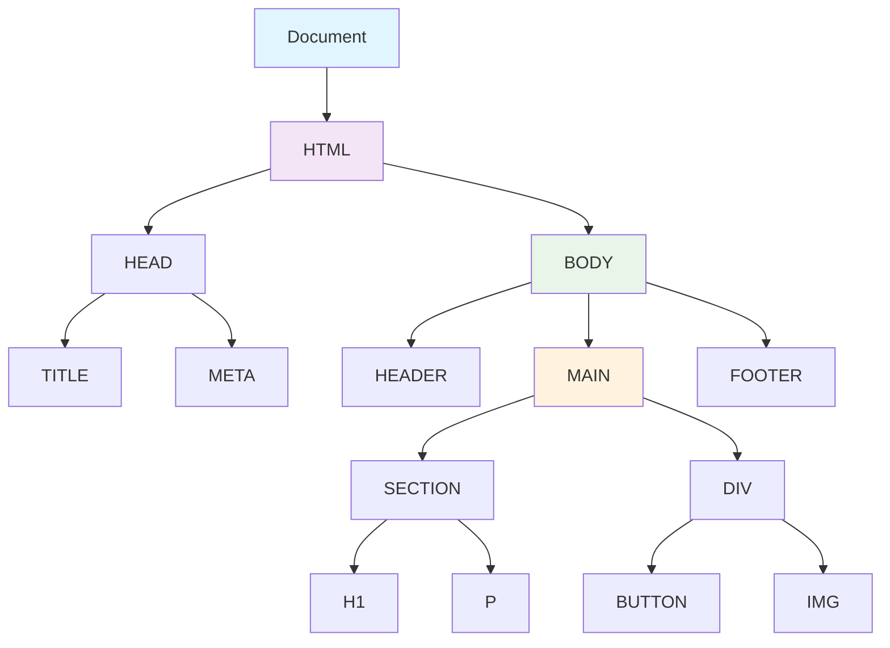
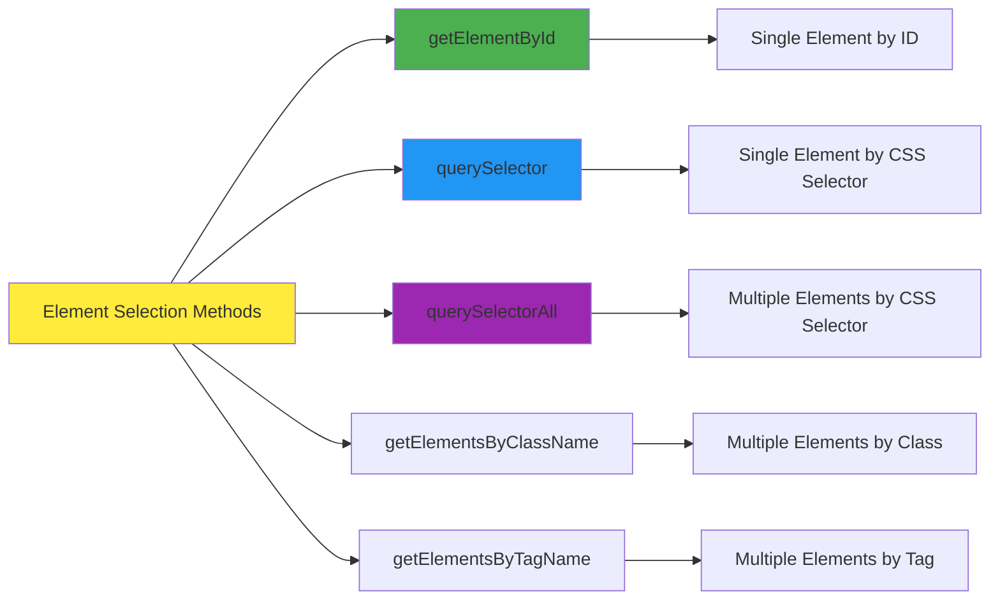
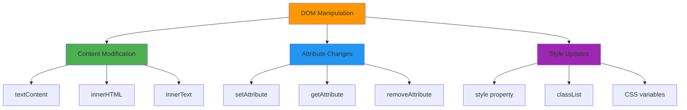
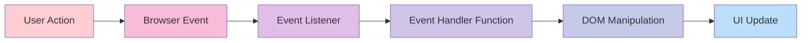
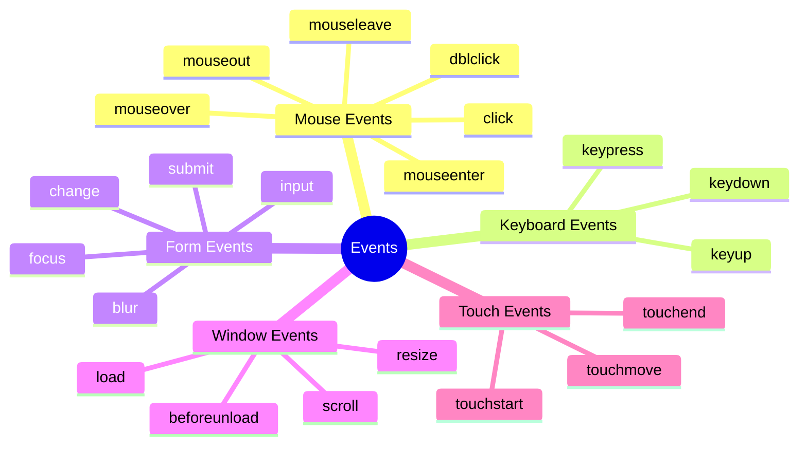
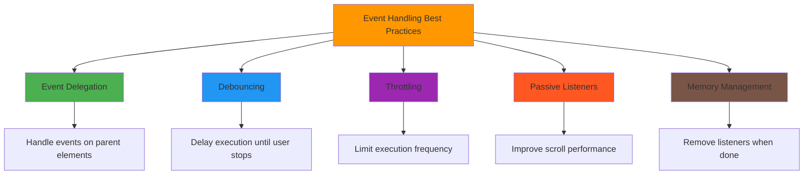
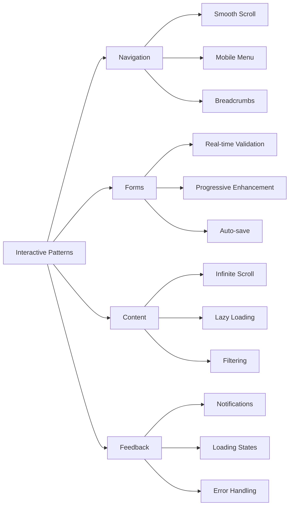
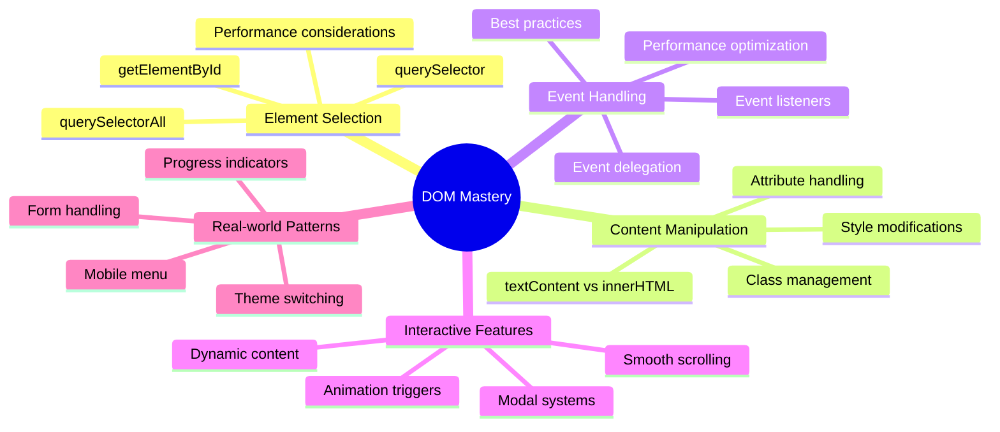

# Session 7: DOM Manipulation and Event Handling 🎭✨

## 🎯 Session Overview

**Prerequisites:** HTML, CSS, JavaScript Basics

---

## 📚 Learning Objectives

By the end of this session, mentees will be able to:

- ✅ Understand the DOM structure and how JavaScript interacts with HTML
- ✅ Select and manipulate HTML elements using JavaScript
- ✅ Modify content, attributes, and styles dynamically
- ✅ Handle user interactions with event listeners
- ✅ Create interactive features like modals and smooth scrolling
- ✅ Apply best practices for event handling

---

## 🌐 Understanding the DOM (Document Object Model)

### What is the DOM?

The DOM is like a **family tree** of your HTML document that JavaScript can read and modify in real-time.



### Real-World Analogy

Think of the DOM like a **company organization chart**:

- **Document** = Company
- **HTML** = CEO
- **Head/Body** = Departments
- **Elements** = Employees

JavaScript is like the **HR department** that can:

- 👀 Find any employee (select elements)
- 📝 Change their job description (modify content)
- 🎨 Update their office (change styles)
- 📞 Set up communication (add event listeners)

---

## 🎯 Element Selection Methods

### The JavaScript Element Selection Toolkit



### Selection Methods Comparison

| Method | Returns | Speed | Use Case | Example |
|--------|---------|-------|----------|---------|
| `getElementById()` | Single Element | ⚡ Fastest | Unique elements | `document.getElementById('header')` |
| `querySelector()` | Single Element | 🚀 Fast | CSS selectors | `document.querySelector('.btn-primary')` |
| `querySelectorAll()` | NodeList | 🐌 Slower | Multiple elements | `document.querySelectorAll('.card')` |
| `getElementsByClassName()` | HTMLCollection | 🚀 Fast | Class-based | `document.getElementsByClassName('nav-item')` |

### Practical Selection Examples

```javascript
// ===================================
// ELEMENT SELECTION EXAMPLES
// ===================================

// 1. Select by ID (most common)
const header = document.getElementById('main-header');
const loginForm = document.getElementById('loginForm');

// 2. Select by CSS selector (most flexible)
const firstButton = document.querySelector('.btn');
const submitButton = document.querySelector('button[type="submit"]');
const navLinks = document.querySelector('#navbar .nav-links');

// 3. Select multiple elements
const allButtons = document.querySelectorAll('.btn');
const allInputs = document.querySelectorAll('input');
const allCards = document.querySelectorAll('.project-card');

// 4. Select by class name (returns live collection)
const menuItems = document.getElementsByClassName('menu-item');

// 5. Select by tag name
const allImages = document.getElementsByTagName('img');
const allParagraphs = document.getElementsByTagName('p');

// Modern preferred approach - using querySelector for everything
const specificElement = document.querySelector('#content .article:first-child h2');
```

---

## 🎨 Content and Style Manipulation

### The Three Pillars of DOM Manipulation



### Content Manipulation Examples

```javascript
// ===================================
// CONTENT MANIPULATION
// ===================================

// Get elements for demonstration
const title = document.getElementById('page-title');
const description = document.querySelector('.description');
const productList = document.getElementById('product-list');

// 1. Change text content (safe, no HTML)
title.textContent = 'Welcome to Our Store!';

// 2. Change HTML content (allows HTML tags)
description.innerHTML = '<strong>Amazing products</strong> at <em>great prices</em>!';

// 3. Get current content
const currentTitle = title.textContent;
const currentHTML = description.innerHTML;

// 4. Add content to existing content
description.innerHTML += ' <span class="highlight">Limited time offer!</span>';

// 5. Clear content
productList.innerHTML = ''; // Clears all child elements

// ===================================
// ATTRIBUTE MANIPULATION
// ===================================

const profileImage = document.getElementById('profile-img');
const downloadLink = document.querySelector('.download-btn');

// Change image source
profileImage.setAttribute('src', 'images/new-profile.jpg');
profileImage.setAttribute('alt', 'Updated profile picture');

// Update link attributes
downloadLink.setAttribute('href', 'files/updated-resume.pdf');
downloadLink.setAttribute('download', 'john-doe-resume.pdf');

// Get attribute values
const currentSrc = profileImage.getAttribute('src');
const linkHref = downloadLink.getAttribute('href');

// Remove attributes
profileImage.removeAttribute('title');

// Check if attribute exists
if (downloadLink.hasAttribute('download')) {
    console.log('This link will download the file');
}

// ===================================
// STYLE MANIPULATION
// ===================================

const card = document.querySelector('.product-card');
const button = document.getElementById('cta-button');

// Method 1: Direct style property (inline styles)
card.style.backgroundColor = '#f0f8ff';
card.style.border = '2px solid #4a90e2';
card.style.borderRadius = '12px';
card.style.padding = '20px';

// Method 2: CSS classes (recommended approach)
// Add a class
button.classList.add('btn-primary');
button.classList.add('btn-large');

// Remove a class
button.classList.remove('btn-secondary');

// Toggle a class (add if not present, remove if present)
button.classList.toggle('active');

// Check if class exists
if (button.classList.contains('btn-primary')) {
    console.log('Button has primary styling');
}

// Replace a class
button.classList.replace('btn-small', 'btn-large');

// Method 3: CSS Custom Properties (CSS Variables)
document.documentElement.style.setProperty('--main-color', '#ff6b6b');
document.documentElement.style.setProperty('--font-size', '18px');
```

---

## 🎪 Event Handling Fundamentals

### The Event Ecosystem



### Common Event Types



### Event Listener Setup Patterns

```javascript
// ===================================
// EVENT LISTENER PATTERNS
// ===================================

// Pattern 1: Basic event listener
const button = document.getElementById('submit-btn');

button.addEventListener('click', function() {
    console.log('Button was clicked!');
    alert('Form submitted successfully!');
});

// Pattern 2: Arrow function (modern syntax)
const menuToggle = document.querySelector('.menu-toggle');

menuToggle.addEventListener('click', () => {
    const navbar = document.querySelector('.navbar');
    navbar.classList.toggle('active');
});

// Pattern 3: Named function (reusable)
function handleFormSubmit(event) {
    event.preventDefault(); // Prevent default form submission
    
    const formData = new FormData(event.target);
    console.log('Form data:', Object.fromEntries(formData));
    
    // Show success message
    showSuccessMessage('Form submitted successfully!');
}

const contactForm = document.getElementById('contact-form');
contactForm.addEventListener('submit', handleFormSubmit);

// Pattern 4: Multiple event listeners
const interactiveCard = document.querySelector('.card');

interactiveCard.addEventListener('mouseenter', () => {
    interactiveCard.style.transform = 'translateY(-5px)';
    interactiveCard.style.boxShadow = '0 10px 25px rgba(0,0,0,0.15)';
});

interactiveCard.addEventListener('mouseleave', () => {
    interactiveCard.style.transform = 'translateY(0)';
    interactiveCard.style.boxShadow = '0 2px 10px rgba(0,0,0,0.1)';
});

// Pattern 5: Event delegation (for dynamic content)
const todoList = document.getElementById('todo-list');

todoList.addEventListener('click', (event) => {
    if (event.target.classList.contains('delete-btn')) {
        const todoItem = event.target.closest('.todo-item');
        todoItem.remove();
    }
    
    if (event.target.classList.contains('complete-btn')) {
        const todoItem = event.target.closest('.todo-item');
        todoItem.classList.toggle('completed');
    }
});
```

---

## 🎭 Real-World Interactive Examples

### Example 1: Dynamic Theme Switcher

```javascript
// ===================================
// THEME SWITCHER IMPLEMENTATION
// ===================================

function createThemeSwitcher() {
    const themeToggle = document.getElementById('theme-toggle');
    const body = document.body;
    
    // Check for saved theme preference
    const savedTheme = localStorage.getItem('theme') || 'light';
    body.setAttribute('data-theme', savedTheme);
    
    themeToggle.addEventListener('click', () => {
        const currentTheme = body.getAttribute('data-theme');
        const newTheme = currentTheme === 'light' ? 'dark' : 'light';
        
        // Update theme
        body.setAttribute('data-theme', newTheme);
        
        // Save preference
        localStorage.setItem('theme', newTheme);
        
        // Update button text
        themeToggle.textContent = newTheme === 'light' ? '🌙' : '☀️';
        
        // Add smooth transition
        body.style.transition = 'background-color 0.3s ease, color 0.3s ease';
    });
}

// Initialize theme switcher when page loads
document.addEventListener('DOMContentLoaded', createThemeSwitcher);
```

### Example 2: Interactive Counter with Animation

```javascript
// ===================================
// ANIMATED COUNTER COMPONENT
// ===================================

function createCounter() {
    const counter = document.getElementById('counter');
    const increaseBtn = document.getElementById('increase');
    const decreaseBtn = document.getElementById('decrease');
    const resetBtn = document.getElementById('reset');
    
    let count = 0;
    
    function updateCounter(newCount) {
        // Add animation class
        counter.classList.add('updating');
        
        // Update the number
        setTimeout(() => {
            counter.textContent = newCount;
            count = newCount;
            
            // Update color based on value
            if (count > 0) {
                counter.style.color = '#27ae60';
            } else if (count < 0) {
                counter.style.color = '#e74c3c';
            } else {
                counter.style.color = '#34495e';
            }
            
            // Remove animation class
            counter.classList.remove('updating');
        }, 150);
    }
    
    increaseBtn.addEventListener('click', () => {
        updateCounter(count + 1);
    });
    
    decreaseBtn.addEventListener('click', () => {
        updateCounter(count - 1);
    });
    
    resetBtn.addEventListener('click', () => {
        updateCounter(0);
    });
    
    // Keyboard shortcuts
    document.addEventListener('keydown', (event) => {
        if (event.key === 'ArrowUp') {
            updateCounter(count + 1);
        } else if (event.key === 'ArrowDown') {
            updateCounter(count - 1);
        } else if (event.key === 'r' || event.key === 'R') {
            updateCounter(0);
        }
    });
}

document.addEventListener('DOMContentLoaded', createCounter);
```

---

## 🚀 Hands-On Practice: Interactive Portfolio Features

### Project Structure

```
portfolio-enhanced/
├── index.html
├── css/
│   ├── styles.css
│   └── animations.css
├── js/
│   ├── smooth-scroll.js
│   ├── modal.js
│   └── dynamic-content.js
└── images/
    └── projects/
```

### Feature 1: Smooth Scrolling Navigation

```javascript
// ===================================
// SMOOTH SCROLLING IMPLEMENTATION
// ===================================

function initSmoothScrolling() {
    // Get all navigation links
    const navLinks = document.querySelectorAll('a[href^="#"]');
    
    navLinks.forEach(link => {
        link.addEventListener('click', (event) => {
            event.preventDefault();
            
            const targetId = link.getAttribute('href').substring(1);
            const targetElement = document.getElementById(targetId);
            
            if (targetElement) {
                // Calculate offset for fixed header
                const headerHeight = document.querySelector('.navbar').offsetHeight;
                const targetPosition = targetElement.offsetTop - headerHeight;
                
                // Smooth scroll to target
                window.scrollTo({
                    top: targetPosition,
                    behavior: 'smooth'
                });
                
                // Update active navigation
                updateActiveNavigation(targetId);
            }
        });
    });
    
    // Update active navigation based on scroll position
    function updateActiveNavigation(activeId) {
        navLinks.forEach(link => {
            link.classList.remove('active');
            if (link.getAttribute('href') === `#${activeId}`) {
                link.classList.add('active');
            }
        });
    }
    
    // Auto-update navigation on scroll
    window.addEventListener('scroll', () => {
        const sections = document.querySelectorAll('section[id]');
        const scrollPosition = window.scrollY + 100;
        
        sections.forEach(section => {
            const sectionTop = section.offsetTop;
            const sectionHeight = section.offsetHeight;
            
            if (scrollPosition >= sectionTop && scrollPosition < sectionTop + sectionHeight) {
                updateActiveNavigation(section.id);
            }
        });
    });
}

// Initialize smooth scrolling
document.addEventListener('DOMContentLoaded', initSmoothScrolling);
```

### Feature 2: Modal System

```javascript
// ===================================
// MODAL SYSTEM IMPLEMENTATION
// ===================================

class ModalManager {
    constructor() {
        this.activeModal = null;
        this.initializeModals();
        this.setupEventListeners();
    }
    
    initializeModals() {
        // Create modal overlay if it doesn't exist
        if (!document.getElementById('modal-overlay')) {
            const overlay = document.createElement('div');
            overlay.id = 'modal-overlay';
            overlay.className = 'modal-overlay';
            document.body.appendChild(overlay);
        }
    }
    
    setupEventListeners() {
        // Handle modal triggers
        document.addEventListener('click', (event) => {
            const trigger = event.target.closest('[data-modal]');
            if (trigger) {
                event.preventDefault();
                const modalId = trigger.getAttribute('data-modal');
                this.openModal(modalId);
            }
            
            // Handle close buttons
            const closeBtn = event.target.closest('.modal-close');
            if (closeBtn) {
                this.closeModal();
            }
            
            // Close on overlay click
            if (event.target.classList.contains('modal-overlay')) {
                this.closeModal();
            }
        });
        
        // Close modal with Escape key
        document.addEventListener('keydown', (event) => {
            if (event.key === 'Escape' && this.activeModal) {
                this.closeModal();
            }
        });
    }
    
    openModal(modalId) {
        const modal = document.getElementById(modalId);
        const overlay = document.getElementById('modal-overlay');
        
        if (modal && overlay) {
            // Prevent body scroll
            document.body.style.overflow = 'hidden';
            
            // Show modal
            overlay.classList.add('active');
            modal.classList.add('active');
            
            // Focus management
            const firstFocusable = modal.querySelector('button, input, select, textarea, a[href]');
            if (firstFocusable) {
                firstFocusable.focus();
            }
            
            this.activeModal = modal;
            
            // Trigger custom event
            modal.dispatchEvent(new CustomEvent('modalOpened'));
        }
    }
    
    closeModal() {
        const overlay = document.getElementById('modal-overlay');
        
        if (this.activeModal && overlay) {
            // Re-enable body scroll
            document.body.style.overflow = '';
            
            // Hide modal
            overlay.classList.remove('active');
            this.activeModal.classList.remove('active');
            
            // Trigger custom event
            this.activeModal.dispatchEvent(new CustomEvent('modalClosed'));
            
            this.activeModal = null;
        }
    }
}

// Initialize modal system
const modalManager = new ModalManager();

// Example: Project details modal
function setupProjectModals() {
    document.addEventListener('modalOpened', (event) => {
        const modal = event.target;
        if (modal.classList.contains('project-modal')) {
            // Load project details dynamically
            loadProjectDetails(modal);
        }
    });
}

function loadProjectDetails(modal) {
    const projectId = modal.getAttribute('data-project-id');
    const projectData = getProjectData(projectId);
    
    if (projectData) {
        modal.querySelector('.project-title').textContent = projectData.title;
        modal.querySelector('.project-description').innerHTML = projectData.description;
        modal.querySelector('.project-tech').innerHTML = projectData.technologies.map(tech => 
            `<span class="tech-tag">${tech}</span>`
        ).join('');
    }
}
```

### Feature 3: Dynamic Content Loading

```javascript
// ===================================
// DYNAMIC CONTENT SYSTEM
// ===================================

class ContentManager {
    constructor() {
        this.cache = new Map();
        this.setupDynamicLoading();
    }
    
    setupDynamicLoading() {
        // Handle dynamic content triggers
        document.addEventListener('click', (event) => {
            const trigger = event.target.closest('[data-load-content]');
            if (trigger) {
                event.preventDefault();
                const contentType = trigger.getAttribute('data-load-content');
                const target = trigger.getAttribute('data-target');
                this.loadContent(contentType, target, trigger);
            }
        });
    }
    
    async loadContent(contentType, targetSelector, triggerElement) {
        const targetElement = document.querySelector(targetSelector);
        if (!targetElement) return;
        
        // Show loading state
        this.showLoadingState(targetElement, triggerElement);
        
        try {
            let content;
            
            // Check cache first
            if (this.cache.has(contentType)) {
                content = this.cache.get(contentType);
            } else {
                // Simulate API call or fetch content
                content = await this.fetchContent(contentType);
                this.cache.set(contentType, content);
            }
            
            // Render content with animation
            this.renderContent(targetElement, content, triggerElement);
            
        } catch (error) {
            this.showErrorState(targetElement, error);
        }
    }
    
    showLoadingState(targetElement, triggerElement) {
        triggerElement.disabled = true;
        triggerElement.textContent = 'Loading...';
        
        targetElement.innerHTML = `
            <div class="loading-spinner">
                <div class="spinner"></div>
                <p>Loading content...</p>
            </div>
        `;
    }
    
    async fetchContent(contentType) {
        // Simulate network delay
        await this.delay(1000);
        
        // Mock content based on type
        const contentTemplates = {
            'latest-projects': this.generateProjectCards(),
            'testimonials': this.generateTestimonials(),
            'blog-posts': this.generateBlogPosts()
        };
        
        return contentTemplates[contentType] || '<p>Content not found</p>';
    }
    
    renderContent(targetElement, content, triggerElement) {
        // Fade out current content
        targetElement.style.opacity = '0';
        
        setTimeout(() => {
            targetElement.innerHTML = content;
            
            // Fade in new content
            targetElement.style.opacity = '1';
            
            // Reset trigger button
            triggerElement.disabled = false;
            triggerElement.textContent = 'Load More';
            
            // Trigger animations for new content
            this.animateNewContent(targetElement);
            
        }, 300);
    }
    
    animateNewContent(container) {
        const items = container.querySelectorAll('.dynamic-item');
        items.forEach((item, index) => {
            item.style.opacity = '0';
            item.style.transform = 'translateY(20px)';
            
            setTimeout(() => {
                item.style.transition = 'opacity 0.5s ease, transform 0.5s ease';
                item.style.opacity = '1';
                item.style.transform = 'translateY(0)';
            }, index * 100);
        });
    }
    
    generateProjectCards() {
        const projects = [
            { title: 'E-commerce Platform', tech: 'React, Node.js', image: 'project4.jpg' },
            { title: 'Social Media Dashboard', tech: 'Vue.js, Firebase', image: 'project5.jpg' },
            { title: 'Task Management App', tech: 'Angular, MongoDB', image: 'project6.jpg' }
        ];
        
        return projects.map(project => `
            <div class="project-card dynamic-item">
                
                <div class="project-info">
                    <h3>${project.title}</h3>
                    <p>Built with ${project.tech}</p>
                    <div class="project-links">
                        <a href="#" class="btn-secondary">View Demo</a>
                        <a href="#" class="btn-outline">GitHub</a>
                    </div>
                </div>
            </div>
        `).join('');
    }
    
    delay(ms) {
        return new Promise(resolve => setTimeout(resolve, ms));
    }
}

// Initialize content manager
const contentManager = new ContentManager();
```

---

## 🎯 Event Handling Best Practices

### Performance Optimization Patterns



### Advanced Event Handling Techniques

```javascript
// ===================================
// ADVANCED EVENT HANDLING PATTERNS
// ===================================

// 1. DEBOUNCING - Wait for user to stop typing
function debounce(func, delay) {
    let timeoutId;
    return function (...args) {
        clearTimeout(timeoutId);
        timeoutId = setTimeout(() => func.apply(this, args), delay);
    };
}

// Search input with debouncing
const searchInput = document.getElementById('search');
const handleSearch = debounce((event) => {
    const query = event.target.value;
    if (query.length > 2) {
        performSearch(query);
    }
}, 300);

searchInput.addEventListener('input', handleSearch);

// 2. THROTTLING - Limit execution frequency
function throttle(func, limit) {
    let inThrottle;
    return function (...args) {
        if (!inThrottle) {
            func.apply(this, args);
            inThrottle = true;
            setTimeout(() => inThrottle = false, limit);
        }
    };
}

// Scroll event with throttling
const handleScroll = throttle(() => {
    const scrollPercent = (window.scrollY / (document.body.scrollHeight - window.innerHeight)) * 100;
    updateProgressBar(scrollPercent);
}, 100);

window.addEventListener('scroll', handleScroll);

// 3. EVENT DELEGATION - Handle events efficiently
function setupEventDelegation() {
    const container = document.getElementById('dynamic-content');
    
    container.addEventListener('click', (event) => {
        // Handle different types of clicks
        const target = event.target;
        
        if (target.matches('.like-btn')) {
            handleLike(target);
        } else if (target.matches('.share-btn')) {
            handleShare(target);
        } else if (target.matches('.delete-btn')) {
            handleDelete(target);
        }
    });
}

// 4. PASSIVE EVENT LISTENERS - Better performance
window.addEventListener('scroll', handleScroll, { passive: true });
window.addEventListener('touchstart', handleTouch, { passive: true });

// 5. CLEANUP AND MEMORY MANAGEMENT
class ComponentManager {
    constructor() {
        this.eventListeners = [];
    }
    
    addListener(element, event, handler, options = {}) {
        element.addEventListener(event, handler, options);
        this.eventListeners.push({ element, event, handler, options });
    }
    
    removeAllListeners() {
        this.eventListeners.forEach(({ element, event, handler, options }) => {
            element.removeEventListener(event, handler, options);
        });
        this.eventListeners = [];
    }
    
    destroy() {
        this.removeAllListeners();
    }
}
```

---

## 📱 User Interaction Patterns

### Common UI Patterns Implementation



### Mobile Menu Implementation

```javascript
// ===================================
// MOBILE MENU PATTERN
// ===================================

class MobileMenu {
    constructor() {
        this.menuToggle = document.querySelector('.menu-toggle');
        this.menu = document.querySelector('.mobile-menu');
        this.menuItems = document.querySelectorAll('.mobile-menu a');
        this.isOpen = false;
        
        this.init();
    }
    
    init() {
        this.menuToggle.addEventListener('click', () => this.toggle());
        
        // Close menu when clicking menu items
        this.menuItems.forEach(item => {
            item.addEventListener('click', () => this.close());
        });
        
        // Close menu on outside click
        document.addEventListener('click', (event) => {
            if (this.isOpen && !this.menu.contains(event.target) && !this.menuToggle.contains(event.target)) {
                this.close();
            }
        });
        
        // Handle escape key
        document.addEventListener('keydown', (event) => {
            if (event.key === 'Escape' && this.isOpen) {
                this.close();
            }
        });
    }
    
    toggle() {
        this.isOpen ? this.close() : this.open();
    }
    
    open() {
        this.menu.classList.add('active');
        this.menuToggle.classList.add('active');
        document.body.style.overflow = 'hidden';
        this.isOpen = true;
        
        // Focus first menu item for accessibility
        this.menuItems[0]?.focus();
    }
    
    close() {
        this.menu.classList.remove('active');
        this.menuToggle.classList.remove('active');
        document.body.style.overflow = '';
        this.isOpen = false;
    }
}

// Initialize mobile menu
new MobileMenu();
```

---

## 🧪 Testing and Debugging DOM Manipulation

### Debugging Techniques

```javascript
// ===================================
// DEBUGGING AND TESTING UTILITIES
// ===================================

// 1. Element inspection helper
function inspectElement(selector) {
    const element = document.querySelector(selector);
    if (element) {
        console.log('Element found:', element);
        console.log('Text content:', element.textContent);
        console.log('HTML content:', element.innerHTML);
        console.log('Attributes:', [...element.attributes].map(attr => `${attr.name}="${attr.value}"`));
        console.log('Classes:', [...element.classList]);
        console.log('Computed styles:', window.getComputedStyle(element));
    } else {
        console.error('Element not found:', selector);
    }
}

// Usage: inspectElement('.my-button')

// 2. Event listener tracker
const eventTracker = {
    listeners: new Map(),
    
    track(element, event, handler) {
        const key = `${element.tagName}-${event}`;
        if (!this.listeners.has(key)) {
            this.listeners.set(key, []);
        }
        this.listeners.get(key).push(handler);
        element.addEventListener(event, handler);
    },
    
    showAll() {
        console.log('Active event listeners:', this.listeners);
    }
};

// 3. Performance monitoring
function measureDOMOperation(operation, label) {
    console.time(label);
    const result = operation();
    console.timeEnd(label);
    return result;
}

// Usage example:
// measureDOMOperation(() => {
//     document.querySelectorAll('.item').forEach(item => {
//         item.style.backgroundColor = 'red';
//     });
// }, 'Style update operation');

// 4. Memory leak detector
class MemoryLeakDetector {
    constructor() {
        this.elements = new WeakSet();
        this.listeners = [];
    }
    
    trackElement(element) {
        this.elements.add(element);
    }
    
    trackListener(element, event, handler) {
        this.listeners.push({ element, event, handler });
        element.addEventListener(event, handler);
    }
    
    cleanup() {
        this.listeners.forEach(({ element, event, handler }) => {
            element.removeEventListener(event, handler);
        });
        this.listeners = [];
        console.log('Memory cleaned up');
    }
}
```

---

## 🎯 Complete Hands-On Project: Interactive Portfolio Dashboard

### HTML Structure for Enhanced Portfolio

```html
<!DOCTYPE html>
<html lang="en">
<head>
    <meta charset="UTF-8">
    <meta name="viewport" content="width=device-width, initial-scale=1.0">
    <title>Interactive Portfolio - John Doe</title>
    <link rel="stylesheet" href="css/styles.css">
    <link rel="stylesheet" href="css/animations.css">
</head>
<body data-theme="light">
    <!-- Enhanced Navigation -->
    <nav class="navbar" id="main-navbar">
        <div class="nav-container">
            <a href="#" class="nav-brand">JD</a>
            
            <!-- Theme Toggle -->
            <button id="theme-toggle" class="theme-toggle" aria-label="Toggle theme">🌙</button>
            
            <!-- Mobile Menu Toggle -->
            <button class="menu-toggle" aria-label="Toggle menu">
                <span></span>
                <span></span>
                <span></span>
            </button>
            
            <!-- Navigation Links -->
            <ul class="nav-menu">
                <li><a href="#hero" class="nav-link active">Home</a></li>
                <li><a href="#about" class="nav-link">About</a></li>
                <li><a href="#projects" class="nav-link">Projects</a></li>
                <li><a href="#skills" class="nav-link">Skills</a></li>
                <li><a href="#contact" class="nav-link">Contact</a></li>
            </ul>
        </div>
        
        <!-- Progress Bar -->
        <div class="scroll-progress" id="scroll-progress"></div>
    </nav>

    <!-- Hero Section with Interactive Elements -->
    <section id="hero" class="hero">
        <div class="hero-content">
            <h1 class="hero-title">
                <span class="typing-text">Hi, I'm John Doe</span>
            </h1>
            <p class="hero-subtitle">
                <span id="role-rotator">Full-Stack Developer</span>
            </p>
            <div class="hero-buttons">
                <a href="#projects" class="cta-button primary">View My Work</a>
                <button class="cta-button secondary" data-modal="contact-modal">Get In Touch</button>
            </div>
        </div>
        
        <!-- Interactive Background -->
        <div class="hero-background">
            <canvas id="particle-canvas"></canvas>
        </div>
    </section>

    <!-- About Section with Counter Animation -->
    <section id="about" class="about">
        <div class="container">
            <h2>About Me</h2>
            <div class="about-content">
                <div class="about-text">
                    <p>Passionate developer with <span id="experience-counter">0</span> years of experience...</p>
                </div>
                
                <!-- Animated Stats -->
                <div class="stats-grid">
                    <div class="stat-item">
                        <span class="stat-number" data-target="50">0</span>
                        <span class="stat-label">Projects Completed</span>
                    </div>
                    <div class="stat-item">
                        <span class="stat-number" data-target="25">0</span>
                        <span class="stat-label">Happy Clients</span>
                    </div>
                    <div class="stat-item">
                        <span class="stat-number" data-target="1000">0</span>
                        <span class="stat-label">Coffee Cups</span>
                    </div>
                </div>
            </div>
        </div>
    </section>

    <!-- Projects Section with Filtering -->
    <section id="projects" class="projects">
        <div class="container">
            <h2>My Projects</h2>
            
            <!-- Project Filter Buttons -->
            <div class="filter-buttons">
                <button class="filter-btn active" data-filter="all">All</button>
                <button class="filter-btn" data-filter="web">Web Apps</button>
                <button class="filter-btn" data-filter="mobile">Mobile</button>
                <button class="filter-btn" data-filter="design">Design</button>
            </div>
            
            <!-- Project Grid -->
            <div class="project-grid" id="project-grid">
                <!-- Projects will be loaded dynamically -->
            </div>
            
            <!-- Load More Button -->
            <div class="text-center">
                <button class="btn-secondary" data-load-content="latest-projects" data-target="#project-grid">
                    Load More Projects
                </button>
            </div>
        </div>
    </section>

    <!-- Skills Section with Interactive Progress Bars -->
    <section id="skills" class="skills">
        <div class="container">
            <h2>My Skills</h2>
            <div class="skills-grid">
                <div class="skill-category">
                    <h3>Frontend</h3>
                    <div class="skill-item">
                        <span>HTML/CSS</span>
                        <div class="skill-bar">
                            <div class="skill-progress" data-skill="95"></div>
                        </div>
                    </div>
                    <div class="skill-item">
                        <span>JavaScript</span>
                        <div class="skill-bar">
                            <div class="skill-progress" data-skill="90"></div>
                        </div>
                    </div>
                    <div class="skill-item">
                        <span>React</span>
                        <div class="skill-bar">
                            <div class="skill-progress" data-skill="85"></div>
                        </div>
                    </div>
                </div>
                
                <div class="skill-category">
                    <h3>Backend</h3>
                    <div class="skill-item">
                        <span>Node.js</span>
                        <div class="skill-bar">
                            <div class="skill-progress" data-skill="80"></div>
                        </div>
                    </div>
                    <div class="skill-item">
                        <span>Python</span>
                        <div class="skill-bar">
                            <div class="skill-progress" data-skill="75"></div>
                        </div>
                    </div>
                </div>
            </div>
        </div>
    </section>

    <!-- Contact Modal -->
    <div id="contact-modal" class="modal">
        <div class="modal-content">
            <div class="modal-header">
                <h3>Get In Touch</h3>
                <button class="modal-close">&times;</button>
            </div>
            <div class="modal-body">
                <form id="quick-contact-form">
                    <div class="form-group">
                        <input type="text" id="quick-name" placeholder="Your Name" required>
                    </div>
                    <div class="form-group">
                        <input type="email" id="quick-email" placeholder="Your Email" required>
                    </div>
                    <div class="form-group">
                        <textarea id="quick-message" placeholder="Your Message" rows="4" required></textarea>
                    </div>
                    <button type="submit" class="btn-primary">Send Message</button>
                </form>
            </div>
        </div>
    </div>

    <!-- Modal Overlay -->
    <div id="modal-overlay" class="modal-overlay"></div>

    <!-- Notification Container -->
    <div id="notification-container" class="notification-container"></div>

    <!-- Back to Top Button -->
    <button id="back-to-top" class="back-to-top" aria-label="Back to top">↑</button>

    <!-- Scripts -->
    <script src="js/smooth-scroll.js"></script>
    <script src="js/modal.js"></script>
    <script src="js/dynamic-content.js"></script>
    <script src="js/animations.js"></script>
    <script src="js/main.js"></script>
</body>
</html>
```

### Main JavaScript Implementation

```javascript
// ===================================
// MAIN APPLICATION CONTROLLER
// ===================================

class PortfolioApp {
    constructor() {
        this.components = {};
        this.init();
    }
    
    init() {
        // Wait for DOM to be ready
        if (document.readyState === 'loading') {
            document.addEventListener('DOMContentLoaded', () => this.initializeComponents());
        } else {
            this.initializeComponents();
        }
    }
    
    initializeComponents() {
        console.log('🚀 Initializing Portfolio App...');
        
        // Initialize core components
        this.components.themeManager = new ThemeManager();
        this.components.navigationManager = new NavigationManager();
        this.components.animationManager = new AnimationManager();
        this.components.modalManager = new ModalManager();
        this.components.notificationManager = new NotificationManager();
        
        // Initialize interactive features
        this.setupInteractiveElements();
        this.setupProjectFiltering();
        this.setupSkillAnimations();
        this.setupFormHandling();
        
        console.log('✅ Portfolio App initialized successfully!');
    }
    
    setupInteractiveElements() {
        // Back to top button
        const backToTop = document.getElementById('back-to-top');
        const scrollProgress = document.getElementById('scroll-progress');
        
        window.addEventListener('scroll', throttle(() => {
            const scrolled = window.pageYOffset;
            const maxHeight = document.body.scrollHeight - window.innerHeight;
            const scrollPercentage = (scrolled / maxHeight) * 100;
            
            // Update progress bar
            scrollProgress.style.width = `${scrollPercentage}%`;
            
            // Show/hide back to top button
            if (scrolled > 300) {
                backToTop.classList.add('visible');
            } else {
                backToTop.classList.remove('visible');
            }
        }, 100));
        
        // Back to top functionality
        backToTop.addEventListener('click', () => {
            window.scrollTo({ top: 0, behavior: 'smooth' });
        });
    }
    
    setupProjectFiltering() {
        const filterButtons = document.querySelectorAll('.filter-btn');
        const projectGrid = document.getElementById('project-grid');
        
        // Load initial projects
        this.loadProjects('all');
        
        filterButtons.forEach(button => {
            button.addEventListener('click', () => {
                // Update active button
                filterButtons.forEach(btn => btn.classList.remove('active'));
                button.classList.add('active');
                
                // Filter projects
                const filter = button.getAttribute('data-filter');
                this.filterProjects(filter);
            });
        });
    }
    
    loadProjects(category = 'all') {
        const projectGrid = document.getElementById('project-grid');
        const projects = this.getProjectData(category);
        
        projectGrid.innerHTML = projects.map(project => `
            <div class="project-card" data-category="${project.category}">
                <div class="project-image">
                    
                    <div class="project-overlay">
                        <button class="btn-primary" data-modal="project-modal" data-project="${project.id}">
                            View Details
                        </button>
                    </div>
                </div>
                <div class="project-info">
                    <h3>${project.title}</h3>
                    <p>${project.description}</p>
                    <div class="project-tech">
                        ${project.technologies.map(tech => `<span class="tech-tag">${tech}</span>`).join('')}
                    </div>
                </div>
            </div>
        `).join('');
        
        // Animate in new projects
        this.components.animationManager.animateProjectCards();
    }
    
    filterProjects(category) {
        const projectCards = document.querySelectorAll('.project-card');
        
        projectCards.forEach(card => {
            const cardCategory = card.getAttribute('data-category');
            const shouldShow = category === 'all' || cardCategory === category;
            
            if (shouldShow) {
                card.style.display = 'block';
                card.classList.add('fade-in');
            } else {
                card.style.display = 'none';
                card.classList.remove('fade-in');
            }
        });
    }
    
    setupSkillAnimations() {
        const observerOptions = {
            threshold: 0.5,
            rootMargin: '0px 0px -100px 0px'
        };
        
        const skillObserver = new IntersectionObserver((entries) => {
            entries.forEach(entry => {
                if (entry.isIntersecting) {
                    this.animateSkillBars(entry.target);
                    skillObserver.unobserve(entry.target);
                }
            });
        }, observerOptions);
        
        const skillsSection = document.querySelector('.skills');
        if (skillsSection) {
            skillObserver.observe(skillsSection);
        }
    }
    
    animateSkillBars(skillsSection) {
        const skillBars = skillsSection.querySelectorAll('.skill-progress');
        
        skillBars.forEach((bar, index) => {
            const targetWidth = bar.getAttribute('data-skill');
            
            setTimeout(() => {
                bar.style.width = `${targetWidth}%`;
                bar.style.transition = 'width 1.5s ease-out';
                
                // Add percentage text
                bar.textContent = `${targetWidth}%`;
            }, index * 200);
        });
    }
    
    setupFormHandling() {
        const quickContactForm = document.getElementById('quick-contact-form');
        
        if (quickContactForm) {
            quickContactForm.addEventListener('submit', (event) => {
                event.preventDefault();
                this.handleQuickContact(quickContactForm);
            });
        }
    }
    
    handleQuickContact(form) {
        const formData = new FormData(form);
        const data = Object.fromEntries(formData);
        
        // Simulate form submission
        this.components.notificationManager.show(
            'Message sent successfully! I\'ll get back to you soon.',
            'success'
        );
        
        // Close modal and reset form
        this.components.modalManager.closeModal();
        form.reset();
        
        // Log form data (in real app, send to server)
        console.log('Contact form submitted:', data);
    }
    
    getProjectData(category) {
        const allProjects = [
            {
                id: 'ecommerce',
                title: 'E-commerce Platform',
                description: 'Modern shopping platform with React and Node.js',
                image: 'images/projects/ecommerce.jpg',
                category: 'web',
                technologies: ['React', 'Node.js', 'MongoDB']
            },
            {
                id: 'mobile-app',
                title: 'Task Management Mobile App',
                description: 'Cross-platform mobile app built with React Native',
                image: 'images/projects/mobile-app.jpg',
                category: 'mobile',
                technologies: ['React Native', 'Firebase']
            },
            {
                id: 'dashboard',
                title: 'Analytics Dashboard',
                description: 'Real-time data visualization dashboard',
                image: 'images/projects/dashboard.jpg',
                category: 'web',
                technologies: ['Vue.js', 'D3.js', 'Python']
            },
            {
                id: 'brand-design',
                title: 'Brand Identity Design',
                description: 'Complete brand identity for tech startup',
                image: 'images/projects/brand.jpg',
                category: 'design',
                technologies: ['Figma', 'Illustrator', 'Photoshop']
            }
        ];
        
        return category === 'all' ? allProjects : allProjects.filter(p => p.category === category);
    }
}

// Utility functions
function throttle(func, limit) {
    let inThrottle;
    return function (...args) {
        if (!inThrottle) {
            func.apply(this, args);
            inThrottle = true;
            setTimeout(() => inThrottle = false, limit);
        }
    };
}

function debounce(func, delay) {
    let timeoutId;
    return function (...args) {
        clearTimeout(timeoutId);
        timeoutId = setTimeout(() => func.apply(this, args), delay);
    };
}

// Initialize the application
const app = new PortfolioApp();

// Make app globally available for debugging
window.portfolioApp = app;
```

---

## 📋 Session Recap & Next Steps

### Key Takeaways Summary



### Performance Checklist

- ✅ **Use event delegation** for dynamic content
- ✅ **Debounce/throttle** expensive operations
- ✅ **Cache DOM queries** when possible
- ✅ **Remove event listeners** when components are destroyed
- ✅ **Use passive listeners** for scroll/touch events
- ✅ **Batch DOM updates** to avoid layout thrashing

### Action Items for Mentees

- [ ] Complete the interactive portfolio with all features
- [ ] Implement at least 3 different event types
- [ ] Add smooth scrolling navigation
- [ ] Create a working modal system
- [ ] Build dynamic content loading
- [ ] Test interactions on mobile devices
- [ ] Optimize for performance using developer tools
- [ ] Add your own creative interactive features

### Resources for Continued Learning

- 📖 **MDN Web Docs**: Comprehensive DOM API reference
- 🎮 **JavaScript30**: 30-day vanilla JS challenge
- 🔧 **Chrome DevTools**: Master debugging techniques
- 📚 **You Don't Know JS**: Deep dive into JavaScript
- 🎯 **Web APIs**: Explore modern browser capabilities

---

## 💡 Pro Tips from the Field

> **Performance Tip**: Always measure before optimizing. Use Chrome DevTools Performance tab to identify bottlenecks.

> **UX Tip**: Provide immediate feedback for user interactions. Even a simple color change makes the interface feel responsive.

> **Development Tip**: Start with semantic HTML, enhance with CSS, then add JavaScript interactions progressively.

> **Debugging Tip**: Use `console.log()`, `console.table()`, and `console.group()` strategically to understand your code flow.

> **Accessibility Tip**: Always test your interactive elements with keyboard navigation and screen readers.

---

## 🎭 Interactive Demo Challenges

### Challenge 1: Color Palette Generator

Create a tool that generates random color palettes and allows users to:

- Click to generate new colors
- Click individual colors to copy hex codes
- Save favorite palettes to localStorage

### Challenge 2: Real-time Character Counter

Build a text area with:

- Live character count
- Word count
- Reading time estimation
- Warning when approaching limits

### Challenge 3: Image Gallery with Lightbox

Create an interactive image gallery featuring:

- Thumbnail grid
- Lightbox modal for full-size viewing
- Keyboard navigation (arrow keys)
- Smooth transitions

### Challenge 4: Todo List with Drag & Drop

Develop a task management interface with:

- Add/remove tasks
- Mark as complete
- Drag and drop reordering
- Filter by status
- Local storage persistence

---

*Ready to make the web come alive with JavaScript! 🎪✨*
