# Session 8: Modern JavaScript and Project Organization

## 🎯 Session Overview

**Prerequisites:** Basic JavaScript knowledge (variables, functions, arrays, objects)

### Learning Objectives

By the end of this session, students will be able to:

- ✅ Use destructuring to extract data from arrays and objects
- ✅ Apply spread operator and rest parameters effectively
- ✅ Utilize modern array methods (map, filter, reduce)
- ✅ Understand and implement async/await for handling promises
- ✅ Organize code using ES6 modules
- ✅ Write cleaner code with arrow functions

---

## 📚 Table of Contents

1. [Destructuring Assignment](#1-destructuring-assignment)
2. [Spread Operator & Rest Parameters](#2-spread-operator--rest-parameters)
3. [Array Methods: The Power Trio](#3-array-methods-the-power-trio)
4. [Promises & Async/Await](#4-promises--asyncawait)
5. [ES6 Modules](#5-es6-modules)
6. [Arrow Functions & Modern Syntax](#6-arrow-functions--modern-syntax)
7. [Hands-On Project](#7-hands-on-project-refactoring-challenge)

---

## 1. Destructuring Assignment

### 🎭 What is Destructuring?

Destructuring is like **unpacking a suitcase** - you take specific items out and give them names, rather than digging through the entire suitcase every time.

```mermaid
graph LR
    A[📦 Array/Object] --> B[🔓 Destructuring]
    B --> C[📋 Individual Variables]
    
    style A fill:#e1f5fe
    style B fill:#f3e5f5
    style C fill:#e8f5e8
```



### Array Destructuring

#### Old Way vs New Way

```javascript
// 🗿 Old Way (ES5)
const colors = ['red', 'green', 'blue'];
const firstColor = colors[0];
const secondColor = colors[1];
const thirdColor = colors[2];

// ✨ Modern Way (ES6+)
const colors = ['red', 'green', 'blue'];
const [firstColor, secondColor, thirdColor] = colors;

console.log(firstColor); // 'red'
console.log(secondColor); // 'green'
```

#### Real-World Example: API Response

```javascript
// 🌐 Imagine getting user data from an API
const userData = ['John', 'Doe', 28, 'Developer'];

// Extract specific information
const [firstName, lastName, age, profession] = userData;

console.log(`Hello ${firstName} ${lastName}!`);
console.log(`Age: ${age}, Job: ${profession}`);
```

#### Advanced Array Destructuring

```javascript
// Skip elements with commas
const [first, , third] = ['a', 'b', 'c'];
console.log(first, third); // 'a' 'c'

// Default values
const [name = 'Anonymous', age = 0] = ['Alice'];
console.log(name, age); // 'Alice' 0

// Rest elements
const [head, ...tail] = [1, 2, 3, 4, 5];
console.log(head); // 1
console.log(tail); // [2, 3, 4, 5]
```

### Object Destructuring

#### Basic Object Destructuring

```javascript
// 🏠 Real estate example
const house = {
    address: '123 Main St',
    price: 250000,
    bedrooms: 3,
    bathrooms: 2,
    garage: true
};

// Extract specific properties
const { address, price, bedrooms } = house;

console.log(`House at ${address} costs $${price} with ${bedrooms} bedrooms`);
```

#### Renaming Variables

```javascript
const user = {
    id: 1,
    name: 'Sarah',
    email: 'sarah@example.com'
};

// Rename while destructuring
const { name: userName, email: userEmail } = user;
console.log(userName); // 'Sarah'
console.log(userEmail); // 'sarah@example.com'
```

#### Nested Destructuring

```javascript
const employee = {
    personal: {
        name: 'Mike',
        age: 30
    },
    work: {
        position: 'Developer',
        salary: 75000
    }
};

// Extract nested properties
const { 
    personal: { name, age }, 
    work: { position } 
} = employee;

console.log(`${name}, age ${age}, works as ${position}`);
```

### 🎯 Practice Exercise 1

```javascript
// TODO: Use destructuring to solve this
const studentGrades = {
    name: 'Emma',
    subjects: {
        math: 95,
        science: 87,
        english: 92
    },
    extracurricular: ['debate', 'chess', 'coding']
};

// Extract: name, math grade, first extracurricular activity
// Your solution here:
```

---

## 2. Spread Operator & Rest Parameters

### 🌊 The Spread Operator (...)

Think of spread as **"unpacking"** or **"spreading out"** elements.

```mermaid
graph TD
    A[📦 Array] --> B[... Spread]
    B --> C[🎯 Individual Elements]
    B --> D[🔄 Copy Array]
    B --> E[🤝 Merge Arrays]
    
    style A fill:#ffebee
    style B fill:#fff3e0
    style C fill:#f1f8e9
    style D fill:#f1f8e9
    style E fill:#f1f8e9
```



#### Array Spreading

```javascript
// 🍕 Pizza toppings example
const basicToppings = ['cheese', 'tomato'];
const premiumToppings = ['pepperoni', 'mushrooms', 'olives'];

// Combine arrays
const allToppings = [...basicToppings, ...premiumToppings];
console.log(allToppings); 
// ['cheese', 'tomato', 'pepperoni', 'mushrooms', 'olives']

// Copy an array (shallow copy)
const toppingsCopy = [...basicToppings];
console.log(toppingsCopy); // ['cheese', 'tomato']
```

#### Object Spreading

```javascript
// 👤 User profile example
const basicProfile = {
    name: 'Alex',
    age: 25
};

const contactInfo = {
    email: 'alex@example.com',
    phone: '123-456-7890'
};

// Merge objects
const completeProfile = {
    ...basicProfile,
    ...contactInfo,
    isActive: true
};

console.log(completeProfile);
// { name: 'Alex', age: 25, email: 'alex@example.com', phone: '123-456-7890', isActive: true }
```

#### Function Arguments with Spread

```javascript
// 🧮 Calculator example
function calculateSum(a, b, c, d) {
    return a + b + c + d;
}

const numbers = [10, 20, 30, 40];

// Old way
const result1 = calculateSum(numbers[0], numbers[1], numbers[2], numbers[3]);

// Modern way with spread
const result2 = calculateSum(...numbers);
console.log(result2); // 100
```

### 🎭 Rest Parameters

Rest is like **"collecting leftovers"** into an array.

```javascript
// 🛒 Shopping cart example
function addToCart(mainItem, ...otherItems) {
    console.log(`Main item: ${mainItem}`);
    console.log(`Other items: ${otherItems.join(', ')}`);
    return [mainItem, ...otherItems];
}

const cart = addToCart('laptop', 'mouse', 'keyboard', 'monitor');
// Main item: laptop
// Other items: mouse, keyboard, monitor
```

### 🎯 Practice Exercise 2

```javascript
// TODO: Complete these functions using spread/rest

// 1. Create a function that finds the maximum of any number of arguments
function findMax(...numbers) {
    // Your solution here
}

// 2. Merge these three arrays into one
const fruits = ['apple', 'banana'];
const vegetables = ['carrot', 'spinach'];
const grains = ['rice', 'wheat'];

// Your solution here:

// 3. Clone this object and add a new property
const car = { brand: 'Toyota', model: 'Camry', year: 2020 };
// Add property: color: 'blue'
// Your solution here:
```

---

## 3. Array Methods: The Power Trio

### 🔄 Understanding the Flow

```mermaid
graph LR
    A[📊 Original Array] --> B[🗺️ map: Transform]
    A --> C[🔍 filter: Select]
    A --> D[🎯 reduce: Combine]
    
    B --> E[📊 New Array<br/>Same Length]
    C --> F[📊 New Array<br/>Fewer Items]
    D --> G[🎁 Single Value]
    
    style A fill:#e3f2fd
    style B fill:#fff3e0
    style C fill:#f1f8e9
    style D fill:#fce4ec
```



### 🗺️ Array.map() - Transform Each Element

**Purpose:** Create a new array by transforming each element

```javascript
// 💰 Price conversion example
const pricesInUSD = [10, 25, 50, 75];

// Convert to EUR (assume 1 USD = 0.85 EUR)
const pricesInEUR = pricesInUSD.map(price => price * 0.85);
console.log(pricesInEUR); // [8.5, 21.25, 42.5, 63.75]

// 👥 User data transformation
const users = [
    { firstName: 'John', lastName: 'Doe' },
    { firstName: 'Jane', lastName: 'Smith' },
    { firstName: 'Bob', lastName: 'Johnson' }
];

const fullNames = users.map(user => `${user.firstName} ${user.lastName}`);
console.log(fullNames); // ['John Doe', 'Jane Smith', 'Bob Johnson']
```

#### Real-World Example: Product Cards

```javascript
const products = [
    { id: 1, name: 'Laptop', price: 999 },
    { id: 2, name: 'Phone', price: 699 },
    { id: 3, name: 'Tablet', price: 299 }
];

// Create HTML structure for each product
const productCards = products.map(product => `
    <div class="product-card">
        <h3>${product.name}</h3>
        <p>$${product.price}</p>
        <button onclick="buyNow(${product.id})">Buy Now</button>
    </div>
`);
```

### 🔍 Array.filter() - Select Elements

**Purpose:** Create a new array with elements that pass a test

```javascript
// 🎂 Age filtering example
const people = [
    { name: 'Alice', age: 17 },
    { name: 'Bob', age: 22 },
    { name: 'Charlie', age: 16 },
    { name: 'Diana', age: 25 }
];

// Find adults (18+)
const adults = people.filter(person => person.age >= 18);
console.log(adults); 
// [{ name: 'Bob', age: 22 }, { name: 'Diana', age: 25 }]

// 🛍️ E-commerce filtering
const products = [
    { name: 'Laptop', price: 999, category: 'electronics', inStock: true },
    { name: 'Book', price: 15, category: 'books', inStock: false },
    { name: 'Phone', price: 699, category: 'electronics', inStock: true }
];

// Available electronics under $1000
const availableElectronics = products.filter(product => 
    product.category === 'electronics' && 
    product.inStock && 
    product.price < 1000
);
```

### 🎯 Array.reduce() - Combine Elements

**Purpose:** Reduce an array to a single value


```javascript
// 💰 Shopping cart total
const cartItems = [
    { name: 'Shirt', price: 25 },
    { name: 'Pants', price: 50 },
    { name: 'Shoes', price: 80 }
];

const totalPrice = cartItems.reduce((total, item) => total + item.price, 0);
console.log(`Total: $${totalPrice}`); // Total: $155

// 📊 Counting occurrences
const votes = ['pizza', 'burger', 'pizza', 'taco', 'pizza', 'burger'];

const voteCount = votes.reduce((count, vote) => {
    count[vote] = (count[vote] || 0) + 1;
    return count;
}, {});

console.log(voteCount); // { pizza: 3, burger: 2, taco: 1 }
```

### 🔗 Chaining Methods

```javascript
// 🏪 E-commerce pipeline
const orders = [
    { id: 1, amount: 100, status: 'completed' },
    { id: 2, amount: 250, status: 'completed' },
    { id: 3, amount: 75, status: 'pending' },
    { id: 4, amount: 300, status: 'completed' }
];

// Get total revenue from completed orders over $100
const totalRevenue = orders
    .filter(order => order.status === 'completed')  // Only completed orders
    .filter(order => order.amount > 100)            // Orders over $100
    .map(order => order.amount)                     // Extract amounts
    .reduce((total, amount) => total + amount, 0);   // Sum them up

console.log(`Total Revenue: $${totalRevenue}`); // Total Revenue: $550
```

### 🎯 Practice Exercise 3

```javascript
const employees = [
    { name: 'Alice', department: 'Engineering', salary: 95000, experience: 5 },
    { name: 'Bob', department: 'Marketing', salary: 65000, experience: 3 },
    { name: 'Charlie', department: 'Engineering', salary: 120000, experience: 8 },
    { name: 'Diana', department: 'Sales', salary: 75000, experience: 4 },
    { name: 'Eve', department: 'Engineering', salary: 110000, experience: 7 }
];

// TODO: Using map, filter, and reduce:

// 1. Get names of all Engineering employees
// Your solution:

// 2. Find employees with salary > 80000 and experience > 5 years
// Your solution:

// 3. Calculate average salary of all employees
// Your solution:

// 4. Create a summary: { department: average_salary } for Engineering dept
// Your solution:
```

---

## 4. Promises & Async/Await

### 🎭 Understanding Asynchronous JavaScript


### 🤝 Promises: A Contract for the Future

A Promise is like **ordering food online**:

- **Pending**: Order placed, waiting for delivery
- **Fulfilled**: Food delivered successfully
- **Rejected**: Order cancelled or failed

```javascript
// 🍕 Pizza delivery analogy
const orderPizza = (type) => {
    return new Promise((resolve, reject) => {
        console.log(`Ordering ${type} pizza...`);
        
        setTimeout(() => {
            const random = Math.random();
            if (random > 0.2) {
                resolve(`${type} pizza delivered! 🍕`);
            } else {
                reject(`Sorry, we're out of ${type} pizza 😞`);
            }
        }, 2000);
    });
};

// Using the promise
orderPizza('Margherita')
    .then(message => console.log(message))
    .catch(error => console.log(error));
```

### 🌟 Async/Await: Making Promises Readable

Async/await is like **having a conversation** instead of **passing notes**.

```javascript
// 🌐 Fetching user data example

// Old way with .then()
function getUserDataOld(userId) {
    fetch(`/api/users/${userId}`)
        .then(response => response.json())
        .then(user => {
            console.log('User:', user);
            return fetch(`/api/posts/${userId}`);
        })
        .then(response => response.json())
        .then(posts => {
            console.log('Posts:', posts);
        })
        .catch(error => {
            console.error('Error:', error);
        });
}

// ✨ Modern way with async/await
async function getUserData(userId) {
    try {
        console.log('Fetching user data...');
        
        const userResponse = await fetch(`/api/users/${userId}`);
        const user = await userResponse.json();
        console.log('User:', user);
        
        const postsResponse = await fetch(`/api/posts/${userId}`);
        const posts = await postsResponse.json();
        console.log('Posts:', posts);
        
        return { user, posts };
    } catch (error) {
        console.error('Error:', error);
    }
}
```

### 🚀 Real-World Example: Weather App

```javascript
// 🌤️ Weather fetching function
async function getWeatherData(city) {
    const loadingElement = document.getElementById('loading');
    const weatherElement = document.getElementById('weather');
    
    try {
        // Show loading
        loadingElement.style.display = 'block';
        weatherElement.innerHTML = '';
        
        // Fetch weather data
        const response = await fetch(`/api/weather?city=${city}`);
        
        if (!response.ok) {
            throw new Error(`HTTP error! status: ${response.status}`);
        }
        
        const weatherData = await response.json();
        
        // Display weather
        weatherElement.innerHTML = `
            <h2>${weatherData.city}</h2>
            <p>Temperature: ${weatherData.temperature}°C</p>
            <p>Condition: ${weatherData.condition}</p>
        `;
        
    } catch (error) {
        weatherElement.innerHTML = `<p>Error: ${error.message}</p>`;
    } finally {
        // Hide loading
        loadingElement.style.display = 'none';
    }
}

// Usage
document.getElementById('search-btn').addEventListener('click', () => {
    const city = document.getElementById('city-input').value;
    getWeatherData(city);
});
```

### 🔄 Parallel vs Sequential Async Operations

```javascript
// 📊 Data fetching comparison

// Sequential (slower) - operations wait for each other
async function fetchDataSequential() {
    console.time('Sequential');
    
    const users = await fetch('/api/users').then(r => r.json());
    const products = await fetch('/api/products').then(r => r.json());
    const orders = await fetch('/api/orders').then(r => r.json());
    
    console.timeEnd('Sequential'); // ~3 seconds
    return { users, products, orders };
}

// Parallel (faster) - operations run simultaneously
async function fetchDataParallel() {
    console.time('Parallel');
    
    const [users, products, orders] = await Promise.all([
        fetch('/api/users').then(r => r.json()),
        fetch('/api/products').then(r => r.json()),
        fetch('/api/orders').then(r => r.json())
    ]);
    
    console.timeEnd('Parallel'); // ~1 second
    return { users, products, orders };
}
```

---

## 5. ES6 Modules

### 📦 Module System Overview


### 📤 Exporting from Modules

#### Named Exports

```javascript
// 🧮 math.js - Mathematical utilities
export function add(a, b) {
    return a + b;
}

export function subtract(a, b) {
    return a - b;
}

export function multiply(a, b) {
    return a * b;
}

export const PI = 3.14159;

// Alternative syntax
const divide = (a, b) => a / b;
const square = (x) => x * x;

export { divide, square };
```

#### Default Exports

```javascript
// 🎨 theme.js - Application theme
const theme = {
    primary: '#3498db',
    secondary: '#2ecc71',
    danger: '#e74c3c',
    dark: '#2c3e50',
    light: '#ecf0f1'
};

export default theme;

// 🔧 config.js - App configuration
class AppConfig {
    constructor() {
        this.apiUrl = 'https://api.example.com';
        this.version = '1.0.0';
        this.debug = process.env.NODE_ENV === 'development';
    }
    
    getApiEndpoint(path) {
        return `${this.apiUrl}${path}`;
    }
}

export default AppConfig;
```

### 📥 Importing Modules

```javascript
// 📄 main.js - Main application file

// Import named exports
import { add, subtract, PI } from './math.js';
import { divide, square } from './math.js';

// Import default export
import theme from './theme.js';
import AppConfig from './config.js';

// Import everything as namespace
import * as MathUtils from './math.js';

// Mixed imports
import theme, { primary, secondary } from './theme.js';

// Usage examples
console.log(add(5, 3)); // 8
console.log(PI); // 3.14159

console.log(theme.primary); // '#3498db'

const config = new AppConfig();
console.log(config.getApiEndpoint('/users'));

// Using namespace import
console.log(MathUtils.add(10, 20)); // 30
console.log(MathUtils.PI); // 3.14159
```

### 🏗️ Real-World Project Structure

```
📁 my-web-app/
├── 📄 index.html
├── 📁 js/
│   ├── 📄 main.js          (Entry point)
│   ├── 📁 components/
│   │   ├── 📄 header.js    (Header component)
│   │   ├── 📄 footer.js    (Footer component)
│   │   └── 📄 modal.js     (Modal component)
│   ├── 📁 utils/
│   │   ├── 📄 api.js       (API utilities)
│   │   ├── 📄 dom.js       (DOM helpers)
│   │   └── 📄 validation.js (Form validation)
│   └── 📁 config/
│       ├── 📄 constants.js  (App constants)
│       └── 📄 settings.js   (App settings)
```

#### Example Implementation

```javascript
// 🔧 utils/api.js
export class ApiClient {
    constructor(baseUrl) {
        this.baseUrl = baseUrl;
    }
    
    async get(endpoint) {
        const response = await fetch(`${this.baseUrl}${endpoint}`);
        return response.json();
    }
    
    async post(endpoint, data) {
        const response = await fetch(`${this.baseUrl}${endpoint}`, {
            method: 'POST',
            headers: {
                'Content-Type': 'application/json'
            },
            body: JSON.stringify(data)
        });
        return response.json();
    }
}

export const delay = (ms) => new Promise(resolve => setTimeout(resolve, ms));

// 🎛️ utils/dom.js
export function createElement(tag, className, textContent) {
    const element = document.createElement(tag);
    if (className) element.className = className;
    if (textContent) element.textContent = textContent;
    return element;
}

export function showElement(selector) {
    document.querySelector(selector).style.display = 'block';
}

export function hideElement(selector) {
    document.querySelector(selector).style.display = 'none';
}

// 🧩 components/header.js
import { createElement } from '../utils/dom.js';

export function createHeader(title, navigation) {
    const header = createElement('header', 'main-header');
    
    const titleElement = createElement('h1', 'header-title', title);
    header.appendChild(titleElement);
    
    const nav = createElement('nav', 'main-nav');
    navigation.forEach(item => {
        const link = createElement('a', 'nav-link', item.text);
        link.href = item.url;
        nav.appendChild(link);
    });
    
    header.appendChild(nav);
    return header;
}

// 📄 main.js
import { ApiClient, delay } from './utils/api.js';
import { createElement, showElement, hideElement } from './utils/dom.js';
import { createHeader } from './components/header.js';

// Initialize app
const api = new ApiClient('https://jsonplaceholder.typicode.com');

// Create header
const navigation = [
    { text: 'Home', url: '#home' },
    { text: 'About', url: '#about' },
    { text: 'Contact', url: '#contact' }
];

const header = createHeader('My Web App', navigation);
document.body.appendChild(header);

// Load data
async function loadUserData() {
    showElement('.loading');
    try {
        await delay(1000); // Simulate loading
        const users = await api.get('/users');
        displayUsers(users);
    } catch (error) {
        console.error('Failed to load users:', error);
    } finally {
        hideElement('.loading');
    }
}
```

---

## 6. Arrow Functions & Modern Syntax

### 🏹 Arrow Functions Evolution


### ⚡ Arrow Function Syntax Variations

```javascript
// 📝 Different arrow function formats

// No parameters
const greet = () => console.log('Hello!');

// One parameter (parentheses optional)
const double = x => x * 2;
const double2 = (x) => x * 2; // Same as above

// Multiple parameters
const add = (a, b) => a + b;

// Function body with multiple statements
const processUser = (user) => {
    console.log(`Processing ${user.name}`);
    const processed = {
        ...user,
        processed: true,
        timestamp: new Date()
    };
    return processed;
};

// Returning objects (wrap in parentheses)
const createUser = (name, age) => ({
    name: name,
    age: age,
    id: Math.random()
});
```

### 🎯 When to Use Arrow Functions

#### ✅ Good Use Cases

```javascript
// 🗂️ Array methods
const numbers = [1, 2, 3, 4, 5];

// Concise and readable
const doubled = numbers.map(n => n * 2);
const evens = numbers.filter(n => n % 2 === 0);
const sum = numbers.reduce((acc, n) => acc + n, 0);

// 📅 Event handlers (when you don't need 'this')
button.addEventListener('click', (event) => {
    console.log('Button clicked!');
    event.preventDefault();
});

// ⏰ Callbacks and promises
setTimeout(() => console.log('Timer finished!'), 1000);

fetch('/api/data')
    .then(response => response.json())
    .then(data => console.log(data))
    .catch(error => console.error(error));
```

#### ❌ When NOT to Use Arrow Functions

```javascript
// 🏠 Object methods - 'this' binding issues
const person = {
    name: 'Alice',
    
    // ❌ Arrow function - 'this' refers to global scope
    greetArrow: () => {
        console.log(`Hello, I'm ${this.name}`); // undefined
    },
    
    // ✅ Regular function - 'this' refers to person object
    greetRegular: function() {
        console.log(`Hello, I'm ${this.name}`); // "Hello, I'm Alice"
    },
    
    // ✅ Method shorthand (ES6)
    greetShort() {
        console.log(`Hello, I'm ${this.name}`); // "Hello, I'm Alice"
    }
};

// 🏗️ Constructor functions
// ❌ Arrow functions can't be constructors
const PersonArrow = (name) => {
    this.name = name; // Error!
};

// ✅ Regular constructor
function PersonRegular(name) {
    this.name = name;
}
```

### 🆕 Modern Syntax Features

#### Template Literals (Template Strings)

```javascript
// 🎭 String interpolation and formatting
const user = {
    name: 'Sarah',
    age: 28,
    profession: 'Developer'
};

// ❌ Old way - string concatenation
const greeting1 = 'Hello, my name is ' + user.name + ' and I am ' + user.age + ' years old.';

// ✅ Modern way - template literals
const greeting2 = `Hello, my name is ${user.name} and I am ${user.age} years old.`;

// 📧 Multi-line strings and HTML templates
const emailTemplate = `
    <div class="email-container">
        <h2>Welcome, ${user.name}!</h2>
        <p>Thank you for joining our platform.</p>
        <p>Your profile:</p>
        <ul>
            <li>Name: ${user.name}</li>
            <li>Age: ${user.age}</li>
            <li>Profession: ${user.profession}</li>
        </ul>
        <button onclick="startTour()">Get Started</button>
    </div>
`;

// 🧮 Expressions in template literals
const price = 99.99;
const tax = 0.08;
const receipt = `
    Subtotal: ${price.toFixed(2)}
    Tax: ${(price * tax).toFixed(2)}
    Total: ${(price * (1 + tax)).toFixed(2)}
`;
```

#### Enhanced Object Literals

```javascript
// 🎨 Modern object creation
const name = 'John';
const age = 30;
const city = 'New York';

// ❌ Old way
const person1 = {
    name: name,
    age: age,
    city: city,
    greet: function() {
        return 'Hello!';
    }
};

// ✅ Modern way - Property shorthand
const person2 = {
    name,      // Same as name: name
    age,       // Same as age: age
    city,      // Same as city: city
    greet() {  // Method shorthand
        return 'Hello!';
    }
};

// 🔑 Computed property names
const propertyName = 'favoriteColor';
const person3 = {
    name,
    age,
    [propertyName]: 'blue',           // Dynamic property name
    [`is${name}Adult`]: age >= 18     // Computed property
};
// Results in: { name: 'John', age: 30, favoriteColor: 'blue', isJohnAdult: true }
```

#### Default Parameters

```javascript
// 🎯 Function parameters with defaults
function createUser(name = 'Anonymous', age = 0, isActive = true) {
    return {
        name,
        age,
        isActive,
        createdAt: new Date()
    };
}

// Usage examples
const user1 = createUser(); 
// { name: 'Anonymous', age: 0, isActive: true, createdAt: ... }

const user2 = createUser('Alice'); 
// { name: 'Alice', age: 0, isActive: true, createdAt: ... }

const user3 = createUser('Bob', 25); 
// { name: 'Bob', age: 25, isActive: true, createdAt: ... }

// 🛒 E-commerce function with defaults
function calculateTotal(price, quantity = 1, discount = 0, taxRate = 0.08) {
    const subtotal = price * quantity;
    const discountAmount = subtotal * discount;
    const taxableAmount = subtotal - discountAmount;
    const tax = taxableAmount * taxRate;
    
    return {
        subtotal: subtotal.toFixed(2),
        discount: discountAmount.toFixed(2),
        tax: tax.toFixed(2),
        total: (taxableAmount + tax).toFixed(2)
    };
}

console.log(calculateTotal(100)); 
// { subtotal: '100.00', discount: '0.00', tax: '8.00', total: '108.00' }

console.log(calculateTotal(100, 2, 0.1)); 
// { subtotal: '200.00', discount: '20.00', tax: '14.40', total: '194.40' }
```

### 🎯 Practice Exercise 4

```javascript
// TODO: Refactor these functions using modern syntax

// 1. Convert to arrow function with template literals
function createWelcomeMessage(firstName, lastName, company) {
    return 'Welcome to ' + company + ', ' + firstName + ' ' + lastName + '!';
}

// Your solution:

// 2. Use enhanced object literals and default parameters
function createProduct(name, price, category, inStock) {
    return {
        name: name,
        price: price || 0,
        category: category || 'general',
        inStock: inStock !== undefined ? inStock : true,
        getId: function() {
            return this.name.toLowerCase().replace(/\s+/g, '-');
        }
    };
}

// Your solution:

// 3. Refactor using modern array methods and arrow functions
function processOrders(orders) {
    var completedOrders = [];
    var totalRevenue = 0;
    
    for (var i = 0; i < orders.length; i++) {
        if (orders[i].status === 'completed') {
            completedOrders.push(orders[i]);
            totalRevenue += orders[i].amount;
        }
    }
    
    return {
        orders: completedOrders,
        total: totalRevenue
    };
}

// Your solution:
```

---

## 7. Hands-On Project: Refactoring Challenge

### 🎯 Project Overview

We'll refactor a legacy task management app using all the modern JavaScript features we've learned.

### 📋 Legacy Code (Before Refactoring)

```javascript
// 🗿 legacy-todo.js - Old ES5 Style Code
var TodoApp = {
    tasks: [
        { id: 1, title: 'Buy groceries', completed: false, priority: 'high', category: 'personal' },
        { id: 2, title: 'Finish project', completed: false, priority: 'high', category: 'work' },
        { id: 3, title: 'Call mom', completed: true, priority: 'medium', category: 'personal' },
        { id: 4, title: 'Book dentist', completed: false, priority: 'low', category: 'health' }
    ],
    
    nextId: 5,
    
    // Add new task
    addTask: function(title, priority, category) {
        var task = {
            id: this.nextId++,
            title: title || 'Untitled Task',
            completed: false,
            priority: priority || 'medium',
            category: category || 'general'
        };
        this.tasks.push(task);
        this.renderTasks();
    },
    
    // Toggle task completion
    toggleTask: function(id) {
        for (var i = 0; i < this.tasks.length; i++) {
            if (this.tasks[i].id === id) {
                this.tasks[i].completed = !this.tasks[i].completed;
                break;
            }
        }
        this.renderTasks();
    },
    
    // Delete task
    deleteTask: function(id) {
        var newTasks = [];
        for (var i = 0; i < this.tasks.length; i++) {
            if (this.tasks[i].id !== id) {
                newTasks.push(this.tasks[i]);
            }
        }
        this.tasks = newTasks;
        this.renderTasks();
    },
    
    // Get tasks by category
    getTasksByCategory: function(category) {
        var filtered = [];
        for (var i = 0; i < this.tasks.length; i++) {
            if (this.tasks[i].category === category) {
                filtered.push(this.tasks[i]);
            }
        }
        return filtered;
    },
    
    // Get task statistics
    getStats: function() {
        var completed = 0;
        var pending = 0;
        var highPriority = 0;
        
        for (var i = 0; i < this.tasks.length; i++) {
            if (this.tasks[i].completed) {
                completed++;
            } else {
                pending++;
            }
            if (this.tasks[i].priority === 'high') {
                highPriority++;
            }
        }
        
        return {
            total: this.tasks.length,
            completed: completed,
            pending: pending,
            highPriority: highPriority
        };
    },
    
    // Render tasks to DOM
    renderTasks: function() {
        var container = document.getElementById('tasks-container');
        container.innerHTML = '';
        
        for (var i = 0; i < this.tasks.length; i++) {
            var task = this.tasks[i];
            var taskElement = document.createElement('div');
            taskElement.className = 'task-item ' + (task.completed ? 'completed' : '');
            
            taskElement.innerHTML = '<span class="task-title">' + task.title + '</span>' +
                '<span class="task-priority priority-' + task.priority + '">' + task.priority + '</span>' +
                '<span class="task-category">' + task.category + '</span>' +
                '<button onclick="TodoApp.toggleTask(' + task.id + ')">' + 
                (task.completed ? 'Undo' : 'Complete') + '</button>' +
                '<button onclick="TodoApp.deleteTask(' + task.id + ')">Delete</button>';
            
            container.appendChild(taskElement);
        }
        
        // Update stats
        var stats = this.getStats();
        document.getElementById('stats').innerHTML = 
            'Total: ' + stats.total + ' | ' +
            'Completed: ' + stats.completed + ' | ' +
            'Pending: ' + stats.pending + ' | ' +
            'High Priority: ' + stats.highPriority;
    }
};

// Initialize app
document.addEventListener('DOMContentLoaded', function() {
    TodoApp.renderTasks();
    
    document.getElementById('add-task-btn').addEventListener('click', function() {
        var title = document.getElementById('task-title').value;
        var priority = document.getElementById('task-priority').value;
        var category = document.getElementById('task-category').value;
        
        if (title.trim() !== '') {
            TodoApp.addTask(title, priority, category);
            document.getElementById('task-title').value = '';
        }
    });
});
```

### ✨ Modern Refactored Version

```javascript
// 🚀 modern-todo.js - Refactored with Modern JavaScript

// 📦 TaskManager class with modern features
class TaskManager {
    constructor(initialTasks = []) {
        this.tasks = initialTasks;
        this.nextId = this.tasks.length > 0 
            ? Math.max(...this.tasks.map(task => task.id)) + 1 
            : 1;
    }
    
    // ➕ Add task with destructuring and default parameters
    addTask({ title = 'Untitled Task', priority = 'medium', category = 'general' } = {}) {
        const task = {
            id: this.nextId++,
            title,
            completed: false,
            priority,
            category,
            createdAt: new Date().toISOString()
        };
        
        this.tasks = [...this.tasks, task];
        return task;
    }
    
    // 🔄 Toggle task completion
    toggleTask(id) {
        this.tasks = this.tasks.map(task => 
            task.id === id 
                ? { ...task, completed: !task.completed }
                : task
        );
        return this.getTask(id);
    }
    
    // 🗑️ Delete task
    deleteTask(id) {
        this.tasks = this.tasks.filter(task => task.id !== id);
    }
    
    // 📝 Update task
    updateTask(id, updates) {
        this.tasks = this.tasks.map(task =>
            task.id === id
                ? { ...task, ...updates }
                : task
        );
        return this.getTask(id);
    }
    
    // 🔍 Get single task
    getTask(id) {
        return this.tasks.find(task => task.id === id);
    }
    
    // 📂 Filter tasks by criteria
    filterTasks({ category, completed, priority } = {}) {
        return this.tasks.filter(task => {
            if (category && task.category !== category) return false;
            if (completed !== undefined && task.completed !== completed) return false;
            if (priority && task.priority !== priority) return false;
            return true;
        });
    }
    
    // 📊 Get comprehensive statistics
    getStats() {
        const total = this.tasks.length;
        const completed = this.tasks.filter(task => task.completed).length;
        const pending = total - completed;
        
        const priorityStats = this.tasks.reduce((stats, task) => {
            stats[task.priority] = (stats[task.priority] || 0) + 1;
            return stats;
        }, {});
        
        const categoryStats = this.tasks.reduce((stats, task) => {
            stats[task.category] = (stats[task.category] || 0) + 1;
            return stats;
        }, {});
        
        return {
            total,
            completed,
            pending,
            completionRate: total > 0 ? Math.round((completed / total) * 100) : 0,
            priorityStats,
            categoryStats
        };
    }
    
    // 🏆 Get tasks by priority order
    getTasksByPriority() {
        const priorityOrder = { high: 3, medium: 2, low: 1 };
        return [...this.tasks].sort((a, b) => 
            priorityOrder[b.priority] - priorityOrder[a.priority]
        );
    }
}

// 🎨 UI Manager for rendering and interaction
class TodoUI {
    constructor(taskManager, selectors = {}) {
        this.taskManager = taskManager;
        this.selectors = {
            container: '#tasks-container',
            form: '#task-form',
            titleInput: '#task-title',
            prioritySelect: '#task-priority',
            categorySelect: '#task-category',
            statsContainer: '#stats',
            filterButtons: '.filter-btn',
            ...selectors
        };
        
        this.currentFilter = 'all';
        this.init();
    }
    
    // 🚀 Initialize event listeners
    init() {
        this.bindEvents();
        this.render();
    }
    
    // 🎯 Bind all event listeners
    bindEvents() {
        // Form submission
        document.querySelector(this.selectors.form)
            ?.addEventListener('submit', this.handleAddTask.bind(this));
        
        // Filter buttons
        document.querySelectorAll(this.selectors.filterButtons)
            .forEach(btn => {
                btn.addEventListener('click', (e) => {
                    this.currentFilter = e.target.dataset.filter;
                    this.render();
                });
            });
    }
    
    // ➕ Handle add task form
    handleAddTask = (e) => {
        e.preventDefault();
        
        const formData = new FormData(e.target);
        const taskData = {
            title: formData.get('title')?.trim(),
            priority: formData.get('priority'),
            category: formData.get('category')
        };
        
        if (taskData.title) {
            this.taskManager.addTask(taskData);
            e.target.reset();
            this.render();
        }
    }
    
    // 🎭 Create task element
    createTaskElement = (task) => {
        const { id, title, priority, category, completed } = task;
        
        return `
            <div class="task-item ${completed ? 'completed' : ''}" data-id="${id}">
                <div class="task-content">
                    <span class="task-title">${title}</span>
                    <div class="task-meta">
                        <span class="task-priority priority-${priority}">${priority}</span>
                        <span class="task-category">${category}</span>
                    </div>
                </div>
                <div class="task-actions">
                    <button class="btn-toggle" data-id="${id}">
                        ${completed ? '↶ Undo' : '✓ Complete'}
                    </button>
                    <button class="btn-delete" data-id="${id}">🗑️ Delete</button>
                </div>
            </div>
        `;
    }
    
    // 📊 Create stats display
    createStatsDisplay = (stats) => {
        const { total, completed, pending, completionRate, priorityStats } = stats;
        
        return `
            <div class="stats-grid">
                <div class="stat-item">
                    <h3>${total}</h3>
                    <p>Total Tasks</p>
                </div>
                <div class="stat-item">
                    <h3>${completed}</h3>
                    <p>Completed</p>
                </div>
                <div class="stat-item">
                    <h3>${pending}</h3>
                    <p>Pending</p>
                </div>
                <div class="stat-item">
                    <h3>${completionRate}%</h3>
                    <p>Completion Rate</p>
                </div>
            </div>
            <div class="priority-breakdown">
                <h4>Priority Breakdown:</h4>
                ${Object.entries(priorityStats)
                    .map(([priority, count]) => 
                        `<span class="priority-stat priority-${priority}">${priority}: ${count}</span>`
                    ).join(' | ')}
            </div>
        `;
    }
    
    // 🔍 Get filtered tasks
    getFilteredTasks() {
        switch (this.currentFilter) {
            case 'completed':
                return this.taskManager.filterTasks({ completed: true });
            case 'pending':
                return this.taskManager.filterTasks({ completed: false });
            case 'high-priority':
                return this.taskManager.filterTasks({ priority: 'high' });
            default:
                return this.taskManager.tasks;
        }
    }
    
    // 🎨 Render everything
    render() {
        this.renderTasks();
        this.renderStats();
        this.updateFilterButtons();
    }
    
    // 📋 Render tasks
    renderTasks() {
        const container = document.querySelector(this.selectors.container);
        if (!container) return;
        
        const tasks = this.getFilteredTasks();
        
        if (tasks.length === 0) {
            container.innerHTML = '<div class="empty-state">No tasks found</div>';
            return;
        }
        
        container.innerHTML = tasks.map(this.createTaskElement).join('');
        
        // Add event listeners to new elements
        container.addEventListener('click', this.handleTaskAction);
    }
    
    // 📊 Render statistics
    renderStats() {
        const statsContainer = document.querySelector(this.selectors.statsContainer);
        if (!statsContainer) return;
        
        const stats = this.taskManager.getStats();
        statsContainer.innerHTML = this.createStatsDisplay(stats);
    }
    
    // 🎯 Handle task actions (toggle, delete)
    handleTaskAction = (e) => {
        const { target } = e;
        const taskId = parseInt(target.dataset.id);
        
        if (!taskId) return;
        
        if (target.classList.contains('btn-toggle')) {
            this.taskManager.toggleTask(taskId);
            this.render();
        } else if (target.classList.contains('btn-delete')) {
            this.taskManager.deleteTask(taskId);
            this.render();
        }
    }
    
    // 🔘 Update filter button states
    updateFilterButtons() {
        document.querySelectorAll(this.selectors.filterButtons).forEach(btn => {
            btn.classList.toggle('active', btn.dataset.filter === this.currentFilter);
        });
    }
}

// 🎯 Application initialization
const initializeApp = async () => {
    // Sample data
    const initialTasks = [
        { id: 1, title: 'Buy groceries', completed: false, priority: 'high', category: 'personal' },
        { id: 2, title: 'Finish project', completed: false, priority: 'high', category: 'work' },
        { id: 3, title: 'Call mom', completed: true, priority: 'medium', category: 'personal' },
        { id: 4, title: 'Book dentist', completed: false, priority: 'low', category: 'health' }
    ];
    
    // Initialize managers
    const taskManager = new TaskManager(initialTasks);
    const todoUI = new TodoUI(taskManager);
    
    // Make available globally for debugging
    window.taskManager = taskManager;
    window.todoUI = todoUI;
    
    console.log('✅ Modern Todo App initialized!');
    console.log('📊 Current stats:', taskManager.getStats());
};

// 🚀 Start the app when DOM is ready
document.addEventListener('DOMContentLoaded', initializeApp);

// 📦 Export for module usage
export { TaskManager, TodoUI, initializeApp };
```

### 🎯 Final Practice Challenge

```javascript
// TODO: Complete the refactoring exercise

// 1. Refactor this shopping cart function using modern JavaScript:
function ShoppingCart() {
    this.items = [];
    this.total = 0;
}

ShoppingCart.prototype.addItem = function(name, price, quantity) {
    var item = {
        id: this.items.length + 1,
        name: name || 'Unknown Item',
        price: price || 0,
        quantity: quantity || 1
    };
    this.items.push(item);
    this.calculateTotal();
};

ShoppingCart.prototype.calculateTotal = function() {
    var total = 0;
    for (var i = 0; i < this.items.length; i++) {
        total += this.items[i].price * this.items[i].quantity;
    }
    this.total = total;
};

// Your modern refactored version:

// 2. Convert this data processing pipeline:
function processUserData(users) {
    var adults = [];
    var totalAge = 0;
    var count = 0;
    
    for (var i = 0; i < users.length; i++) {
        if (users[i].age >= 18) {
            adults.push(users[i]);
            totalAge += users[i].age;
            count++;
        }
    }
    
    return {
        adults: adults,
        averageAge: count > 0 ? totalAge / count : 0
    };
}

// Your modern version using array methods:

// 3. Create a modern API client class with async/await:
// - Should have methods for GET, POST, PUT, DELETE
// - Use template literals for URL construction
// - Include error handling
// - Use modern class syntax

// Your solution:
```

---

## 🎉 Session Summary

### ✅ What We Accomplished

1. **Destructuring**: Unpacked arrays and objects efficiently
2. **Spread/Rest**: Mastered the three dots for different scenarios  
3. **Array Methods**: Transformed, filtered, and reduced data like pros
4. **Async/Await**: Made asynchronous code readable and maintainable
5. **ES6 Modules**: Organized code into reusable, maintainable pieces
6. **Modern Syntax**: Wrote cleaner, more expressive JavaScript

### 🚀 Key Takeaways


### 🎯 Next Steps

1. **Practice**: Apply these concepts to your current projects
2. **React Ready**: You're now prepared for React development
3. **Performance**: Learn about optimizing modern JavaScript
4. **Testing**: Explore testing modern JavaScript applications

### 📚 Additional Resources

- [MDN Modern JavaScript Guide](https://developer.mozilla.org/en-US/docs/Web/JavaScript)
- [ES6 Features Overview](https://github.com/lukehoban/es6features)
- [JavaScript.info Modern Tutorial](https://javascript.info/)

---

## 🤝 Q&A Session

**Time for questions!** Let's discuss:

- Which concept was most challenging?
- How will you apply these in your projects?
- What would you like to explore deeper?

---

*Happy coding! 🚀 Remember: Modern JavaScript is about writing code that's not just functional, but maintainable, readable, and enjoyable to work with.*
