# 🌐 Session 9: Building Your First Complete Website

## 🎯 Learning Objectives

By the end of this session, you will be able to:

- ✅ Organize a professional web project structure
- ✅ Integrate HTML, CSS, and JavaScript seamlessly
- ✅ Test and debug your website effectively
- ✅ Optimize your website for better performance
- ✅ Deploy a complete portfolio website

---

## 📁 Part 1: Proper Web Project Organization

### Why Project Structure Matters

Imagine your website as a **digital house** 🏠. Just like a well-organized house has designated rooms for different purposes, a well-structured website has organized folders and files that make it:

- Easy to maintain
- Quick to navigate
- Professional to present
- Scalable for future growth

### 📂 Professional Folder Structure

```
my-portfolio/
├── index.html              # 🏠 Home page (main entrance)
├── about.html              # 📄 About page
├── contact.html            # 📞 Contact page
├── css/                    # 🎨 All stylesheets
│   ├── style.css           # Main styles
│   ├── responsive.css      # Mobile styles
│   └── animations.css      # Animation effects
├── js/                     # ⚡ All JavaScript files
│   ├── main.js             # Main functionality
│   ├── animations.js       # Animation scripts
│   └── form-validation.js  # Form handling
├── images/                 # 🖼️ All images
│   ├── profile/            # Personal photos
│   ├── projects/           # Project screenshots
│   └── icons/              # Icons and logos
├── fonts/                  # 🔤 Custom fonts
├── assets/                 # 📦 Other resources
│   ├── documents/          # PDFs, resumes
│   └── videos/             # Video files
└── README.md               # 📋 Project documentation
```

### 🔗 File Naming Conventions

**✅ Good Examples:**

- `main-stylesheet.css`
- `hero-section.js`
- `profile-photo.jpg`
- `contact-form.html`

**❌ Bad Examples:**

- `My Styles.css` (spaces)
- `HOMEPAGE.HTML` (all caps)
- `script1.js` (non-descriptive)
- `pic.jpg` (unclear purpose)

### 💡 Real-World Example: Netflix's Approach

Netflix organizes their web assets similarly:

- Separate folders for different content types
- Descriptive naming for easy identification
- Modular structure for team collaboration

---

## 🔗 Part 2: Integrating HTML, CSS, and JavaScript

### The Three Pillars of Web Development

```mermaid
graph TD
    A[Complete Website] --> B[HTML - Structure 🏗️]
    A --> C[CSS - Styling 🎨]
    A --> D[JavaScript - Interaction ⚡]
    
    B --> E[Content & Layout]
    C --> F[Visual Design]
    D --> G[Dynamic Behavior]
    
    E --> H[User Experience]
    F --> H
    G --> H
```



### 🏗️ HTML: The Foundation

**index.html** - Your main structure:

```html
<!DOCTYPE html>
<html lang="en">
<head>
    <meta charset="UTF-8">
    <meta name="viewport" content="width=device-width, initial-scale=1.0">
    <title>John Doe - Web Developer</title>
    
    <!-- CSS Links (Order Matters!) -->
    <link rel="stylesheet" href="css/style.css">
    <link rel="stylesheet" href="css/responsive.css">
    
    <!-- Fonts -->
    <link href="https://fonts.googleapis.com/css2?family=Inter:wght@300;400;600;700&display=swap" rel="stylesheet">
</head>
<body>
    <!-- Navigation -->
    <nav class="navbar">
        <div class="nav-container">
            <h1 class="logo">John Doe</h1>
            <ul class="nav-menu">
                <li><a href="#home">Home</a></li>
                <li><a href="#about">About</a></li>
                <li><a href="#projects">Projects</a></li>
                <li><a href="#contact">Contact</a></li>
            </ul>
        </div>
    </nav>

    <!-- Main Content -->
    <main>
        <section id="home" class="hero-section">
            <h2 class="hero-title">Frontend Developer</h2>
            <p class="hero-subtitle">Creating beautiful, responsive websites</p>
            <button id="cta-button" class="cta-btn">View My Work</button>
        </section>
    </main>

    <!-- JavaScript Links (Before closing body tag) -->
    <script src="js/main.js"></script>
    <script src="js/animations.js"></script>
</body>
</html>
```

### 🎨 CSS: The Visual Layer

**css/style.css** - Main styling:

```css
/* CSS Custom Properties (Variables) */
:root {
    --primary-color: #3498db;
    --secondary-color: #2c3e50;
    --accent-color: #e74c3c;
    --text-color: #333;
    --bg-color: #f8f9fa;
    --font-family: 'Inter', sans-serif;
}

/* Reset and Base Styles */
* {
    margin: 0;
    padding: 0;
    box-sizing: border-box;
}

body {
    font-family: var(--font-family);
    line-height: 1.6;
    color: var(--text-color);
    background-color: var(--bg-color);
}

/* Navigation Styles */
.navbar {
    background: white;
    box-shadow: 0 2px 10px rgba(0,0,0,0.1);
    position: fixed;
    top: 0;
    width: 100%;
    z-index: 1000;
}

.nav-container {
    max-width: 1200px;
    margin: 0 auto;
    padding: 1rem 2rem;
    display: flex;
    justify-content: space-between;
    align-items: center;
}

.logo {
    font-size: 1.5rem;
    font-weight: 700;
    color: var(--primary-color);
}

.nav-menu {
    display: flex;
    list-style: none;
    gap: 2rem;
}

.nav-menu a {
    text-decoration: none;
    color: var(--text-color);
    font-weight: 500;
    transition: color 0.3s ease;
}

.nav-menu a:hover {
    color: var(--primary-color);
}
```

### ⚡ JavaScript: The Interactive Layer

**js/main.js** - Main functionality:

```javascript
// Wait for DOM to load
document.addEventListener('DOMContentLoaded', function() {
    
    // Smooth scrolling for navigation links
    const navLinks = document.querySelectorAll('.nav-menu a');
    
    navLinks.forEach(link => {
        link.addEventListener('click', function(e) {
            e.preventDefault();
            
            const targetId = this.getAttribute('href');
            const targetSection = document.querySelector(targetId);
            
            if (targetSection) {
                targetSection.scrollIntoView({
                    behavior: 'smooth'
                });
            }
        });
    });
    
    // CTA Button interaction
    const ctaButton = document.getElementById('cta-button');
    
    ctaButton.addEventListener('click', function() {
        // Add animation class
        this.classList.add('clicked');
        
        // Remove class after animation
        setTimeout(() => {
            this.classList.remove('clicked');
        }, 300);
        
        // Scroll to projects section
        const projectsSection = document.getElementById('projects');
        if (projectsSection) {
            projectsSection.scrollIntoView({ behavior: 'smooth' });
        }
    });
    
    // Dynamic greeting based on time
    function setGreeting() {
        const hour = new Date().getHours();
        const greetingElement = document.querySelector('.hero-subtitle');
        
        if (greetingElement) {
            let greeting;
            
            if (hour < 12) {
                greeting = 'Good morning! Ready to explore my work?';
            } else if (hour < 18) {
                greeting = 'Good afternoon! Let\'s dive into my projects.';
            } else {
                greeting = 'Good evening! Welcome to my digital space.';
            }
            
            greetingElement.textContent = greeting;
        }
    }
    
    setGreeting();
});
```

### 🔄 Integration Flow Diagram


---

## 🧪 Part 3: Testing and Debugging Techniques

### 🛠️ Development Tools You Need

1. **Browser Developer Tools** (F12)
   - **Console**: View errors and debug JavaScript
   - **Elements**: Inspect and modify HTML/CSS
   - **Network**: Monitor file loading
   - **Application**: Check local storage, cookies

2. **Code Validation Tools**
   - HTML: [W3C Markup Validator](https://validator.w3.org/)
   - CSS: [W3C CSS Validator](https://jigsaw.w3.org/css-validator/)

### 🐛 Common Debugging Scenarios

#### Scenario 1: CSS Not Loading

**Problem**: Styles not appearing on website

**Debug Process**:

```javascript
// 1. Check browser console for errors
console.log('Debug: Checking CSS load status');

// 2. Verify file paths
const cssLinks = document.querySelectorAll('link[rel="stylesheet"]');
cssLinks.forEach((link, index) => {
    console.log(`CSS File ${index + 1}:`, link.href);
});

// 3. Test if CSS is loaded
const computedStyle = window.getComputedStyle(document.body);
console.log('Body font family:', computedStyle.fontFamily);
```

#### Scenario 2: JavaScript Errors

**Problem**: Interactive features not working

**Debug Steps**:

```javascript
// 1. Add try-catch blocks
try {
    const button = document.getElementById('cta-button');
    if (!button) {
        throw new Error('CTA button not found');
    }
    
    button.addEventListener('click', handleClick);
    console.log('✅ Button event listener added successfully');
    
} catch (error) {
    console.error('❌ Error setting up button:', error.message);
}

// 2. Use console.log for tracking
function handleClick() {
    console.log('🖱️ Button clicked at:', new Date().toLocaleTimeString());
    // Your click handling code here
}

// 3. Validate data
function validateForm(formData) {
    console.group('📝 Form Validation');
    console.log('Email:', formData.email);
    console.log('Message length:', formData.message.length);
    console.groupEnd();
}
```

### 🌐 Cross-Browser Testing Strategy

```mermaid
graph LR
    A[Your Website] --> B[Chrome 🌐]
    A --> C[Firefox 🔥]
    A --> D[Safari 🧭]
    A --> E[Edge 🔷]
    
    B --> F[Desktop Testing]
    C --> F
    D --> F
    E --> F
    
    B --> G[Mobile Testing]
    C --> G
    D --> G
    E --> G
    
    F --> H[Final Validation ✅]
    G --> H
```



### 📱 Responsive Testing Checklist

- [ ] **Mobile devices** (320px - 768px)
- [ ] **Tablets** (768px - 1024px)
- [ ] **Desktop** (1024px+)
- [ ] **Touch interactions** work properly
- [ ] **Text is readable** without zooming
- [ ] **Buttons are clickable** (minimum 44px)
- [ ] **Images scale** appropriately

---

## ⚡ Part 4: Performance Optimization Basics

### 🚀 Why Performance Matters

**Real Impact**:

- **1 second delay** = 7% reduction in conversions
- **53% of users** abandon sites that take >3 seconds to load
- **Google ranks** faster sites higher in search results

### 🎯 Quick Optimization Wins

#### 1. Image Optimization

```html
<!-- Before: Large, unoptimized image -->


<!-- After: Optimized with responsive images -->
<picture>
    <source media="(max-width: 768px)" srcset="images/hero-bg-mobile.webp">
    <source media="(max-width: 1200px)" srcset="images/hero-bg-tablet.webp">
    
</picture>
```

#### 2. CSS Optimization

```css
/* Minimize CSS with efficient selectors */
.hero-section {
    /* Use transform instead of changing layout properties */
    transform: translateY(0);
    transition: transform 0.3s ease;
}

.hero-section:hover {
    transform: translateY(-5px);
}

/* Avoid expensive properties */
/* ❌ Expensive */
.expensive {
    box-shadow: 0 0 20px rgba(0,0,0,0.5);
    filter: blur(2px);
}

/* ✅ Better */
.efficient {
    box-shadow: 0 2px 10px rgba(0,0,0,0.1);
    opacity: 0.9;
}
```

#### 3. JavaScript Optimization

```javascript
// Debounce scroll events to improve performance
function debounce(func, wait) {
    let timeout;
    return function executedFunction(...args) {
        const later = () => {
            clearTimeout(timeout);
            func(...args);
        };
        clearTimeout(timeout);
        timeout = setTimeout(later, wait);
    };
}

// Use debounced scroll handler
const handleScroll = debounce(() => {
    console.log('Scroll event handled');
}, 100);

window.addEventListener('scroll', handleScroll);
```

### 📊 Performance Monitoring

```javascript
// Monitor page load performance
window.addEventListener('load', () => {
    const perfData = performance.getEntriesByType('navigation')[0];
    const loadTime = perfData.loadEventEnd - perfData.loadEventStart;
    
    console.group('📊 Performance Metrics');
    console.log(`⏱️ Page Load Time: ${loadTime}ms`);
    console.log(`📡 DOM Content Loaded: ${perfData.domContentLoadedEventEnd - perfData.domContentLoadedEventStart}ms`);
    console.groupEnd();
    
    // Alert if load time is too slow
    if (loadTime > 3000) {
        console.warn('⚠️ Page load time is slow. Consider optimization.');
    }
});
```

---

## 🛠️ Hands-On Practice: Complete Portfolio Integration

### 🎯 Project Goal

Create a fully integrated, responsive portfolio website that showcases:

- Professional project structure
- Clean, modern design
- Interactive JavaScript features
- Optimized performance

### 📋 Step-by-Step Integration Checklist

#### Phase 1: Setup

- [ ] Create proper folder structure
- [ ] Set up HTML template with semantic markup
- [ ] Link CSS and JavaScript files correctly
- [ ] Test basic file connections

#### Phase 2: Styling

- [ ] Apply CSS variables for consistent theming
- [ ] Implement responsive navigation
- [ ] Style hero section with call-to-action
- [ ] Add hover effects and transitions

#### Phase 3: JavaScript Integration

- [ ] Add smooth scrolling navigation
- [ ] Implement interactive button effects
- [ ] Create dynamic content (greeting, time-based)
- [ ] Add form validation (if applicable)

#### Phase 4: Testing & Debugging

- [ ] Test in different browsers
- [ ] Check responsive design
- [ ] Validate HTML and CSS
- [ ] Debug console errors

#### Phase 5: Performance Check

- [ ] Optimize images
- [ ] Minify CSS/JavaScript (for production)
- [ ] Test loading speed
- [ ] Check mobile performance

### 🎨 Visual Integration Example

```mermaid
graph TD
    A[index.html] --> B[css/style.css]
    A --> C[js/main.js]
    A --> D[images/profile.jpg]
    
    B --> E[Visual Styling]
    C --> F[Interactive Features]
    D --> G[Visual Content]
    
    E --> H[Complete User Experience]
    F --> H
    G --> H
    
    H --> I[Portfolio Website ✨]
```



---

## 🎉 Session Summary

### ✅ What You've Accomplished

1. **Professional Structure** - Organized project files like a pro developer
2. **Seamless Integration** - Connected HTML, CSS, and JavaScript effectively
3. **Testing Skills** - Learned to debug and validate your code
4. **Performance Awareness** - Understood optimization basics
5. **Complete Website** - Built a functional portfolio from scratch

### 🚀 Next Steps

1. **Deploy your website** using GitHub Pages or Netlify
2. **Add more projects** to showcase your skills
3. **Implement advanced features** like contact forms
4. **Optimize for SEO** with meta tags and structured data
5. **Monitor performance** using tools like Google PageSpeed Insights

### 💡 Pro Tips for Success

**🎯 Remember**: A great website is like a well-orchestrated symphony - every file, every line of code, and every interaction should work in harmony to create an exceptional user experience.

**📚 Keep Learning**: Web development evolves rapidly. Stay curious, keep experimenting, and don't be afraid to break things while learning!

**🤝 Get Feedback**: Share your portfolio with peers, mentors, and potential employers. Fresh perspectives help you improve.

---

## 📖 Additional Resources

- **MDN Web Docs**: Comprehensive web development documentation
- **Can I Use**: Check browser compatibility for CSS/JS features
- **Google PageSpeed Insights**: Performance testing tool
- **W3C Validators**: HTML and CSS validation tools

---

*Happy coding! 🚀 Remember: Every expert was once a beginner who never gave up.*
